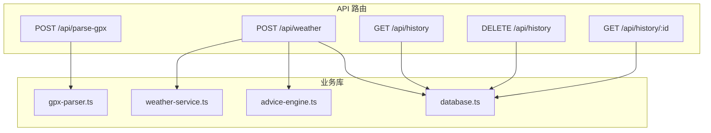
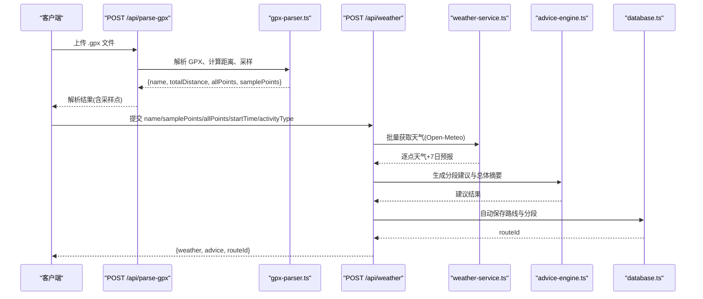
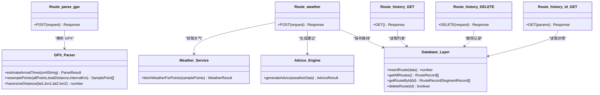

# API 接口文档

<cite>
**本文引用的文件**   
- [app/api/parse-gpx/route.ts](file://app/api/parse-gpx/route.ts)
- [app/api/weather/route.ts](file://app/api/weather/route.ts)
- [app/api/history/route.ts](file://app/api/history/route.ts)
- [app/api/history/[id]/route.ts](file://app/api/history/[id]/route.ts)
- [lib/gpx-parser.ts](file://lib/gpx-parser.ts)
- [lib/weather-service.ts](file://lib/weather-service.ts)
- [lib/advice-engine.ts](file://lib/advice-engine.ts)
- [lib/database.ts](file://lib/database.ts)
</cite>

## 目录
1. [简介](#简介)
2. [项目结构](#项目结构)
3. [核心组件](#核心组件)
4. [架构总览](#架构总览)
5. [详细接口说明](#详细接口说明)
6. [依赖关系分析](#依赖关系分析)
7. [性能与限制](#性能与限制)
8. [认证、速率限制与安全](#认证速率限制与安全)
9. [故障排查指南](#故障排查指南)
10. [结论](#结论)
11. [附录：数据模型与错误码](#附录数据模型与错误码)

## 简介
本文件为 FineG 项目的 RESTful API 完整接口文档，覆盖以下能力：
- GPX 轨迹解析：上传 .gpx 文件并返回采样点、全量点及距离统计。
- 天气查询与建议：基于采样点获取沿途天气预报，生成分段建议与总体摘要。
- 历史记录管理：查询、删除已保存的路线记录，以及按 ID 获取详情（含分段）。

API 基于 Next.js App Router 实现，使用 SQLite 本地持久化存储，外部天气数据来自 Open-Meteo。

## 项目结构
API 路由位于 app/api 下，业务逻辑封装在 lib 目录中：
- parse-gpx：GPX 解析入口
- weather：天气与建议计算入口
- history：历史记录的列表与删除
- history/[id]：按 ID 获取单条记录详情

图表来源
- [app/api/parse-gpx/route.ts:1-48](file://app/api/parse-gpx/route.ts#L1-L48)
- [app/api/weather/route.ts:1-93](file://app/api/weather/route.ts#L1-L93)
- [app/api/history/route.ts:1-33](file://app/api/history/route.ts#L1-L33)
- [app/api/history/[id]/route.ts:1-25](file://app/api/history/[id]/route.ts#L1-L25)
- [lib/gpx-parser.ts:1-231](file://lib/gpx-parser.ts#L1-L231)
- [lib/weather-service.ts:1-176](file://lib/weather-service.ts#L1-L176)
- [lib/advice-engine.ts:1-201](file://lib/advice-engine.ts#L1-L201)
- [lib/database.ts:1-204](file://lib/database.ts#L1-L204)

章节来源
- [app/api/parse-gpx/route.ts:1-48](file://app/api/parse-gpx/route.ts#L1-L48)
- [app/api/weather/route.ts:1-93](file://app/api/weather/route.ts#L1-L93)
- [app/api/history/route.ts:1-33](file://app/api/history/route.ts#L1-L33)
- [app/api/history/[id]/route.ts:1-25](file://app/api/history/[id]/route.ts#L1-L25)

## 核心组件
- GPX 解析器：负责解析 XML GPX，计算总距离、采样点与全量点，并对全量点进行渲染限流处理。
- 天气服务：对采样点分批请求 Open-Meteo 每日预报，匹配到达日期并返回逐点天气与 7 天预报。
- 建议引擎：根据天气指标生成分级建议（信息/警告/危险），并汇总整体摘要。
- 数据库层：SQLite 持久化路线与分段信息，提供增删查接口。

章节来源
- [lib/gpx-parser.ts:1-231](file://lib/gpx-parser.ts#L1-L231)
- [lib/weather-service.ts:1-176](file://lib/weather-service.ts#L1-L176)
- [lib/advice-engine.ts:1-201](file://lib/advice-engine.ts#L1-L201)
- [lib/database.ts:1-204](file://lib/database.ts#L1-L204)

## 架构总览
下图展示了从客户端到后端各层的调用关系与数据流向。

图表来源
- [app/api/parse-gpx/route.ts:1-48](file://app/api/parse-gpx/route.ts#L1-L48)
- [lib/gpx-parser.ts:1-231](file://lib/gpx-parser.ts#L1-L231)
- [app/api/weather/route.ts:1-93](file://app/api/weather/route.ts#L1-L93)
- [lib/weather-service.ts:1-176](file://lib/weather-service.ts#L1-L176)
- [lib/advice-engine.ts:1-201](file://lib/advice-engine.ts#L1-L201)
- [lib/database.ts:1-204](file://lib/database.ts#L1-L204)

## 详细接口说明

### 通用约定
- 基础路径：/api
- 内容类型：JSON（除 GPX 上传为 multipart/form-data）
- 响应格式：统一 JSON；成功时返回业务对象，失败时返回包含 error 字段的对象
- 时间格式：ISO 8601（如 2024-01-01T12:00:00Z）或 YYYY-MM-DD、HH:mm
- 坐标顺序：lat（纬度）、lon（经度），单位为度
- 距离单位：千米（km）

### 1) 解析 GPX 文件
- 方法：POST
- URL：/api/parse-gpx
- 请求体：multipart/form-data
  - 字段名：file
  - 类型：File
  - 约束：必须存在且扩展名为 .gpx
- 成功响应（200）：
  - name: string（轨迹名称）
  - totalDistance: number（总距离，km）
  - pointCount: number（采样点数量）
  - allPoints: TrackPoint[]（全量点，最多约 2000 个用于渲染）
  - samplePoints: SamplePoint[]（采样点，含 index、distanceFromStart）
- 错误响应：
  - 400：未上传文件或非 .gpx 文件
  - 500：解析失败（例如无效 GPX）

示例请求（curl）
- curl -X POST http://localhost:3000/api/parse-gpx -F "file=@trip.gpx"

示例响应（节选）
- {
    "name": "周末骑行",
    "totalDistance": 42.3,
    "pointCount": 16,
    "allPoints": [...],
    "samplePoints": [...]
  }

章节来源
- [app/api/parse-gpx/route.ts:1-48](file://app/api/parse-gpx/route.ts#L1-L48)
- [lib/gpx-parser.ts:1-231](file://lib/gpx-parser.ts#L1-L231)

### 2) 获取天气与建议
- 方法：POST
- URL：/api/weather
- 请求体（JSON）：
  - name: string（可选，默认“未命名轨迹”）
  - samplePoints: SamplePoint[]（必填）
  - allPoints: TrackPoint[]（可选）
  - startTime: string（可选，ISO 8601）
  - activityType: string（可选，如 walking/hiking/cycling/mtb/running/driving）
- 业务行为：
  - 若提供 startTime 与 activityType，则根据平均速度估算到达时间，用于匹配对应日期的天气
  - 批量请求 Open-Meteo 每日预报，返回每个采样点的天气与 7 天预报
  - 自动生成建议并按段聚合，同时自动保存到数据库
- 成功响应（200）：
  - weather: WeatherResult
    - points: PointWeather[]
      - point: SamplePoint
      - arrivalDate: string|null（YYYY-MM-DD）
      - arrivalTime: string|null（HH:mm）
      - weather: DailyWeather|null（到达日天气）
      - forecast: DailyWeather[]（7 天预报）
  - advice: AdviceResult
    - summary: string（总体摘要）
    - overall: Advice[]（去重后的整体建议，按严重度排序）
    - segments: SegmentAdvice[]（每段建议，含经纬度、到达时间、天气与建议）
  - routeId: number|null（自动保存后返回的记录 ID）
- 错误响应：
  - 400：未提供采样点数据
  - 500：天气请求或处理失败

示例请求（curl）
- curl -X POST http://localhost:3000/api/weather \
  -H "Content-Type: application/json" \
  -d '{
    "name":"周末骑行",
    "samplePoints":[...],
    "allPoints":[...],
    "startTime":"2024-06-01T08:00:00Z",
    "activityType":"cycling"
  }'

示例响应（节选）
- {
    "weather": {
      "points": [
        {
          "point": {"lat":39.9,"lon":116.4,"index":0,"distanceFromStart":0},
          "arrivalDate":"2024-06-01","arrivalTime":"08:00",
          "weather":{"date":"2024-06-01","tempMax":32,"tempMin":22,"precipitationProbability":20,"windSpeedMax":12,"weatherCode":1},
          "forecast":[...]
        }
      ]
    },
    "advice": {
      "summary":"沿途气温 22°C ~ 32°C，天气状况：大部晴朗，最高降水概率 20%。 整体天气良好，适合出行！",
      "overall":[],
      "segments":[...]
    },
    "routeId": 1
  }

章节来源
- [app/api/weather/route.ts:1-93](file://app/api/weather/route.ts#L1-L93)
- [lib/weather-service.ts:1-176](file://lib/weather-service.ts#L1-L176)
- [lib/advice-engine.ts:1-201](file://lib/advice-engine.ts#L1-L201)
- [lib/database.ts:1-204](file://lib/database.ts#L1-L204)

### 3) 历史记录管理

#### 3.1 获取所有历史记录
- 方法：GET
- URL：/api/history
- 成功响应（200）：RouteRecord[]（不含 all_points_json）
  - id: number
  - name: string
  - distance_km: number
  - points_count: number
  - activity_type: string|null
  - start_time: string|null
  - created_at: string
- 错误响应：
  - 500：获取失败

示例请求（curl）
- curl http://localhost:3000/api/history

示例响应（节选）
- [
    {"id":1,"name":"周末骑行","distance_km":42.3,"points_count":16,"activity_type":"cycling","start_time":"2024-06-01T08:00:00Z","created_at":"2024-06-01T08:05:12"},
    ...
  ]

章节来源
- [app/api/history/route.ts:1-33](file://app/api/history/route.ts#L1-L33)
- [lib/database.ts:1-204](file://lib/database.ts#L1-L204)

#### 3.2 删除历史记录
- 方法：DELETE
- URL：/api/history
- 请求体（JSON）：
  - id: number（必填）
- 成功响应（200）：{ success: true }
- 错误响应：
  - 400：未提供 ID
  - 404：记录不存在
  - 500：删除失败

示例请求（curl）
- curl -X DELETE http://localhost:3000/api/history -H "Content-Type: application/json" -d '{"id":1}'

章节来源
- [app/api/history/route.ts:1-33](file://app/api/history/route.ts#L1-L33)
- [lib/database.ts:1-204](file://lib/database.ts#L1-L204)

#### 3.3 按 ID 获取记录详情
- 方法：GET
- URL：/api/history/:id
- 路径参数：
  - id: string（将转换为整数）
- 成功响应（200）：RouteRecord & { segments: SegmentRecord[] }
  - 包含该路线的所有分段信息（含天气与建议）
- 错误响应：
  - 400：无效的 ID
  - 404：记录不存在
  - 500：获取失败

示例请求（curl）
- curl http://localhost:3000/api/history/1

示例响应（节选）
- {
    "id":1,"name":"周末骑行","distance_km":42.3,"points_count":16,"activity_type":"cycling","start_time":"2024-06-01T08:00:00Z","created_at":"2024-06-01T08:05:12","all_points_json":"[...]","segments":[...]
  }

章节来源
- [app/api/history/[id]/route.ts:1-25](file://app/api/history/[id]/route.ts#L1-L25)
- [lib/database.ts:1-204](file://lib/database.ts#L1-L204)

## 依赖关系分析
- 路由层仅做参数校验与编排，核心逻辑下沉至 lib 模块，职责清晰、耦合低。
- weather 接口内部串联天气服务与建议引擎，并在成功后写入数据库，形成“解析→天气→建议→持久化”的流水线。
- 数据库层通过事务批量插入分段，保证一致性。

图表来源
- [app/api/parse-gpx/route.ts:1-48](file://app/api/parse-gpx/route.ts#L1-L48)
- [app/api/weather/route.ts:1-93](file://app/api/weather/route.ts#L1-L93)
- [app/api/history/route.ts:1-33](file://app/api/history/route.ts#L1-L33)
- [app/api/history/[id]/route.ts:1-25](file://app/api/history/[id]/route.ts#L1-L25)
- [lib/gpx-parser.ts:1-231](file://lib/gpx-parser.ts#L1-L231)
- [lib/weather-service.ts:1-176](file://lib/weather-service.ts#L1-L176)
- [lib/advice-engine.ts:1-201](file://lib/advice-engine.ts#L1-L201)
- [lib/database.ts:1-204](file://lib/database.ts#L1-L204)

## 性能与限制
- GPX 全量点渲染限流：当 allPoints 超过 2000 时进行等间隔抽样，以降低前端渲染压力。
- 天气请求批处理：按批次并发请求 Open-Meteo，提升吞吐。
- 采样点数量控制：采样点上限受活动类型与距离影响，避免过大请求体。
- 数据库写入：采用事务批量插入分段，减少 I/O 次数。

[本节为通用性能讨论，不直接分析具体文件]

## 认证、速率限制与安全
- 认证机制：当前未实现鉴权中间件，所有端点均为公开访问。生产环境建议增加 JWT 或会话认证。
- 速率限制：未实现服务端限流。建议结合反向代理或框架中间件实施 IP/用户维度的限流策略。
- 安全考虑：
  - 输入校验：已对必要字段进行基本校验（如 file 存在性、.gpx 后缀、samplePoints 非空、ID 合法性）。
  - 外部依赖：天气服务依赖 Open-Meteo，需确保网络可达与超时配置合理。
  - 文件上传：建议在生产环境限制文件大小与类型白名单，防止恶意上传。
  - 数据安全：SQLite 文件位于 data/routes.db，部署时应做好备份与权限控制。

[本节为通用安全讨论，不直接分析具体文件]

## 故障排查指南
- 常见错误码与含义：
  - 400：请求参数缺失或非法（如未上传文件、非 .gpx、未提供采样点、无效 ID）
  - 404：资源不存在（如删除或查询的历史记录不存在）
  - 500：服务器内部错误（如解析失败、天气 API 异常、数据库操作失败）
- 定位步骤：
  - 检查请求体结构与必填字段是否齐全
  - 确认 GPX 文件是否为标准格式且包含有效轨迹点
  - 检查网络连通性与 Open-Meteo 可用性
  - 查看服务端日志（天气或数据库异常会打印错误）
- 已知容错：
  - 天气接口即使数据库保存失败也不会中断主流程，但会记录错误日志

章节来源
- [app/api/parse-gpx/route.ts:1-48](file://app/api/parse-gpx/route.ts#L1-L48)
- [app/api/weather/route.ts:1-93](file://app/api/weather/route.ts#L1-L93)
- [app/api/history/route.ts:1-33](file://app/api/history/route.ts#L1-L33)
- [app/api/history/[id]/route.ts:1-25](file://app/api/history/[id]/route.ts#L1-L25)

## 结论
FineG 的 API 围绕“解析 GPX → 获取天气 → 生成建议 → 持久化”的主链路设计，接口简洁、职责清晰。建议在后续迭代中补充认证与限流、完善错误码分类与可观测性，以提升生产可用性与安全性。

[本节为总结性内容，不直接分析具体文件]

## 附录：数据模型与错误码

### 数据模型（节选）
- TrackPoint
  - lat: number
  - lon: number
  - elevation?: number
  - time?: string
- SamplePoint extends TrackPoint
  - index: number
  - distanceFromStart: number
  - estimatedArrival?: string
- ActivityType
  - id: string
  - label: string
  - icon: string
  - avgSpeedKmh: number
- DailyWeather
  - date: string
  - tempMax: number
  - tempMin: number
  - precipitationProbability: number
  - windSpeedMax: number
  - weatherCode: number
- PointWeather
  - point: SamplePoint
  - arrivalDate: string|null
  - arrivalTime: string|null
  - weather: DailyWeather|null
  - forecast: DailyWeather[]
- Advice
  - level: "info"|"warning"|"danger"
  - icon: string
  - text: string
- SegmentAdvice
  - pointIndex: number
  - distanceKm: number
  - lat: number
  - lon: number
  - arrivalDate: string|null
  - arrivalTime: string|null
  - weather: DailyWeather|null
  - advices: Advice[]
- RouteRecord
  - id: number
  - name: string
  - distance_km: number
  - points_count: number
  - activity_type: string|null
  - start_time: string|null
  - created_at: string
  - all_points_json: string
- SegmentRecord
  - id: number
  - route_id: number
  - point_index: number
  - distance_km: number
  - lat: number
  - lon: number
  - arrival_date: string|null
  - arrival_time: string|null
  - wmo_code: number|null
  - temp_max: number|null
  - temp_min: number|null
  - precip_prob: number|null
  - wind_speed_max: number|null
  - advice_level: string|null
  - advice_text: string|null

章节来源
- [lib/gpx-parser.ts:1-231](file://lib/gpx-parser.ts#L1-L231)
- [lib/weather-service.ts:1-176](file://lib/weather-service.ts#L1-L176)
- [lib/advice-engine.ts:1-201](file://lib/advice-engine.ts#L1-L201)
- [lib/database.ts:1-204](file://lib/database.ts#L1-L204)

### 错误码定义
- 400：请求参数缺失或非法
- 404：资源不存在
- 500：服务器内部错误

章节来源
- [app/api/parse-gpx/route.ts:1-48](file://app/api/parse-gpx/route.ts#L1-L48)
- [app/api/weather/route.ts:1-93](file://app/api/weather/route.ts#L1-L93)
- [app/api/history/route.ts:1-33](file://app/api/history/route.ts#L1-L33)
- [app/api/history/[id]/route.ts:1-25](file://app/api/history/[id]/route.ts#L1-L25)