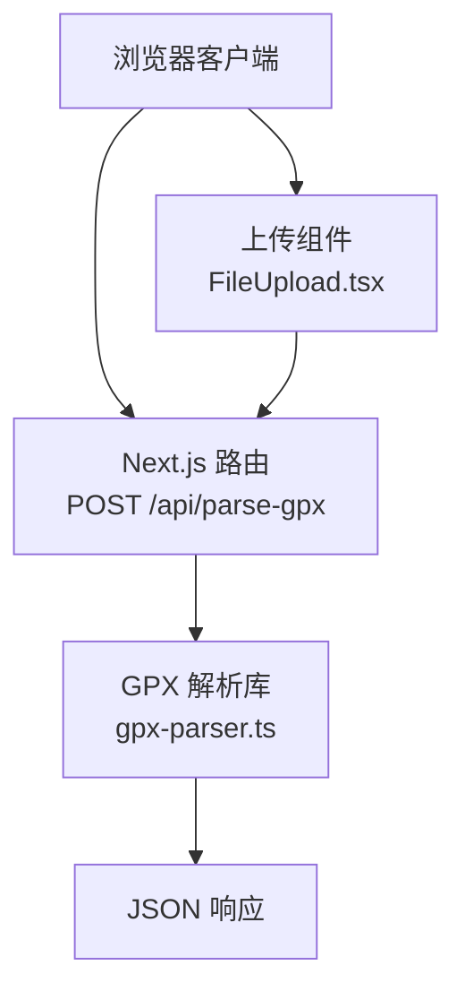
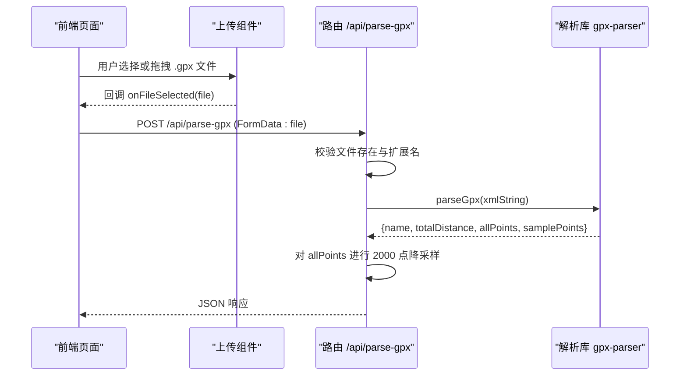
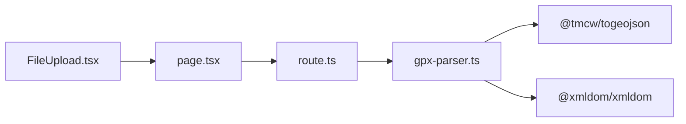
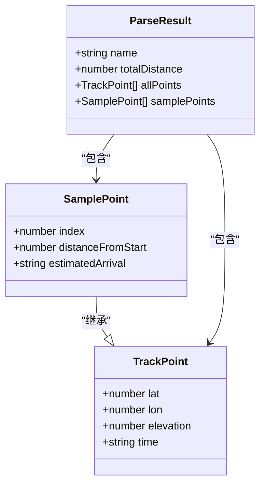

# GPX 解析接口

<cite>
**本文引用的文件**
- [app/api/parse-gpx/route.ts](file://app/api/parse-gpx/route.ts)
- [lib/gpx-parser.ts](file://lib/gpx-parser.ts)
- [components/FileUpload.tsx](file://components/FileUpload.tsx)
- [app/page.tsx](file://app/page.tsx)
</cite>

## 目录
1. [简介](#简介)
2. [项目结构](#项目结构)
3. [核心组件](#核心组件)
4. [架构总览](#架构总览)
5. [详细组件分析](#详细组件分析)
6. [依赖分析](#依赖分析)
7. [性能考虑](#性能考虑)
8. [故障排查指南](#故障排查指南)
9. [结论](#结论)
10. [附录](#附录)

## 简介
本文件为“GPX 解析接口”的完整 API 文档，聚焦于 POST /api/parse-gpx 端点。内容涵盖：
- 请求规范（表单字段、文件上传要求与格式校验）
- 响应数据结构（轨迹名称、总距离、采样点、全部轨迹点等）
- 错误处理机制（400 格式错误、500 解析失败）
- 文件大小限制与性能优化策略（2000 点限制）
- 数据验证规则
- 前端集成示例与最佳实践

## 项目结构
该接口位于 Next.js App Router 中，采用服务端路由 + 解析库的组合方式：
- 路由层：接收表单上传、执行基础校验、调用解析库、返回 JSON
- 解析层：解析 GPX XML、计算总距离、生成采样点、对全量点进行降采样以控制渲染规模
- 前端层：页面与上传组件负责构造 FormData、发起请求并展示结果

图表来源
- [app/api/parse-gpx/route.ts:1-48](file://app/api/parse-gpx/route.ts#L1-L48)
- [lib/gpx-parser.ts:1-231](file://lib/gpx-parser.ts#L1-L231)
- [components/FileUpload.tsx:1-97](file://components/FileUpload.tsx#L1-L97)

章节来源
- [app/api/parse-gpx/route.ts:1-48](file://app/api/parse-gpx/route.ts#L1-L48)
- [lib/gpx-parser.ts:1-231](file://lib/gpx-parser.ts#L1-L231)
- [components/FileUpload.tsx:1-97](file://components/FileUpload.tsx#L1-L97)

## 核心组件
- 路由处理器：负责表单解析、文件类型校验、调用解析函数、限流全量点数量、统一错误处理
- 解析器：解析 GPX XML、提取轨迹点、计算总距离、生成采样点、估算到达时间（供其他接口使用）
- 前端上传组件：提供拖拽/选择 .gpx 文件的能力，并在选择后触发上传流程

章节来源
- [app/api/parse-gpx/route.ts:1-48](file://app/api/parse-gpx/route.ts#L1-L48)
- [lib/gpx-parser.ts:1-231](file://lib/gpx-parser.ts#L1-L231)
- [components/FileUpload.tsx:1-97](file://components/FileUpload.tsx#L1-L97)

## 架构总览
下图展示了从前端到后端再到解析库的端到端调用流程。

图表来源
- [app/page.tsx:30-60](file://app/page.tsx#L30-L60)
- [components/FileUpload.tsx:28-48](file://components/FileUpload.tsx#L28-L48)
- [app/api/parse-gpx/route.ts:4-46](file://app/api/parse-gpx/route.ts#L4-L46)
- [lib/gpx-parser.ts:139-230](file://lib/gpx-parser.ts#L139-L230)

## 详细组件分析

### 接口定义：POST /api/parse-gpx
- 方法：POST
- URL：/api/parse-gpx
- Content-Type：multipart/form-data（由浏览器自动设置）
- 请求体：表单字段
  - file：二进制文件，必须为 .gpx 格式
- 成功响应：JSON
  - name：字符串，轨迹名称
  - totalDistance：数字，单位千米（km），保留一位小数
  - pointCount：整数，原始轨迹点总数
  - allPoints：数组，最多 2000 个轨迹点（已做降采样）
  - samplePoints：数组，采样点集合（用于后续天气查询等）
- 错误响应：JSON
  - 400：缺少文件或非 .gpx 格式
  - 500：解析失败（XML 无效、无有效轨迹点等）

章节来源
- [app/api/parse-gpx/route.ts:4-46](file://app/api/parse-gpx/route.ts#L4-L46)

### 请求参数与数据格式
- 表单字段
  - file：必填，类型为 File，扩展名需以 .gpx 结尾（不区分大小写）
- 文件要求
  - 仅接受 .gpx 文件；其他扩展名将返回 400 错误
  - 未检测到文件将返回 400 错误
- 文件大小限制
  - 当前实现未在服务端显式限制文件大小；建议在前端增加合理限制（例如 10MB），以避免大文件导致内存与解析开销过大

章节来源
- [app/api/parse-gpx/route.ts:9-21](file://app/api/parse-gpx/route.ts#L9-L21)
- [components/FileUpload.tsx:33-35](file://components/FileUpload.tsx#L33-L35)

### 响应数据结构
- 顶层字段
  - name：string，轨迹名称（来自 GPX 元数据或默认值）
  - totalDistance：number，单位 km，四舍五入至 0.1 km
  - pointCount：number，原始轨迹点数量
  - allPoints：TrackPoint[]，最多 2000 个点（已按间隔抽样）
  - samplePoints：SamplePoint[]，采样点集合
- TrackPoint 字段
  - lat：number，纬度
  - lon：number，经度
  - elevation：number?，海拔（可选）
  - time：string?，时间戳（可选）
- SamplePoint 字段
  - 继承 TrackPoint 所有字段
  - index：number，对应 allPoints 中的索引
  - distanceFromStart：number，距起点的累计距离（km，保留 0.1）
  - estimatedArrival：string?，ISO 时间字符串（在其它接口中根据活动类型与开始时间估算）

章节来源
- [lib/gpx-parser.ts:4-16](file://lib/gpx-parser.ts#L4-L16)
- [lib/gpx-parser.ts:112-117](file://lib/gpx-parser.ts#L112-L117)
- [lib/gpx-parser.ts:139-230](file://lib/gpx-parser.ts#L139-L230)
- [app/api/parse-gpx/route.ts:35-41](file://app/api/parse-gpx/route.ts#L35-L41)

### 数据处理与算法要点
- 解析 GPX
  - 使用标准库将 GPX 转换为 GeoJSON，并从 LineString 坐标中提取轨迹点
- 总距离计算
  - 使用 Haversine 公式逐段累加相邻点距离，得到总距离（km）
- 采样点生成
  - 基于固定间隔（约每 10 km）选取采样点，最少包含起点和终点，上限受最大样本数约束
- 全量点降采样
  - 为保证渲染性能，allPoints 最多返回 2000 个点；当原始点数超过 2000 时，按均匀间隔抽取

章节来源
- [lib/gpx-parser.ts:119-137](file://lib/gpx-parser.ts#L119-L137)
- [lib/gpx-parser.ts:161-218](file://lib/gpx-parser.ts#L161-L218)
- [app/api/parse-gpx/route.ts:26-33](file://app/api/parse-gpx/route.ts#L26-L33)

### 错误处理机制
- 400 未上传文件
  - 条件：表单中不存在 file 字段
  - 响应体：{ error: "未上传文件" }
- 400 文件格式错误
  - 条件：文件扩展名不以 .gpx 结尾
  - 响应体：{ error: "请上传 .gpx 格式的文件" }
- 500 解析失败
  - 条件：解析过程中抛出异常（如 XML 无效、无有效轨迹点等）
  - 响应体：{ error: "具体错误信息或默认提示" }

章节来源
- [app/api/parse-gpx/route.ts:9-21](file://app/api/parse-gpx/route.ts#L9-L21)
- [app/api/parse-gpx/route.ts:42-46](file://app/api/parse-gpx/route.ts#L42-L46)
- [lib/gpx-parser.ts:157-159](file://lib/gpx-parser.ts#L157-L159)

### 前端集成示例与最佳实践
- 基本调用流程
  - 使用 FormData 附加 file 字段
  - 通过 fetch 发送 POST 请求到 /api/parse-gpx
  - 检查响应状态码，若不为 ok，读取 JSON 错误消息并提示用户
  - 成功后解析 name、totalDistance、pointCount、allPoints、samplePoints 并进入下一步
- 最佳实践
  - 前端可先校验文件扩展名与大小，减少无效请求
  - 上传期间显示加载状态，避免重复提交
  - 对 large GPX 文件，建议在客户端进行初步裁剪或提示用户分段导出
  - 错误信息应友好地反馈给用户，并提供重试入口

章节来源
- [app/page.tsx:30-60](file://app/page.tsx#L30-L60)
- [components/FileUpload.tsx:28-48](file://components/FileUpload.tsx#L28-L48)

## 依赖分析
- 路由层依赖
  - NextRequest/NextResponse：HTTP 请求与响应封装
  - gpx-parser：解析 GPX、计算距离、生成采样点
- 解析层依赖
  - @tmcw/togeojson：将 GPX 转为 GeoJSON
  - @xmldom/xmldom：解析 XML 字符串
- 前端依赖
  - React 组件：FileUpload 提供拖拽/选择能力
  - 页面逻辑：构造 FormData、发起请求、处理响应与错误

图表来源
- [app/api/parse-gpx/route.ts:1-3](file://app/api/parse-gpx/route.ts#L1-L3)
- [lib/gpx-parser.ts:1-2](file://lib/gpx-parser.ts#L1-L2)
- [app/page.tsx:30-60](file://app/page.tsx#L30-L60)
- [components/FileUpload.tsx:1-10](file://components/FileUpload.tsx#L1-L10)

章节来源
- [app/api/parse-gpx/route.ts:1-3](file://app/api/parse-gpx/route.ts#L1-L3)
- [lib/gpx-parser.ts:1-2](file://lib/gpx-parser.ts#L1-L2)
- [app/page.tsx:30-60](file://app/page.tsx#L30-L60)
- [components/FileUpload.tsx:1-10](file://components/FileUpload.tsx#L1-L10)

## 性能考虑
- 全量点降采样
  - 当 allPoints 超过 2000 时，按均匀间隔抽取，确保前端渲染流畅
- 采样点数量控制
  - 采样点数量受总距离与间隔影响，同时有最小/最大样本数限制，避免过多或过少
- 距离计算复杂度
  - 总距离计算为 O(n)，n 为轨迹点数；对于超长轨迹，建议在前端或上游进行预处理
- 内存与 I/O
  - 大文件会占用较多内存进行文本解析；建议在前端限制文件大小，或在服务端引入中间件限制上传体积

章节来源
- [app/api/parse-gpx/route.ts:26-33](file://app/api/parse-gpx/route.ts#L26-L33)
- [lib/gpx-parser.ts:161-218](file://lib/gpx-parser.ts#L161-L218)

## 故障排查指南
- 常见错误与定位
  - 400 未上传文件：确认表单字段名为 file，且确实附带了文件
  - 400 文件格式错误：确认文件扩展名为 .gpx（不区分大小写）
  - 500 解析失败：检查 GPX 是否为合法 XML，是否包含有效的轨迹点
- 调试建议
  - 打印请求 FormData 内容与响应体
  - 使用浏览器开发者工具查看网络请求详情
  - 在本地复现相同 GPX 文件，逐步缩小问题范围

章节来源
- [app/api/parse-gpx/route.ts:9-21](file://app/api/parse-gpx/route.ts#L9-L21)
- [app/api/parse-gpx/route.ts:42-46](file://app/api/parse-gpx/route.ts#L42-L46)
- [lib/gpx-parser.ts:157-159](file://lib/gpx-parser.ts#L157-L159)

## 结论
POST /api/parse-gpx 提供了稳定、易用的 GPX 解析能力，支持基本的文件校验、距离计算与采样点生成，并通过 2000 点降采样保障渲染性能。结合前端的上传组件与页面逻辑，可实现完整的上传—解析—展示工作流。建议在生产环境补充文件大小限制与更完善的错误提示，以提升用户体验与系统稳定性。

## 附录

### 请求示例（概念性）
- 使用 FormData 发送
  - 字段名：file
  - 值：.gpx 文件
- 使用 curl 的概念性示例
  - curl -X POST http://localhost:3000/api/parse-gpx -F "file=@/path/to/track.gpx"

[本节为概念性说明，不直接分析具体文件]

### 响应示例（概念性）
- 成功响应
  - {
      "name": "示例轨迹",
      "totalDistance": 42.3,
      "pointCount": 12000,
      "allPoints": [...],
      "samplePoints": [...]
    }
- 错误响应
  - 400：{ "error": "请上传 .gpx 格式的文件" }
  - 500：{ "error": "解析 GPX 文件失败" }

[本节为概念性说明，不直接分析具体文件]

### 数据模型关系图

图表来源
- [lib/gpx-parser.ts:4-16](file://lib/gpx-parser.ts#L4-L16)
- [lib/gpx-parser.ts:112-117](file://lib/gpx-parser.ts#L112-L117)