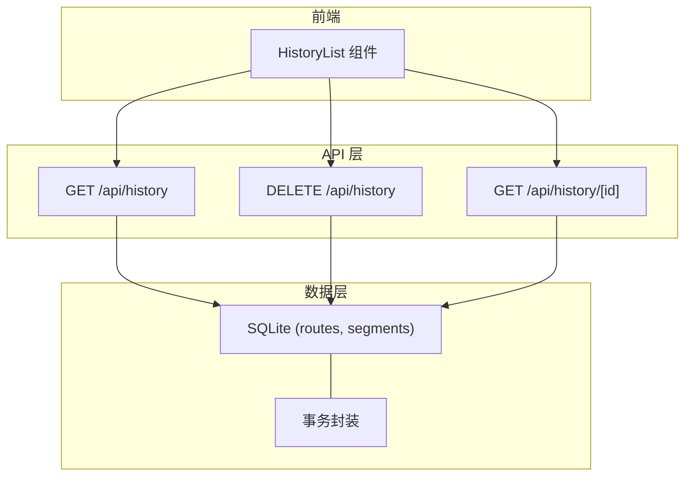
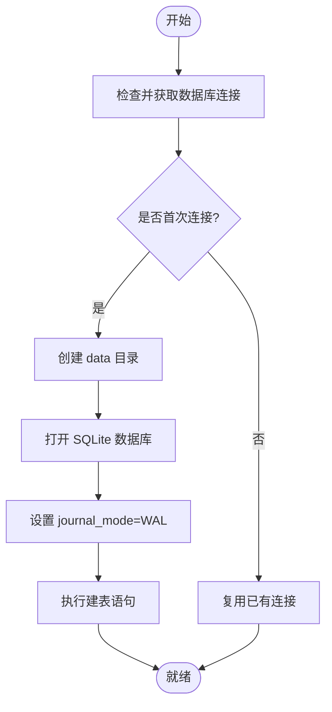
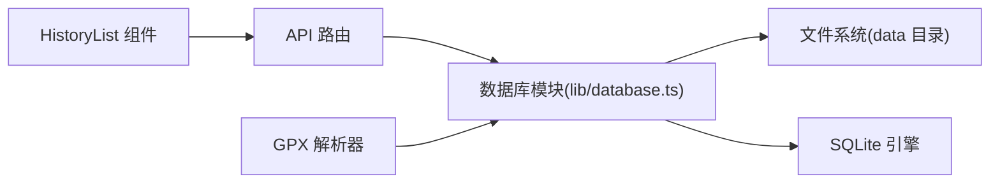
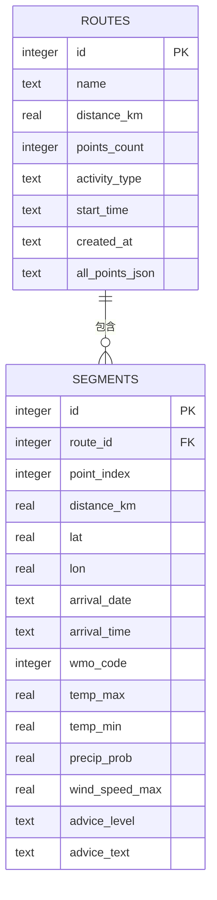
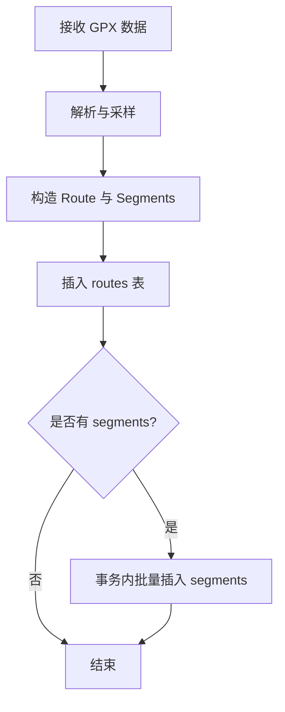

# 历史记录管理接口

<cite>
**本文引用的文件**   
- [database.ts](file://lib/database.ts)
- [HistoryList.tsx](file://components/HistoryList.tsx)
- [gpx-parser.ts](file://lib/gpx-parser.ts)
</cite>

## 目录
1. [简介](#简介)
2. [项目结构](#项目结构)
3. [核心组件](#核心组件)
4. [架构总览](#架构总览)
5. [详细组件分析](#详细组件分析)
6. [依赖关系分析](#依赖关系分析)
7. [性能考虑](#性能考虑)
8. [故障排查指南](#故障排查指南)
9. [结论](#结论)
10. [附录](#附录)

## 简介
本文件为“历史记录管理”的完整 API 文档，覆盖以下 RESTful 端点：
- GET /api/history（获取历史记录列表）
- DELETE /api/history（删除历史记录）
- GET /api/history/[id]（获取单条记录详情）

同时详细说明 SQLite 数据库表结构设计（routes 与 segments）、数据持久化机制、事务处理、CRUD 示例、数据验证规则、错误处理与性能优化建议，以及数据完整性保证和并发访问控制。

## 项目结构
本项目采用 Next.js App Router 组织 API 路由与页面：
- app/api/history/route.ts：实现 GET /api/history 与 DELETE /api/history
- app/api/history/[id]/route.ts：实现 GET /api/history/[id]
- lib/database.ts：SQLite 连接、建表、CRUD 与事务封装
- components/HistoryList.tsx：前端历史列表展示与交互
- lib/gpx-parser.ts：GPX 解析与采样算法（用于生成历史记录的输入数据）



图表来源
- [database.ts:23-55](file://lib/database.ts#L23-L55)
- [database.ts:164-188](file://lib/database.ts#L164-L188)
- [database.ts:190-203](file://lib/database.ts#L190-L203)

章节来源
- [database.ts:1-204](file://lib/database.ts#L1-L204)
- [HistoryList.tsx:1-218](file://components/HistoryList.tsx#L1-L218)

## 核心组件
- 数据库模块（lib/database.ts）
  - 提供 getDb() 单例连接、initTables() 建表、insertRoute()/getAllRoutes()/getRouteById()/deleteRoute() 等 CRUD 方法
  - 使用 WAL 模式提升并发读性能
  - 使用 better-sqlite3 的 transaction() 封装批量写入与级联删除
- 前端历史列表（components/HistoryList.tsx）
  - 展示路线卡片、支持多选对比、二次确认删除、查看详情跳转
- GPX 解析（lib/gpx-parser.ts）
  - 提供轨迹点提取、距离计算、采样策略与估算到达时间等工具函数，供上游写入历史时使用

章节来源
- [database.ts:9-21](file://lib/database.ts#L9-L21)
- [database.ts:23-55](file://lib/database.ts#L23-L55)
- [database.ts:90-162](file://lib/database.ts#L90-L162)
- [database.ts:164-188](file://lib/database.ts#L164-L188)
- [database.ts:190-203](file://lib/database.ts#L190-L203)
- [HistoryList.tsx:1-218](file://components/HistoryList.tsx#L1-L218)
- [gpx-parser.ts:120-137](file://lib/gpx-parser.ts#L120-L137)
- [gpx-parser.ts:139-230](file://lib/gpx-parser.ts#L139-L230)

## 架构总览
整体流程：
- 客户端调用 /api/history 相关端点
- API 路由调用数据库模块进行查询或写入
- 数据库模块通过 better-sqlite3 操作 routes 与 segments 表
- 删除操作使用事务确保 segments 与 routes 的一致性
- 读取详情时聚合 route 与其 segments

```mermaid
sequenceDiagram
participant C as "客户端"
participant API as "API 路由"
participant DB as "数据库模块"
participant S as "SQLite 存储"
C->>API : "GET /api/history"
API->>DB : "getAllRoutes()"
DB->>S : "SELECT ... FROM routes ORDER BY created_at DESC"
S-->>DB : "返回路线列表(不含 all_points_json)"
DB-->>API : "列表数据"
API-->>C : "200 OK + JSON 列表"
C->>API : "GET /api/history/ : id"
API->>DB : "getRouteById(id)"
DB->>S : "SELECT * FROM routes WHERE id=?"
S-->>DB : "route"
DB->>S : "SELECT * FROM segments WHERE route_id=? ORDER BY point_index ASC"
S-->>DB : "segments[]"
DB-->>API : "{ route, segments }"
API-->>C : "200 OK + JSON 详情"
C->>API : "DELETE /api/history/ : id"
API->>DB : "deleteRoute(id)"
DB->>DB : "transaction(() => { 删除 segments; 删除 routes })"
DB-->>API : "是否成功"
API-->>C : "200/204/404/500"
```

图表来源
- [database.ts:164-188](file://lib/database.ts#L164-L188)
- [database.ts:190-203](file://lib/database.ts#L190-L203)

## 详细组件分析

### 数据库表结构与字段说明
- routes 表
  - id: INTEGER PRIMARY KEY AUTOINCREMENT
  - name: TEXT NOT NULL
  - distance_km: REAL NOT NULL
  - points_count: INTEGER NOT NULL
  - activity_type: TEXT
  - start_time: TEXT
  - created_at: TEXT DEFAULT datetime('now','localtime')
  - all_points_json: TEXT NOT NULL
- segments 表
  - id: INTEGER PRIMARY KEY AUTOINCREMENT
  - route_id: INTEGER NOT NULL（外键关联 routes.id，ON DELETE CASCADE）
  - point_index: INTEGER NOT NULL
  - distance_km: REAL NOT NULL
  - lat: REAL NOT NULL
  - lon: REAL NOT NULL
  - arrival_date: TEXT
  - arrival_time: TEXT
  - wmo_code: INTEGER
  - temp_max: REAL
  - temp_min: REAL
  - precip_prob: REAL
  - wind_speed_max: REAL
  - advice_level: TEXT
  - advice_text: TEXT

章节来源
- [database.ts:23-55](file://lib/database.ts#L23-L55)

### 数据持久化与事务处理
- 连接与初始化
  - 单例 getDb() 负责懒加载连接、创建 data 目录、设置 journal_mode=WAL、执行 initTables()
- 写入（插入路线与分段）
  - insertRoute() 先插入 routes，再在事务中批量插入 segments，返回新路线 ID
- 读取
  - getAllRoutes() 仅返回非敏感字段（排除 all_points_json），按 created_at 倒序
  - getRouteById() 返回 route 及其 segments（按 point_index 升序）
- 删除
  - deleteRoute() 使用事务先删 segments 再删 routes，确保一致性



图表来源
- [database.ts:9-21](file://lib/database.ts#L9-L21)
- [database.ts:23-55](file://lib/database.ts#L23-L55)

章节来源
- [database.ts:9-21](file://lib/database.ts#L9-L21)
- [database.ts:90-162](file://lib/database.ts#L90-L162)
- [database.ts:164-188](file://lib/database.ts#L164-L188)
- [database.ts:190-203](file://lib/database.ts#L190-L203)

### API 端点定义与行为

#### GET /api/history
- 功能：获取历史记录列表（不包含 all_points_json）
- 请求参数：无
- 响应数据结构：数组，元素包含 id、name、distance_km、points_count、activity_type、start_time、created_at
- 状态码：
  - 200：成功
  - 500：服务器内部错误（如数据库异常）

章节来源
- [database.ts:164-170](file://lib/database.ts#L164-L170)

#### GET /api/history/[id]
- 功能：根据 ID 获取单条记录详情（包含 segments）
- 路径参数：
  - id：数字型主键
- 响应数据结构：
  - route：包含 routes 全部字段
  - segments：segments 数组，按 point_index 升序
- 状态码：
  - 200：成功
  - 404：未找到记录
  - 500：服务器内部错误

章节来源
- [database.ts:172-188](file://lib/database.ts#L172-L188)

#### DELETE /api/history
- 功能：删除指定历史记录（含其所有分段）
- 路径参数：
  - id：数字型主键
- 响应：
  - 成功：可返回 200 或 204（具体由路由实现决定）
  - 失败：404（不存在）、500（服务器错误）
- 事务语义：
  - 在事务内先删除 segments，再删除 routes，保证一致性

章节来源
- [database.ts:190-203](file://lib/database.ts#L190-L203)

### 数据模型与类型
- RouteRecord：routes 表映射
- SegmentRecord：segments 表映射
- getAllRoutes 返回类型为 Omit<RouteRecord, "all_points_json">[]，避免传输大对象
- getRouteById 返回 RouteRecord 与 SegmentRecord[] 的组合

章节来源
- [database.ts:59-86](file://lib/database.ts#L59-L86)
- [database.ts:164-170](file://lib/database.ts#L164-L170)
- [database.ts:172-188](file://lib/database.ts#L172-L188)

### 前端交互与数据流
- HistoryList 组件
  - 展示路线卡片，显示名称、距离、活动类型、开始时间与查询时间
  - 支持多选对比（最多 4 条）
  - 删除按钮具备二次确认逻辑（3 秒内再次点击才触发）
  - 提供“查看详情”入口，对应 GET /api/history/[id]
- 数据获取
  - 列表页通过 GET /api/history 拉取精简信息
  - 详情页通过 GET /api/history/[id] 拉取完整信息（含 segments）

章节来源
- [HistoryList.tsx:1-218](file://components/HistoryList.tsx#L1-L218)

### 写入流程与数据校验（参考）
- 典型写入流程（供参考）
  - 解析 GPX 得到 name、totalDistance、allPoints、samplePoints
  - 构造 RouteRecord 与 SegmentRecord 列表
  - 调用 insertRoute() 完成持久化
- 关键校验点
  - 必须存在有效轨迹点（否则解析阶段抛出错误）
  - 距离计算基于 Haversine 公式
  - 采样点数受最大限制约束，避免过大负载

章节来源
- [gpx-parser.ts:139-230](file://lib/gpx-parser.ts#L139-L230)
- [gpx-parser.ts:120-137](file://lib/gpx-parser.ts#L120-L137)
- [database.ts:90-162](file://lib/database.ts#L90-L162)

## 依赖关系分析
- API 路由依赖数据库模块（lib/database.ts）
- 数据库模块依赖 better-sqlite3 与文件系统（创建 data 目录）
- 前端组件依赖 API 路由提供的数据
- GPX 解析库用于生成写入数据（上游流程）



图表来源
- [database.ts:1-21](file://lib/database.ts#L1-L21)
- [database.ts:23-55](file://lib/database.ts#L23-L55)
- [HistoryList.tsx:1-218](file://components/HistoryList.tsx#L1-L218)
- [gpx-parser.ts:139-230](file://lib/gpx-parser.ts#L139-L230)

章节来源
- [database.ts:1-21](file://lib/database.ts#L1-L21)
- [database.ts:23-55](file://lib/database.ts#L23-L55)
- [HistoryList.tsx:1-218](file://components/HistoryList.tsx#L1-L218)
- [gpx-parser.ts:139-230](file://lib/gpx-parser.ts#L139-L230)

## 性能考虑
- 连接与并发
  - 使用 WAL 模式提升并发读性能，减少写阻塞
- 查询优化
  - 列表接口不返回 all_points_json，降低网络与序列化开销
  - 详情接口对 segments 按 point_index 排序，便于前端渲染
- 写入优化
  - 批量插入 segments 使用事务包裹，减少磁盘同步次数
- 资源控制
  - 采样点数上限限制，避免超大 payload
- 建议
  - 对频繁查询字段建立索引（如 created_at、route_id）
  - 对大文本字段（all_points_json）按需加载或分片

章节来源
- [database.ts:17](file://lib/database.ts#L17)
- [database.ts:164-170](file://lib/database.ts#L164-L170)
- [database.ts:137-158](file://lib/database.ts#L137-L158)
- [gpx-parser.ts:172-218](file://lib/gpx-parser.ts#L172-L218)

## 故障排查指南
- 常见问题
  - 数据库文件缺失：确保 data 目录存在且可写；首次连接会自动创建
  - 权限问题：运行进程需对 data 目录有读写权限
  - 并发写入冲突：WAL 模式下读多写少场景更稳定，注意避免长时间持有事务
  - 记录不存在：删除或详情查询返回 404 时需在前端友好提示
- 定位手段
  - 检查日志输出（如有）
  - 直接查看 data/routes.db 文件是否存在
  - 使用 SQLite 客户端验证表结构与数据

章节来源
- [database.ts:11-18](file://lib/database.ts#L11-L18)
- [database.ts:172-188](file://lib/database.ts#L172-L188)
- [database.ts:190-203](file://lib/database.ts#L190-L203)

## 结论
本方案通过清晰的 API 分层与稳健的 SQLite 持久化，提供了高效的历史记录管理能力。结合 WAL 模式与事务封装，在保证数据一致性的同时提升了并发性能。前端组件与后端接口职责清晰，易于扩展与维护。

## 附录

### 数据模型图


图表来源
- [database.ts:23-55](file://lib/database.ts#L23-L55)

### 写入流程图（参考）


图表来源
- [gpx-parser.ts:139-230](file://lib/gpx-parser.ts#L139-L230)
- [database.ts:90-162](file://lib/database.ts#L90-L162)