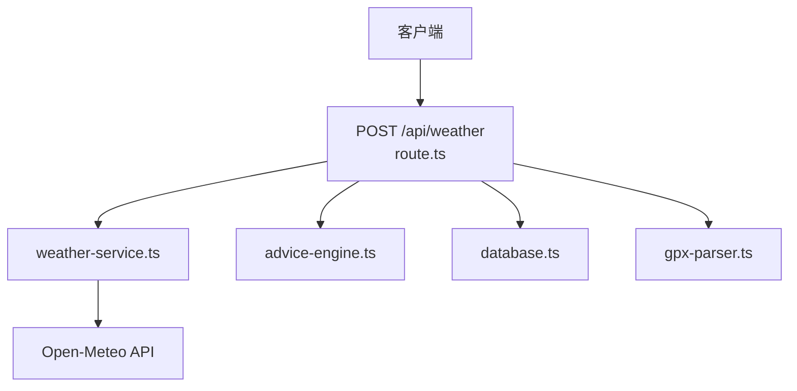
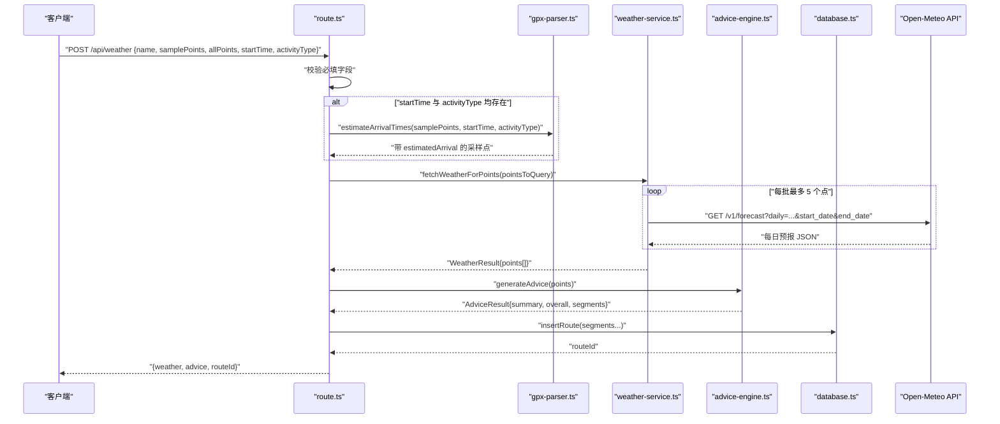
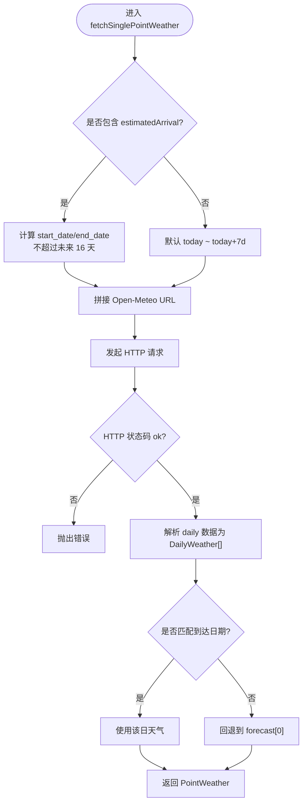
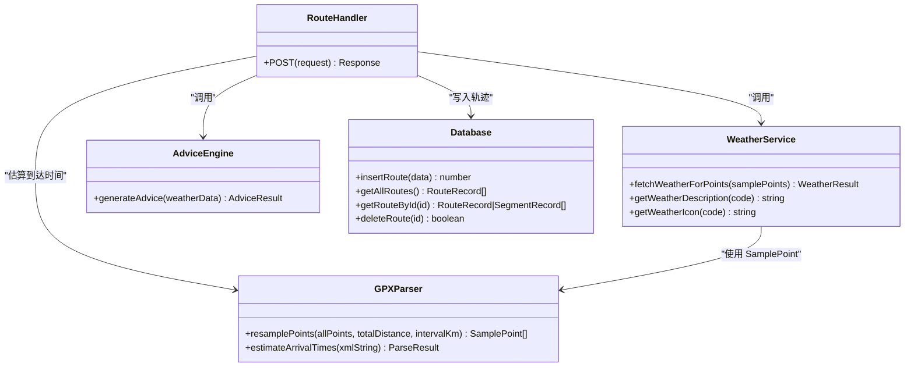

# 天气查询接口

<cite>
**本文引用的文件**
- [app/api/weather/route.ts](file://app/api/weather/route.ts)
- [lib/weather-service.ts](file://lib/weather-service.ts)
- [lib/gpx-parser.ts](file://lib/gpx-parser.ts)
- [lib/advice-engine.ts](file://lib/advice-engine.ts)
- [lib/database.ts](file://lib/database.ts)
- [app/page.tsx](file://app/page.tsx)
</cite>

## 目录
1. [简介](#简介)
2. [项目结构](#项目结构)
3. [核心组件](#核心组件)
4. [架构总览](#架构总览)
5. [详细组件分析](#详细组件分析)
6. [依赖关系分析](#依赖关系分析)
7. [性能与批量优化](#性能与批量优化)
8. [错误处理与重试策略](#错误处理与重试策略)
9. [缓存机制](#缓存机制)
10. [请求示例与响应格式](#请求示例与响应格式)
11. [故障排查指南](#故障排查指南)
12. [结论](#结论)

## 简介
本接口提供“沿途天气”查询能力，支持基于采样点坐标数组、活动类型与开始时间估算到达时间，并返回每日天气预报、匹配到达日期的当日天气以及智能建议。后端通过 Open-Meteo API 获取天气数据，并对结果进行聚合与建议生成，同时可选地将轨迹段信息持久化到本地 SQLite 数据库。

## 项目结构
与本接口相关的核心文件如下：
- 路由入口：app/api/weather/route.ts
- 天气服务：lib/weather-service.ts（Open-Meteo 集成、WMO 代码映射）
- 轨迹解析与采样：lib/gpx-parser.ts（采样点定义、活动类型、采样间隔）
- 建议引擎：lib/advice-engine.ts（根据天气生成建议）
- 数据库：lib/database.ts（轨迹与分段记录持久化）
- 前端调用示例：app/page.tsx（客户端如何发起 POST /api/weather）

图表来源
- [app/api/weather/route.ts:1-93](file://app/api/weather/route.ts#L1-L93)
- [lib/weather-service.ts:71-176](file://lib/weather-service.ts#L71-L176)
- [lib/advice-engine.ts:118-201](file://lib/advice-engine.ts#L118-L201)
- [lib/database.ts:90-162](file://lib/database.ts#L90-L162)
- [lib/gpx-parser.ts:44-110](file://lib/gpx-parser.ts#L44-L110)

章节来源
- [app/api/weather/route.ts:1-93](file://app/api/weather/route.ts#L1-L93)
- [lib/weather-service.ts:1-176](file://lib/weather-service.ts#L1-L176)
- [lib/gpx-parser.ts:1-231](file://lib/gpx-parser.ts#L1-L231)
- [lib/advice-engine.ts:1-201](file://lib/advice-engine.ts#L1-L201)
- [lib/database.ts:1-204](file://lib/database.ts#L1-L204)
- [app/page.tsx:63-118](file://app/page.tsx#L63-L118)

## 核心组件
- 路由处理器：负责参数校验、到达时间估算、调用天气服务与建议引擎、可选写入数据库、统一错误封装。
- 天气服务：按批次并发调用 Open-Meteo 的每日预报接口，构造日期范围，解析并映射 WMO 天气代码，返回每个采样点的当日天气与完整 7 天预报。
- 建议引擎：基于温度、降水概率、风力和天气代码生成分级建议，并汇总整体摘要。
- 轨迹解析：定义采样点与活动类型，支持按距离等间隔采样与到达时间估算。
- 数据库：使用 SQLite 持久化轨迹与分段信息，便于后续查看与分析。

章节来源
- [app/api/weather/route.ts:7-92](file://app/api/weather/route.ts#L7-L92)
- [lib/weather-service.ts:71-176](file://lib/weather-service.ts#L71-L176)
- [lib/advice-engine.ts:118-201](file://lib/advice-engine.ts#L118-L201)
- [lib/gpx-parser.ts:4-15](file://lib/gpx-parser.ts#L4-L15)
- [lib/database.ts:23-55](file://lib/database.ts#L23-L55)

## 架构总览
以下时序图展示了从客户端发起请求到返回结果的完整流程，包括到达时间估算、天气数据获取、建议生成与数据库写入。

图表来源
- [app/api/weather/route.ts:7-92](file://app/api/weather/route.ts#L7-L92)
- [lib/gpx-parser.ts:95-110](file://lib/gpx-parser.ts#L95-L110)
- [lib/weather-service.ts:71-176](file://lib/weather-service.ts#L71-L176)
- [lib/advice-engine.ts:118-201](file://lib/advice-engine.ts#L118-L201)
- [lib/database.ts:90-162](file://lib/database.ts#L90-L162)

## 详细组件分析

### 端点：POST /api/weather
- 功能：接收采样点与可选的开始时间、活动类型，计算到达时间，拉取沿途天气，生成建议，并可选保存至数据库。
- 输入参数
  - name: 字符串，可选；用于命名轨迹。
  - samplePoints: 采样点数组，必填；每个点包含经纬度、索引、距起点距离，可能包含预计到达时间。
  - allPoints: 原始轨迹点数组，可选；用于持久化。
  - startTime: ISO 时间字符串，可选；结合 activityType 可估算到达时间。
  - activityType: 活动类型标识，可选；如 walking/hiking/cycling/mtb/running/driving。
- 参数校验规则
  - samplePoints 必须存在且长度大于 0，否则返回 400。
  - 若同时提供 startTime 与 activityType，则对采样点进行到达时间估算。
- 输出结构
  - weather: 天气结果对象，包含 points 数组。
  - advice: 建议结果对象，包含 summary、overall、segments。
  - routeId: 成功入库时返回的轨迹 ID，失败时为 null。
- 错误处理
  - 参数缺失或无效：400。
  - 其他异常：500，返回 error 消息。

章节来源
- [app/api/weather/route.ts:7-92](file://app/api/weather/route.ts#L7-L92)

### 天气服务：Open-Meteo 集成与数据结构
- 批量策略
  - 将采样点分批，每批最多 5 个，同批内并发请求，降低总体延迟。
- 日期范围计算
  - 若采样点含 estimatedArrival，则以到达日期为基准，起始日期不晚于当天，结束日期为到达日 +1 天，且不超出未来 16 天的限制。
  - 若无到达时间，默认查询今天起 7 天。
- 请求字段
  - daily 参数包含：最高温、最低温、最大降水概率、天气代码、最大风速。
- 响应映射
  - 将 Open-Meteo 的每日数据映射为 DailyWeather 结构，并匹配到达日期的当日天气；若无匹配则回退到第一天。
- WMO 天气代码映射
  - 提供 getWeatherDescription 与 getWeatherIcon 两个工具函数，将数字代码转换为中文描述与图标。

图表来源
- [lib/weather-service.ts:89-176](file://lib/weather-service.ts#L89-L176)

章节来源
- [lib/weather-service.ts:1-176](file://lib/weather-service.ts#L1-L176)

### 建议引擎：基于天气的智能建议
- 规则维度
  - 降水概率：>70% 警告，>50% 提示。
  - 雷暴：天气代码 >= 95 危险。
  - 高温：最高温 >= 35°C 警告，>= 30°C 提示。
  - 低温：最低温 <= 0°C 警告，<= 5°C 提示。
  - 大风：最大风速 > 50km/h 危险，> 30km/h 警告。
  - 降雪：雪相关代码区间提示路面湿滑。
- 输出
  - segments：每个采样点对应的分段建议。
  - overall：去重后的整体建议，按严重级别排序。
  - summary：综合摘要，包含平均气温、天气状况、最高降水概率等。

章节来源
- [lib/advice-engine.ts:30-116](file://lib/advice-engine.ts#L30-L116)
- [lib/advice-engine.ts:118-201](file://lib/advice-engine.ts#L118-L201)

### 轨迹解析与采样：采样点与活动类型
- 数据结构
  - TrackPoint：基础轨迹点（经纬度、海拔、时间）。
  - SamplePoint：扩展采样点（索引、距起点距离、预计到达时间）。
  - ActivityType：活动类型（id、标签、图标、平均速度 km/h）。
  - SAMPLE_INTERVALS：采样间隔选项（1km/5km/10km）。
- 采样算法
  - 按累计距离选择采样点，保证首尾点必选，控制最大样本数。
- 到达时间估算
  - 根据活动类型的平均速度与距起点距离，推算 estimatedArrival。

章节来源
- [lib/gpx-parser.ts:4-42](file://lib/gpx-parser.ts#L4-L42)
- [lib/gpx-parser.ts:44-94](file://lib/gpx-parser.ts#L44-L94)
- [lib/gpx-parser.ts:95-110](file://lib/gpx-parser.ts#L95-L110)

### 数据库：轨迹与分段持久化
- 表结构
  - routes：轨迹基本信息（名称、距离、点数、活动类型、开始时间、创建时间、全部轨迹点 JSON）。
  - segments：分段信息（点索引、距离、经纬度、到达日期/时间、WMO 代码、温度、降水概率、风速、建议等级与文本）。
- 写入逻辑
  - 在路由中尝试写入，失败不影响主流程，仅记录日志。
  - 使用事务批量插入分段，提升写入效率。

章节来源
- [lib/database.ts:23-55](file://lib/database.ts#L23-L55)
- [lib/database.ts:90-162](file://lib/database.ts#L90-L162)

## 依赖关系分析
- 耦合关系
  - route.ts 依赖 weather-service.ts、advice-engine.ts、gpx-parser.ts、database.ts。
  - weather-service.ts 依赖 gpx-parser.ts 的 SamplePoint 类型。
  - advice-engine.ts 依赖 weather-service.ts 的 DailyWeather 与描述工具。
- 外部依赖
  - Open-Meteo API：每日预报接口。
  - SQLite（better-sqlite3）：本地数据库。

图表来源
- [app/api/weather/route.ts:1-93](file://app/api/weather/route.ts#L1-L93)
- [lib/weather-service.ts:1-176](file://lib/weather-service.ts#L1-L176)
- [lib/advice-engine.ts:1-201](file://lib/advice-engine.ts#L1-L201)
- [lib/gpx-parser.ts:1-231](file://lib/gpx-parser.ts#L1-L231)
- [lib/database.ts:1-204](file://lib/database.ts#L1-L204)

## 性能与批量优化
- 批量并发
  - 每批最多 5 个采样点，同批内并行请求，显著降低端到端延迟。
- 采样点数量控制
  - 采样间隔与最大样本数限制避免过多请求，提高吞吐。
- 日期范围裁剪
  - 有到达时间的场景只查询必要日期窗口，减少数据传输量。
- 数据库写入
  - 使用事务批量插入分段，减少 I/O 次数。

章节来源
- [lib/weather-service.ts:71-87](file://lib/weather-service.ts#L71-L87)
- [lib/gpx-parser.ts:44-94](file://lib/gpx-parser.ts#L44-L94)
- [lib/database.ts:131-159](file://lib/database.ts#L131-L159)

## 错误处理与重试策略
- 当前实现
  - 路由层捕获所有异常，返回 500 与错误消息。
  - 天气服务在 HTTP 非 ok 时抛出错误。
  - 数据库写入失败不会导致请求失败，仅记录日志。
- 建议的重试策略（可扩展）
  - 针对网络超时或临时性错误（如 5xx），实施指数退避重试（例如最多 2 次）。
  - 对 429（限流）增加等待后重试。
  - 对确定性错误（如 4xx）不进行重试，直接返回错误。
- 建议的错误分类
  - 参数错误：400。
  - 上游服务错误：502/503/504 等，触发重试。
  - 业务错误：如未提供采样点，400。

章节来源
- [app/api/weather/route.ts:87-92](file://app/api/weather/route.ts#L87-L92)
- [lib/weather-service.ts:141-145](file://lib/weather-service.ts#L141-L145)
- [app/api/weather/route.ts:77-80](file://app/api/weather/route.ts#L77-L80)

## 缓存机制
- 当前实现
  - 未发现服务端缓存逻辑。
- 建议的缓存策略（可扩展）
  - 基于地点与日期范围的键值缓存（如 Redis），TTL 设置为 10-30 分钟，避免重复请求相同区域与日期的天气。
  - 对于无到达时间的场景，可按“今日+7天”的固定窗口缓存。
  - 注意缓存失效与更新策略，确保数据新鲜度。

章节来源
- [lib/weather-service.ts:138-147](file://lib/weather-service.ts#L138-L147)

## 请求示例与响应格式

### 请求
- 方法：POST
- 路径：/api/weather
- Content-Type：application/json
- 请求体字段
  - name: 字符串，可选
  - samplePoints: 采样点数组，必填
    - lat: 纬度，数值
    - lon: 经度，数值
    - index: 索引，数值
    - distanceFromStart: 距起点距离（km），数值
    - estimatedArrival: ISO 时间字符串，可选
  - allPoints: 原始轨迹点数组，可选
    - lat: 纬度，数值
    - lon: 经度，数值
    - elevation: 海拔，可选
    - time: 时间，可选
  - startTime: ISO 时间字符串，可选
  - activityType: 活动类型标识，可选（walking/hiking/cycling/mtb/running/driving）

章节来源
- [app/api/weather/route.ts:10-22](file://app/api/weather/route.ts#L10-L22)
- [lib/gpx-parser.ts:4-15](file://lib/gpx-parser.ts#L4-L15)
- [lib/gpx-parser.ts:17-31](file://lib/gpx-parser.ts#L17-L31)

### 响应
- 成功响应体
  - weather: 天气结果对象
    - points: 采样点天气数组
      - point: 采样点对象
      - arrivalDate: 到达日期（YYYY-MM-DD），可为空
      - arrivalTime: 到达时间（HH:MM），可为空
      - weather: 当日天气对象（DailyWeather），可为空
      - forecast: 7 天预报数组（DailyWeather[]）
  - advice: 建议结果对象
    - summary: 整体摘要字符串
    - overall: 整体建议数组
      - level: info/warning/danger
      - icon: 图标字符
      - text: 建议文本
    - segments: 分段建议数组
      - pointIndex: 点索引
      - distanceKm: 距离（km）
      - lat/lon: 经纬度
      - arrivalDate/arrivalTime: 到达日期/时间
      - weather: 当日天气对象（DailyWeather），可为空
      - advices: 该分段的建议数组
  - routeId: 轨迹 ID，整数或 null

- 错误响应体
  - error: 错误消息字符串
  - 状态码：400（参数错误）、500（服务器错误）

章节来源
- [app/api/weather/route.ts:82-92](file://app/api/weather/route.ts#L82-L92)
- [lib/weather-service.ts:3-22](file://lib/weather-service.ts#L3-L22)
- [lib/advice-engine.ts:7-28](file://lib/advice-engine.ts#L7-L28)

### 客户端调用示例（参考）
- 前端页面在用户确认设置后，向 /api/weather 发送 POST 请求，并将结果存入 sessionStorage 后跳转结果页。

章节来源
- [app/page.tsx:63-118](file://app/page.tsx#L63-L118)

## 故障排查指南
- 常见问题
  - 未提供采样点：检查 samplePoints 是否为空数组或缺失。
  - 活动类型无效：确认 activityType 是否在支持列表中。
  - 开始时间格式错误：确保 startTime 为有效 ISO 时间字符串。
  - 上游服务不可用：检查 Open-Meteo 可达性与状态码。
- 定位步骤
  - 查看路由层错误日志与返回的 error 消息。
  - 检查天气服务抛出的错误信息（包含状态码与原因）。
  - 确认数据库写入是否失败（不影响主流程，但会记录日志）。

章节来源
- [app/api/weather/route.ts:24-29](file://app/api/weather/route.ts#L24-L29)
- [app/api/weather/route.ts:87-92](file://app/api/weather/route.ts#L87-L92)
- [lib/weather-service.ts:141-145](file://lib/weather-service.ts#L141-L145)
- [app/api/weather/route.ts:77-80](file://app/api/weather/route.ts#L77-L80)

## 结论
本接口以简洁的请求格式提供强大的“沿途天气”能力，通过批量并发与采样控制提升性能，结合建议引擎为用户提供出行决策支持。建议在后续版本中加入服务端缓存与更健壮的重试策略，以进一步提升稳定性与用户体验。