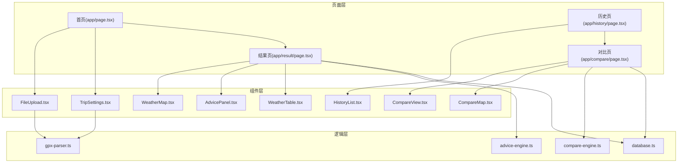
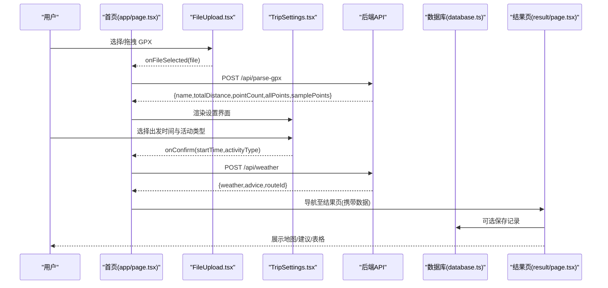
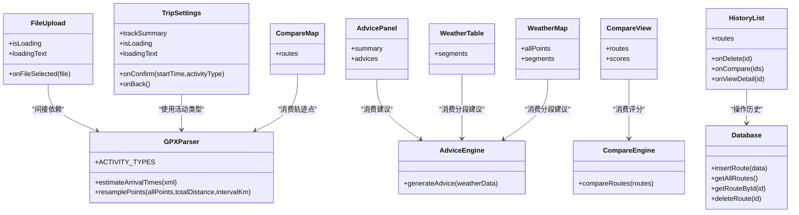

# 前端组件架构

<cite>
**本文引用的文件**   
- [components/FileUpload.tsx](file://components/FileUpload.tsx)
- [components/TripSettings.tsx](file://components/TripSettings.tsx)
- [components/AdvicePanel.tsx](file://components/AdvicePanel.tsx)
- [components/WeatherTable.tsx](file://components/WeatherTable.tsx)
- [components/WeatherMap.tsx](file://components/WeatherMap.tsx)
- [components/CompareView.tsx](file://components/CompareView.tsx)
- [components/CompareMap.tsx](file://components/CompareMap.tsx)
- [components/HistoryList.tsx](file://components/HistoryList.tsx)
- [app/page.tsx](file://app/page.tsx)
- [app/result/page.tsx](file://app/result/page.tsx)
- [app/history/page.tsx](file://app/history/page.tsx)
- [app/compare/page.tsx](file://app/compare/page.tsx)
- [lib/gpx-parser.ts](file://lib/gpx-parser.ts)
- [lib/advice-engine.ts](file://lib/advice-engine.ts)
- [lib/compare-engine.ts](file://lib/compare-engine.ts)
- [lib/database.ts](file://lib/database.ts)
</cite>

## 目录
1. [简介](#简介)
2. [项目结构](#项目结构)
3. [核心组件](#核心组件)
4. [架构总览](#架构总览)
5. [详细组件分析](#详细组件分析)
6. [依赖关系分析](#依赖关系分析)
7. [性能与可访问性](#性能与可访问性)
8. [故障排查指南](#故障排查指南)
9. [结论](#结论)
10. [附录：使用示例与样式定制](#附录使用示例与样式定制)

## 简介
本文件面向 FineG 的前端组件架构，聚焦基于 React 的组件化设计与页面组织方式。文档覆盖以下要点：
- 组件职责、Props 接口、事件处理与状态管理
- 关键组件实现细节：FileUpload、WeatherMap、AdvicePanel、CompareView（以及 CompareMap、HistoryList、TripSettings、WeatherTable）
- 组件间通信机制与数据传递模式
- 使用示例、样式定制方法与响应式设计考虑

## 项目结构
FineG 采用 Next.js App Router + React 客户端组件的组织方式：
- app 目录：页面路由与页面级状态编排
- components 目录：可复用 UI 组件
- lib 目录：业务逻辑与数据处理（GPX 解析、建议生成、对比评分、数据库封装）

图表来源
- [app/page.tsx:1-214](file://app/page.tsx#L1-L214)
- [app/result/page.tsx:1-578](file://app/result/page.tsx#L1-L578)
- [app/history/page.tsx:1-96](file://app/history/page.tsx#L1-L96)
- [app/compare/page.tsx:1-251](file://app/compare/page.tsx#L1-L251)
- [components/FileUpload.tsx:1-97](file://components/FileUpload.tsx#L1-L97)
- [components/TripSettings.tsx:1-175](file://components/TripSettings.tsx#L1-L175)
- [components/AdvicePanel.tsx:1-65](file://components/AdvicePanel.tsx#L1-L65)
- [components/WeatherTable.tsx:1-102](file://components/WeatherTable.tsx#L1-L102)
- [components/WeatherMap.tsx:1-182](file://components/WeatherMap.tsx#L1-L182)
- [components/CompareView.tsx:1-273](file://components/CompareView.tsx#L1-L273)
- [components/CompareMap.tsx:1-190](file://components/CompareMap.tsx#L1-L190)
- [components/HistoryList.tsx:1-218](file://components/HistoryList.tsx#L1-L218)
- [lib/gpx-parser.ts:1-231](file://lib/gpx-parser.ts#L1-L231)
- [lib/advice-engine.ts:1-201](file://lib/advice-engine.ts#L1-L201)
- [lib/compare-engine.ts:1-116](file://lib/compare-engine.ts#L1-L116)
- [lib/database.ts:1-204](file://lib/database.ts#L1-L204)

章节来源
- [app/page.tsx:1-214](file://app/page.tsx#L1-L214)
- [app/result/page.tsx:1-578](file://app/result/page.tsx#L1-L578)
- [app/history/page.tsx:1-96](file://app/history/page.tsx#L1-L96)
- [app/compare/page.tsx:1-251](file://app/compare/page.tsx#L1-L251)

## 核心组件
本节概述各组件的职责、Props 接口、事件与状态管理要点。

- FileUpload
  - 职责：接收 GPX 文件（拖拽或选择），校验 .gpx 后缀并回调父组件
  - Props：onFileSelected(file)、isLoading、loadingText?
  - 事件：onDragOver/onDragLeave/onDrop、onChange
  - 状态：isDragging、禁用态控制
  - 参考路径：[components/FileUpload.tsx:1-97](file://components/FileUpload.tsx#L1-L97)

- TripSettings
  - 职责：展示轨迹摘要、设置出发时间与出行方式、估算用时
  - Props：trackSummary、onConfirm(startTime, activityType)、onBack、isLoading、loadingText?
  - 事件：onConfirm、onBack
  - 状态：dateTime、selectedActivity
  - 参考路径：[components/TripSettings.tsx:1-175](file://components/TripSettings.tsx#L1-L175)

- AdvicePanel
  - 职责：展示天气概况与按严重度排序的建议列表
  - Props：summary、advices[]
  - 渲染：根据 level 区分颜色与图标
  - 参考路径：[components/AdvicePanel.tsx:1-65](file://components/AdvicePanel.tsx#L1-L65)

- WeatherTable
  - 职责：以表格形式展示沿途采样点天气详情
  - Props：segments[]
  - 参考路径：[components/WeatherTable.tsx:1-102](file://components/WeatherTable.tsx#L1-L102)

- WeatherMap
  - 职责：在 Leaflet 地图上绘制轨迹线与采样点标记，Tooltip/Popup 显示天气与建议
  - Props：allPoints[]、segments[]
  - 状态：isClient（避免 SSR 错误）
  - 参考路径：[components/WeatherMap.tsx:1-182](file://components/WeatherMap.tsx#L1-L182)

- CompareView
  - 职责：多路线对比卡片与对齐百分比表格，计算推荐路线
  - Props：routes[]、scores[]
  - 辅助：getSegmentAtPercent、getRouteColor
  - 参考路径：[components/CompareView.tsx:1-273](file://components/CompareView.tsx#L1-L273)

- CompareMap
  - 职责：多路线地图叠加显示，带图例
  - Props：routes[{id,name,color,allPoints,segments}]
  - 状态：isClient
  - 参考路径：[components/CompareMap.tsx:1-190](file://components/CompareMap.tsx#L1-L190)

- HistoryList
  - 职责：历史记录列表、多选对比、删除确认、查看详情跳转
  - Props：routes[]、onDelete(id)、onCompare(ids[])、onViewDetail(id)
  - 状态：selected Set、deleting id
  - 参考路径：[components/HistoryList.tsx:1-218](file://components/HistoryList.tsx#L1-L218)

章节来源
- [components/FileUpload.tsx:1-97](file://components/FileUpload.tsx#L1-L97)
- [components/TripSettings.tsx:1-175](file://components/TripSettings.tsx#L1-L175)
- [components/AdvicePanel.tsx:1-65](file://components/AdvicePanel.tsx#L1-L65)
- [components/WeatherTable.tsx:1-102](file://components/WeatherTable.tsx#L1-L102)
- [components/WeatherMap.tsx:1-182](file://components/WeatherMap.tsx#L1-L182)
- [components/CompareView.tsx:1-273](file://components/CompareView.tsx#L1-L273)
- [components/CompareMap.tsx:1-190](file://components/CompareMap.tsx#L1-L190)
- [components/HistoryList.tsx:1-218](file://components/HistoryList.tsx#L1-L218)

## 架构总览
整体流程：上传 GPX → 解析与采样 → 设置出发时间/活动类型 → 获取天气与建议 → 结果可视化与持久化 → 历史管理与多路线对比。

图表来源
- [app/page.tsx:1-214](file://app/page.tsx#L1-L214)
- [components/FileUpload.tsx:1-97](file://components/FileUpload.tsx#L1-L97)
- [components/TripSettings.tsx:1-175](file://components/TripSettings.tsx#L1-L175)
- [app/result/page.tsx:1-578](file://app/result/page.tsx#L1-L578)
- [lib/database.ts:1-204](file://lib/database.ts#L1-L204)

## 详细组件分析

### FileUpload 组件
- 设计要点
  - 支持拖拽与点击选择，限制 .gpx 扩展名
  - 通过 isLoading 禁用交互，提供 loadingText 文案
  - 使用 useCallback 稳定事件处理器引用
- 关键 Props
  - onFileSelected(file): 回调选中文件
  - isLoading: boolean
  - loadingText?: string
- 事件与状态
  - isDragging 用于高亮拖拽区域
  - onDragOver/onDragLeave/onDrop 控制拖拽反馈与文件派发
  - onChange 处理 input[type=file] 选择
- 使用示例（概念）
  - 父组件持有状态 status，在 parsing 时传入 isLoading=true
  - 收到 file 后调用后端解析接口，成功后进入设置步骤
- 样式定制
  - 通过 className 组合 Tailwind 类，可按需替换边框、背景、圆角等
- 响应式
  - 容器自适应宽度，移动端友好

章节来源
- [components/FileUpload.tsx:1-97](file://components/FileUpload.tsx#L1-L97)
- [app/page.tsx:1-214](file://app/page.tsx#L1-L214)

### TripSettings 组件
- 设计要点
  - 展示轨迹摘要（名称、距离、点数、采样点数量）
  - 默认出发时间为“明天 8:00”，支持修改
  - 根据活动类型平均速度估算全程用时
- 关键 Props
  - trackSummary: { name, totalDistance, pointCount, sampleCount }
  - onConfirm(startTime, activityType)
  - onBack()
  - isLoading, loadingText?
- 事件与状态
  - dateTime、selectedActivity
  - 确认按钮触发 onConfirm；返回按钮触发 onBack
- 使用示例（概念）
  - 首页在解析完成后渲染该组件，将解析结果映射为 trackSummary
- 样式定制
  - 表单控件与卡片布局可通过 Tailwind 类调整
- 响应式
  - 网格布局在小屏自动换行

章节来源
- [components/TripSettings.tsx:1-175](file://components/TripSettings.tsx#L1-L175)
- [app/page.tsx:1-214](file://app/page.tsx#L1-L214)

### AdvicePanel 组件
- 设计要点
  - 顶部展示总体天气概况 summary
  - 下方按严重度（danger/warning/info）展示建议列表
- 关键 Props
  - summary: string
  - advices: Advice[]
- 渲染逻辑
  - 根据 advice.level 决定文字与背景色
  - 无建议时展示“整体良好”提示
- 使用示例（概念）
  - 结果页从 advice-engine 生成的 overall 数组传入
- 样式定制
  - 通过 Tailwind 类快速切换主题色与间距
- 响应式
  - 列表项在小屏下保持可读性

章节来源
- [components/AdvicePanel.tsx:1-65](file://components/AdvicePanel.tsx#L1-L65)
- [lib/advice-engine.ts:1-201](file://lib/advice-engine.ts#L1-L201)

### WeatherTable 组件
- 设计要点
  - 表格展示每个采样点的距离、到达时间、天气、温度、降水概率、风速
  - 对高降水/大风进行高亮
- 关键 Props
  - segments: SegmentAdvice[]
- 使用示例（概念）
  - 结果页底部全宽展示
- 样式定制
  - 表头与行样式可通过 Tailwind 类调整
- 响应式
  - 外层 overflow-x-auto 保证小屏横向滚动

章节来源
- [components/WeatherTable.tsx:1-102](file://components/WeatherTable.tsx#L1-L102)
- [app/result/page.tsx:1-578](file://app/result/page.tsx#L1-L578)

### WeatherMap 组件
- 设计要点
  - 使用 react-leaflet 渲染地图，绘制 Polyline 轨迹与 CircleMarker 采样点
  - Tooltip/Popup 显示天气信息与建议
  - 通过 isClient 规避 SSR 初始化问题
- 关键 Props
  - allPoints: TrackPoint[]
  - segments: SegmentAdvice[]
- 数据流
  - positions = allPoints.map(p => [p.lat,p.lon])
  - bounds/center 由所有点计算得出
  - 采样点颜色依据是否有 danger/warning 建议
- 使用示例（概念）
  - 结果页传入 allPoints 与 segments
- 样式定制
  - 地图容器尺寸与圆角通过 className/style 控制
- 响应式
  - 高度固定但可随父容器变化

章节来源
- [components/WeatherMap.tsx:1-182](file://components/WeatherMap.tsx#L1-L182)
- [app/result/page.tsx:1-578](file://app/result/page.tsx#L1-L578)

### CompareView 组件
- 设计要点
  - 顶部卡片汇总每条路线的关键指标与亮点
  - 中部表格按 0%/25%/50%/75%/100% 对齐比较各路段天气
  - 根据 compare-engine 评分输出排名与推荐标记
- 关键 Props
  - routes: CompareRouteData[]
  - scores: RouteScore[]
- 算法片段
  - getSegmentAtPercent(segments, totalDist, pct) 定位对应路段
  - getRouteColor(index) 分配路线颜色
- 使用示例（概念）
  - 对比页加载多条路线后传入
- 样式定制
  - 卡片边框、阴影、推荐标签均可通过 Tailwind 类调整
- 响应式
  - 卡片列数随屏幕宽度变化

章节来源
- [components/CompareView.tsx:1-273](file://components/CompareView.tsx#L1-L273)
- [lib/compare-engine.ts:1-116](file://lib/compare-engine.ts#L1-L116)
- [app/compare/page.tsx:1-251](file://app/compare/page.tsx#L1-L251)

### CompareMap 组件
- 设计要点
  - 多路线叠加显示，每条路线独立颜色
  - 采样点标记颜色反映风险等级
  - 左下角图例展示路线颜色与名称
- 关键 Props
  - routes: Array<{id,name,color,allPoints,segments}>
- 数据流
  - 聚合所有点计算 bounds/center
  - 遍历 routes 渲染 Polyline 与 CircleMarker
- 使用示例（概念）
  - 对比页动态导入并传入 mapRoutes
- 样式定制
  - 图例样式与 Marker 颜色可配置
- 响应式
  - 高度固定，适配不同屏幕

章节来源
- [components/CompareMap.tsx:1-190](file://components/CompareMap.tsx#L1-L190)
- [app/compare/page.tsx:1-251](file://app/compare/page.tsx#L1-L251)

### HistoryList 组件
- 设计要点
  - 列表展示历史路线，支持多选对比（最多 4 条）
  - 二次点击确认删除，悬浮栏一键对比
- 关键 Props
  - routes: HistoryRoute[]
  - onDelete(id), onCompare(ids[]), onViewDetail(id)
- 状态
  - selected: Set<number>
  - deleting: number | null
- 使用示例（概念）
  - 历史页负责数据加载与回调处理
- 样式定制
  - 选中态边框与环阴影突出
- 响应式
  - 悬浮栏在小屏居中显示

章节来源
- [components/HistoryList.tsx:1-218](file://components/HistoryList.tsx#L1-L218)
- [app/history/page.tsx:1-96](file://app/history/page.tsx#L1-L96)

## 依赖关系分析
组件与库之间的依赖如下：

图表来源
- [components/FileUpload.tsx:1-97](file://components/FileUpload.tsx#L1-L97)
- [components/TripSettings.tsx:1-175](file://components/TripSettings.tsx#L1-L175)
- [components/AdvicePanel.tsx:1-65](file://components/AdvicePanel.tsx#L1-L65)
- [components/WeatherTable.tsx:1-102](file://components/WeatherTable.tsx#L1-L102)
- [components/WeatherMap.tsx:1-182](file://components/WeatherMap.tsx#L1-L182)
- [components/CompareView.tsx:1-273](file://components/CompareView.tsx#L1-L273)
- [components/CompareMap.tsx:1-190](file://components/CompareMap.tsx#L1-L190)
- [components/HistoryList.tsx:1-218](file://components/HistoryList.tsx#L1-L218)
- [lib/gpx-parser.ts:1-231](file://lib/gpx-parser.ts#L1-L231)
- [lib/advice-engine.ts:1-201](file://lib/advice-engine.ts#L1-L201)
- [lib/compare-engine.ts:1-116](file://lib/compare-engine.ts#L1-L116)
- [lib/database.ts:1-204](file://lib/database.ts#L1-L204)

章节来源
- [lib/gpx-parser.ts:1-231](file://lib/gpx-parser.ts#L1-L231)
- [lib/advice-engine.ts:1-201](file://lib/advice-engine.ts#L1-L201)
- [lib/compare-engine.ts:1-116](file://lib/compare-engine.ts#L1-L116)
- [lib/database.ts:1-204](file://lib/database.ts#L1-L204)

## 性能与可访问性
- 地图组件 SSR 安全
  - WeatherMap 与 CompareMap 均通过 isClient 状态避免在服务端初始化 Leaflet 导致的错误
  - 对比页使用 dynamic import 延迟加载地图，提升首屏性能
- 大数据量优化
  - 采样点数量上限受控（约 16 个），避免过多 Marker 影响渲染
  - 对比表格仅展示 5 个百分位点，降低 DOM 节点数量
- 交互体验
  - 拖拽上传提供即时视觉反馈
  - 删除操作二次确认，防止误删
- 可访问性建议
  - 为交互元素添加 aria-label/title
  - 键盘可达性与焦点可见性可在后续增强

[本节为通用指导，不直接分析具体文件]

## 故障排查指南
- 地图无法渲染
  - 检查是否启用客户端组件（"use client"）
  - 确认动态导入与 SSR=false 配置
  - 参考：[components/WeatherMap.tsx:1-182](file://components/WeatherMap.tsx#L1-L182)、[components/CompareMap.tsx:1-190](file://components/CompareMap.tsx#L1-L190)
- 上传失败或解析异常
  - 检查文件格式是否为 .gpx
  - 查看后端解析接口返回的错误信息
  - 参考：[app/page.tsx:1-214](file://app/page.tsx#L1-L214)
- 天气查询失败
  - 检查请求体字段是否完整（samplePoints、startTime、activityType）
  - 参考：[app/page.tsx:1-214](file://app/page.tsx#L1-L214)
- 历史记录加载为空
  - 确认数据库初始化与 API 正常
  - 参考：[app/history/page.tsx:1-96](file://app/history/page.tsx#L1-L96)、[lib/database.ts:1-204](file://lib/database.ts#L1-L204)

章节来源
- [components/WeatherMap.tsx:1-182](file://components/WeatherMap.tsx#L1-L182)
- [components/CompareMap.tsx:1-190](file://components/CompareMap.tsx#L1-L190)
- [app/page.tsx:1-214](file://app/page.tsx#L1-L214)
- [app/history/page.tsx:1-96](file://app/history/page.tsx#L1-L96)
- [lib/database.ts:1-204](file://lib/database.ts#L1-L204)

## 结论
FineG 的前端采用清晰的“页面编排 + 可复用组件 + 纯函数逻辑”的分层架构。组件职责单一、Props 接口明确、事件驱动的数据流清晰。通过采样点策略与动态加载地图等手段，兼顾了性能与用户体验。建议在后续迭代中补充更完善的错误边界与可访问性增强。

[本节为总结性内容，不直接分析具体文件]

## 附录：使用示例与样式定制

### 组件使用示例（概念）
- 首页上传与设置
  - 在首页引入 FileUpload 与 TripSettings，分别处理文件选择与设置确认
  - 参考：[app/page.tsx:1-214](file://app/page.tsx#L1-L214)
- 结果页展示
  - 将解析后的 allPoints 与 advice.segments 传给 WeatherMap 与 AdvicePanel
  - 参考：[app/result/page.tsx:1-578](file://app/result/page.tsx#L1-L578)
- 历史与对比
  - 历史页加载列表并支持多选对比，对比页加载数据并渲染 CompareView 与 CompareMap
  - 参考：[app/history/page.tsx:1-96](file://app/history/page.tsx#L1-L96)、[app/compare/page.tsx:1-251](file://app/compare/page.tsx#L1-L251)

### 样式定制方法
- 统一使用 Tailwind 类名进行样式定制，如边框、圆角、阴影、文本颜色等
- 地图容器可通过 className 与 style 控制宽高与圆角
- 组件内部已预留深色模式兼容类名，可直接沿用

### 响应式设计考虑
- 卡片网格根据设备宽度自动调整列数
- 表格使用横向滚动以适应小屏
- 地图高度固定，配合父容器实现自适应布局

[本节为概念性说明，不直接分析具体文件]