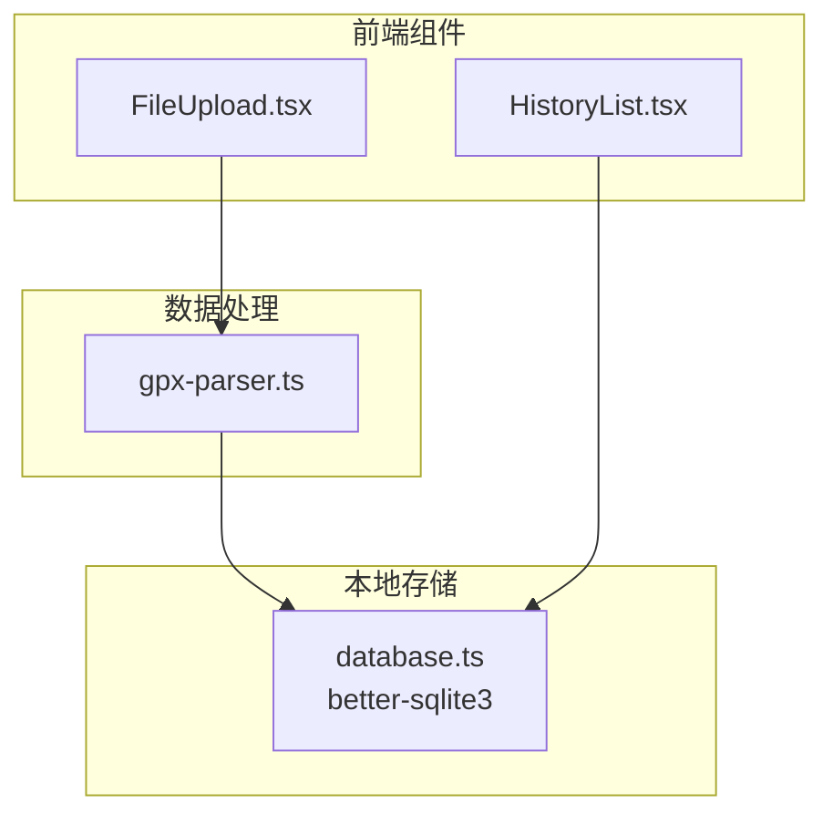
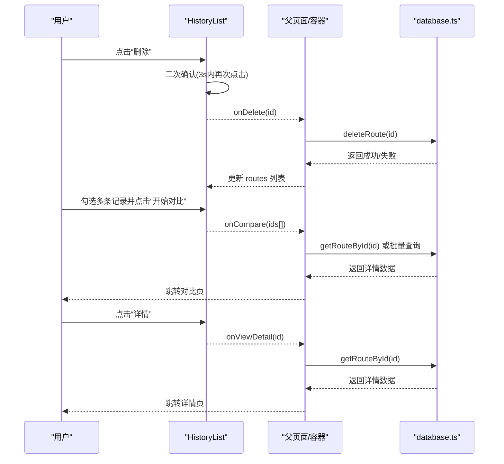
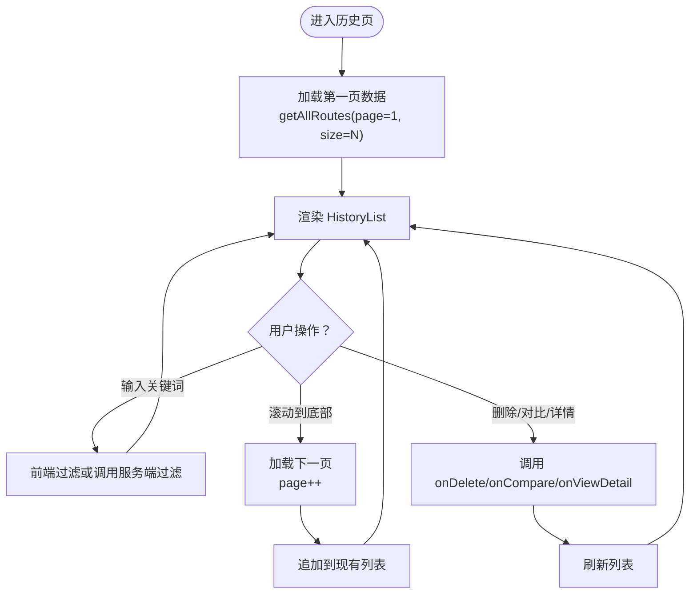
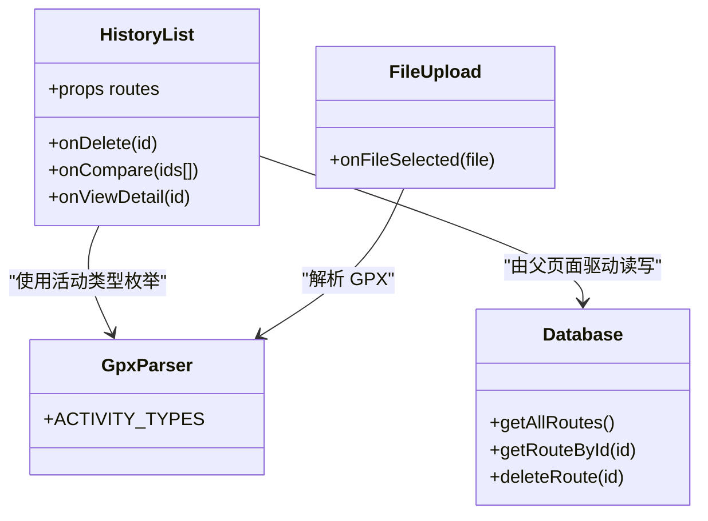

# 历史记录列表组件

<cite>
**本文引用的文件**   
- [HistoryList.tsx](file://src/components/HistoryList.tsx)
- [database.ts](file://src/lib/database.ts)
- [gpx-parser.ts](file://src/lib/gpx-parser.ts)
- [FileUpload.tsx](file://src/components/FileUpload.tsx)
</cite>

## 目录
1. [简介](#简介)
2. [项目结构](#项目结构)
3. [核心组件](#核心组件)
4. [架构总览](#架构总览)
5. [详细组件分析](#详细组件分析)
6. [依赖关系分析](#依赖关系分析)
7. [性能与可扩展性](#性能与可扩展性)
8. [故障排查指南](#故障排查指南)
9. [结论](#结论)
10. [附录：接口与数据模型](#附录接口与数据模型)

## 简介
本文件为“历史记录列表组件”（HistoryList）的完整技术文档，聚焦以下目标：
- 历史数据的分页加载、搜索过滤与操作能力说明
- 组件 Props 接口定义与使用方式
- 数据获取策略与本地存储集成（SQLite）
- 用户交互反馈（删除确认、批量对比选择）
- 与后端 API 的通信模式与错误处理策略建议
- 列表项交互设计与最佳实践

注意：当前仓库中 HistoryList 组件以“受控列表”形式呈现，由父级提供数据与回调。分页与搜索在当前实现中未内置，但文档提供了扩展方案与落地路径。

## 项目结构
围绕 HistoryList 的相关代码分布如下：
- 组件层：src/components/HistoryList.tsx（列表渲染与交互）、src/components/FileUpload.tsx（GPX 上传入口）
- 数据层：src/lib/database.ts（better-sqlite3 本地数据库读写）
- 解析层：src/lib/gpx-parser.ts（GPX 解析、采样点计算、活动类型映射）

图表来源
- [HistoryList.tsx:1-218](file://src/components/HistoryList.tsx#L1-L218)
- [database.ts:1-204](file://src/lib/database.ts#L1-L204)
- [gpx-parser.ts:1-231](file://src/lib/gpx-parser.ts#L1-L231)
- [FileUpload.tsx:1-97](file://src/components/FileUpload.tsx#L1-L97)

章节来源
- [HistoryList.tsx:1-218](file://src/components/HistoryList.tsx#L1-L218)
- [database.ts:1-204](file://src/lib/database.ts#L1-L204)
- [gpx-parser.ts:1-231](file://src/lib/gpx-parser.ts#L1-L231)
- [FileUpload.tsx:1-97](file://src/components/FileUpload.tsx#L1-L97)

## 核心组件
- HistoryList 负责展示历史路线卡片、多选对比、查看详情与删除确认等交互。
- 数据来源于父组件传入的 routes 数组；删除与对比通过回调 onDelete、onCompare、onViewDetail 通知上层。
- 支持最多 4 条路线进行对比，并提供浮动操作栏提示已选数量。

章节来源
- [HistoryList.tsx:16-28](file://src/components/HistoryList.tsx#L16-L28)
- [HistoryList.tsx:29-58](file://src/components/HistoryList.tsx#L29-L58)
- [HistoryList.tsx:72-217](file://src/components/HistoryList.tsx#L72-L217)

## 架构总览
HistoryList 作为纯展示与交互组件，其数据流通常如下：
- 父页面从本地数据库读取历史列表并传给 HistoryList
- 用户触发删除时，HistoryList 调用 onDelete，父页面执行删除逻辑（可结合 API 或本地库）
- 用户选择多条记录后点击“开始对比”，HistoryList 调用 onCompare 将选中 ID 列表上抛
- 用户点击“详情”，HistoryList 调用 onViewDetail 打开详情页

图表来源
- [HistoryList.tsx:44-58](file://src/components/HistoryList.tsx#L44-L58)
- [HistoryList.tsx:153-182](file://src/components/HistoryList.tsx#L153-L182)
- [HistoryList.tsx:198-214](file://src/components/HistoryList.tsx#L198-L214)
- [database.ts:190-203](file://src/lib/database.ts#L190-L203)
- [database.ts:172-188](file://src/lib/database.ts#L172-L188)

## 详细组件分析

### 组件 Props 与数据模型
- HistoryRoute：单条历史记录的只读数据结构，包含 id、name、距离、点数、活动类型、起始时间、创建时间等字段。
- HistoryListProps：
  - routes: 历史列表数据源
  - onDelete: 删除回调，接收被删记录 id
  - onCompare: 批量对比回调，接收选中 id 数组
  - onViewDetail: 查看详情回调，接收记录 id

章节来源
- [HistoryList.tsx:6-21](file://src/components/HistoryList.tsx#L6-L21)

### 数据获取策略与本地存储集成
- 列表数据来源：由父组件通过 props.routes 注入。当前组件不直接发起网络请求或数据库访问。
- 本地存储：database.ts 提供 getAllRoutes、getRouteById、deleteRoute 等方法，用于读取、查询与删除记录。
- 推荐集成方式：
  - 在父页面初始化时调用 getAllRoutes 获取列表，按 created_at 倒序排列
  - 删除时调用 deleteRoute，成功后刷新列表
  - 查看详情或对比时调用 getRouteById 获取完整数据

章节来源
- [database.ts:164-170](file://src/lib/database.ts#L164-L170)
- [database.ts:172-188](file://src/lib/database.ts#L172-L188)
- [database.ts:190-203](file://src/lib/database.ts#L190-L203)

### 分页加载与搜索过滤（扩展方案）
当前组件未内置分页与搜索，以下为可落地的扩展建议：
- 分页加载
  - 在父页面维护分页状态（page、pageSize），调用 getAllRoutes 时增加 LIMIT/OFFSET（需在 database.ts 扩展查询方法）
  - 滚动到底部或点击“加载更多”时追加下一页数据
- 搜索过滤
  - 在父页面维护 searchQuery 状态，对 routes 进行前端过滤（名称模糊匹配、日期范围筛选）
  - 如需服务端过滤，可在 database.ts 新增带条件的查询方法并在父页面调用

[此图为概念流程，无需图表来源]

### 用户操作反馈与交互设计
- 空态提示：当 routes 为空时显示友好引导文案，提示用户上传 GPX 文件后会保存记录。
- 多选对比：
  - 每条记录左侧复选框，最多可选 4 条
  - 达到上限时给出提示文本
  - 底部悬浮栏显示已选数量与“开始对比”按钮
- 删除确认：
  - 首次点击删除按钮进入“确认删除”状态（3 秒超时自动取消）
  - 再次点击才真正触发删除回调，避免误删

章节来源
- [HistoryList.tsx:60-70](file://src/components/HistoryList.tsx#L60-L70)
- [HistoryList.tsx:32-42](file://src/components/HistoryList.tsx#L32-L42)
- [HistoryList.tsx:185-193](file://src/components/HistoryList.tsx#L185-L193)
- [HistoryList.tsx:198-214](file://src/components/HistoryList.tsx#L198-L214)
- [HistoryList.tsx:44-58](file://src/components/HistoryList.tsx#L44-L58)

### 与后端 API 的通信模式与错误处理策略（建议）
当前仓库使用本地 SQLite 存储，未暴露 REST API。若后续引入后端服务，建议：
- 通信模式
  - GET /api/history?page=&size=&q= 获取分页列表
  - DELETE /api/history/:id 删除记录
  - GET /api/history/:id 获取详情
- 错误处理
  - 网络异常：重试机制 + 用户提示
  - 权限/鉴权失败：跳转登录或提示重新认证
  - 业务错误：根据错误码给出明确提示（如“记录不存在”、“删除失败”）
  - 乐观更新：删除前在 UI 立即移除条目，失败则回滚并提示

[本节为通用建议，不涉及具体源码，故无章节来源]

## 依赖关系分析
- HistoryList 依赖 gpx-parser 中的 ACTIVITY_TYPES 用于活动类型图标与标签展示
- 数据持久化依赖 database.ts 提供的 CRUD 方法
- 文件上传入口 FileUpload.tsx 与 GPX 解析器 gpx-parser.ts 配合完成轨迹解析与入库

图表来源
- [HistoryList.tsx:1-218](file://src/components/HistoryList.tsx#L1-L218)
- [database.ts:1-204](file://src/lib/database.ts#L1-L204)
- [gpx-parser.ts:1-231](file://src/lib/gpx-parser.ts#L1-L231)
- [FileUpload.tsx:1-97](file://src/components/FileUpload.tsx#L1-L97)

章节来源
- [HistoryList.tsx:1-218](file://src/components/HistoryList.tsx#L1-L218)
- [database.ts:1-204](file://src/lib/database.ts#L1-L204)
- [gpx-parser.ts:1-231](file://src/lib/gpx-parser.ts#L1-L231)
- [FileUpload.tsx:1-97](file://src/components/FileUpload.tsx#L1-L97)

## 性能与可扩展性
- 列表渲染
  - 大数据量场景建议虚拟滚动或分页加载，减少 DOM 节点数量
- 删除操作
  - 二次确认降低误删风险；建议在父页面做幂等删除与事务保护
- 对比功能
  - 限制最多 4 条对比，避免一次性拉取过多详情数据导致卡顿
- 本地存储
  - better-sqlite3 适合小中型数据集；超大规模需考虑分表或索引优化

[本节为通用建议，不涉及具体源码，故无章节来源]

## 故障排查指南
- 删除失败
  - 检查数据库连接与 WAL 模式是否生效
  - 确认外键约束与级联删除是否正确
- 列表为空
  - 确认父页面是否正确调用 getAllRoutes 并传入 routes
  - 检查 GPX 解析与入库流程是否成功
- 对比无法启动
  - 检查选中数量是否满足下限（≥2）且不超过上限（≤4）
  - 确认 onCompare 回调是否被正确绑定

章节来源
- [database.ts:190-203](file://src/lib/database.ts#L190-L203)
- [HistoryList.tsx:185-214](file://src/components/HistoryList.tsx#L185-L214)

## 结论
HistoryList 是一个简洁、可控的历史记录展示与交互组件，具备多选对比与删除确认等实用特性。结合 database.ts 的本地存储能力，可实现离线可用的历史记录管理。若需要更强大的检索与分页体验，可在父页面扩展分页与搜索逻辑，并按建议对接后端 API 以提升可扩展性与容错能力。

## 附录：接口与数据模型

### HistoryList Props 定义
- routes: HistoryRoute[]
- onDelete: (id: number) => void
- onCompare: (ids: number[]) => void
- onViewDetail: (id: number) => void

章节来源
- [HistoryList.tsx:16-21](file://src/components/HistoryList.tsx#L16-L21)

### 数据模型
- HistoryRoute（组件侧视图模型）
  - id: number
  - name: string
  - distance_km: number
  - points_count: number
  - activity_type: string | null
  - start_time: string | null
  - created_at: string

- RouteRecord（数据库实体）
  - id: number
  - name: string
  - distance_km: number
  - points_count: number
  - activity_type: string | null
  - start_time: string | null
  - created_at: string
  - all_points_json: string

- SegmentRecord（分段数据）
  - id: number
  - route_id: number
  - point_index: number
  - distance_km: number
  - lat: number
  - lon: number
  - arrival_date: string | null
  - arrival_time: string | null
  - wmo_code: number | null
  - temp_max: number | null
  - temp_min: number | null
  - precip_prob: number | null
  - wind_speed_max: number | null
  - advice_level: string | null
  - advice_text: string | null

章节来源
- [HistoryList.tsx:6-14](file://src/components/HistoryList.tsx#L6-L14)
- [database.ts:59-86](file://src/lib/database.ts#L59-L86)