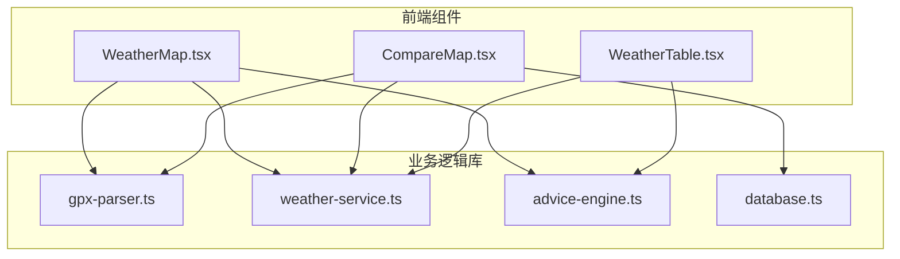
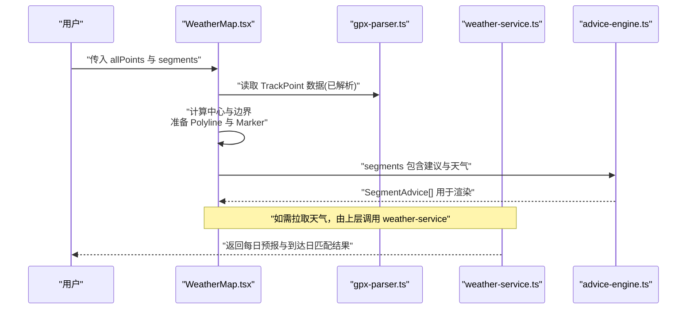
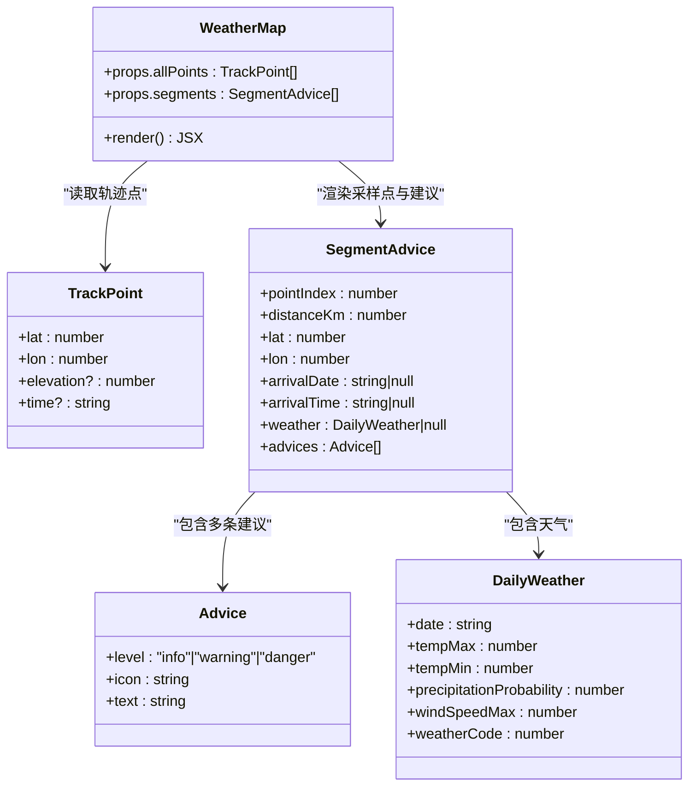
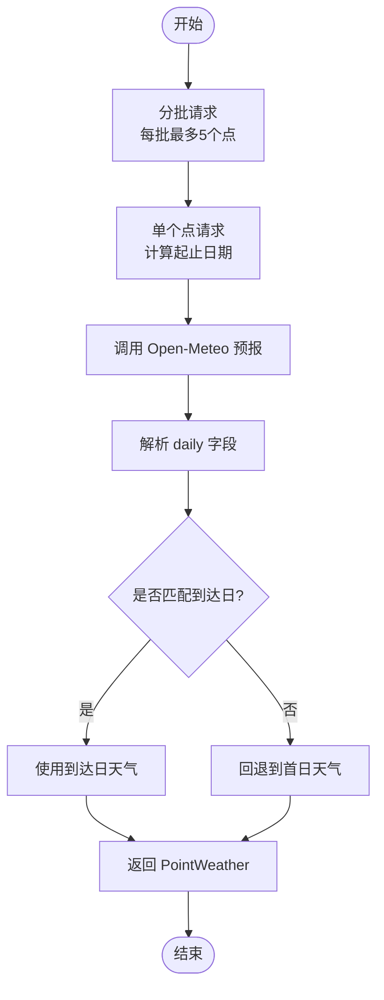
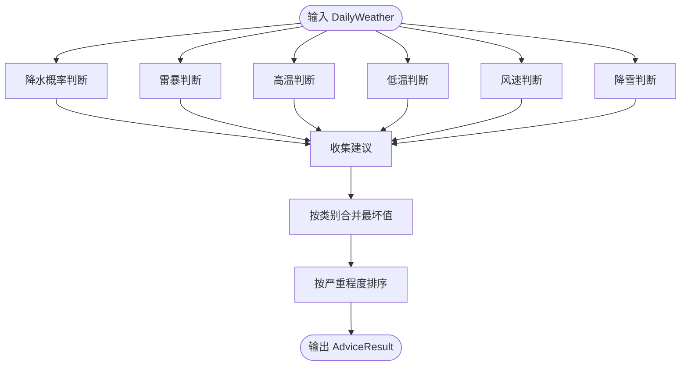
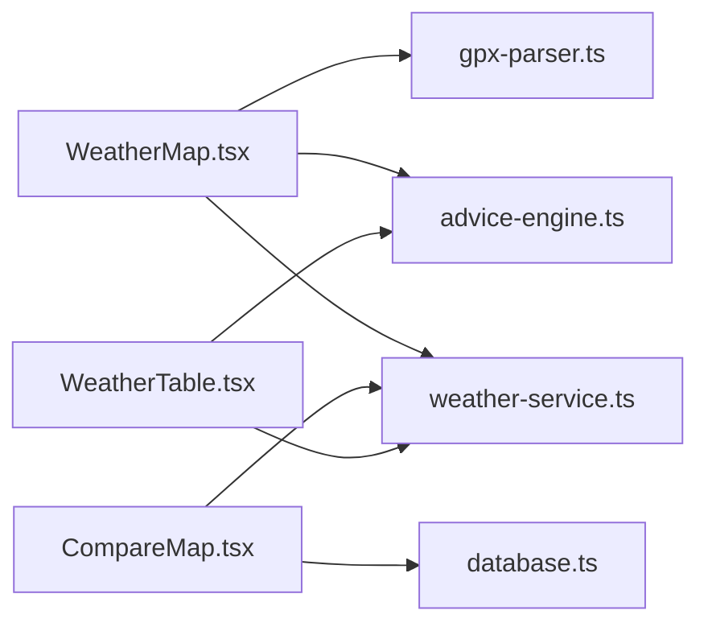

# 天气地图组件

<cite>
**本文引用的文件**   
- [WeatherMap.tsx](file://components/WeatherMap.tsx)
- [CompareMap.tsx](file://components/CompareMap.tsx)
- [weather-service.ts](file://lib/weather-service.ts)
- [advice-engine.ts](file://lib/advice-engine.ts)
- [gpx-parser.ts](file://lib/gpx-parser.ts)
- [database.ts](file://lib/database.ts)
- [WeatherTable.tsx](file://components/WeatherTable.tsx)
</cite>

## 目录
1. [简介](#简介)
2. [项目结构](#项目结构)
3. [核心组件](#核心组件)
4. [架构总览](#架构总览)
5. [详细组件分析](#详细组件分析)
6. [依赖关系分析](#依赖关系分析)
7. [性能与可扩展性](#性能与可扩展性)
8. [故障排查指南](#故障排查指南)
9. [结论](#结论)
10. [附录：API 与服务集成](#附录api-与服务集成)

## 简介
本组件文档围绕基于 Leaflet 的天气地图可视化能力，聚焦以下目标：
- 轨迹点渲染：将 GPX 解析后的轨迹点绘制为折线，并计算地图中心与边界。
- 天气信息标注：在采样点处叠加圆形标记，展示天气图标、温度、降水概率、风速等，并提供 Tooltip 与 Popup 交互。
- 交互功能：点击弹出详细信息，悬停显示简要信息；支持多路线对比视图。
- Props 接口与初始化配置：明确 WeatherMap 的输入参数、地图容器与瓦片层配置。
- 图层管理与事件处理：通过 react-leaflet 的 Polyline、CircleMarker、Tooltip、Popup 管理图层与交互。
- 自定义样式与响应式适配：提供路径颜色、标记填充色、半径、透明度等可定制项，以及容器尺寸与最小高度设置。
- 与天气数据和服务的集成模式：封装 Open-Meteo 每日天气预报请求、WMO 天气码映射、按到达时间匹配天气，以及建议生成引擎。

## 项目结构
与天气地图相关的代码主要分布在 components 与 lib 两个目录中：
- components
  - WeatherMap.tsx：单条轨迹的天气地图可视化
  - CompareMap.tsx：多条轨迹对比的地图可视化
  - WeatherTable.tsx：以表格形式展示分段天气与建议
- lib
  - gpx-parser.ts：GPX 解析、距离计算、采样点生成与到达时间估算
  - weather-service.ts：Open-Meteo 天气 API 调用、WMO 天气码描述与图标映射
  - advice-engine.ts：根据天气数据生成分段建议与总体摘要
  - database.ts：本地 SQLite 持久化（用于历史对比场景）

图表来源
- [WeatherMap.tsx:1-182](file://components/WeatherMap.tsx#L1-L182)
- [CompareMap.tsx:1-190](file://components/CompareMap.tsx#L1-L190)
- [gpx-parser.ts:1-231](file://lib/gpx-parser.ts#L1-L231)
- [weather-service.ts:1-176](file://lib/weather-service.ts#L1-L176)
- [advice-engine.ts:1-201](file://lib/advice-engine.ts#L1-L201)
- [database.ts:1-204](file://lib/database.ts#L1-L204)

章节来源
- [WeatherMap.tsx:1-182](file://components/WeatherMap.tsx#L1-L182)
- [CompareMap.tsx:1-190](file://components/CompareMap.tsx#L1-L190)
- [gpx-parser.ts:1-231](file://lib/gpx-parser.ts#L1-L231)
- [weather-service.ts:1-176](file://lib/weather-service.ts#L1-L176)
- [advice-engine.ts:1-201](file://lib/advice-engine.ts#L1-L201)
- [database.ts:1-204](file://lib/database.ts#L1-L204)

## 核心组件
本节聚焦 WeatherMap 组件的职责与实现要点：
- 客户端渲染保护：使用状态判断避免服务端渲染时访问浏览器 API。
- 轨迹折线：将 TrackPoint 数组转换为 positions 并绘制 Polyline。
- 采样点标记：对每个 SegmentAdvice 渲染 CircleMarker，并根据危险/警告级别动态着色。
- 交互提示：Tooltip 显示简要天气与时间；Popup 展示完整天气详情与建议列表。
- 地图初始化：根据所有点位计算 bounds 与 center，设置 TileLayer 与基础样式。

章节来源
- [WeatherMap.tsx:21-24](file://components/WeatherMap.tsx#L21-L24)
- [WeatherMap.tsx:26-42](file://components/WeatherMap.tsx#L26-L42)
- [WeatherMap.tsx:44-75](file://components/WeatherMap.tsx#L44-L75)
- [WeatherMap.tsx:77-178](file://components/WeatherMap.tsx#L77-L178)

## 架构总览
下图展示了从 GPX 到地图可视化的端到端流程，包括天气服务与建议引擎的参与。

图表来源
- [WeatherMap.tsx:44-75](file://components/WeatherMap.tsx#L44-L75)
- [gpx-parser.ts:44-94](file://lib/gpx-parser.ts#L44-L94)
- [weather-service.ts:71-87](file://lib/weather-service.ts#L71-L87)
- [advice-engine.ts:118-141](file://lib/advice-engine.ts#L118-L141)

## 详细组件分析

### WeatherMap 组件
- 职责
  - 接收 allPoints 与 segments 作为输入，渲染轨迹线与采样点标记。
  - 根据建议等级决定标记填充色，并在 Tooltip/Popup 中展示天气与建议。
- Props 接口
  - allPoints: TrackPoint[]，轨迹点集合
  - segments: SegmentAdvice[]，分段建议与天气数据
- 地图初始化
  - 使用 MapContainer 设置 bounds、center、zoom 与 className/style。
  - 使用 TileLayer 加载 OpenStreetMap 瓦片。
- 图层管理
  - Polyline 绘制轨迹线，pathOptions 控制颜色、粗细与透明度。
  - CircleMarker 渲染采样点，radius/pathOptions 控制外观。
  - Tooltip 与 Popup 提供交互信息。
- 事件处理
  - 通过 react-leaflet 内置交互（点击弹出 Popup、悬停显示 Tooltip）。
- 自定义样式
  - 可通过 pathOptions 修改折线与标记样式；通过 className/style 调整容器布局。
- 响应式适配
  - 容器使用 w-full h-full 与 minHeight 保证在不同屏幕下可用。

图表来源
- [WeatherMap.tsx:21-24](file://components/WeatherMap.tsx#L21-L24)
- [gpx-parser.ts:4-15](file://lib/gpx-parser.ts#L4-L15)
- [advice-engine.ts:7-28](file://lib/advice-engine.ts#L7-L28)
- [weather-service.ts:3-18](file://lib/weather-service.ts#L3-L18)

章节来源
- [WeatherMap.tsx:21-24](file://components/WeatherMap.tsx#L21-L24)
- [WeatherMap.tsx:44-75](file://components/WeatherMap.tsx#L44-L75)
- [WeatherMap.tsx:77-178](file://components/WeatherMap.tsx#L77-L178)
- [gpx-parser.ts:4-15](file://lib/gpx-parser.ts#L4-L15)
- [advice-engine.ts:7-28](file://lib/advice-engine.ts#L7-L28)
- [weather-service.ts:3-18](file://lib/weather-service.ts#L3-L18)

### CompareMap 组件（对比视图）
- 职责
  - 同时渲染多条轨迹及其采样点，便于对比不同路线的天气与建议。
- 关键特性
  - 聚合所有轨迹点计算全局 bounds 与 center。
  - 每条轨迹独立 Polyline 与 CircleMarker，支持图例展示。
- 数据来源
  - RouteLayer 包含 id/name/color/allPoints/segments，其中 segments 来自数据库记录。

章节来源
- [CompareMap.tsx:18-28](file://components/CompareMap.tsx#L18-L28)
- [CompareMap.tsx:45-77](file://components/CompareMap.tsx#L45-L77)
- [CompareMap.tsx:79-169](file://components/CompareMap.tsx#L79-L169)
- [database.ts:70-86](file://lib/database.ts#L70-L86)

### 天气服务与 WMO 映射
- 功能
  - 批量获取多个采样点的每日天气预报，按到达日期匹配具体天气。
  - 提供天气描述与图标映射函数，供 UI 展示。
- 数据模型
  - DailyWeather：单日天气字段
  - PointWeather：采样点+到达时间+当日天气+7天预报
  - WeatherResult：批量结果包装
- 错误处理
  - 当 API 响应失败时抛出错误，便于上层捕获与降级。

图表来源
- [weather-service.ts:71-87](file://lib/weather-service.ts#L71-L87)
- [weather-service.ts:89-175](file://lib/weather-service.ts#L89-L175)

章节来源
- [weather-service.ts:3-18](file://lib/weather-service.ts#L3-L18)
- [weather-service.ts:25-69](file://lib/weather-service.ts#L25-L69)
- [weather-service.ts:71-87](file://lib/weather-service.ts#L71-L87)
- [weather-service.ts:89-175](file://lib/weather-service.ts#L89-L175)

### 建议引擎
- 功能
  - 根据每日天气生成分级建议（info/warning/danger），并按类别合并最严重情况。
  - 输出整体摘要与分段建议列表。
- 规则示例
  - 降水概率阈值、雷暴天气、高温/低温、强风、降雪等条件触发相应建议。

图表来源
- [advice-engine.ts:30-116](file://lib/advice-engine.ts#L30-L116)
- [advice-engine.ts:118-201](file://lib/advice-engine.ts#L118-L201)

章节来源
- [advice-engine.ts:7-28](file://lib/advice-engine.ts#L7-L28)
- [advice-engine.ts:30-116](file://lib/advice-engine.ts#L30-L116)
- [advice-engine.ts:118-201](file://lib/advice-engine.ts#L118-L201)

### GPX 解析与采样
- 功能
  - 解析 GPX XML，提取 LineString 坐标为 TrackPoint。
  - 计算总距离与等距采样点，限制最大采样数量。
  - 根据活动类型平均速度估算到达时间。
- 复杂度
  - 距离计算采用 Haversine 公式，O(n) 遍历轨迹点。
  - 采样过程 O(n)，受 maxSamples 限制。

章节来源
- [gpx-parser.ts:4-15](file://lib/gpx-parser.ts#L4-L15)
- [gpx-parser.ts:44-94](file://lib/gpx-parser.ts#L44-L94)
- [gpx-parser.ts:119-137](file://lib/gpx-parser.ts#L119-L137)
- [gpx-parser.ts:139-230](file://lib/gpx-parser.ts#L139-L230)

### 数据持久化（对比场景）
- 功能
  - 使用 SQLite 存储轨迹与分段记录，支持查询与删除。
  - 对比地图从数据库读取 SegmentRecord 进行渲染。
- 表结构
  - routes：轨迹基本信息与全部点 JSON
  - segments：分段天气与建议字段

章节来源
- [database.ts:23-55](file://lib/database.ts#L23-L55)
- [database.ts:59-86](file://lib/database.ts#L59-L86)
- [database.ts:90-162](file://lib/database.ts#L90-L162)
- [database.ts:172-188](file://lib/database.ts#L172-L188)

## 依赖关系分析
- 组件耦合
  - WeatherMap 依赖 gpx-parser 的数据结构与 advice-engine 的输出格式。
  - CompareMap 依赖 database 的 SegmentRecord 与 weather-service 的图标映射。
- 外部依赖
  - react-leaflet 与 leaflet：地图渲染与交互。
  - Open-Meteo API：天气数据源。
  - better-sqlite3：本地持久化（Node 环境）。

图表来源
- [WeatherMap.tsx:1-182](file://components/WeatherMap.tsx#L1-L182)
- [CompareMap.tsx:1-190](file://components/CompareMap.tsx#L1-L190)
- [WeatherTable.tsx:1-102](file://components/WeatherTable.tsx#L1-L102)
- [gpx-parser.ts:1-231](file://lib/gpx-parser.ts#L1-L231)
- [weather-service.ts:1-176](file://lib/weather-service.ts#L1-L176)
- [advice-engine.ts:1-201](file://lib/advice-engine.ts#L1-L201)
- [database.ts:1-204](file://lib/database.ts#L1-L204)

章节来源
- [WeatherMap.tsx:1-182](file://components/WeatherMap.tsx#L1-L182)
- [CompareMap.tsx:1-190](file://components/CompareMap.tsx#L1-L190)
- [WeatherTable.tsx:1-102](file://components/WeatherTable.tsx#L1-L102)
- [gpx-parser.ts:1-231](file://lib/gpx-parser.ts#L1-L231)
- [weather-service.ts:1-176](file://lib/weather-service.ts#L1-L176)
- [advice-engine.ts:1-201](file://lib/advice-engine.ts#L1-L201)
- [database.ts:1-204](file://lib/database.ts#L1-L204)

## 性能与可扩展性
- 渲染优化
  - 使用 bounds 与 center 减少初始缩放范围，提升首屏性能。
  - 采样点数量上限控制，避免过多 CircleMarker 导致卡顿。
- 网络优化
  - 天气请求批量处理，降低并发压力与往返次数。
- 可扩展点
  - 支持自定义瓦片源与主题切换。
  - 扩展更多天气指标或风险规则。
  - 增加图层开关与过滤（如仅显示危险/警告点）。

[本节为通用指导，不直接分析具体文件]

## 故障排查指南
- 地图未渲染
  - 检查是否在客户端环境中渲染（use client 与 isClient 状态）。
  - 确认 Leaflet CSS 已正确引入。
- 无轨迹或标记
  - 验证 allPoints 是否为空；检查 resample 与采样逻辑。
  - 确认 segments 数据是否包含有效 lat/lon 与天气信息。
- 天气数据缺失
  - 检查 Open-Meteo 请求参数与日期范围；查看 API 响应状态。
  - 若到达时间为空，回退到当前日期+7天范围。
- 建议异常
  - 核对天气字段是否存在与数值范围；检查阈值规则。

章节来源
- [WeatherMap.tsx:30-42](file://components/WeatherMap.tsx#L30-L42)
- [weather-service.ts:137-145](file://lib/weather-service.ts#L137-L145)
- [weather-service.ts:164-175](file://lib/weather-service.ts#L164-L175)
- [advice-engine.ts:30-116](file://lib/advice-engine.ts#L30-L116)

## 结论
WeatherMap 组件以 react-leaflet 为基础，结合 GPX 解析、天气服务与建议引擎，实现了轨迹可视化与天气信息标注的一体化体验。其清晰的 Props 接口、灵活的样式配置与良好的交互设计，使其易于扩展与维护。配合 CompareMap 与 WeatherTable，可覆盖单条与多条路线的对比分析需求。

[本节为总结性内容，不直接分析具体文件]

## 附录：API 与服务集成
- 天气服务集成模式
  - 批量请求：按批次并行获取多个采样点的每日预报。
  - 到达日匹配：优先使用到达日期对应的天气，否则回退到首日。
  - WMO 映射：统一天气码到中文描述与图标。
- 建议引擎集成模式
  - 输入：PointWeather[]
  - 输出：AdviceResult（summary、overall、segments）
  - 规则：降水、雷暴、温度、风速、降雪等多维度阈值判定
- 数据持久化集成模式
  - 写入：insertRoute 支持批量插入 segments
  - 读取：getRouteById 返回轨迹与分段记录
  - 删除：deleteRoute 级联删除 segments

章节来源
- [weather-service.ts:71-87](file://lib/weather-service.ts#L71-L87)
- [weather-service.ts:89-175](file://lib/weather-service.ts#L89-L175)
- [advice-engine.ts:118-201](file://lib/advice-engine.ts#L118-L201)
- [database.ts:90-162](file://lib/database.ts#L90-L162)
- [database.ts:172-188](file://lib/database.ts#L172-L188)