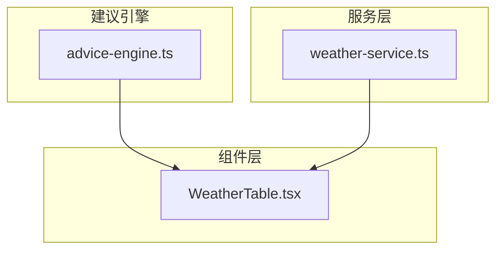
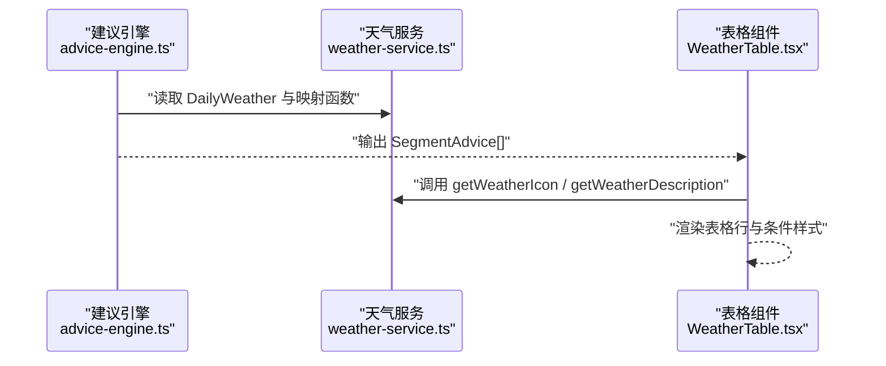
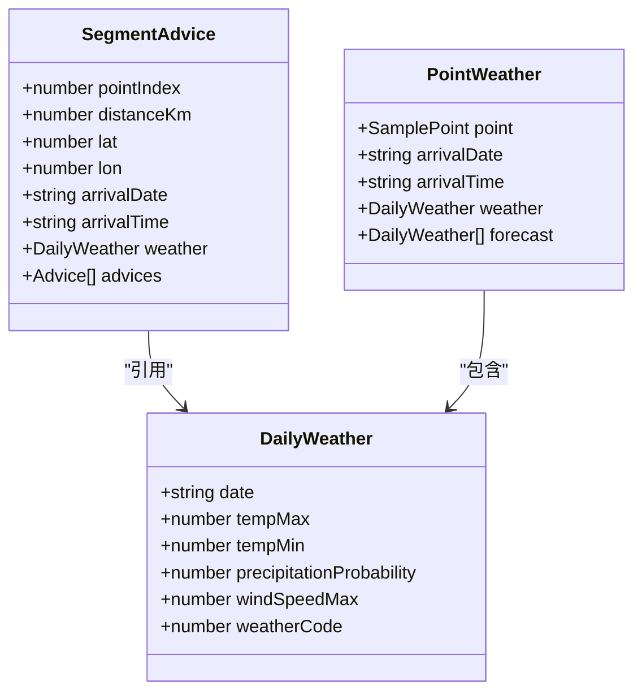
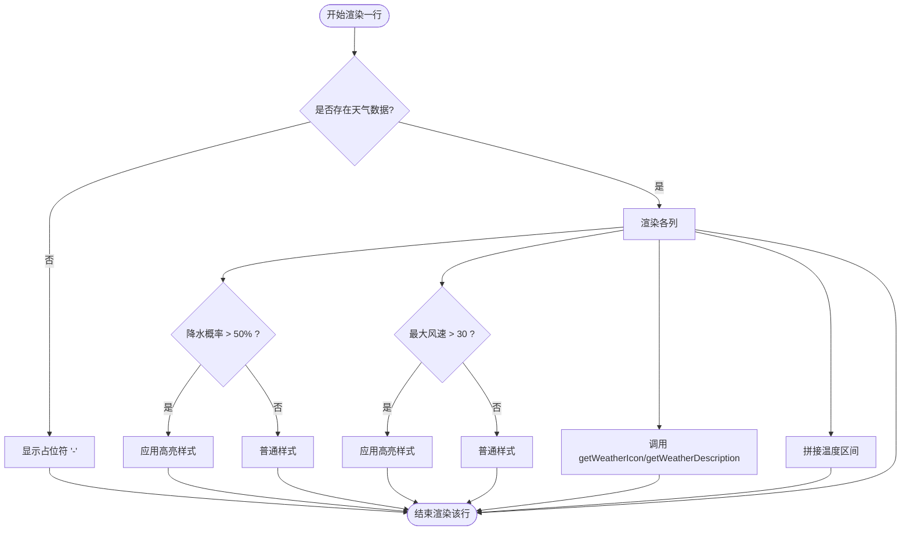
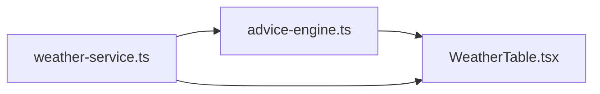

# 天气数据表格组件

<cite>
**本文引用的文件**   
- [WeatherTable.tsx](file://src/components/WeatherTable.tsx)
- [weather-service.ts](file://src/lib/weather-service.ts)
- [advice-engine.ts](file://src/lib/advice-engine.ts)
</cite>

## 目录
1. [简介](#简介)
2. [项目结构](#项目结构)
3. [核心组件](#核心组件)
4. [架构总览](#架构总览)
5. [详细组件分析](#详细组件分析)
6. [依赖关系分析](#依赖关系分析)
7. [性能考虑](#性能考虑)
8. [故障排查指南](#故障排查指南)
9. [结论](#结论)
10. [附录](#附录)

## 简介
本文件为 WeatherTable 天气数据表格组件的详细文档。该组件用于将行程分段（segments）的天气信息以表格形式展示，包含距离、到达时间、天气状况、温度区间、降水概率与最大风速等列，并对高降水概率与强风进行视觉强调。组件通过 weather-service 提供的天气描述与图标映射函数对数据进行格式化展示，数据来源由 advice-engine 生成的 SegmentAdvice 列表提供。

## 项目结构
与 WeatherTable 相关的代码位于 src 目录下：
- 组件层：src/components/WeatherTable.tsx
- 服务层：src/lib/weather-service.ts（天气数据模型、WMO 编码映射、批量获取天气）
- 建议引擎：src/lib/advice-engine.ts（生成 SegmentAdvice 供表格渲染）

图表来源
- [WeatherTable.tsx:1-102](file://src/components/WeatherTable.tsx#L1-L102)
- [weather-service.ts:1-176](file://src/lib/weather-service.ts#L1-L176)
- [advice-engine.ts:1-201](file://src/lib/advice-engine.ts#L1-L201)

章节来源
- [WeatherTable.tsx:1-102](file://src/components/WeatherTable.tsx#L1-L102)
- [weather-service.ts:1-176](file://src/lib/weather-service.ts#L1-L176)
- [advice-engine.ts:1-201](file://src/lib/advice-engine.ts#L1-L201)

## 核心组件
WeatherTable 是一个无状态 React 函数组件，接收 segments 作为 Props，内部遍历并渲染表格行。其职责包括：
- 渲染表头与数据行
- 使用 weather-service 的 getWeatherIcon 与 getWeatherDescription 对天气编码进行可视化与文本化
- 对降水概率与最大风速进行条件样式强调
- 处理缺失数据的占位显示

Props 接口
- segments: SegmentAdvice[]（来自 advice-engine），每个元素包含点索引、累计距离、经纬度、预计到达日期与时间、当日天气对象及建议列表

章节来源
- [WeatherTable.tsx:4-8](file://src/components/WeatherTable.tsx#L4-L8)
- [advice-engine.ts:13-22](file://src/lib/advice-engine.ts#L13-L22)

## 架构总览
WeatherTable 的数据流从上游建议引擎到组件渲染如下：
- advice-engine 基于 weather-service 返回的点级天气数据，生成 SegmentAdvice 列表
- WeatherTable 消费 SegmentAdvice 列表，逐行渲染表格
- 天气图标与描述通过 weather-service 的映射函数在客户端完成

图表来源
- [advice-engine.ts:118-201](file://src/lib/advice-engine.ts#L118-L201)
- [weather-service.ts:25-69](file://src/lib/weather-service.ts#L25-L69)
- [WeatherTable.tsx:24-96](file://src/components/WeatherTable.tsx#L24-L96)

## 详细组件分析

### 组件 Props 与数据模型
- Props
  - segments: SegmentAdvice[]，表示行程分段的天气与建议聚合结果
- 关键数据结构
  - SegmentAdvice：包含 pointIndex、distanceKm、lat、lon、arrivalDate、arrivalTime、weather、advices
  - DailyWeather：包含 date、tempMax、tempMin、precipitationProbability、windSpeedMax、weatherCode
  - PointWeather：包含 point、arrivalDate、arrivalTime、weather、forecast

图表来源
- [advice-engine.ts:13-22](file://src/lib/advice-engine.ts#L13-L22)
- [weather-service.ts:3-18](file://src/lib/weather-service.ts#L3-L18)

章节来源
- [advice-engine.ts:13-22](file://src/lib/advice-engine.ts#L13-L22)
- [weather-service.ts:3-18](file://src/lib/weather-service.ts#L3-L18)

### 数据列配置与单元格渲染
- 列定义
  - 序号：基于索引自增
  - 距离：单位 km
  - 到达时间：日期与时间分行显示，空值显示占位符
  - 天气：图标 + 描述（通过 weather-service 映射）
  - 温度：最低 ~ 最高 °C
  - 降水概率：百分比，大于 50% 时高亮
  - 风速：km/h，大于 30 时高亮
- 渲染策略
  - 当 weather 为空时，对应列显示占位符
  - 条件样式通过 Tailwind 类名实现

图表来源
- [WeatherTable.tsx:24-96](file://src/components/WeatherTable.tsx#L24-L96)
- [weather-service.ts:25-69](file://src/lib/weather-service.ts#L25-L69)

章节来源
- [WeatherTable.tsx:10-98](file://src/components/WeatherTable.tsx#L10-L98)
- [weather-service.ts:25-69](file://src/lib/weather-service.ts#L25-L69)

### 交互行为
- 当前组件未实现排序、筛选或分页等交互功能
- 支持悬停高亮整行（hover 背景色变化）
- 条件样式仅用于提示性强调，不触发额外交互

章节来源
- [WeatherTable.tsx:27-30](file://src/components/WeatherTable.tsx#L27-L30)

### 样式定制方法
- 表格容器：外层 div 提供横向滚动能力，适配小屏设备
- 表头与主体：使用 Tailwind 类控制字体大小、颜色、背景与分割线
- 条件高亮：降水概率与风速阈值对应的颜色与字重
- 暗色模式：通过 dark: 前缀类名适配深色主题

章节来源
- [WeatherTable.tsx:10-23](file://src/components/WeatherTable.tsx#L10-L23)
- [WeatherTable.tsx:66-92](file://src/components/WeatherTable.tsx#L66-L92)

### 响应式适配
- 外层容器启用 overflow-x-auto，在小屏幕下可水平滚动查看完整表格
- 字号与间距采用较小尺寸，提升移动端可读性

章节来源
- [WeatherTable.tsx:10-11](file://src/components/WeatherTable.tsx#L10-L11)

### 大数据量优化
- 当前实现为全量渲染，适合中小规模数据
- 如需支持大量分段数据，建议引入虚拟滚动或分页加载，以减少 DOM 节点数量与重排开销

[本节为通用建议，不涉及具体文件分析]

### 与天气服务的数据同步机制与实时更新
- 数据同步
  - 上游 advice-engine 基于 weather-service 的 DailyWeather 与映射函数生成 SegmentAdvice
  - WeatherTable 仅消费 SegmentAdvice，不直接发起网络请求
- 实时更新
  - 组件本身不包含轮询或订阅逻辑；若需实时更新，应在父组件中维护最新 segments 并通过 props 更新
  - 可在父组件中定时刷新或监听外部事件后重新拉取数据并传入新的 segments

章节来源
- [advice-engine.ts:118-201](file://src/lib/advice-engine.ts#L118-L201)
- [weather-service.ts:71-87](file://src/lib/weather-service.ts#L71-L87)
- [WeatherTable.tsx:8-9](file://src/components/WeatherTable.tsx#L8-L9)

## 依赖关系分析
- WeatherTable 依赖
  - advice-engine 的 SegmentAdvice 类型与数据
  - weather-service 的 getWeatherIcon 与 getWeatherDescription 映射函数
- 间接依赖
  - advice-engine 依赖 weather-service 的 DailyWeather 与映射函数

图表来源
- [WeatherTable.tsx:1-2](file://src/components/WeatherTable.tsx#L1-L2)
- [advice-engine.ts:1-5](file://src/lib/advice-engine.ts#L1-L5)
- [weather-service.ts:1-10](file://src/lib/weather-service.ts#L1-L10)

章节来源
- [WeatherTable.tsx:1-2](file://src/components/WeatherTable.tsx#L1-L2)
- [advice-engine.ts:1-5](file://src/lib/advice-engine.ts#L1-L5)
- [weather-service.ts:1-10](file://src/lib/weather-service.ts#L1-L10)

## 性能考虑
- 渲染复杂度：O(n)，n 为 segments 长度
- 条件样式计算：每行常数时间判断
- 潜在瓶颈：当 n 较大时，DOM 节点增多导致渲染与滚动性能下降
- 优化方向：
  - 虚拟滚动或分页
  - 预计算天气图标与描述缓存（避免重复映射）
  - 使用 React.memo 包裹行组件（如拆分为子组件）

[本节为通用建议，不涉及具体文件分析]

## 故障排查指南
- 天气数据为空
  - 检查上游是否传入了有效的 segments 且 weather 字段非空
  - 确认 advice-engine 是否正确生成 SegmentAdvice
- 天气图标或描述异常
  - 检查 weatherCode 是否在 WMO 映射范围内
  - 确认 weather-service 的映射函数未被覆盖或修改
- 条件样式不生效
  - 检查降水概率与风速阈值是否符合预期
  - 确认 Tailwind 类名未被自定义样式覆盖

章节来源
- [WeatherTable.tsx:45-93](file://src/components/WeatherTable.tsx#L45-L93)
- [weather-service.ts:25-69](file://src/lib/weather-service.ts#L25-L69)
- [advice-engine.ts:118-141](file://src/lib/advice-engine.ts#L118-L141)

## 结论
WeatherTable 提供了简洁、直观的天气数据表格展示能力，结合 weather-service 的映射函数实现了良好的可读性与可维护性。当前版本聚焦于基础渲染与条件高亮，适用于中小规模数据场景。若需扩展排序、筛选、分页与实时更新等功能，建议在父组件中统一管理与调度，并在必要时引入虚拟化技术以提升性能。

## 附录

### API 参考（组件 Props）
- segments: SegmentAdvice[]
  - 字段说明
    - pointIndex: number
    - distanceKm: number
    - lat: number
    - lon: number
    - arrivalDate: string | null
    - arrivalTime: string | null
    - weather: DailyWeather | null
    - advices: Advice[]

章节来源
- [WeatherTable.tsx:4-8](file://src/components/WeatherTable.tsx#L4-L8)
- [advice-engine.ts:13-22](file://src/lib/advice-engine.ts#L13-L22)

### 数据列说明
- 序号：自增索引
- 距离：累计距离（km）
- 到达时间：日期与时间（空值占位）
- 天气：图标 + 描述（WMO 编码映射）
- 温度：最低至最高（°C）
- 降水概率：百分比（>50% 高亮）
- 风速：最大风速（km/h，>30 高亮）

章节来源
- [WeatherTable.tsx:12-22](file://src/components/WeatherTable.tsx#L12-L22)
- [WeatherTable.tsx:45-93](file://src/components/WeatherTable.tsx#L45-L93)
- [weather-service.ts:25-69](file://src/lib/weather-service.ts#L25-L69)