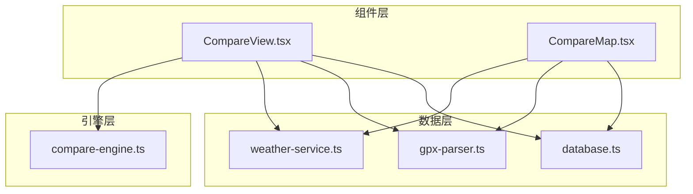
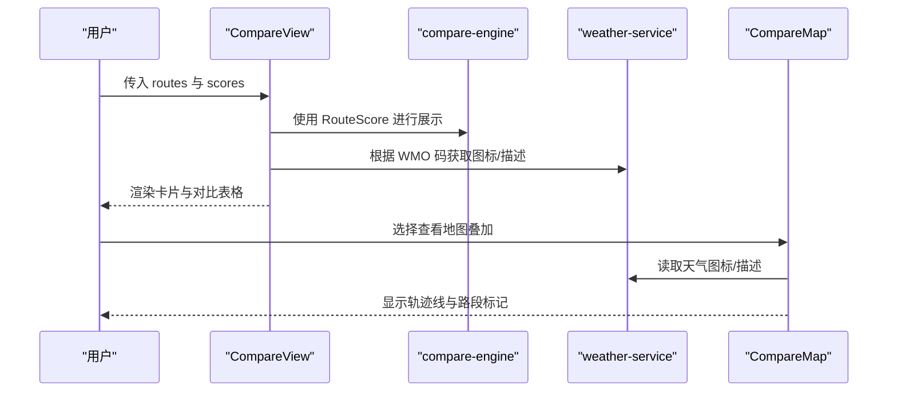
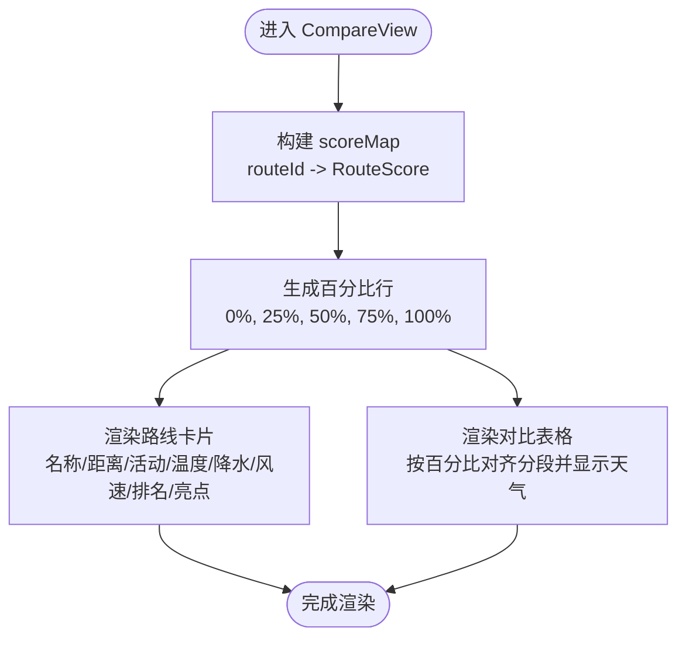
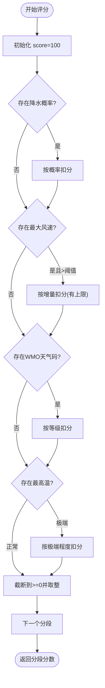
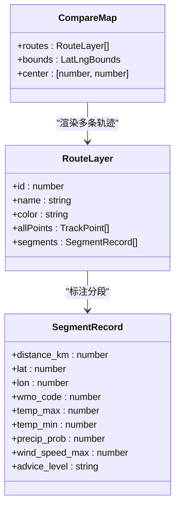
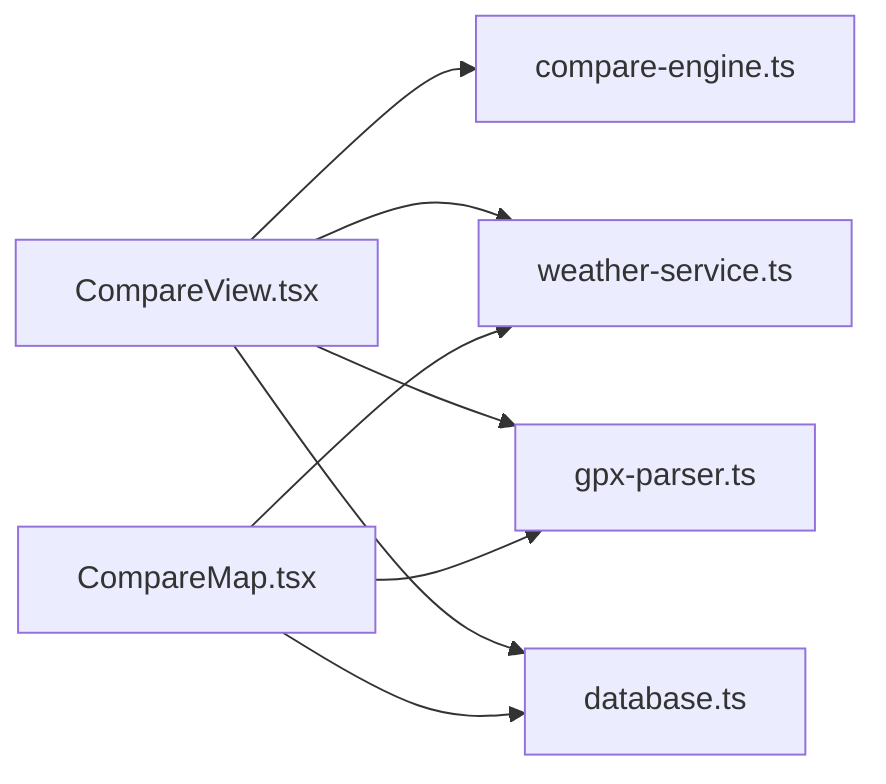

# 对比视图组件

<cite>
**本文引用的文件**   
- [CompareView.tsx](file://src/components/CompareView.tsx)
- [compare-engine.ts](file://src/lib/compare-engine.ts)
- [CompareMap.tsx](file://src/components/CompareMap.tsx)
- [database.ts](file://src/lib/database.ts)
- [weather-service.ts](file://src/lib/weather-service.ts)
- [gpx-parser.ts](file://src/lib/gpx-parser.ts)
</cite>

## 目录
1. [简介](#简介)
2. [项目结构](#项目结构)
3. [核心组件与数据模型](#核心组件与数据模型)
4. [架构总览](#架构总览)
5. [详细组件分析](#详细组件分析)
6. [依赖关系分析](#依赖关系分析)
7. [性能考虑与大数据集方案](#性能考虑与大数据集方案)
8. [故障排查指南](#故障排查指南)
9. [结论](#结论)
10. [附录：接口与数据格式](#附录接口与数据格式)

## 简介
本文件为“对比视图组件”（CompareView）的完整技术文档，聚焦多路线对比分析的数据展示逻辑、评分计算结果与可视化图表。内容涵盖：
- 组件 Props 接口与对比数据格式
- 评分算法与排序规则
- 表格化对比与地图叠加显示
- 交互操作与导出建议
- 性能优化策略与大数据处理方案

## 项目结构
对比视图相关代码主要分布在以下模块：
- 组件层：对比视图卡片与表格、对比地图
- 引擎层：评分计算与亮点生成
- 数据层：轨迹采样、天气服务、数据库持久化

图示来源
- [CompareView.tsx:1-273](file://src/components/CompareView.tsx#L1-L273)
- [CompareMap.tsx:1-190](file://src/components/CompareMap.tsx#L1-L190)
- [compare-engine.ts:1-116](file://src/lib/compare-engine.ts#L1-L116)
- [database.ts:1-204](file://src/lib/database.ts#L1-L204)
- [weather-service.ts:1-176](file://src/lib/weather-service.ts#L1-L176)
- [gpx-parser.ts:1-231](file://src/lib/gpx-parser.ts#L1-L231)

章节来源
- [CompareView.tsx:1-273](file://src/components/CompareView.tsx#L1-L273)
- [CompareMap.tsx:1-190](file://src/components/CompareMap.tsx#L1-L190)
- [compare-engine.ts:1-116](file://src/lib/compare-engine.ts#L1-L116)
- [database.ts:1-204](file://src/lib/database.ts#L1-L204)
- [weather-service.ts:1-176](file://src/lib/weather-service.ts#L1-L176)
- [gpx-parser.ts:1-231](file://src/lib/gpx-parser.ts#L1-L231)

## 核心组件与数据模型
- CompareView：负责多路线对比的卡片汇总、分段对齐表格展示、推荐标记与颜色标识。
- compare-engine：提供路线评分、排名与亮点生成。
- CompareMap：在地图上叠加多条轨迹线、按路段标注天气与风险等级。
- database：定义 SegmentRecord 等数据结构并提供读写接口。
- weather-service：WMO 天气码解析、图标与描述映射。
- gpx-parser：轨迹点采样、活动类型与速度估算。

章节来源
- [CompareView.tsx:1-273](file://src/components/CompareView.tsx#L1-L273)
- [compare-engine.ts:1-116](file://src/lib/compare-engine.ts#L1-L116)
- [CompareMap.tsx:1-190](file://src/components/CompareMap.tsx#L1-L190)
- [database.ts:1-204](file://src/lib/database.ts#L1-L204)
- [weather-service.ts:1-176](file://src/lib/weather-service.ts#L1-L176)
- [gpx-parser.ts:1-231](file://src/lib/gpx-parser.ts#L1-L231)

## 架构总览
对比视图整体流程：
- 输入：多条路线数据（含分段信息）与评分结果
- 处理：按百分比对齐分段、渲染卡片与表格、地图叠加
- 输出：用户可直观比较各路线的天气、风险与建议

图示来源
- [CompareView.tsx:1-273](file://src/components/CompareView.tsx#L1-L273)
- [compare-engine.ts:1-116](file://src/lib/compare-engine.ts#L1-L116)
- [weather-service.ts:1-176](file://src/lib/weather-service.ts#L1-L176)
- [CompareMap.tsx:1-190](file://src/components/CompareMap.tsx#L1-L190)

## 详细组件分析

### CompareView 组件
职责与功能
- 接收 routes 与 scores，构建 scoreMap 快速查找
- 生成固定百分比行（起点、25%、50%、75%、终点），按距离对齐分段
- 渲染每条路线的摘要卡片：名称、距离、活动类型、温度区间、降水概率、风速、排名、推荐标签、亮点
- 渲染对比表格：每列一条路线，单元格显示对应分段的天气图标、描述、温度、降水与风速；危险/警告路段高亮背景
- 提供路线颜色分配函数，用于表头与地图联动

关键实现要点
- 百分比对齐：通过 getSegmentAtPercent 在 segments 中查找最接近目标距离的分段
- 推荐标记：依据 isRecommended 字段在卡片顶部显示“推荐”标签
- 颜色管理：getRouteColor 基于索引循环取色，保证不同路线视觉区分

交互与筛选
- 当前版本未内置筛选控件；可通过上层组件对 routes/scores 预处理后传入
- 表格支持横向滚动以适配多路线场景

导出能力
- 当前组件不直接提供导出；可在上层封装导出按钮，将 routes 与 scores 序列化为 JSON/CSV 下载

图示来源
- [CompareView.tsx:22-44](file://src/components/CompareView.tsx#L22-L44)
- [CompareView.tsx:46-158](file://src/components/CompareView.tsx#L46-L158)
- [CompareView.tsx:160-263](file://src/components/CompareView.tsx#L160-L263)
- [CompareView.tsx:268-272](file://src/components/CompareView.tsx#L268-L272)

章节来源
- [CompareView.tsx:1-273](file://src/components/CompareView.tsx#L1-L273)

### 评分引擎（compare-engine）
职责与功能
- 对每个分段进行打分，综合降水、风、天气码、温度等因素
- 计算总分与平均分，按平均分降序排序并赋予排名
- 标记最高分为推荐路线，同时生成亮点提示

评分算法说明
- 基础分 100
- 降水惩罚：按概率线性扣分，上限封顶
- 风力惩罚：超过阈值后按增量扣分，有上限
- 天气码惩罚：依据 WMO 等级分级扣分
- 温度惩罚：极端高温或低温扣分
- 最终分数截断至 0 以上并四舍五入

排序与排名
- 按 avgScore 降序排列
- 排名第一标记 isRecommended=true，其余为 false

亮点生成
- 基于最大/最小温度、最大降水概率、最大风速生成可读性强的提示语

图示来源
- [compare-engine.ts:19-54](file://src/lib/compare-engine.ts#L19-L54)
- [compare-engine.ts:56-81](file://src/lib/compare-engine.ts#L56-L81)
- [compare-engine.ts:83-115](file://src/lib/compare-engine.ts#L83-L115)

章节来源
- [compare-engine.ts:1-116](file://src/lib/compare-engine.ts#L1-L116)

### 对比地图（CompareMap）
职责与功能
- 动态计算所有轨迹点的边界与中心点
- 绘制多条 Polyline 轨迹线，颜色由上层传入
- 在每个分段位置放置 CircleMarker，按风险等级着色（危险/警告/安全）
- Tooltip/Popup 展示路线名、到达时间、天气图标与温度、降水、风速等信息
- 左下角图例显示各路线名称与颜色

交互特性
- 点击标记弹出详细信息
- 悬停显示简要信息

图示来源
- [CompareMap.tsx:18-28](file://src/components/CompareMap.tsx#L18-L28)
- [CompareMap.tsx:30-73](file://src/components/CompareMap.tsx#L30-L73)
- [CompareMap.tsx:79-169](file://src/components/CompareMap.tsx#L79-L169)
- [database.ts:70-86](file://src/lib/database.ts#L70-L86)

章节来源
- [CompareMap.tsx:1-190](file://src/components/CompareMap.tsx#L1-L190)
- [database.ts:70-86](file://src/lib/database.ts#L70-L86)

### 数据与工具支撑
- 天气服务：提供 WMO 天气码的描述与图标映射，供对比表格与地图展示一致语义
- 轨迹解析：提供采样点生成与活动类型常量，便于估算到达时间与分段密度控制
- 数据库：定义 SegmentRecord 等结构，确保前后端数据一致性

章节来源
- [weather-service.ts:25-69](file://src/lib/weather-service.ts#L25-L69)
- [gpx-parser.ts:24-31](file://src/lib/gpx-parser.ts#L24-L31)
- [database.ts:70-86](file://src/lib/database.ts#L70-L86)

## 依赖关系分析
- CompareView 依赖 compare-engine 的 RouteScore 进行展示
- CompareView 依赖 weather-service 的图标与描述函数
- CompareView 依赖 gpx-parser 的活动类型常量
- CompareMap 依赖 weather-service 与 gpx-parser 的轨迹点结构
- 数据模型 SegmentRecord 来自 database.ts，贯穿对比与地图展示

图示来源
- [CompareView.tsx:1-273](file://src/components/CompareView.tsx#L1-L273)
- [CompareMap.tsx:1-190](file://src/components/CompareMap.tsx#L1-L190)
- [compare-engine.ts:1-116](file://src/lib/compare-engine.ts#L1-L116)
- [weather-service.ts:1-176](file://src/lib/weather-service.ts#L1-L176)
- [gpx-parser.ts:1-231](file://src/lib/gpx-parser.ts#L1-L231)
- [database.ts:1-204](file://src/lib/database.ts#L1-L204)

章节来源
- [CompareView.tsx:1-273](file://src/components/CompareView.tsx#L1-L273)
- [CompareMap.tsx:1-190](file://src/components/CompareMap.tsx#L1-L190)
- [compare-engine.ts:1-116](file://src/lib/compare-engine.ts#L1-L116)
- [weather-service.ts:1-176](file://src/lib/weather-service.ts#L1-L176)
- [gpx-parser.ts:1-231](file://src/lib/gpx-parser.ts#L1-L231)
- [database.ts:1-204](file://src/lib/database.ts#L1-L204)

## 性能考虑与大数据集方案
- 分段对齐复杂度：当前 getSegmentAtPercent 对每个百分比行遍历 segments 寻找最近距离，时间复杂度 O(N×P)，N 为分段数，P 为百分比行数（固定为 5）。对于大数据集，建议：
  - 预计算累计距离数组，并使用二分查找定位目标距离对应的分段，降至 O(P×log N)
  - 缓存已计算的 segment 映射，避免重复查找
- 渲染性能：
  - 对比表格采用固定百分比行，DOM 节点数量可控；若扩展更多行，建议使用虚拟列表
  - 地图渲染大量 Marker 时，可使用聚合或按需加载策略
- 天气 API 调用：
  - 批量请求已在 weather-service 中实现分批并行，保持并发度适中以避免限流
- 内存占用：
  - 避免在组件内创建大对象；尽量复用 route 与 segment 引用
- 导出性能：
  - 大数据导出建议流式生成 CSV，避免一次性构建超大字符串

[本节为通用性能指导，无需源码引用]

## 故障排查指南
- 天气图标/描述异常
  - 检查 WMO 码是否有效，确认 weather-service 的映射覆盖范围
  - 参考路径：[weather-service.ts:25-69](file://src/lib/weather-service.ts#L25-L69)
- 分段对齐不准确
  - 核对 distance_km 与 segments 的顺序与精度
  - 参考路径：[CompareView.tsx:28-44](file://src/components/CompareView.tsx#L28-L44)
- 地图无轨迹或中心偏移
  - 检查 allPoints 是否为空，bounds 与 center 计算是否正确
  - 参考路径：[CompareMap.tsx:45-64](file://src/components/CompareMap.tsx#L45-L64)
- 评分与排名不符合预期
  - 检查分段数据完整性（降水、风、天气码、温度）
  - 参考路径：[compare-engine.ts:19-54](file://src/lib/compare-engine.ts#L19-L54)、[compare-engine.ts:83-115](file://src/lib/compare-engine.ts#L83-L115)

章节来源
- [weather-service.ts:25-69](file://src/lib/weather-service.ts#L25-L69)
- [CompareView.tsx:28-44](file://src/components/CompareView.tsx#L28-L44)
- [CompareMap.tsx:45-64](file://src/components/CompareMap.tsx#L45-L64)
- [compare-engine.ts:19-54](file://src/lib/compare-engine.ts#L19-L54)
- [compare-engine.ts:83-115](file://src/lib/compare-engine.ts#L83-L115)

## 结论
CompareView 提供了清晰的多路线对比体验：通过固定百分比对齐的分段表格与卡片摘要，结合地图叠加，帮助用户快速识别最优路线。评分引擎综合考虑多种天气因素，给出客观排名与亮点提示。针对大数据集，建议在分段对齐与渲染层面引入更高效的数据结构与虚拟化策略，以提升性能与可扩展性。

[本节为总结性内容，无需源码引用]

## 附录：接口与数据格式

### CompareView Props 接口
- routes: CompareRouteData[]
  - id: number
  - name: string
  - distance_km: number
  - activity_type: string | null
  - start_time: string | null
  - segments: SegmentRecord[]
- scores: RouteScore[]
  - routeId: number
  - routeName: string
  - totalScore: number
  - avgScore: number
  - rank: number
  - isRecommended: boolean
  - highlights: string[]

章节来源
- [CompareView.tsx:8-20](file://src/components/CompareView.tsx#L8-L20)
- [compare-engine.ts:3-11](file://src/lib/compare-engine.ts#L3-L11)

### 对比数据格式（SegmentRecord）
关键字段包括：
- 位置与距离：lat、lon、distance_km
- 时间：arrival_date、arrival_time
- 天气：wmo_code、temp_max、temp_min、precip_prob、wind_speed_max
- 建议：advice_level、advice_text

章节来源
- [database.ts:70-86](file://src/lib/database.ts#L70-L86)

### 排序与筛选
- 排序：按 RouteScore.avgScore 降序，rank 从 1 开始递增，第一名标记 isRecommended
- 筛选：组件内部未实现筛选控件；可在上层对 routes/scores 进行过滤后传入

章节来源
- [compare-engine.ts:105-112](file://src/lib/compare-engine.ts#L105-L112)

### 交互与导出
- 交互：
  - 卡片推荐标签与颜色区分
  - 表格危险/警告高亮
  - 地图弹窗与悬停提示
- 导出：
  - 当前组件不提供导出；可在上层封装导出按钮，将 routes 与 scores 序列化为 JSON/CSV

章节来源
- [CompareView.tsx:74-158](file://src/components/CompareView.tsx#L74-L158)
- [CompareView.tsx:160-263](file://src/components/CompareView.tsx#L160-L263)
- [CompareMap.tsx:120-166](file://src/components/CompareMap.tsx#L120-L166)