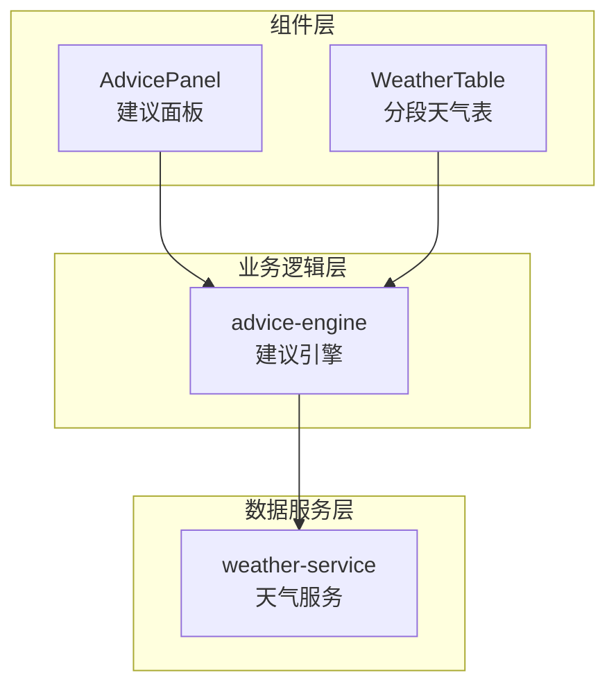
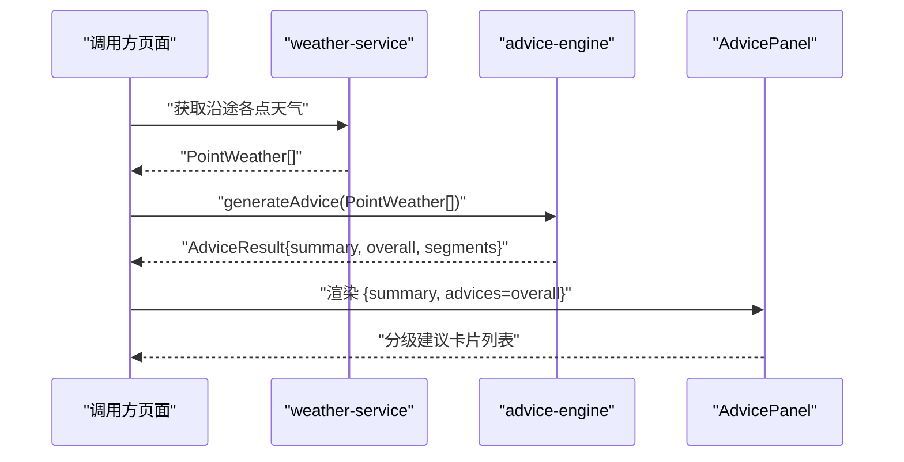
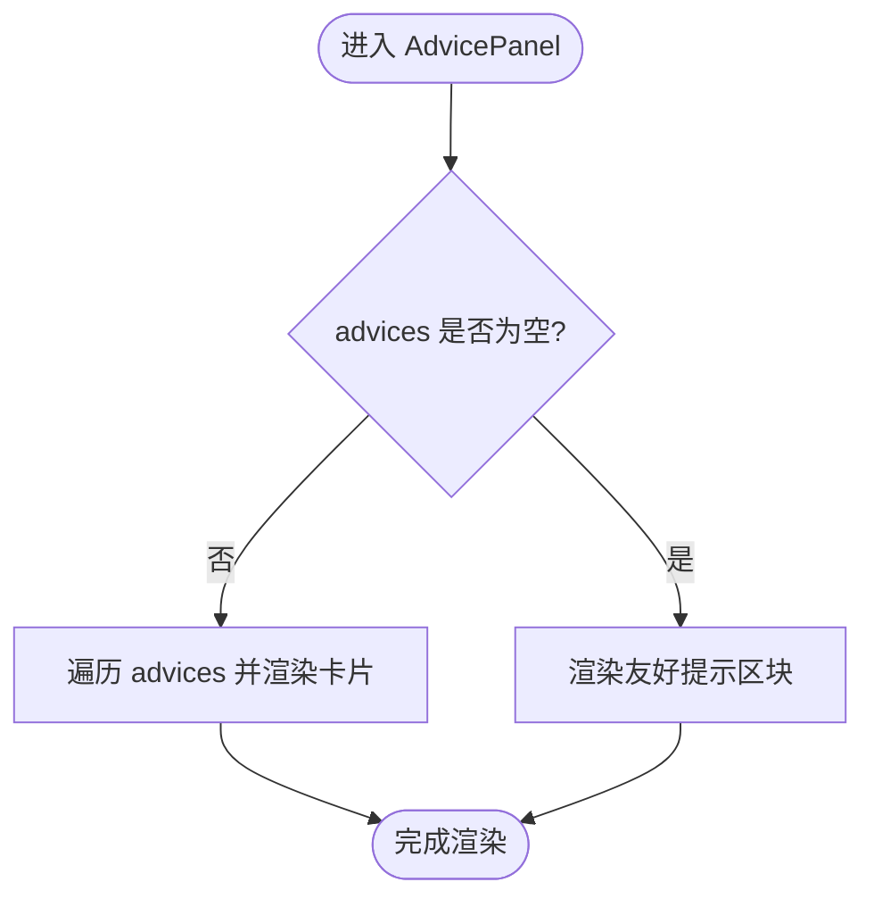
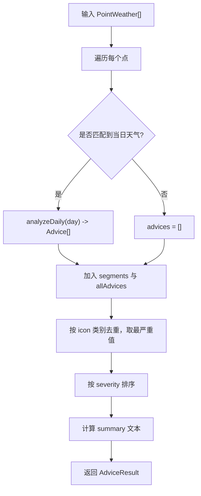
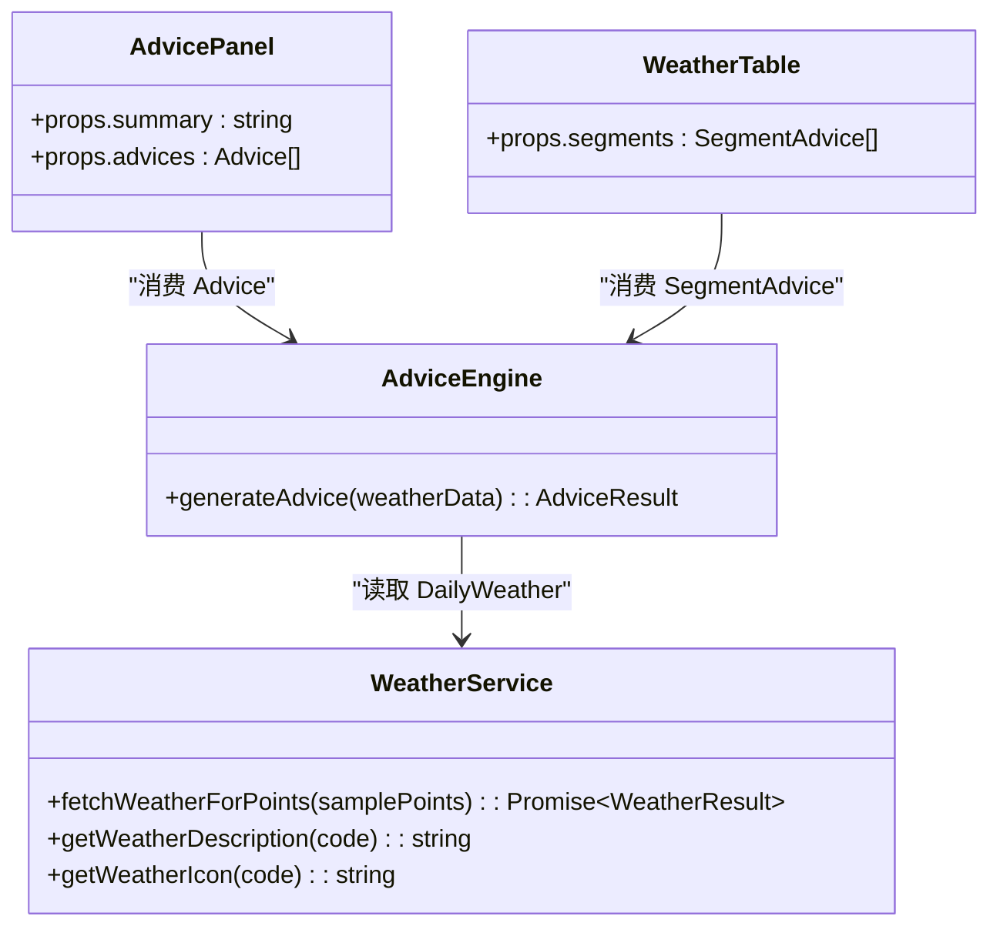
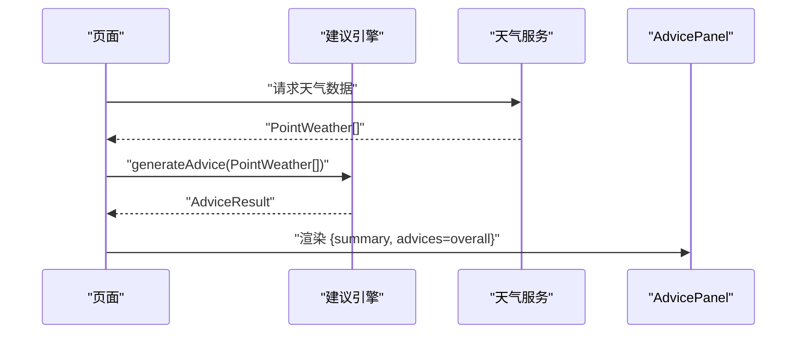

# 建议面板组件

<cite>
**本文引用的文件**   
- [components/AdvicePanel.tsx](file://components/AdvicePanel.tsx)
- [lib/advice-engine.ts](file://lib/advice-engine.ts)
- [lib/weather-service.ts](file://lib/weather-service.ts)
- [components/WeatherTable.tsx](file://components/WeatherTable.tsx)
</cite>

## 目录
1. [简介](#简介)
2. [项目结构](#项目结构)
3. [核心组件与数据模型](#核心组件与数据模型)
4. [架构总览](#架构总览)
5. [详细组件分析](#详细组件分析)
6. [依赖关系分析](#依赖关系分析)
7. [性能考量](#性能考量)
8. [故障排查指南](#故障排查指南)
9. [结论](#结论)
10. [附录：样式定制与无障碍支持](#附录样式定制与无障碍支持)

## 简介
本文件为 AdvicePanel 智能建议面板组件的完整技术文档。内容涵盖建议数据的展示逻辑、分级预警系统的视觉呈现与交互设计，详细说明组件的 Props 接口、建议分类渲染、颜色编码系统、动态内容更新方式，并提供样式定制方法、响应式布局适配和无障碍访问支持建议。同时给出与后端建议引擎的数据对接模式，帮助开发者快速集成与扩展。

## 项目结构
AdvicePanel 位于 components 目录中，负责将来自建议引擎（advice-engine）的整体建议列表进行可视化展示；建议引擎则基于天气服务（weather-service）提供的逐点天气数据生成建议结果。

图表来源
- [components/AdvicePanel.tsx:1-65](file://components/AdvicePanel.tsx#L1-L65)
- [lib/advice-engine.ts:1-201](file://lib/advice-engine.ts#L1-L201)
- [lib/weather-service.ts:1-176](file://lib/weather-service.ts#L1-L176)
- [components/WeatherTable.tsx:1-102](file://components/WeatherTable.tsx#L1-L102)

章节来源
- [components/AdvicePanel.tsx:1-65](file://components/AdvicePanel.tsx#L1-L65)
- [lib/advice-engine.ts:1-201](file://lib/advice-engine.ts#L1-L201)
- [lib/weather-service.ts:1-176](file://lib/weather-service.ts#L1-L176)
- [components/WeatherTable.tsx:1-102](file://components/WeatherTable.tsx#L1-L102)

## 核心组件与数据模型
- AdvicePanel 组件
  - 职责：接收整体建议摘要与整体建议列表，按等级渲染卡片式条目，提供无建议时的友好提示。
  - 输入 Props：
    - summary: string — 整体天气概况文本
    - advices: Advice[] — 整体建议列表
- 建议数据模型（Advice）
  - level: "info" | "warning" | "danger"
  - icon: string — 用于表达类别的图标字符
  - text: string — 建议文案
- 分段建议模型（SegmentAdvice）
  - 包含点位索引、距离、经纬度、到达时间、当日天气及该段落的建议列表
- 建议结果模型（AdviceResult）
  - summary: string
  - overall: Advice[]
  - segments: SegmentAdvice[]

章节来源
- [components/AdvicePanel.tsx:1-65](file://components/AdvicePanel.tsx#L1-L65)
- [lib/advice-engine.ts:7-28](file://lib/advice-engine.ts#L7-L28)

## 架构总览
建议面板的数据流从天气服务到建议引擎再到 UI 组件，形成清晰的分层结构。

图表来源
- [lib/weather-service.ts:71-87](file://lib/weather-service.ts#L71-L87)
- [lib/advice-engine.ts:118-201](file://lib/advice-engine.ts#L118-L201)
- [components/AdvicePanel.tsx:8-64](file://components/AdvicePanel.tsx#L8-L64)

## 详细组件分析

### AdvicePanel 组件
- 功能要点
  - 顶部区块：显示整体天气概况摘要
  - 建议列表：根据每条建议的等级渲染不同背景与边框色，左侧显示图标，右侧显示文案
  - 空状态：当没有建议时，展示“整体天气良好”的提示
- 渲染逻辑
  - 遍历 advices 数组，依据 advice.level 选择对应的样式类名组合
  - 使用 key={idx} 作为列表项标识（注意：在真实场景中建议使用稳定唯一键）
- 交互设计
  - 当前为纯展示型组件，未内置点击或展开等交互
  - 可在此基础上扩展：如点击某条建议高亮对应路段、跳转至 WeatherTable 定位段落等

图表来源
- [components/AdvicePanel.tsx:22-61](file://components/AdvicePanel.tsx#L22-L61)

章节来源
- [components/AdvicePanel.tsx:1-65](file://components/AdvicePanel.tsx#L1-L65)

### 建议引擎（advice-engine）
- 职责
  - 对每个点的匹配日期天气进行分析，生成逐日建议
  - 汇总所有点的建议，按类别去重并保留最严重值，输出整体建议列表
  - 生成整体摘要文本（平均温度区间、天气状况集合、最高降水概率等）
- 关键流程
  - analyzeDaily：基于降水概率、雷暴、高温、低温、大风、降雪等规则生成单天建议
  - generateAdvice：聚合所有点的建议，按类别合并并排序，生成最终结果
- 复杂度
  - 时间复杂度：O(N)，N 为点数；去重阶段 Map 操作近似 O(1)
  - 空间复杂度：O(N)，存储 segments 与 allAdvices

图表来源
- [lib/advice-engine.ts:30-116](file://lib/advice-engine.ts#L30-L116)
- [lib/advice-engine.ts:118-201](file://lib/advice-engine.ts#L118-L201)

章节来源
- [lib/advice-engine.ts:1-201](file://lib/advice-engine.ts#L1-L201)

### 天气服务（weather-service）
- 职责
  - 批量请求 Open-Meteo 每日预报，解析为 DailyWeather 列表
  - 根据到达日期匹配具体天气，若无则回退到首日
- 关键点
  - 分批并发请求以提升性能
  - 错误处理：当 API 返回非成功状态时抛出错误
  - 提供天气描述与图标映射函数

章节来源
- [lib/weather-service.ts:1-176](file://lib/weather-service.ts#L1-L176)

### 分段天气表（WeatherTable）
- 职责
  - 以表格形式展示各段落的天气详情与建议关联信息
  - 对降水概率与风速进行条件高亮，辅助用户快速识别风险
- 与 AdvicePanel 的关系
  - 两者共享同一数据来源（segments），分别承担“概览建议”和“明细数据”的职责

章节来源
- [components/WeatherTable.tsx:1-102](file://components/WeatherTable.tsx#L1-L102)

## 依赖关系分析
- AdvicePanel 仅依赖建议引擎导出的 Advice 类型，不直接访问天气服务
- advice-engine 依赖 weather-service 的类型与工具函数
- WeatherTable 依赖 advice-engine 的 SegmentAdvice 类型以及 weather-service 的描述与图标函数

图表来源
- [components/AdvicePanel.tsx:1-65](file://components/AdvicePanel.tsx#L1-L65)
- [lib/advice-engine.ts:1-201](file://lib/advice-engine.ts#L1-L201)
- [lib/weather-service.ts:1-176](file://lib/weather-service.ts#L1-L176)
- [components/WeatherTable.tsx:1-102](file://components/WeatherTable.tsx#L1-L102)

章节来源
- [components/AdvicePanel.tsx:1-65](file://components/AdvicePanel.tsx#L1-L65)
- [lib/advice-engine.ts:1-201](file://lib/advice-engine.ts#L1-L201)
- [lib/weather-service.ts:1-176](file://lib/weather-service.ts#L1-L176)
- [components/WeatherTable.tsx:1-102](file://components/WeatherTable.tsx#L1-L102)

## 性能考量
- 建议引擎的时间复杂度为 O(N)，适合中等规模的路径点数量
- 天气服务采用分批并发请求，避免一次性大量请求导致阻塞
- 建议在调用方增加缓存策略：
  - 对相同坐标与到达时间的天气结果进行短期缓存
  - 对 AdviceResult 做轻量级缓存，减少重复计算
- 列表渲染优化：
  - 为 AdvicePanel 的建议项提供稳定的唯一 key（例如结合 icon+text 哈希或外部 ID）
  - 若建议数量较大，考虑虚拟滚动或分页加载

[本节为通用性能建议，无需特定文件引用]

## 故障排查指南
- 天气 API 失败
  - 现象：无法获取天气数据，界面可能为空或报错
  - 排查：检查网络连通性与 API 返回状态码；确认坐标与日期范围合法
  - 参考实现：天气服务在请求失败时抛出错误
- 建议为空
  - 现象：AdvicePanel 显示“整体天气良好”提示
  - 排查：确认 generateAdvice 输入 weatherData 是否为空；检查 analyzeDaily 阈值是否符合预期
- 列表渲染异常
  - 现象：React 警告 key 不稳定
  - 排查：将 key 改为稳定唯一标识，避免仅使用索引

章节来源
- [lib/weather-service.ts:141-145](file://lib/weather-service.ts#L141-L145)
- [lib/advice-engine.ts:118-201](file://lib/advice-engine.ts#L118-L201)
- [components/AdvicePanel.tsx:27-53](file://components/AdvicePanel.tsx#L27-L53)

## 结论
AdvicePanel 是一个简洁、清晰的建议展示组件，配合 advice-engine 与 weather-service 形成了从数据到可视化的完整链路。通过分级预警的颜色编码与图标语义化，用户可以快速理解出行风险与建议重点。建议在后续迭代中增强交互能力（如联动地图与分段表）、完善无障碍支持与样式主题化配置。

[本节为总结性内容，无需特定文件引用]

## 附录：样式定制与无障碍支持

### Props 接口定义
- AdvicePanelProps
  - summary: string — 整体天气概况文本
  - advices: Advice[] — 整体建议列表

章节来源
- [components/AdvicePanel.tsx:3-6](file://components/AdvicePanel.tsx#L3-L6)

### 建议分类与颜色编码
- 等级与颜色映射
  - danger：红色系背景与边框，强调高风险
  - warning：琥珀色系背景与边框，提示中等风险
  - info：灰色系背景与边框，表示一般信息
- 图标语义
  - 使用 emoji 图标直观表达类别（如降雨、雷电、高温、低温、大风、降雪等）
- 文本可读性
  - 根据等级调整文字颜色与粗细，提升对比度与可读性

章节来源
- [components/AdvicePanel.tsx:30-52](file://components/AdvicePanel.tsx#L30-L52)

### 动态内容更新
- 数据驱动渲染
  - 父组件在获取新的 AdviceResult 后，将 summary 与 overall 传入 AdvicePanel
- 更新时机
  - 建议在天气数据变化或路径规划变更时触发重新计算与渲染
- 稳定性建议
  - 为建议项提供稳定 key，避免不必要的重渲染

章节来源
- [lib/advice-engine.ts:118-201](file://lib/advice-engine.ts#L118-L201)
- [components/AdvicePanel.tsx:27-53](file://components/AdvicePanel.tsx#L27-L53)

### 样式定制方法
- 主题覆盖
  - 通过 Tailwind 的 dark: 变体支持深色模式
  - 可在外层容器注入自定义 CSS 变量，统一控制色板
- 组件内样式扩展
  - 将样式类抽取为常量或配置对象，便于集中管理
  - 支持传入可选的样式覆盖 props（如 className、theme）

章节来源
- [components/AdvicePanel.tsx:10-52](file://components/AdvicePanel.tsx#L10-L52)

### 响应式布局适配
- 当前布局
  - 使用 flex 与间距控制，在小屏设备上保持可读性
- 扩展建议
  - 在大屏上可增加左右分栏，左侧为建议列表，右侧为分段天气表
  - 针对超长文案启用换行与省略策略

章节来源
- [components/AdvicePanel.tsx:10-52](file://components/AdvicePanel.tsx#L10-L52)

### 无障碍访问支持
- 语义化标签
  - 使用标题与段落标签组织层级，确保屏幕阅读器正确朗读
- 对比度与色彩
  - 保证文字与背景对比度符合 WCAG 标准，避免仅用颜色传达信息
- 键盘导航
  - 若未来增加交互（如展开详情），需提供焦点管理与键盘操作
- 替代文本
  - 图标应辅以 aria-label 或隐藏文本，确保含义可被读屏器理解

[本节为通用无障碍建议，无需特定文件引用]

### 与后端建议引擎的数据对接模式
- 数据源
  - 上游提供 PointWeather[]（含到达时间与匹配天气）
- 处理流程
  - 调用 generateAdvice 生成 AdviceResult
  - 将 result.summary 与 result.overall 传入 AdvicePanel
- 错误处理
  - 捕获天气服务错误，降级显示“暂无建议”或重试机制
- 示例流程（概念图）

[此图为概念流程示意，无需特定文件引用]