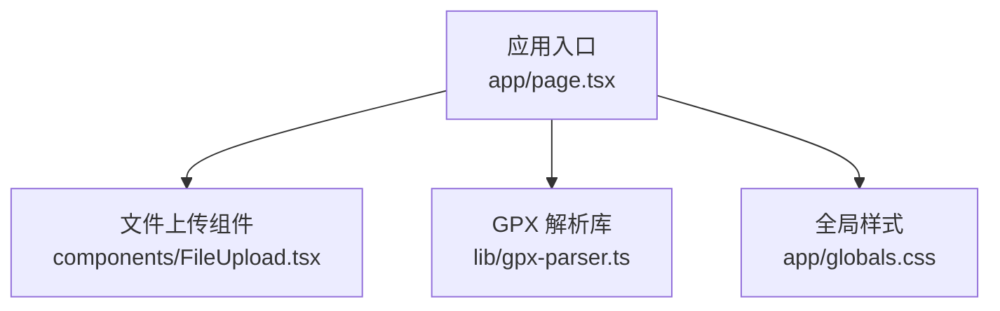
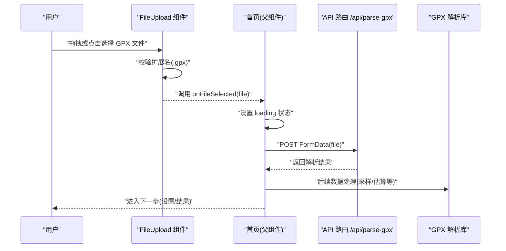
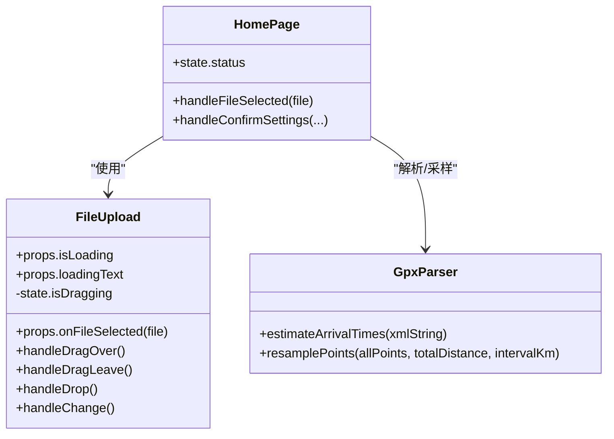
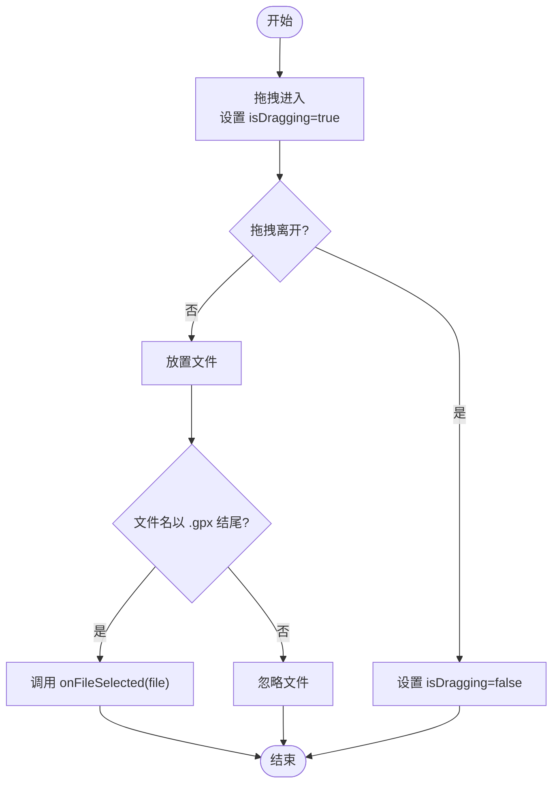
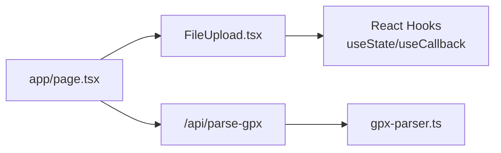

# 文件上传组件

<cite>
**本文引用的文件**
- [components/FileUpload.tsx](file://components/FileUpload.tsx)
- [app/page.tsx](file://app/page.tsx)
- [lib/gpx-parser.ts](file://lib/gpx-parser.ts)
- [app/globals.css](file://app/globals.css)
</cite>

## 目录
1. [简介](#简介)
2. [项目结构](#项目结构)
3. [核心组件](#核心组件)
4. [架构总览](#架构总览)
5. [详细组件分析](#详细组件分析)
6. [依赖关系分析](#依赖关系分析)
7. [性能与体验优化](#性能与体验优化)
8. [故障排查指南](#故障排查指南)
9. [结论](#结论)
10. [附录：使用示例与样式定制](#附录使用示例与样式定制)

## 简介
本文件为 FileUpload 文件上传组件的完整文档，聚焦以下方面：
- 拖拽上传能力与交互反馈
- 文件类型验证机制（仅接受 .gpx）
- 状态管理（拖拽态、加载态）
- Props 接口定义（onFileSelected、isLoading、loadingText）
- 事件处理逻辑（拖拽、点击选择）
- 用户体验优化建议
- 集成到页面中的使用示例
- 样式定制方法与响应式设计考虑

## 项目结构
该组件位于 components 目录下，作为客户端组件被首页引入并参与整体业务流程。

图表来源
- [app/page.tsx:1-214](file://app/page.tsx#L1-L214)
- [components/FileUpload.tsx:1-97](file://components/FileUpload.tsx#L1-L97)
- [lib/gpx-parser.ts:1-231](file://lib/gpx-parser.ts#L1-L231)
- [app/globals.css:1-40](file://app/globals.css#L1-L40)

章节来源
- [components/FileUpload.tsx:1-97](file://components/FileUpload.tsx#L1-L97)
- [app/page.tsx:1-214](file://app/page.tsx#L1-L214)

## 核心组件
FileUpload 是一个“受控式”上传区域，负责：
- 接收父组件传入的 onFileSelected、isLoading、loadingText
- 维护本地 isDragging 状态以提供拖拽视觉反馈
- 支持拖拽和点击两种选择方式
- 在 isLoading 时禁用交互并展示加载指示器

章节来源
- [components/FileUpload.tsx:1-97](file://components/FileUpload.tsx#L1-L97)

## 架构总览
从用户操作到数据处理的端到端流程如下：

图表来源
- [components/FileUpload.tsx:28-48](file://components/FileUpload.tsx#L28-L48)
- [app/page.tsx:30-60](file://app/page.tsx#L30-L60)
- [lib/gpx-parser.ts:139-230](file://lib/gpx-parser.ts#L139-L230)

## 详细组件分析

### Props 接口定义
- onFileSelected(file: File): void
  - 当用户成功选择有效文件后回调，由父组件负责后续处理。
- isLoading: boolean
  - 控制组件是否处于加载态；为真时禁用交互并显示加载动画与提示文本。
- loadingText?: string
  - 可选的加载提示文案，默认值用于通用场景。

章节来源
- [components/FileUpload.tsx:5-15](file://components/FileUpload.tsx#L5-L15)

### 内部状态与生命周期
- isDragging: boolean
  - 记录拖拽进入/离开容器时的视觉高亮状态。
- 渲染分支
  - 非加载态：显示拖拽/点击提示与图标
  - 加载态：显示旋转动画与 loadingText

章节来源
- [components/FileUpload.tsx:16-16](file://components/FileUpload.tsx#L16-L16)
- [components/FileUpload.tsx:74-93](file://components/FileUpload.tsx#L74-L93)

### 事件处理逻辑
- 拖拽进入 handleDragOver
  - 阻止默认行为，置 isDragging 为 true
- 拖拽离开 handleDragLeave
  - 阻止默认行为，置 isDragging 为 false
- 放置 handleDrop
  - 阻止默认行为，重置 isDragging
  - 取 dataTransfer.files[0]，若存在且扩展名为 .gpx，则触发 onFileSelected
- 点击选择 handleChange
  - 取 input.files[0]，若存在则触发 onFileSelected

章节来源
- [components/FileUpload.tsx:18-48](file://components/FileUpload.tsx#L18-L48)

### 文件验证机制
- 前端基础校验：仅允许 .gpx 后缀的文件通过拖拽路径
- 点击选择未做扩展名限制，建议在父组件或后端进一步校验
- 建议增强点：
  - 增加文件大小上限校验
  - 增加 MIME 类型校验
  - 对空文件或损坏文件给出明确错误提示

章节来源
- [components/FileUpload.tsx:32-35](file://components/FileUpload.tsx#L32-L35)

### 状态管理与父组件协作
- 父组件通过 isLoading 控制组件交互与 UI
- 父组件在 onFileSelected 中发起网络请求，并在失败时回退状态
- 组件本身不持有业务数据，保持纯 UI 职责

章节来源
- [app/page.tsx:124-126](file://app/page.tsx#L124-L126)
- [app/page.tsx:30-60](file://app/page.tsx#L30-L60)

### 类图（组件与依赖）

图表来源
- [components/FileUpload.tsx:1-97](file://components/FileUpload.tsx#L1-L97)
- [app/page.tsx:25-118](file://app/page.tsx#L25-L118)
- [lib/gpx-parser.ts:44-110](file://lib/gpx-parser.ts#L44-L110)
- [lib/gpx-parser.ts:139-230](file://lib/gpx-parser.ts#L139-L230)

### 流程图（拖拽放置与选择）

图表来源
- [components/FileUpload.tsx:18-38](file://components/FileUpload.tsx#L18-L38)

## 依赖关系分析
- 组件自身无外部运行时依赖，仅使用 React 内置能力
- 父组件将文件上传与解析流程串联，形成“UI -> 父组件 -> API -> 解析库”的链路
- 样式基于 Tailwind CSS 原子类，全局主题变量来自全局样式

图表来源
- [components/FileUpload.tsx:1-97](file://components/FileUpload.tsx#L1-L97)
- [app/page.tsx:1-214](file://app/page.tsx#L1-L214)
- [lib/gpx-parser.ts:1-231](file://lib/gpx-parser.ts#L1-L231)

章节来源
- [components/FileUpload.tsx:1-97](file://components/FileUpload.tsx#L1-L97)
- [app/page.tsx:1-214](file://app/page.tsx#L1-L214)
- [lib/gpx-parser.ts:1-231](file://lib/gpx-parser.ts#L1-L231)

## 性能与体验优化
- 防抖与节流
  - 当前实现未对频繁拖拽进行节流，可在高频拖拽场景下对 isDragging 更新做简单节流以减少重绘
- 大文件处理
  - 建议在前端增加文件大小限制与进度反馈，避免阻塞主线程
- 可访问性
  - 为外层容器添加 role="button" 与键盘 Enter/Space 触发选择
  - 为输入框添加 aria-label 提升屏幕阅读器体验
- 错误提示
  - 对非法文件类型、过大文件、空文件给出即时提示
- 并发与幂等
  - 父组件在请求进行中应防止重复提交（当前已通过 isLoading 控制）

[本节为通用建议，不直接分析具体文件]

## 故障排查指南
- 拖拽无效
  - 检查是否在目标元素上正确绑定 onDragOver/onDragLeave/onDrop，并确保 preventDefault
- 文件未被识别
  - 确认拖拽路径中对 .gpx 的校验逻辑；点击选择未做扩展名限制，需在父组件或后端补充校验
- 加载态无法交互
  - 确认父组件是否正确传递 isLoading，以及组件内 disabled 属性生效
- 解析失败
  - 查看父组件的错误分支与 API 返回信息，必要时增加更详细的错误消息

章节来源
- [components/FileUpload.tsx:18-48](file://components/FileUpload.tsx#L18-L48)
- [app/page.tsx:42-59](file://app/page.tsx#L42-L59)

## 结论
FileUpload 组件职责清晰、耦合度低，通过 props 暴露最小必要接口，配合父组件完成完整的上传与解析流程。其拖拽交互与加载态反馈良好，具备较好的可扩展性与可定制性。建议在前端增加更完善的文件校验与错误提示，以提升健壮性与用户体验。

[本节为总结性内容，不直接分析具体文件]

## 附录：使用示例与样式定制

### 集成到页面中的使用示例
- 在页面中导入并传入 onFileSelected、isLoading、loadingText
- 在 onFileSelected 中发起网络请求，并根据结果切换状态
- 参考首页的实现模式

章节来源
- [app/page.tsx:143-147](file://app/page.tsx#L143-L147)
- [app/page.tsx:30-60](file://app/page.tsx#L30-L60)

### 样式定制方法
- 容器外观
  - 边框、圆角、内边距、过渡动画均可通过 Tailwind 类调整
  - 拖拽高亮与悬停效果可通过条件类组合实现
- 加载态样式
  - 旋转动画与提示文案位置可按需调整
- 深色模式
  - 组件已适配 dark 变体，遵循全局主题变量

章节来源
- [components/FileUpload.tsx:55-64](file://components/FileUpload.tsx#L55-L64)
- [components/FileUpload.tsx:74-93](file://components/FileUpload.tsx#L74-L93)
- [app/globals.css:3-20](file://app/globals.css#L3-L20)

### 响应式设计考虑
- 容器宽度与间距采用相对单位与自适应布局，适合移动端与桌面端
- 字体大小与行高在不同屏幕尺寸下保持可读性
- 触摸友好：点击选择区域覆盖整个容器，便于手指操作

章节来源
- [components/FileUpload.tsx:55-72](file://components/FileUpload.tsx#L55-L72)