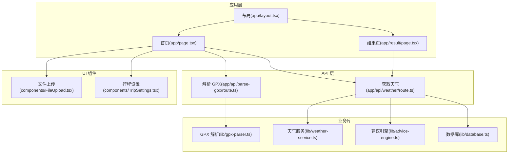
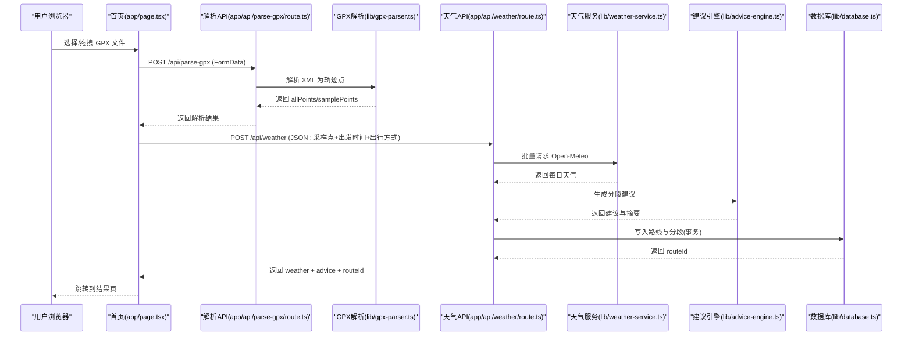
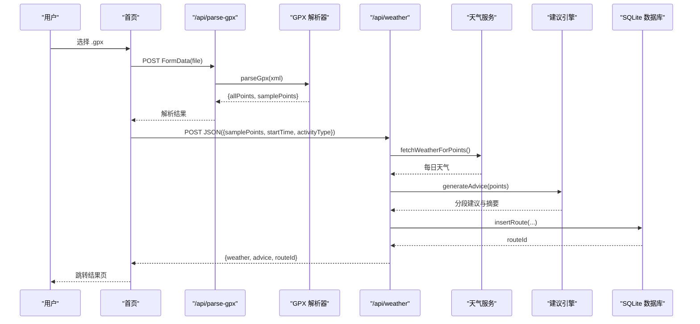
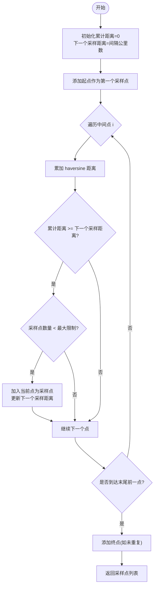
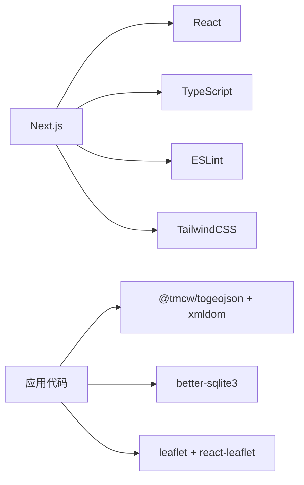

# 快速开始

<cite>
**本文引用的文件**   
- [README.md](file://README.md)
- [package.json](file://package.json)
- [next.config.ts](file://next.config.ts)
- [tsconfig.json](file://tsconfig.json)
- [app/layout.tsx](file://app/layout.tsx)
- [app/page.tsx](file://app/page.tsx)
- [components/FileUpload.tsx](file://components/FileUpload.tsx)
- [components/TripSettings.tsx](file://components/TripSettings.tsx)
- [app/api/parse-gpx/route.ts](file://app/api/parse-gpx/route.ts)
- [app/api/weather/route.ts](file://app/api/weather/route.ts)
- [lib/gpx-parser.ts](file://lib/gpx-parser.ts)
- [lib/weather-service.ts](file://lib/weather-service.ts)
- [lib/advice-engine.ts](file://lib/advice-engine.ts)
- [lib/database.ts](file://lib/database.ts)
- [app/result/page.tsx](file://app/result/page.tsx)
</cite>

## 目录
1. [简介](#简介)
2. [项目结构](#项目结构)
3. [核心组件](#核心组件)
4. [架构总览](#架构总览)
5. [详细组件分析](#详细组件分析)
6. [依赖分析](#依赖分析)
7. [性能考虑](#性能考虑)
8. [故障排除指南](#故障排除指南)
9. [结论](#结论)
10. [附录](#附录)

## 简介
FineG 是一个基于 Next.js 的“GPX 天气助手”，支持上传 GPX 轨迹文件，解析采样点并查询沿途天气，生成出行建议与可视化结果。本快速开始指南将帮助你在最短时间内完成环境准备、安装依赖、启动开发服务器，并通过基本示例完成一次完整的“上传 GPX → 设置行程参数 → 查看天气分析结果”的流程。

## 项目结构
本项目采用 Next.js App Router 组织页面与 API：
- app 目录：页面路由与 API 路由
- components 目录：前端交互组件（上传、行程设置、地图、表格等）
- lib 目录：核心逻辑（GPX 解析、天气服务、建议引擎、数据库）
- data 目录：本地 SQLite 数据文件存放位置（运行时自动创建）



图表来源
- [app/page.tsx:1-214](file://app/page.tsx#L1-L214)
- [app/result/page.tsx:1-578](file://app/result/page.tsx#L1-L578)
- [app/layout.tsx:1-47](file://app/layout.tsx#L1-L47)
- [app/api/parse-gpx/route.ts:1-48](file://app/api/parse-gpx/route.ts#L1-L48)
- [app/api/weather/route.ts:1-93](file://app/api/weather/route.ts#L1-L93)
- [lib/gpx-parser.ts:1-231](file://lib/gpx-parser.ts#L1-L231)
- [lib/weather-service.ts:1-176](file://lib/weather-service.ts#L1-L176)
- [lib/advice-engine.ts:1-201](file://lib/advice-engine.ts#L1-L201)
- [lib/database.ts:1-204](file://lib/database.ts#L1-L204)
- [components/FileUpload.tsx:1-97](file://components/FileUpload.tsx#L1-L97)
- [components/TripSettings.tsx:1-175](file://components/TripSettings.tsx#L1-L175)

章节来源
- [README.md:1-37](file://README.md#L1-L37)
- [package.json:1-34](file://package.json#L1-L34)
- [next.config.ts:1-8](file://next.config.ts#L1-L8)
- [tsconfig.json:1-35](file://tsconfig.json#L1-L35)

## 核心组件
- 首页流程控制：负责文件上传、解析状态管理、跳转至结果页
- 文件上传组件：拖拽或选择 .gpx 文件
- 行程设置组件：选择出发时间与出行方式，估算用时
- 解析 API：接收 GPX 文本，返回采样点与全量点（限流渲染）
- 天气 API：根据采样点批量请求外部天气接口，生成建议并落库
- 结果页：展示地图、建议面板、天气详情表，支持重新查询

章节来源
- [app/page.tsx:1-214](file://app/page.tsx#L1-L214)
- [components/FileUpload.tsx:1-97](file://components/FileUpload.tsx#L1-L97)
- [components/TripSettings.tsx:1-175](file://components/TripSettings.tsx#L1-L175)
- [app/api/parse-gpx/route.ts:1-48](file://app/api/parse-gpx/route.ts#L1-L48)
- [app/api/weather/route.ts:1-93](file://app/api/weather/route.ts#L1-L93)
- [app/result/page.tsx:1-578](file://app/result/page.tsx#L1-L578)

## 架构总览
下图展示了从用户操作到数据落库的关键调用链。



图表来源
- [app/page.tsx:1-214](file://app/page.tsx#L1-L214)
- [app/api/parse-gpx/route.ts:1-48](file://app/api/parse-gpx/route.ts#L1-L48)
- [lib/gpx-parser.ts:1-231](file://lib/gpx-parser.ts#L1-L231)
- [app/api/weather/route.ts:1-93](file://app/api/weather/route.ts#L1-L93)
- [lib/weather-service.ts:1-176](file://lib/weather-service.ts#L1-L176)
- [lib/advice-engine.ts:1-201](file://lib/advice-engine.ts#L1-L201)
- [lib/database.ts:1-204](file://lib/database.ts#L1-L204)

## 详细组件分析

### 环境准备与安装
- Node.js 版本
  - 推荐 Node.js 18+（Next.js 16 生态对 LTS 更友好）。若使用 nvm/nvs 可快速切换版本。
- 包管理器选择
  - npm、yarn、pnpm、bun 均可。项目 scripts 中已提供 dev/build/start/lint 命令。
- 安装依赖
  - 在项目根目录执行：npm install（或 yarn/pnpm/bun 对应命令）
- 启动开发服务器
  - 执行：npm run dev（或 yarn dev / pnpm dev / bun dev）
  - 打开浏览器访问 http://localhost:3000

章节来源
- [README.md:1-37](file://README.md#L1-L37)
- [package.json:1-34](file://package.json#L1-L34)

### 首次运行与基本使用
- 上传 GPX 文件
  - 在首页点击或拖拽 .gpx 文件，触发后端解析
- 设置行程参数
  - 选择出发时间与出行方式（步行/骑行/跑步/驾车等），系统会估算全程用时
- 查看天气分析结果
  - 提交后进入结果页，包含地图、建议面板、天气详情表
  - 支持调整出发时间重新查询

章节来源
- [app/page.tsx:1-214](file://app/page.tsx#L1-L214)
- [components/FileUpload.tsx:1-97](file://components/FileUpload.tsx#L1-L97)
- [components/TripSettings.tsx:1-175](file://components/TripSettings.tsx#L1-L175)
- [app/result/page.tsx:1-578](file://app/result/page.tsx#L1-L578)

### 关键流程时序图（上传→解析→天气→结果）


图表来源
- [app/page.tsx:1-214](file://app/page.tsx#L1-L214)
- [app/api/parse-gpx/route.ts:1-48](file://app/api/parse-gpx/route.ts#L1-L48)
- [lib/gpx-parser.ts:1-231](file://lib/gpx-parser.ts#L1-L231)
- [app/api/weather/route.ts:1-93](file://app/api/weather/route.ts#L1-L93)
- [lib/weather-service.ts:1-176](file://lib/weather-service.ts#L1-L176)
- [lib/advice-engine.ts:1-201](file://lib/advice-engine.ts#L1-L201)
- [lib/database.ts:1-204](file://lib/database.ts#L1-L204)

### 数据结构与关系（类图）
```mermaid
classDiagram
class TrackPoint {
+number lat
+number lon
+number? elevation
+string? time
}
class SamplePoint {
+number index
+number distanceFromStart
+string? estimatedArrival
}
class ActivityType {
+string id
+string label
+string icon
+number avgSpeedKmh
}
class ParseResult {
+string name
+number totalDistance
+TrackPoint[] allPoints
+SamplePoint[] samplePoints
}
class DailyWeather {
+string date
+number tempMax
+number tempMin
+number precipitationProbability
+number windSpeedMax
+number weatherCode
}
class PointWeather {
+SamplePoint point
+string? arrivalDate
+string? arrivalTime
+DailyWeather? weather
+DailyWeather[] forecast
}
class SegmentAdvice {
+number pointIndex
+number distanceKm
+number lat
+number lon
+string? arrivalDate
+string? arrivalTime
+DailyWeather? weather
+Advice[] advices
}
class RouteRecord {
+number id
+string name
+number distance_km
+number points_count
+string? activity_type
+string? start_time
+string created_at
+string all_points_json
}
class SegmentRecord {
+number id
+number route_id
+number point_index
+number distance_km
+number lat
+number lon
+string? arrival_date
+string? arrival_time
+number? wmo_code
+number? temp_max
+number? temp_min
+number? precip_prob
+number? wind_speed_max
+string? advice_level
+string? advice_text
}
SamplePoint --|> TrackPoint : "扩展"
ParseResult --> TrackPoint
ParseResult --> SamplePoint
PointWeather --> SamplePoint
PointWeather --> DailyWeather
SegmentAdvice --> DailyWeather
RouteRecord ||--o{ SegmentRecord : "一对多"
```

图表来源
- [lib/gpx-parser.ts:1-231](file://lib/gpx-parser.ts#L1-L231)
- [lib/weather-service.ts:1-176](file://lib/weather-service.ts#L1-L176)
- [lib/advice-engine.ts:1-201](file://lib/advice-engine.ts#L1-L201)
- [lib/database.ts:1-204](file://lib/database.ts#L1-L204)

### 算法流程图（采样点重采样）


图表来源
- [lib/gpx-parser.ts:44-94](file://lib/gpx-parser.ts#L44-L94)

## 依赖分析
- 运行时依赖
  - next、react/react-dom：框架与 UI 基础
  - @tmcw/togeojson、@xmldom/xmldom：GPX/XML 解析
  - better-sqlite3：本地 SQLite 存储
  - leaflet、react-leaflet：地图渲染
- 开发依赖
  - typescript、@types/*、eslint、tailwindcss 等



图表来源
- [package.json:1-34](file://package.json#L1-L34)

章节来源
- [package.json:1-34](file://package.json#L1-L34)

## 性能考虑
- GPX 全量点渲染优化
  - 解析后将全量点按固定比例抽样限制到约 2000 点，避免前端渲染卡顿
- 天气请求批处理
  - 按批次并发请求 Open-Meteo，减少串行等待
- 数据库写入事务
  - 插入分段数据使用事务，保证一致性与性能
- 动态加载地图
  - 结果页地图通过动态导入延迟加载，缩短首屏时间

章节来源
- [app/api/parse-gpx/route.ts:26-33](file://app/api/parse-gpx/route.ts#L26-L33)
- [lib/weather-service.ts:76-87](file://lib/weather-service.ts#L76-L87)
- [lib/database.ts:137-158](file://lib/database.ts#L137-L158)
- [app/result/page.tsx:16-26](file://app/result/page.tsx#L16-L26)

## 故障排除指南
- 无法启动开发服务器
  - 确认 Node.js 版本满足要求；清理 node_modules 后重装依赖；检查端口 3000 是否被占用
- 上传 GPX 失败
  - 确保文件后缀为 .gpx；检查文件大小与格式是否符合标准；查看浏览器控制台错误信息
- 天气查询失败
  - 检查网络连通性；Open-Meteo 接口可能受地域或网络影响；重试或稍后再试
- 历史记录不显示
  - 确认 data/routes.db 是否存在且可读；检查数据库权限；重启开发服务器以重建连接
- 地图不加载
  - 结果页地图为动态加载，请确保网络可用；检查浏览器控制台是否有资源加载错误

章节来源
- [app/api/parse-gpx/route.ts:9-21](file://app/api/parse-gpx/route.ts#L9-L21)
- [lib/weather-service.ts:139-145](file://lib/weather-service.ts#L139-L145)
- [lib/database.ts:10-21](file://lib/database.ts#L10-L21)
- [app/result/page.tsx:16-26](file://app/result/page.tsx#L16-L26)

## 结论
通过本指南，你可以在几分钟内完成 FineG 的环境搭建与首次运行，掌握上传 GPX、设置行程参数、查看天气分析与建议的核心流程。建议在后续使用中结合历史记录功能进行对比与复盘，并根据实际出行需求调整出发时间与出行方式以获得更准确的建议。

## 附录
- 常用脚本
  - 开发：npm run dev
  - 构建：npm run build
  - 启动生产：npm start
  - 代码检查：npm run lint
- 全局布局与导航
  - 站点标题与描述、顶部导航（首页/历史记录）由布局组件统一注入

章节来源
- [package.json:5-10](file://package.json#L5-L10)
- [app/layout.tsx:5-8](file://app/layout.tsx#L5-L8)
- [app/layout.tsx:18-41](file://app/layout.tsx#L18-L41)