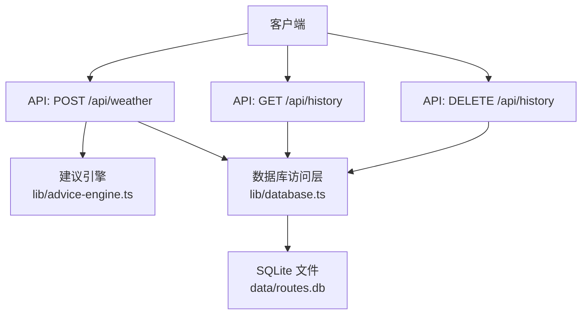
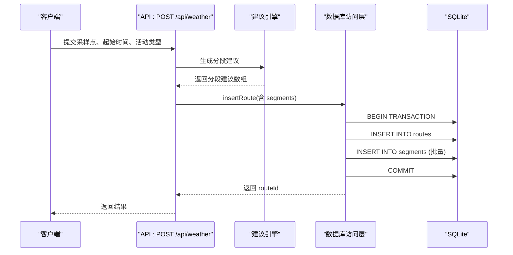
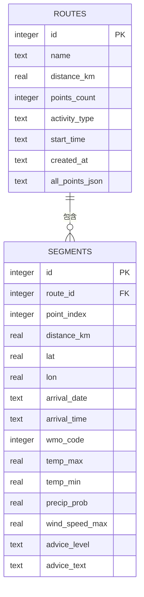

# 数据库表结构

<cite>
**本文引用的文件**   
- [lib/database.ts](file://lib/database.ts)
- [app/api/history/route.ts](file://app/api/history/route.ts)
- [app/api/weather/route.ts](file://app/api/weather/route.ts)
- [lib/advice-engine.ts](file://lib/advice-engine.ts)
- [lib/compare-engine.ts](file://lib/compare-engine.ts)
- [package.json](file://package.json)
</cite>

## 目录
1. [简介](#简介)
2. [项目结构与数据层定位](#项目结构与数据层定位)
3. [核心组件与职责](#核心组件与职责)
4. [架构总览](#架构总览)
5. [详细表结构设计](#详细表结构设计)
6. [依赖关系与完整性约束](#依赖关系与完整性约束)
7. [性能特性与优化建议](#性能特性与优化建议)
8. [初始化与迁移策略](#初始化与迁移策略)
9. [SQL 查询示例与最佳实践](#sql-查询示例与最佳实践)
10. [故障排查指南](#故障排查指南)
11. [结论](#结论)

## 简介
本文件聚焦于 FineG 项目的 SQLite 数据库表结构设计，重点说明 routes 表与 segments 表的完整 Schema、字段定义、主外键关系、索引策略、关联关系与数据完整性约束。同时给出设计决策说明、初始化脚本要点、迁移策略与性能优化建议，并提供常用 SQL 查询示例与最佳实践，帮助开发者快速理解并高效使用数据层。

## 项目结构与数据层定位
- 数据持久化由 Node.js 服务端的 lib/database.ts 统一封装，基于 better-sqlite3 驱动。
- API 路由通过 Next.js 的 app/api 暴露接口：
  - 写入：POST /api/weather（解析 GPX、获取天气、生成建议、落库）
  - 读取：GET /api/history（列出历史路线）
  - 删除：DELETE /api/history（按 ID 删除路线及其分段）
- 业务逻辑位于 lib/advice-engine.ts（建议引擎）、lib/compare-engine.ts（对比评分），均消费数据库返回的 SegmentRecord 类型。

图表来源
- [app/api/weather/route.ts:1-93](file://app/api/weather/route.ts#L1-L93)
- [app/api/history/route.ts:1-33](file://app/api/history/route.ts#L1-L33)
- [lib/database.ts:1-204](file://lib/database.ts#L1-L204)

章节来源
- [lib/database.ts:1-204](file://lib/database.ts#L1-L204)
- [app/api/weather/route.ts:1-93](file://app/api/weather/route.ts#L1-L93)
- [app/api/history/route.ts:1-33](file://app/api/history/route.ts#L1-L33)

## 核心组件与职责
- 数据库访问层（lib/database.ts）
  - 负责连接管理、WAL 模式开启、表初始化、CRUD 操作。
  - 提供 insertRoute、getAllRoutes、getRouteById、deleteRoute 等函数。
- 建议引擎（lib/advice-engine.ts）
  - 根据天气数据为每个分段生成建议等级与文本，供写入 segments 表。
- 对比引擎（lib/compare-engine.ts）
  - 读取 segments 数据计算评分与排名，用于前端展示。
- API 路由
  - 协调解析、天气、建议、落库流程，或提供历史记录列表与删除能力。

章节来源
- [lib/database.ts:1-204](file://lib/database.ts#L1-L204)
- [lib/advice-engine.ts:1-201](file://lib/advice-engine.ts#L1-L201)
- [lib/compare-engine.ts:1-116](file://lib/compare-engine.ts#L1-L116)
- [app/api/weather/route.ts:1-93](file://app/api/weather/route.ts#L1-L93)
- [app/api/history/route.ts:1-33](file://app/api/history/route.ts#L1-L33)

## 架构总览
下图展示了从请求到落库的关键调用链，以及表间一对多关系。

图表来源
- [app/api/weather/route.ts:1-93](file://app/api/weather/route.ts#L1-L93)
- [lib/advice-engine.ts:1-201](file://lib/advice-engine.ts#L1-L201)
- [lib/database.ts:1-204](file://lib/database.ts#L1-L204)

## 详细表结构设计

### 表：routes
- 用途：存储一次轨迹的基本信息与汇总元数据。
- 字段定义
  - id: INTEGER, 自增主键
  - name: TEXT, 非空，轨迹名称
  - distance_km: REAL, 非空，总距离（千米）
  - points_count: INTEGER, 非空，采样点数
  - activity_type: TEXT, 可选，活动类型标识
  - start_time: TEXT, 可选，开始时间（ISO 字符串）
  - created_at: TEXT, 非空，默认当前本地时间
  - all_points_json: TEXT, 非空，原始轨迹点 JSON 文本
- 主键：id
- 索引策略：无显式索引；created_at 常用于排序，可在高频查询场景考虑添加索引。
- 设计要点
  - 将全部轨迹点以 JSON 文本形式保存，避免在细粒度点位上过度规范化，提升写入吞吐与简化查询。
  - 保留 points_count 作为冗余统计字段，便于列表页快速展示。

章节来源
- [lib/database.ts:23-34](file://lib/database.ts#L23-L34)

### 表：segments
- 用途：存储轨迹分段（采样点）级别的详细信息，包括位置、到达时间、天气与建议。
- 字段定义
  - id: INTEGER, 自增主键
  - route_id: INTEGER, 非空，外键指向 routes.id，级联删除
  - point_index: INTEGER, 非空，采样点在原序列中的索引
  - distance_km: REAL, 非空，该点的累计距离（千米）
  - lat: REAL, 非空，纬度
  - lon: REAL, 非空，经度
  - arrival_date: TEXT, 可选，到达日期
  - arrival_time: TEXT, 可选，到达时间
  - wmo_code: INTEGER, 可选，WMO 天气代码
  - temp_max: REAL, 可选，最高温度
  - temp_min: REAL, 可选，最低温度
  - precip_prob: REAL, 可选，降水概率
  - wind_speed_max: REAL, 可选，最大风速
  - advice_level: TEXT, 可选，建议等级（info/warning/danger）
  - advice_text: TEXT, 可选，建议文本
- 主键：id
- 外键：route_id -> routes(id) ON DELETE CASCADE
- 索引策略：无显式索引；但 getRouteById 会按 route_id 过滤并按 point_index 排序，建议在 (route_id, point_index) 建立复合索引以提升查询性能。
- 设计要点
  - 采用“宽表”设计，将天气与建议信息直接保存在分段记录中，减少跨表 JOIN，提高分析型查询效率。
  - 使用 TEXT 存储时间与建议文本，兼容 ISO 字符串与自由文本，便于扩展。

章节来源
- [lib/database.ts:36-54](file://lib/database.ts#L36-L54)

### 类型映射（TypeScript）
- RouteRecord 与 SegmentRecord 与上述表结构一一对应，确保前后端一致。
- 插入时，API 将建议引擎输出的分段建议映射为 segments 行。

章节来源
- [lib/database.ts:59-86](file://lib/database.ts#L59-L86)
- [app/api/weather/route.ts:49-76](file://app/api/weather/route.ts#L49-L76)

## 依赖关系与完整性约束
- 一对多关系：一个 routes 对应多个 segments。
- 外键约束：segments.route_id 引用 routes.id，且设置 ON DELETE CASCADE，删除路线时会级联删除其所有分段。
- 数据一致性：
  - 写入采用事务包裹，保证 routes 与 segments 原子性。
  - 删除也使用事务，先删子段再删父记录，避免外键冲突。

图表来源
- [lib/database.ts:23-54](file://lib/database.ts#L23-L54)

章节来源
- [lib/database.ts:190-203](file://lib/database.ts#L190-L203)

## 性能特性与优化建议
- WAL 模式：已启用 journal_mode=WAL，提升并发读性能与降低锁竞争。
- 写入优化：
  - 使用事务批量插入 segments，减少磁盘 I/O 与日志开销。
  - 全量轨迹点以 JSON 文本存储，避免过多小表带来的 JOIN 成本。
- 查询优化：
  - 常见查询：按 route_id 获取分段并按 point_index 排序。建议在 segments(route_id, point_index) 建立复合索引。
  - 列表页按 created_at 倒序，可考虑在 routes(created_at) 建索引。
- 空间权衡：
  - 将天气与建议信息冗余到 segments，减少 JOIN，适合分析型与可视化场景。
- 并发与锁：
  - SQLite 单写者模型，在高并发写入下需关注队列与批处理；当前实现已在应用层做事务聚合，具备较好吞吐。

章节来源
- [lib/database.ts:17-18](file://lib/database.ts#L17-L18)
- [lib/database.ts:131-159](file://lib/database.ts#L131-L159)
- [lib/database.ts:172-188](file://lib/database.ts#L172-L188)

## 初始化与迁移策略
- 初始化
  - 首次启动时自动创建 data 目录与 routes.db 文件。
  - 使用 CREATE TABLE IF NOT EXISTS 确保幂等初始化。
- 迁移策略
  - 当前未引入版本化迁移框架。建议在 initTables 中增加版本号控制，或使用外部迁移工具（如 sqlite-migrate）。
  - 新增字段或索引时，采用 ALTER TABLE 与 CREATE INDEX 的幂等语句，并在应用启动时执行。
- 备份与恢复
  - 由于是单文件数据库，可直接复制 routes.db 进行备份；注意在 WAL 模式下同时备份 -wal/-shm 文件以保证一致性。

章节来源
- [lib/database.ts:10-21](file://lib/database.ts#L10-L21)
- [lib/database.ts:23-54](file://lib/database.ts#L23-L54)

## SQL 查询示例与最佳实践
以下为常用查询思路与范式（不直接粘贴源码，仅描述语义）：
- 获取某条路线及其分段（按顺序）
  - 选择 routes.* 与 segments.*，WHERE segments.route_id = ?，ORDER BY segments.point_index ASC。
- 列出历史路线（不含大字段）
  - SELECT id, name, distance_km, points_count, activity_type, start_time, created_at FROM routes ORDER BY created_at DESC。
- 删除路线及其分段
  - 在事务内先 DELETE FROM segments WHERE route_id = ?，再 DELETE FROM routes WHERE id = ?。
- 统计类查询
  - 按天/小时聚合平均温度、最大风速、降水概率等，用于报表或对比。
- 条件筛选
  - 根据 advice_level 筛选危险或警告路段，或根据 wmo_code 筛选恶劣天气时段。

最佳实践
- 始终使用参数化查询，避免 SQL 注入。
- 对热点查询路径建立合适索引（见“性能特性与优化建议”）。
- 批量写入使用事务，减少日志与同步开销。
- 读取大字段（all_points_json）按需加载，避免不必要的网络传输。

章节来源
- [lib/database.ts:164-188](file://lib/database.ts#L164-L188)
- [lib/database.ts:190-203](file://lib/database.ts#L190-L203)

## 故障排查指南
- 常见问题
  - 数据库文件不存在：检查 data 目录权限与路径，确认进程有写入权限。
  - 写入失败：查看事务是否被异常中断；确认 segments 数量过大时的内存与磁盘压力。
  - 删除无效：确认传入的 route_id 存在；检查外键约束是否生效。
- 日志与错误处理
  - API 层捕获异常并返回结构化错误信息。
  - 数据库写入失败时，API 层记录错误但不阻塞主流程（容错策略）。
- 调试建议
  - 临时开启 SQLite 日志或启用 EXPLAIN QUERY PLAN 验证索引命中情况。
  - 使用 SQLite 客户端直接打开 routes.db 校验数据一致性。

章节来源
- [app/api/history/route.ts:8-12](file://app/api/history/route.ts#L8-L12)
- [app/api/history/route.ts:27-31](file://app/api/history/route.ts#L27-L31)
- [app/api/weather/route.ts:77-80](file://app/api/weather/route.ts#L77-L80)

## 结论
FineG 的数据层采用简洁而实用的双表设计：routes 承载轨迹概览与全量点 JSON，segments 承载分段维度的位置、时间与天气建议。通过外键级联删除与事务批量写入保障一致性与性能。结合 WAL 模式与合理的索引策略，可满足中等规模轨迹数据的读写与分析需求。后续可按需引入版本化迁移与更细粒度的索引优化，进一步提升可维护性与查询效率。