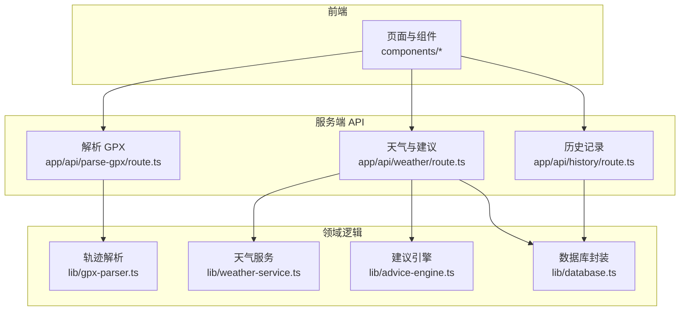
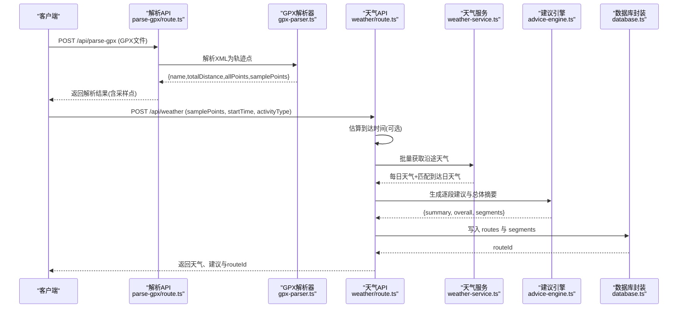
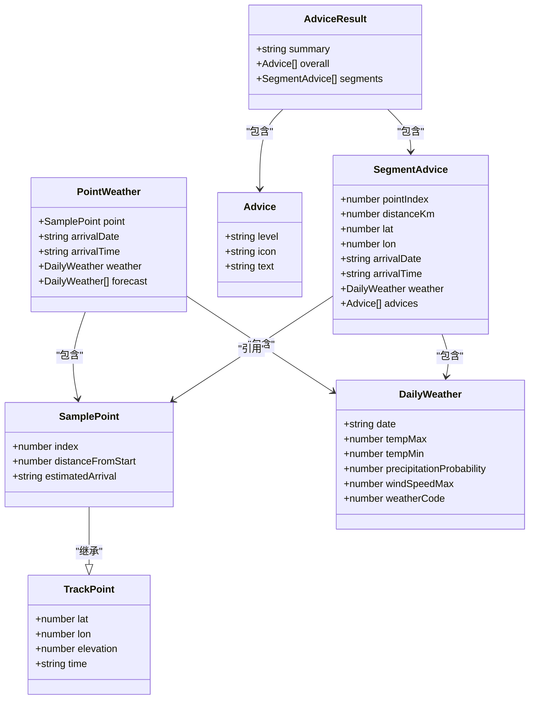
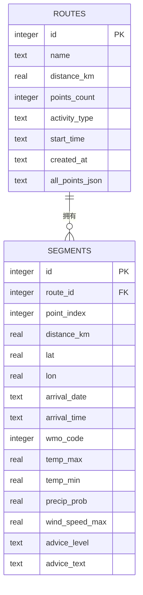
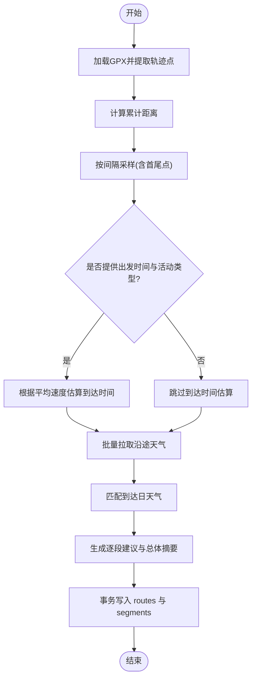
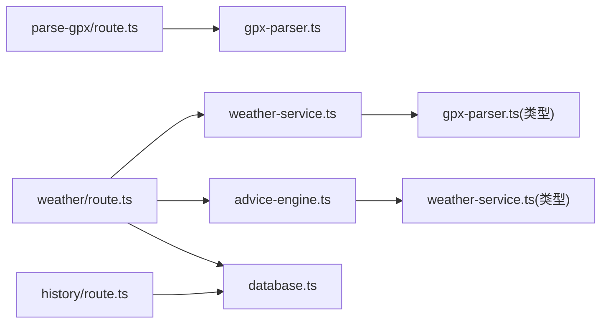

# 数据模型设计

<cite>
**本文引用的文件**
- [lib/database.ts](file://lib/database.ts)
- [lib/gpx-parser.ts](file://lib/gpx-parser.ts)
- [lib/weather-service.ts](file://lib/weather-service.ts)
- [lib/advice-engine.ts](file://lib/advice-engine.ts)
- [app/api/parse-gpx/route.ts](file://app/api/parse-gpx/route.ts)
- [app/api/weather/route.ts](file://app/api/weather/route.ts)
- [app/api/history/route.ts](file://app/api/history/route.ts)
- [components/TripSettings.tsx](file://components/TripSettings.tsx)
</cite>

## 目录
1. [引言](#引言)
2. [项目结构](#项目结构)
3. [核心组件](#核心组件)
4. [架构总览](#架构总览)
5. [详细组件分析](#详细组件分析)
6. [依赖关系分析](#依赖关系分析)
7. [性能考虑](#性能考虑)
8. [故障排查指南](#故障排查指南)
9. [结论](#结论)
10. [附录](#附录)

## 引言
本文件聚焦 FineG 项目的数据模型设计，围绕以下目标展开：
- 明确核心数据结构定义：TrackPoint、SamplePoint、DailyWeather、SegmentAdvice 等
- 说明数据库表结构设计：routes 与 segments 表的字段、主外键关系与索引策略
- 梳理数据验证规则、业务约束与数据完整性保证机制
- 总结数据访问模式与缓存策略的最佳实践

## 项目结构
本项目采用 Next.js API Routes + 本地 SQLite（better-sqlite3）的轻量架构。数据相关代码集中在 lib 目录，API 路由位于 app/api，UI 组件在 components。

图表来源
- [app/api/parse-gpx/route.ts:1-48](file://app/api/parse-gpx/route.ts#L1-L48)
- [app/api/weather/route.ts:1-93](file://app/api/weather/route.ts#L1-L93)
- [app/api/history/route.ts:1-33](file://app/api/history/route.ts#L1-L33)
- [lib/gpx-parser.ts:1-231](file://lib/gpx-parser.ts#L1-L231)
- [lib/weather-service.ts:1-176](file://lib/weather-service.ts#L1-L176)
- [lib/advice-engine.ts:1-201](file://lib/advice-engine.ts#L1-L201)
- [lib/database.ts:1-204](file://lib/database.ts#L1-L204)

章节来源
- [app/api/parse-gpx/route.ts:1-48](file://app/api/parse-gpx/route.ts#L1-L48)
- [app/api/weather/route.ts:1-93](file://app/api/weather/route.ts#L1-L93)
- [app/api/history/route.ts:1-33](file://app/api/history/route.ts#L1-L33)
- [lib/gpx-parser.ts:1-231](file://lib/gpx-parser.ts#L1-L231)
- [lib/weather-service.ts:1-176](file://lib/weather-service.ts#L1-L176)
- [lib/advice-engine.ts:1-201](file://lib/advice-engine.ts#L1-L201)
- [lib/database.ts:1-204](file://lib/database.ts#L1-L204)

## 核心组件
本节概述关键数据模型及其职责：
- TrackPoint：原始轨迹点，包含经纬度、可选海拔和时间
- SamplePoint：采样点，继承自 TrackPoint，增加序号、累计距离和预计到达时间
- DailyWeather：按日聚合的天气数据，包含温度、降水概率、风速、WMO 天气码
- SegmentAdvice：分段建议，关联采样点、到达时间与当日天气，并汇总多条建议

章节来源
- [lib/gpx-parser.ts:4-15](file://lib/gpx-parser.ts#L4-L15)
- [lib/weather-service.ts:3-18](file://lib/weather-service.ts#L3-L18)
- [lib/advice-engine.ts:7-28](file://lib/advice-engine.ts#L7-L28)

## 架构总览
下图展示了从上传 GPX 到生成建议并落库的数据流。

图表来源
- [app/api/parse-gpx/route.ts:1-48](file://app/api/parse-gpx/route.ts#L1-L48)
- [lib/gpx-parser.ts:139-231](file://lib/gpx-parser.ts#L139-L231)
- [app/api/weather/route.ts:1-93](file://app/api/weather/route.ts#L1-L93)
- [lib/weather-service.ts:71-176](file://lib/weather-service.ts#L71-L176)
- [lib/advice-engine.ts:118-201](file://lib/advice-engine.ts#L118-L201)
- [lib/database.ts:90-162](file://lib/database.ts#L90-L162)

## 详细组件分析

### 数据模型与类型定义
- TrackPoint
  - 字段：lat、lon、elevation（可选）、time（可选）
  - 用途：表示 GPS 轨迹中的原始点
- SamplePoint
  - 继承 TrackPoint，新增 index、distanceFromStart、estimatedArrival（ISO 时间字符串）
  - 用途：用于降采样后的代表性点，便于天气查询与建议计算
- DailyWeather
  - 字段：date、tempMax、tempMin、precipitationProbability、windSpeedMax、weatherCode
  - 用途：Open-Meteo 每日预报数据的结构化映射
- PointWeather
  - 字段：point、arrivalDate、arrivalTime、weather、forecast
  - 用途：将采样点与其到达日期及对应天气进行绑定
- Advice
  - 字段：level（info/warning/danger）、icon、text
  - 用途：单条出行建议
- SegmentAdvice
  - 字段：pointIndex、distanceKm、lat、lon、arrivalDate、arrivalTime、weather、advices
  - 用途：每个采样点对应的建议集合与上下文信息
- AdviceResult
  - 字段：summary、overall、segments
  - 用途：整体摘要、去重合并后的总体建议、逐段建议列表

章节来源
- [lib/gpx-parser.ts:4-15](file://lib/gpx-parser.ts#L4-L15)
- [lib/weather-service.ts:3-22](file://lib/weather-service.ts#L3-L22)
- [lib/advice-engine.ts:7-28](file://lib/advice-engine.ts#L7-L28)

#### 类图（数据模型）

图表来源
- [lib/gpx-parser.ts:4-15](file://lib/gpx-parser.ts#L4-L15)
- [lib/weather-service.ts:3-22](file://lib/weather-service.ts#L3-L22)
- [lib/advice-engine.ts:7-28](file://lib/advice-engine.ts#L7-L28)

### 数据库表结构设计
- routes 表
  - 字段：id（自增主键）、name、distance_km、points_count、activity_type、start_time、created_at、all_points_json
  - 说明：存储路线元信息与全部轨迹点的 JSON 快照
- segments 表
  - 字段：id（自增主键）、route_id（外键）、point_index、distance_km、lat、lon、arrival_date、arrival_time、wmo_code、temp_max、temp_min、precip_prob、wind_speed_max、advice_level、advice_text
  - 说明：存储每个采样点的天气与建议结果，支持按 point_index 排序展示

主外键与级联
- segments.route_id 引用 routes.id，设置 ON DELETE CASCADE，删除路线时自动清理其分段记录

索引策略
- 当前未显式创建额外索引；建议根据查询热点添加：
  - segments(route_id) 以优化按路线查询分段
  - segments(point_index) 或复合索引 (route_id, point_index) 以加速顺序读取
  - routes(created_at) 以优化历史列表排序

事务与一致性
- 插入路线与分段使用事务包裹，确保原子性
- 删除路线与分段也使用事务，避免中间状态

章节来源
- [lib/database.ts:23-55](file://lib/database.ts#L23-L55)
- [lib/database.ts:90-162](file://lib/database.ts#L90-L162)
- [lib/database.ts:190-204](file://lib/database.ts#L190-L204)

#### ER 图（数据库）

图表来源
- [lib/database.ts:23-55](file://lib/database.ts#L23-L55)

### 数据验证规则与业务约束
- 输入校验
  - 解析 GPX：要求上传 .gpx 文件，否则返回错误
  - 天气请求：必须提供 samplePoints，否则拒绝
- 业务约束
  - 采样点数量限制：最大样本数受距离与间隔控制，上限有硬限制
  - 全量轨迹渲染限制：allPoints 在前端渲染前被抽样至固定上限，避免性能问题
  - 活动类型与速度：通过预设活动类型平均速度估算到达时间
- 数据完整性
  - 外键约束：segments.route_id 必须存在且随父记录级联删除
  - 非空约束：routes.name、distance_km、points_count、created_at、all_points_json 为非空
  - 数值范围：经纬度、距离、温度、风速、降水概率等由上游服务与算法保证合理范围

章节来源
- [app/api/parse-gpx/route.ts:1-48](file://app/api/parse-gpx/route.ts#L1-L48)
- [app/api/weather/route.ts:1-93](file://app/api/weather/route.ts#L1-L93)
- [lib/gpx-parser.ts:44-94](file://lib/gpx-parser.ts#L44-L94)
- [lib/gpx-parser.ts:139-231](file://lib/gpx-parser.ts#L139-L231)
- [lib/database.ts:23-55](file://lib/database.ts#L23-L55)

### 数据处理流程与算法要点
- 轨迹采样
  - 基于 Haversine 距离累加，按固定间隔采样，首尾点必保留，样本上限受距离与间隔控制
- 到达时间估算
  - 依据活动类型的平均速度，将距离转换为小时，叠加起始时间得到 ISO 到达时间
- 天气匹配
  - 根据到达日期选择对应日期的天气预报，若无则回退到首日
- 建议生成
  - 对降水、雷电、高温、低温、大风、降雪等维度生成分级建议，并按图标类别去重合并最严重值

图表来源
- [lib/gpx-parser.ts:139-231](file://lib/gpx-parser.ts#L139-L231)
- [lib/weather-service.ts:71-176](file://lib/weather-service.ts#L71-L176)
- [lib/advice-engine.ts:118-201](file://lib/advice-engine.ts#L118-L201)
- [lib/database.ts:90-162](file://lib/database.ts#L90-L162)

### 数据访问模式
- 写入
  - insertRoute：先插入 routes，再在事务中批量插入 segments，返回 routeId
- 读取
  - getAllRoutes：仅返回路线元信息（不含 all_points_json），按创建时间倒序
  - getRouteById：按 id 获取路线与所有分段（按 point_index 升序）
- 删除
  - deleteRoute：在事务中先删 segments，再删 routes，返回影响行数

章节来源
- [lib/database.ts:90-162](file://lib/database.ts#L90-L162)
- [lib/database.ts:164-188](file://lib/database.ts#L164-L188)
- [lib/database.ts:190-204](file://lib/database.ts#L190-L204)

### 缓存策略与最佳实践
- 天气数据缓存
  - 按“采样点坐标 + 到达日期”作为缓存键，缓存 Open-Meteo 响应
  - 缓存有效期建议 10~30 分钟，避免频繁调用外部 API
  - 可结合内存缓存（进程内 Map）与持久化缓存（如 Redis）分层实现
- 建议结果缓存
  - 对相同 weatherData 生成的 AdviceResult 可短期缓存，减少重复计算
- 全量轨迹缓存
  - 对 large GPX 的 allPoints 可在服务端做一次性抽样并缓存，避免重复解析
- 并发与批处理
  - 天气请求已按批次并行，建议配合连接池与超时重试策略

[本节为通用指导，不直接分析具体文件]

## 依赖关系分析
- 模块耦合
  - API 层依赖领域逻辑（解析、天气、建议、数据库）
  - 领域逻辑之间单向依赖：weather-service 依赖 gpx-parser 的类型；advice-engine 依赖 weather-service 的类型；database.ts 独立
- 外部依赖
  - better-sqlite3：本地数据库
  - @tmcw/togeojson、@xmldom/xmldom：GPX 解析
  - Open-Meteo：天气数据源

图表来源
- [app/api/parse-gpx/route.ts:1-48](file://app/api/parse-gpx/route.ts#L1-L48)
- [app/api/weather/route.ts:1-93](file://app/api/weather/route.ts#L1-L93)
- [app/api/history/route.ts:1-33](file://app/api/history/route.ts#L1-L33)
- [lib/gpx-parser.ts:1-231](file://lib/gpx-parser.ts#L1-L231)
- [lib/weather-service.ts:1-176](file://lib/weather-service.ts#L1-L176)
- [lib/advice-engine.ts:1-201](file://lib/advice-engine.ts#L1-L201)
- [lib/database.ts:1-204](file://lib/database.ts#L1-L204)

章节来源
- [app/api/parse-gpx/route.ts:1-48](file://app/api/parse-gpx/route.ts#L1-L48)
- [app/api/weather/route.ts:1-93](file://app/api/weather/route.ts#L1-L93)
- [app/api/history/route.ts:1-33](file://app/api/history/route.ts#L1-L33)
- [lib/gpx-parser.ts:1-231](file://lib/gpx-parser.ts#L1-L231)
- [lib/weather-service.ts:1-176](file://lib/weather-service.ts#L1-L176)
- [lib/advice-engine.ts:1-201](file://lib/advice-engine.ts#L1-L201)
- [lib/database.ts:1-204](file://lib/database.ts#L1-L204)

## 性能考虑
- 采样与渲染
  - 全量轨迹点在前端渲染前进行抽样，降低 DOM 压力
- 天气请求批处理
  - 按批次并行请求，减少总耗时
- 数据库事务
  - 批量写入使用事务，减少磁盘同步次数
- 索引优化
  - 针对高频查询路径（按路线查分段、按时间排序）建立合适索引

[本节为通用指导，不直接分析具体文件]

## 故障排查指南
- 常见错误与定位
  - 未上传文件或格式不正确：检查 parse-gpx 接口入参与文件名后缀
  - 未提供采样点数据：检查 weather 接口入参 samplePoints
  - 天气 API 失败：检查网络连通性与 Open-Meteo 返回状态码
  - 数据库写入失败：查看日志输出，确认 data 目录权限与 WAL 模式
- 建议
  - 在 API 层统一捕获异常并返回结构化错误消息
  - 对第三方 API 增加重试与降级策略
  - 对数据库操作增加慢查询日志与监控

章节来源
- [app/api/parse-gpx/route.ts:1-48](file://app/api/parse-gpx/route.ts#L1-L48)
- [app/api/weather/route.ts:1-93](file://app/api/weather/route.ts#L1-L93)
- [lib/weather-service.ts:139-145](file://lib/weather-service.ts#L139-L145)
- [lib/database.ts:1-21](file://lib/database.ts#L1-L21)

## 结论
FineG 的数据模型围绕“轨迹—采样点—天气—建议”的主线构建，采用轻量 SQLite 存储与清晰的类型定义，保证了可扩展性与易维护性。建议在后续迭代中完善索引策略、引入多级缓存与更严格的输入校验，以提升稳定性与性能。

[本节为总结性内容，不直接分析具体文件]

## 附录

### 字段与约束速览
- routes
  - 主键：id
  - 必填：name、distance_km、points_count、created_at、all_points_json
  - 可选：activity_type、start_time
- segments
  - 主键：id
  - 必填：route_id、point_index、distance_km、lat、lon
  - 可选：arrival_date、arrival_time、wmo_code、temp_max、temp_min、precip_prob、wind_speed_max、advice_level、advice_text
  - 外键：route_id → routes.id（ON DELETE CASCADE）

章节来源
- [lib/database.ts:23-55](file://lib/database.ts#L23-L55)

### 用户交互与数据模型映射
- TripSettings 组件负责收集出发时间与活动类型，驱动到达时间估算与后续天气查询
- ACTIVITY_TYPES 常量定义了不同活动的平均速度，用于估算用时与到达时间

章节来源
- [components/TripSettings.tsx:1-175](file://components/TripSettings.tsx#L1-L175)
- [lib/gpx-parser.ts:24-31](file://lib/gpx-parser.ts#L24-L31)