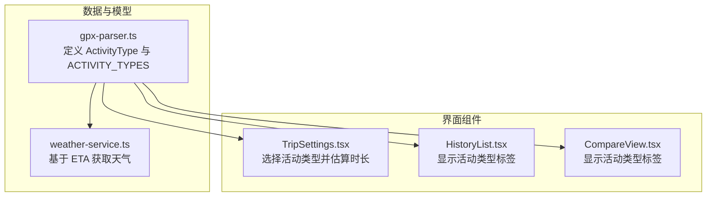
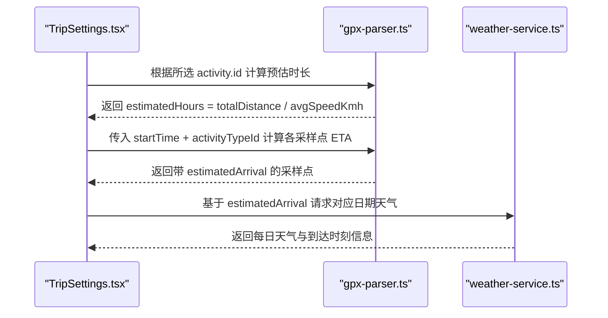
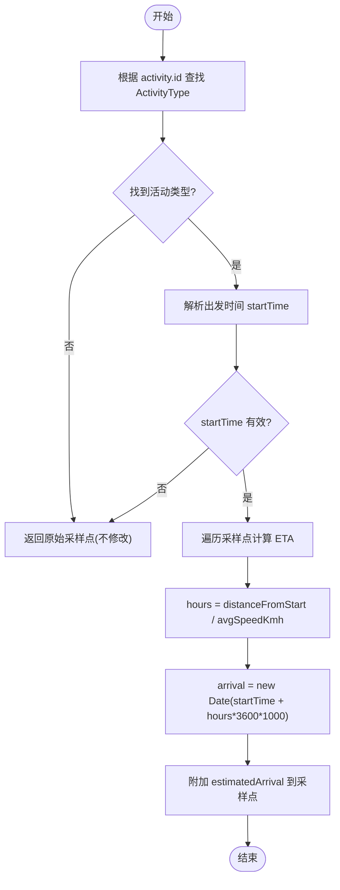
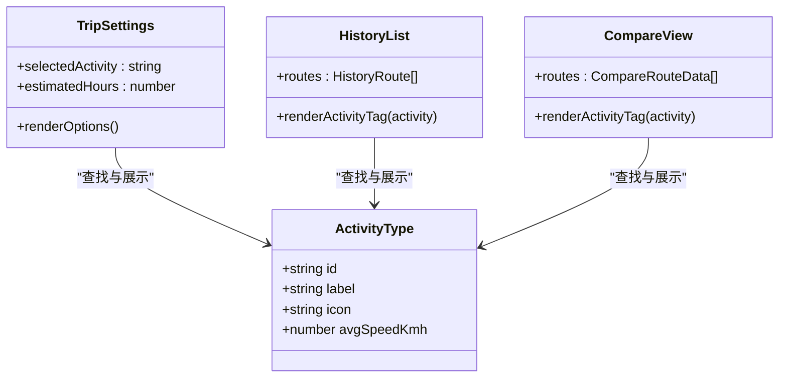
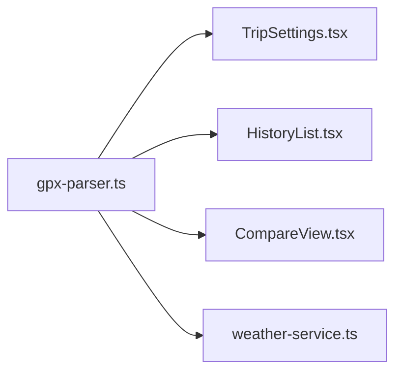

# ActivityType 活动类型模型

<cite>
**本文引用的文件**
- [gpx-parser.ts](file://src/lib/gpx-parser.ts)
- [TripSettings.tsx](file://src/components/TripSettings.tsx)
- [CompareView.tsx](file://src/components/CompareView.tsx)
- [HistoryList.tsx](file://src/components/HistoryList.tsx)
- [weather-service.ts](file://src/lib/weather-service.ts)
</cite>

## 目录
1. [简介](#简介)
2. [项目结构](#项目结构)
3. [核心组件](#核心组件)
4. [架构总览](#架构总览)
5. [详细组件分析](#详细组件分析)
6. [依赖分析](#依赖分析)
7. [性能考虑](#性能考虑)
8. [故障排查指南](#故障排查指南)
9. [结论](#结论)
10. [附录](#附录)

## 简介
本文件围绕 ActivityType 活动类型模型进行系统化文档化，涵盖接口定义、内置配置项、参数设置依据与适用场景、扩展新活动类型的步骤、在预计到达时间（ETA）计算中的应用以及与用户界面的交互方式。目标是帮助开发者快速理解并安全地扩展该模型，同时提供最佳实践与配置建议。

## 项目结构
ActivityType 的定义与使用集中在以下位置：
- 模型与常量定义：src/lib/gpx-parser.ts
- 行程设置界面：src/components/TripSettings.tsx
- 历史列表展示：src/components/HistoryList.tsx
- 对比视图展示：src/components/CompareView.tsx
- ETA 到天气查询的衔接：src/lib/weather-service.ts

图表来源
- [gpx-parser.ts:17-31](file://src/lib/gpx-parser.ts#L17-L31)
- [TripSettings.tsx:1-175](file://src/components/TripSettings.tsx#L1-L175)
- [HistoryList.tsx:1-218](file://src/components/HistoryList.tsx#L1-L218)
- [CompareView.tsx:1-273](file://src/components/CompareView.tsx#L1-L273)
- [weather-service.ts:1-176](file://src/lib/weather-service.ts#L1-L176)

章节来源
- [gpx-parser.ts:17-31](file://src/lib/gpx-parser.ts#L17-L31)
- [TripSettings.tsx:1-175](file://src/components/TripSettings.tsx#L1-L175)
- [HistoryList.tsx:1-218](file://src/components/HistoryList.tsx#L1-L218)
- [CompareView.tsx:1-273](file://src/components/CompareView.tsx#L1-L273)
- [weather-service.ts:1-176](file://src/lib/weather-service.ts#L1-L176)

## 核心组件
- ActivityType 接口
  - id: string — 唯一标识符，用于在系统中匹配与检索活动类型
  - label: string — 显示标签，面向用户的中文名称
  - icon: string — 图标标识，用于界面展示
  - avgSpeedKmh: number — 平均速度（km/h），用于估算用时与 ETA

- ACTIVITY_TYPES 配置数组
  - 步行/徒步: id=walking, label=步行/徒步, icon=🚶, avgSpeedKmh=5
  - 登山/越野: id=hiking, label=登山/越野, icon=🥾, avgSpeedKmh=3.5
  - 骑行/公路: id=cycling, label=骑行/公路, icon=🚴, avgSpeedKmh=20
  - 骑行/山地: id=mtb, label=骑行/山地, icon=🚵, avgSpeedKmh=12
  - 跑步: id=running, label=跑步, icon=🏃, avgSpeedKmh=10
  - 驾车: id=driving, label=驾车, icon=🚗, avgSpeedKmh=60

这些值作为默认配置，供前端界面渲染与 ETA 估算使用。

章节来源
- [gpx-parser.ts:17-31](file://src/lib/gpx-parser.ts#L17-L31)

## 架构总览
ActivityType 贯穿“解析轨迹 → 估算用时 → 查询天气 → 界面展示”的全链路：

图表来源
- [TripSettings.tsx:41-53](file://src/components/TripSettings.tsx#L41-L53)
- [gpx-parser.ts:98-110](file://src/lib/gpx-parser.ts#L98-L110)
- [weather-service.ts:95-100](file://src/lib/weather-service.ts#L95-L100)

## 详细组件分析

### ActivityType 接口与配置详解
- 字段说明
  - id: 系统内唯一键，用于查找与持久化存储
  - label: 面向用户的可读名称，便于界面展示与筛选
  - icon: 用于在卡片、按钮等 UI 元素中直观表达活动类型
  - avgSpeedKmh: 以 km/h 为单位的平均速度，用于将距离转换为时间

- 内置活动类型与适用场景
  - 步行/徒步: 适合城市漫步、平坦步道；avgSpeedKmh=5 符合一般成人步行速度
  - 登山/越野: 地形复杂、爬升较多；avgSpeedKmh=3.5 体现更慢的平均速度
  - 骑行/公路: 铺装路面、较少障碍；avgSpeedKmh=20 反映普通骑行者水平
  - 骑行/山地: 非铺装、起伏大；avgSpeedKmh=12 体现山地骑行的减速因素
  - 跑步: 中等强度有氧运动；avgSpeedKmh=10 接近大众跑者配速
  - 驾车: 道路行驶；avgSpeedKmh=60 代表综合路况下的平均速度

- 参数设置依据
  - avgSpeedKmh 采用经验均值，兼顾不同地形与常见参与者能力
  - 对于需要更高精度的场景，可在上层逻辑按海拔、坡度或实时条件动态修正

章节来源
- [gpx-parser.ts:17-31](file://src/lib/gpx-parser.ts#L17-L31)

### 在预计到达时间（ETA）计算中的应用
- 基本公式
  - 单点耗时（小时）= 该点距起点距离（km）/ avgSpeedKmh
  - 到达时间 = 出发时间 + 耗时
- 实现要点
  - 通过 activity.id 从 ACTIVITY_TYPES 查找对应 avgSpeedKmh
  - 对每个采样点计算 estimatedArrival（ISO 字符串）
  - 当 activity 不存在或起始时间为非法时，保持原采样点不变

图表来源
- [gpx-parser.ts:98-110](file://src/lib/gpx-parser.ts#L98-L110)

章节来源
- [gpx-parser.ts:98-110](file://src/lib/gpx-parser.ts#L98-L110)

### 与用户界面的交互关系
- TripSettings.tsx
  - 展示所有活动类型选项，包含图标、标签与平均速度提示
  - 根据所选活动类型与轨迹总距离估算全程用时
  - 将 startTime 与 selectedActivity 传递给后续流程以生成 ETA

- HistoryList.tsx 与 CompareView.tsx
  - 从数据库读取 route.activity_type
  - 通过 ACTIVITY_TYPES.find 匹配并显示对应的 icon 与 label
  - 保证历史与对比页面的一致性与可识别性

图表来源
- [gpx-parser.ts:17-31](file://src/lib/gpx-parser.ts#L17-L31)
- [TripSettings.tsx:115-136](file://src/components/TripSettings.tsx#L115-L136)
- [HistoryList.tsx:77-79](file://src/components/HistoryList.tsx#L77-L79)
- [CompareView.tsx:60-62](file://src/components/CompareView.tsx#L60-L62)

章节来源
- [TripSettings.tsx:115-136](file://src/components/TripSettings.tsx#L115-L136)
- [HistoryList.tsx:77-79](file://src/components/HistoryList.tsx#L77-L79)
- [CompareView.tsx:60-62](file://src/components/CompareView.tsx#L60-L62)

### 扩展新活动类型的指导
- 添加自定义活动类型
  - 在 ACTIVITY_TYPES 中添加一条记录，确保 id 全局唯一
  - 合理设置 label 与 icon，提升界面可读性与辨识度
  - 设定 avgSpeedKmh，参考同类活动的经验均值与地形特征

- 速度估算规则建议
  - 基础规则：avgSpeedKmh 作为常数，适用于快速估算
  - 进阶规则：结合海拔变化、坡度、路面类型、交通状况等进行加权修正
  - 分层策略：保留 ACTIVITY_TYPES 作为默认基准，在上层服务注入动态修正系数

- 与现有流程的兼容
  - 新增类型后，无需改动界面渲染逻辑，因为组件通过 find(id) 动态匹配
  - ETA 计算自动生效，只要 activity.id 存在于 ACTIVITY_TYPES

章节来源
- [gpx-parser.ts:24-31](file://src/lib/gpx-parser.ts#L24-L31)
- [TripSettings.tsx:41-53](file://src/components/TripSettings.tsx#L41-L53)
- [gpx-parser.ts:98-110](file://src/lib/gpx-parser.ts#L98-L110)

## 依赖分析
- 模块耦合
  - gpx-parser.ts 暴露 ActivityType 与 ACTIVITY_TYPES，被多个组件与服务引用
  - TripSettings.tsx 依赖 ACTIVITY_TYPES 进行选项渲染与时长估算
  - HistoryList.tsx 与 CompareView.tsx 依赖 ACTIVITY_TYPES 进行标签展示
  - weather-service.ts 依赖 SamplePoint.estimatedArrival 以定位天气查询日期

图表来源
- [gpx-parser.ts:17-31](file://src/lib/gpx-parser.ts#L17-L31)
- [TripSettings.tsx:1-175](file://src/components/TripSettings.tsx#L1-L175)
- [HistoryList.tsx:1-218](file://src/components/HistoryList.tsx#L1-L218)
- [CompareView.tsx:1-273](file://src/components/CompareView.tsx#L1-L273)
- [weather-service.ts:1-176](file://src/lib/weather-service.ts#L1-L176)

章节来源
- [gpx-parser.ts:17-31](file://src/lib/gpx-parser.ts#L17-L31)
- [TripSettings.tsx:1-175](file://src/components/TripSettings.tsx#L1-L175)
- [HistoryList.tsx:1-218](file://src/components/HistoryList.tsx#L1-L218)
- [CompareView.tsx:1-273](file://src/components/CompareView.tsx#L1-L273)
- [weather-service.ts:1-176](file://src/lib/weather-service.ts#L1-L176)

## 性能考虑
- 查找复杂度
  - ACTIVITY_TYPES 规模较小，find(id) 的时间复杂度为 O(n)，n 为活动类型数量，当前 n=6，开销可忽略
- 估算计算
  - ETA 计算为线性遍历采样点，时间复杂度 O(m)，m 为采样点数量，通常 m≤50，性能良好
- 界面渲染
  - 活动类型选项渲染为固定网格，无额外计算，渲染成本稳定

[本节为通用性能讨论，不涉及具体代码片段]

## 故障排查指南
- 找不到活动类型
  - 现象：界面未显示活动标签或 ETA 未更新
  - 排查：确认 route.activity_type 是否存在于 ACTIVITY_TYPES 的 id 集合中
  - 相关位置：
    - [gpx-parser.ts:98-100](file://src/lib/gpx-parser.ts#L98-L100)
    - [HistoryList.tsx:77-79](file://src/components/HistoryList.tsx#L77-L79)
    - [CompareView.tsx:60-62](file://src/components/CompareView.tsx#L60-L62)

- 出发时间无效
  - 现象：ETA 未计算或 estimatedArrival 为空
  - 排查：检查 startTime 是否为合法 ISO 字符串
  - 相关位置：
    - [gpx-parser.ts:102-103](file://src/lib/gpx-parser.ts#L102-L103)

- 天气 API 失败
  - 现象：无法获取到达日期的天气
  - 排查：检查网络状态与 Open-Meteo API 响应码
  - 相关位置：
    - [weather-service.ts:141-145](file://src/lib/weather-service.ts#L141-L145)

章节来源
- [gpx-parser.ts:98-103](file://src/lib/gpx-parser.ts#L98-L103)
- [weather-service.ts:141-145](file://src/lib/weather-service.ts#L141-L145)
- [HistoryList.tsx:77-79](file://src/components/HistoryList.tsx#L77-L79)
- [CompareView.tsx:60-62](file://src/components/CompareView.tsx#L60-L62)

## 结论
ActivityType 模型以简洁的数据结构承载了活动类型的关键元数据，并通过 ACTIVITY_TYPES 提供开箱即用的默认配置。其 avgSpeedKmh 字段直接驱动 ETA 计算，并与界面展示紧密集成。扩展新活动类型只需在配置数组中追加条目，即可无缝融入现有流程。建议在需要更高精度时引入动态修正机制，并在边界条件下做好健壮性处理。

[本节为总结性内容，不涉及具体代码片段]

## 附录
- 最佳实践与配置建议
  - 保持 id 的唯一性与语义清晰，避免未来冲突
  - label 应贴近用户语言习惯，icon 需具备高辨识度
  - avgSpeedKmh 初始值以经验均值为准，后续可按地形与实时条件调整
  - 在持久化层统一使用 id 而非 label，避免本地化变更导致的不一致
  - 对 ETA 计算增加输入校验与异常回退，确保界面稳定性

[本节为通用建议，不涉及具体代码片段]