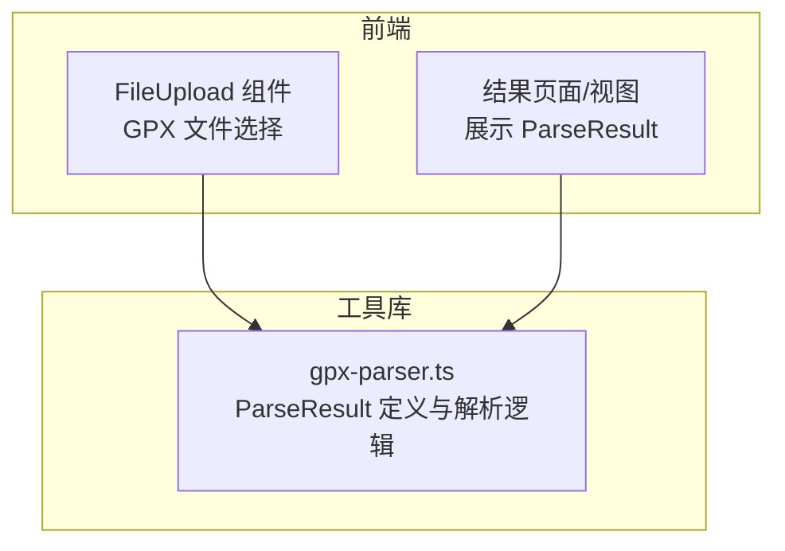
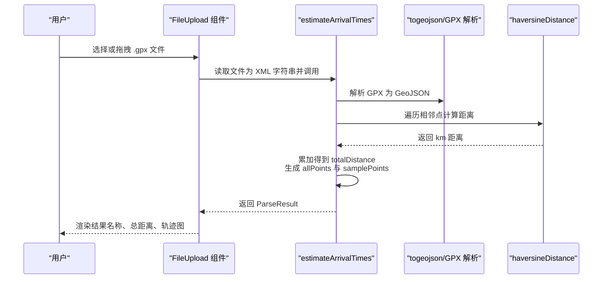
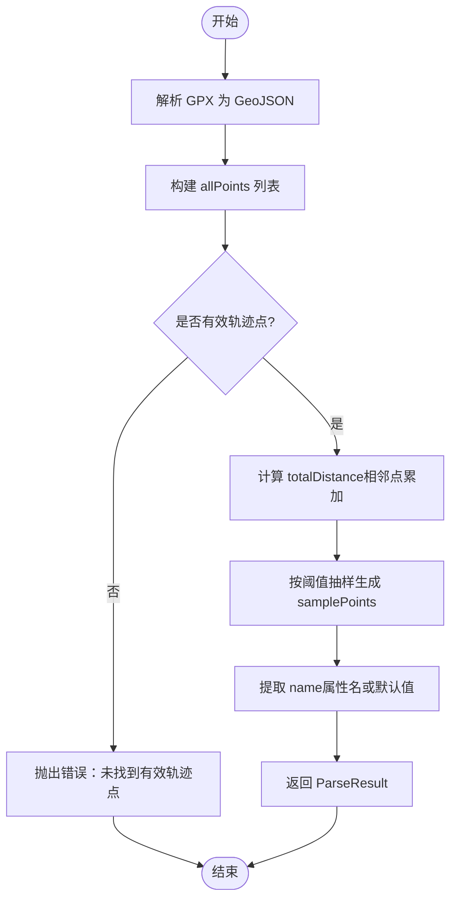
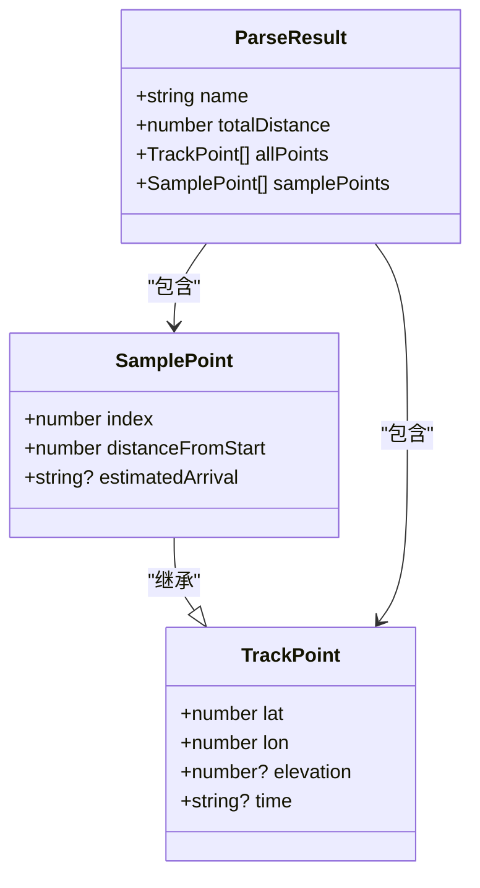
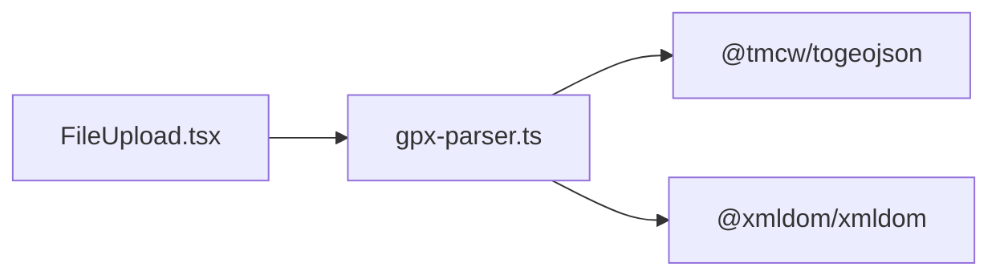

# ParseResult 解析结果模型

<cite>
**本文引用的文件**   
- [gpx-parser.ts](file://src/lib/gpx-parser.ts)
- [FileUpload.tsx](file://src/components/FileUpload.tsx)
</cite>

## 目录
1. [简介](#简介)
2. [项目结构](#项目结构)
3. [核心组件](#核心组件)
4. [架构总览](#架构总览)
5. [详细组件分析](#详细组件分析)
6. [依赖关系分析](#依赖关系分析)
7. [性能考虑](#性能考虑)
8. [故障排查指南](#故障排查指南)
9. [结论](#结论)
10. [附录](#附录)

## 简介
本文件围绕 ParseResult 解析结果模型进行系统化说明，重点覆盖以下方面：
- ParseResult 接口的字段定义与用途：name、totalDistance、allPoints、samplePoints
- totalDistance 的计算方法与精度控制策略
- allPoints 与 samplePoints 的区别、数据量差异及适用场景
- 通过 estimateArrivalTimes 函数获取完整解析结果的流程
- 解析结果在前端展示与后端存储中的传递与使用模式
- 错误处理与异常情况的处理策略

## 项目结构
本项目采用“功能域 + 工具库”的组织方式。与 ParseResult 相关的核心实现集中在 src/lib/gpx-parser.ts；前端上传交互在 src/components/FileUpload.tsx 中提供 GPX 文件选择能力。

图表来源
- [gpx-parser.ts:112-117](file://src/lib/gpx-parser.ts#L112-L117)
- [FileUpload.tsx:1-97](file://src/components/FileUpload.tsx#L1-L97)

章节来源
- [gpx-parser.ts:112-117](file://src/lib/gpx-parser.ts#L112-L117)
- [FileUpload.tsx:1-97](file://src/components/FileUpload.tsx#L1-L97)

## 核心组件
- ParseResult 接口：统一描述一次 GPX 轨迹的解析结果，包含名称、总距离、全量点集与采样点集。
- TrackPoint 与 SamplePoint：基础轨迹点与带索引、累计距离、预计到达时间的增强点类型。
- estimateArrivalTimes：从 XML 字符串解析 GPX，计算总距离并生成 ParseResult。
- haversineDistance：基于球面三角公式计算两点间距离（km）。
- resamplePoints：通用重采样函数，用于按固定间隔生成采样点（供其他模块复用）。

章节来源
- [gpx-parser.ts:4-15](file://src/lib/gpx-parser.ts#L4-L15)
- [gpx-parser.ts:112-117](file://src/lib/gpx-parser.ts#L112-L117)
- [gpx-parser.ts:119-137](file://src/lib/gpx-parser.ts#L119-L137)
- [gpx-parser.ts:139-230](file://src/lib/gpx-parser.ts#L139-L230)
- [gpx-parser.ts:44-94](file://src/lib/gpx-parser.ts#L44-L94)

## 架构总览
下图展示了从用户选择 GPX 文件到得到 ParseResult 的关键调用链与数据流向。

图表来源
- [FileUpload.tsx:1-97](file://src/components/FileUpload.tsx#L1-L97)
- [gpx-parser.ts:139-230](file://src/lib/gpx-parser.ts#L139-L230)
- [gpx-parser.ts:119-137](file://src/lib/gpx-parser.ts#L119-L137)

## 详细组件分析

### ParseResult 接口与字段语义
- name：轨迹名称，来源于 GPX 元数据（如第一个要素的名称），若缺失则回退为默认值。
- totalDistance：总距离，单位千米（km），由相邻点距离累加后四舍五入至小数点后一位。
- allPoints：完整轨迹点数组，包含所有原始坐标点（经纬度、可选海拔、时间等）。
- samplePoints：采样点数组，按固定间隔选取的代表性点，便于快速概览与可视化。

字段来源与用途
- name：来自 GPX 解析后的 GeoJSON 首个要素的属性名，若无则使用默认文案。
- totalDistance：对 allPoints 相邻点对依次计算 haversineDistance 并求和，最终保留一位小数。
- allPoints：从 GPX 的 LineString 坐标序列中提取，顺序保持原文件顺序。
- samplePoints：在计算总距离的同时，按累计距离阈值挑选代表性点，确保首尾必选且数量受上限约束。

章节来源
- [gpx-parser.ts:112-117](file://src/lib/gpx-parser.ts#L112-L117)
- [gpx-parser.ts:139-230](file://src/lib/gpx-parser.ts#L139-L230)

### totalDistance 计算方法与精度控制
- 计算方法：对 allPoints 中每对相邻点应用 haversineDistance 累加，得到总距离（km）。
- 精度控制：最终 totalDistance 与采样点的 distanceFromStart 均通过“乘以 10 再除以 10”的方式保留一位小数，避免浮点误差累积带来的显示抖动。

章节来源
- [gpx-parser.ts:119-137](file://src/lib/gpx-parser.ts#L119-L137)
- [gpx-parser.ts:161-170](file://src/lib/gpx-parser.ts#L161-L170)
- [gpx-parser.ts:224-229](file://src/lib/gpx-parser.ts#L224-L229)

### allPoints 与 samplePoints 的区别与使用场景
- 数据量差异
  - allPoints：包含全部原始轨迹点，适合高精度绘制、详细分析与统计。
  - samplePoints：按固定间隔抽取的代表点，数量受上限限制，适合概览、缩略图与快速交互。
- 性能考虑
  - 大量点直接渲染会显著增加 DOM/Canvas 压力，建议在大屏或长轨迹中使用 samplePoints 做主视图，allPoints 按需加载或下钻查看。
  - 采样算法保证首尾点必选，并在达到最大样本数时停止追加，避免无界增长。
- 典型用法
  - 概览地图：优先使用 samplePoints 绘制折线与标记。
  - 详情面板：展示 totalDistance、name，以及关键里程碑（samplePoints 的 distanceFromStart）。
  - 深度分析：切换至 allPoints 进行高程、速度、停留点等精细计算。

章节来源
- [gpx-parser.ts:139-230](file://src/lib/gpx-parser.ts#L139-L230)
- [gpx-parser.ts:44-94](file://src/lib/gpx-parser.ts#L44-L94)

### 通过 estimateArrivalTimes 获取 ParseResult 的流程
- 输入：XML 字符串（GPX 内容）
- 步骤
  1) 解析 GPX 为 GeoJSON，提取 LineString 坐标序列构建 allPoints
  2) 校验 allPoints 是否为空，为空则抛出错误
  3) 计算 totalDistance：相邻点距离累加
  4) 生成 samplePoints：按累计距离阈值抽样，确保首尾点存在且不超过上限
  5) 提取 name：优先取 GeoJSON 属性名，否则回退默认值
  6) 返回 ParseResult
- 输出：ParseResult 对象

图表来源
- [gpx-parser.ts:139-230](file://src/lib/gpx-parser.ts#L139-L230)

章节来源
- [gpx-parser.ts:139-230](file://src/lib/gpx-parser.ts#L139-L230)

### 相关数据结构与关系

图表来源
- [gpx-parser.ts:4-15](file://src/lib/gpx-parser.ts#L4-L15)
- [gpx-parser.ts:112-117](file://src/lib/gpx-parser.ts#L112-L117)

章节来源
- [gpx-parser.ts:4-15](file://src/lib/gpx-parser.ts#L4-L15)
- [gpx-parser.ts:112-117](file://src/lib/gpx-parser.ts#L112-L117)

### 使用示例（概念性说明）
- 前端选择 GPX 文件后，将文件内容作为 XML 字符串传入 estimateArrivalTimes，获得 ParseResult。
- 使用 ParseResult.name 展示标题，totalDistance 展示总里程，samplePoints 用于概览地图，allPoints 用于详情或导出。
- 如需估算到达时间，可基于 samplePoints 的 distanceFromStart 与活动平均速度计算每个点的预计到达时间（该逻辑在其他函数中提供）。

章节来源
- [FileUpload.tsx:1-97](file://src/components/FileUpload.tsx#L1-L97)
- [gpx-parser.ts:139-230](file://src/lib/gpx-parser.ts#L139-L230)

## 依赖关系分析
- gpx-parser.ts 对外暴露：
  - 类型：TrackPoint、SamplePoint、ParseResult
  - 函数：estimateArrivalTimes、haversineDistance、resamplePoints
- 外部依赖：
  - @tmcw/togeojson：将 GPX 转换为 GeoJSON
  - @xmldom/xmldom：浏览器环境下解析 XML 字符串
- 前端组件 FileUpload.tsx 负责 GPX 文件选择与读取，随后调用 gpx-parser.ts 中的解析函数。

图表来源
- [FileUpload.tsx:1-97](file://src/components/FileUpload.tsx#L1-L97)
- [gpx-parser.ts:1-2](file://src/lib/gpx-parser.ts#L1-L2)
- [gpx-parser.ts:139-230](file://src/lib/gpx-parser.ts#L139-L230)

章节来源
- [gpx-parser.ts:1-2](file://src/lib/gpx-parser.ts#L1-L2)
- [gpx-parser.ts:139-230](file://src/lib/gpx-parser.ts#L139-L230)
- [FileUpload.tsx:1-97](file://src/components/FileUpload.tsx#L1-L97)

## 性能考虑
- 采样优先：在大数据量轨迹上优先使用 samplePoints 进行渲染与交互，allPoints 仅在需要时加载。
- 距离计算复杂度：totalDistance 与采样过程均为 O(n)，n 为 allPoints 长度；应避免重复计算，必要时缓存结果。
- 精度与稳定性：对距离进行一位小数四舍五入，减少浮点误差导致的 UI 抖动。
- 内存占用：allPoints 可能较大，注意分页或虚拟滚动；samplePoints 数量有上限，适合常驻内存。

[本节为通用指导，不直接分析具体文件]

## 故障排查指南
- 常见错误
  - 未找到有效轨迹点：当 GPX 不包含任何 LineString 坐标时，解析函数会抛出错误。
- 定位方法
  - 检查 GPX 文件是否包含有效的轨迹段（LineString）
  - 确认 XML 字符串编码与格式正确
  - 验证 togeojson 与 xmldom 的版本兼容性
- 恢复策略
  - 提示用户重新上传正确的 GPX 文件
  - 记录错误日志以便复现问题

章节来源
- [gpx-parser.ts:157-159](file://src/lib/gpx-parser.ts#L157-L159)

## 结论
ParseResult 以统一的模型封装了 GPX 轨迹的核心信息，配合 haversineDistance 的距离计算与采样策略，既保证了精度又兼顾了性能。通过 estimateArrivalTimes 提供的端到端解析流程，前端可以便捷地获取并展示轨迹概览与详细信息。建议在大数据量场景下优先使用 samplePoints，结合 allPoints 的下钻机制，平衡体验与资源消耗。

[本节为总结性内容，不直接分析具体文件]

## 附录
- 术语
  - 轨迹点：包含经纬度、可选海拔与时间的地理坐标点
  - 采样点：按固定间隔抽取的代表性轨迹点，含累计距离与可选预计到达时间
- 扩展建议
  - 支持多种采样间隔配置（例如 1km/5km/10km）
  - 为 ParseResult 增加元数据（如创建时间、设备信息等）
  - 在后端持久化时仅保存必要字段，减少存储体积

[本节为补充说明，不直接分析具体文件]