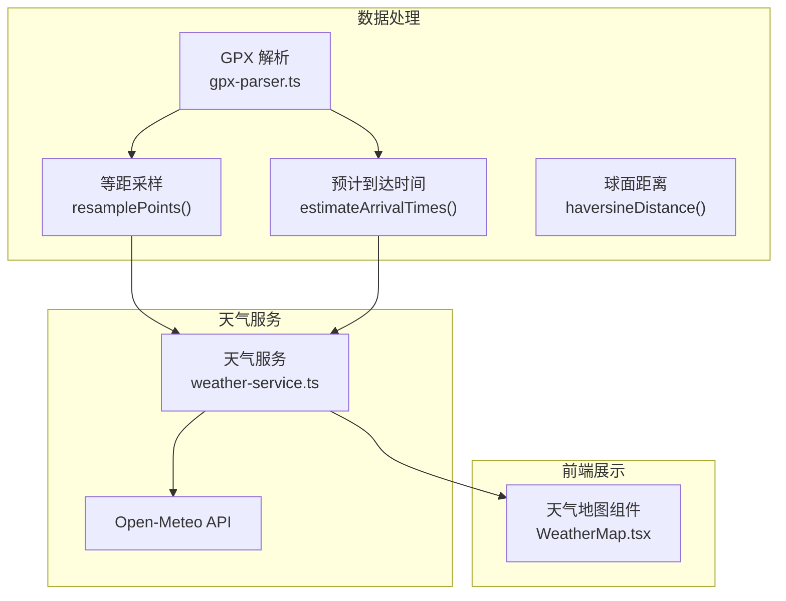
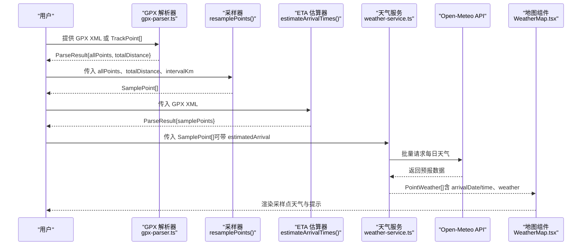
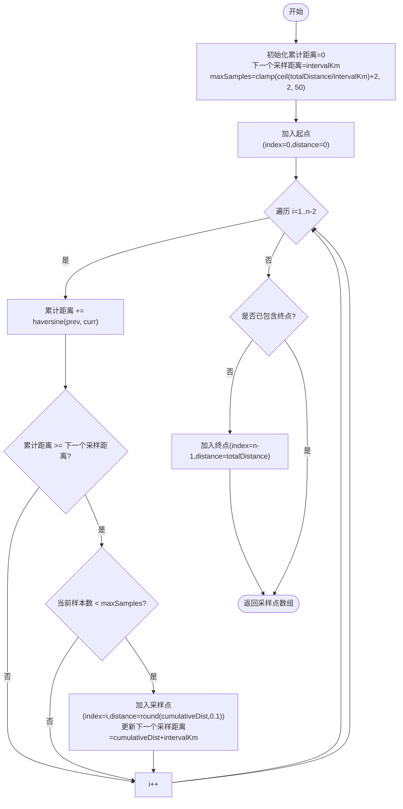
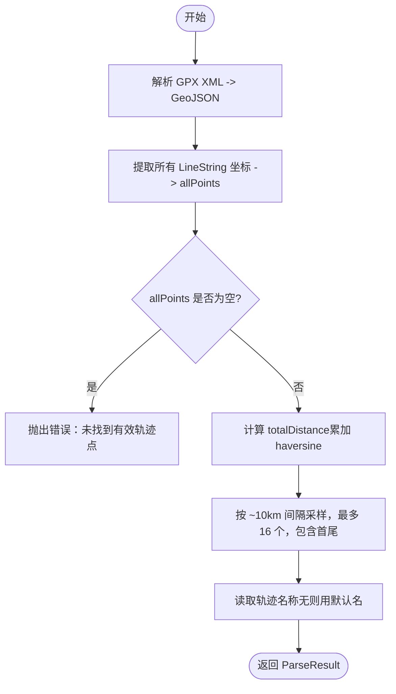
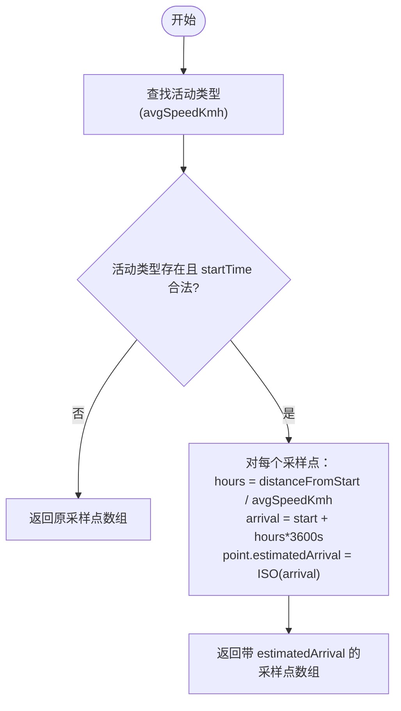
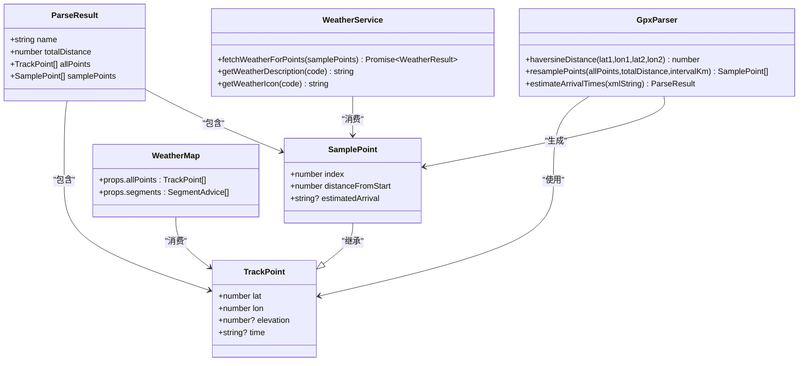

# SamplePoint 采样点模型

<cite>
**本文引用的文件**
- [gpx-parser.ts](file://src/lib/gpx-parser.ts)
- [weather-service.ts](file://src/lib/weather-service.ts)
- [WeatherMap.tsx](file://src/components/WeatherMap.tsx)
</cite>

## 目录
1. [简介](#简介)
2. [项目结构](#项目结构)
3. [核心组件](#核心组件)
4. [架构总览](#架构总览)
5. [详细组件分析](#详细组件分析)
6. [依赖关系分析](#依赖关系分析)
7. [性能考量](#性能考量)
8. [故障排查指南](#故障排查指南)
9. [结论](#结论)
10. [附录：使用示例与最佳实践](#附录使用示例与最佳实践)

## 简介
本文件围绕 SamplePoint 采样点模型进行系统化文档说明。SamplePoint 在 TrackPoint 基础上扩展了 index、distanceFromStart、estimatedArrival 三个字段，用于对轨迹点进行“等距采样”和“预计到达时间估算”，从而在天气查询等外部服务调用中实现精度与性能的平衡。本文将深入解释每个字段的含义与计算方法、采样算法的工作原理（含智能采样策略与边界点处理）、以及如何在实际流程中使用 resamplePoints 与 estimateArrivalTimes 生成采样点并添加预计到达时间。

## 项目结构
与 SamplePoint 相关的核心逻辑集中在以下模块：
- src/lib/gpx-parser.ts：定义 TrackPoint、SamplePoint、ParseResult 等类型，并提供 resamplePoints、estimateArrivalTimes、haversineDistance 等工具函数。
- src/lib/weather-service.ts：基于 SamplePoint 的 estimatedArrival 计算到达日期/时间，批量拉取 Open-Meteo 天气预报数据。
- src/components/WeatherMap.tsx：前端地图展示组件，消费采样点及其天气信息。

图表来源
- [gpx-parser.ts:44-94](file://src/lib/gpx-parser.ts#L44-L94)
- [gpx-parser.ts:139-230](file://src/lib/gpx-parser.ts#L139-L230)
- [gpx-parser.ts:120-137](file://src/lib/gpx-parser.ts#L120-L137)
- [weather-service.ts:71-87](file://src/lib/weather-service.ts#L71-L87)
- [weather-service.ts:89-175](file://src/lib/weather-service.ts#L89-L175)
- [WeatherMap.tsx:84-178](file://src/components/WeatherMap.tsx#L84-L178)

章节来源
- [gpx-parser.ts:4-15](file://src/lib/gpx-parser.ts#L4-L15)
- [gpx-parser.ts:44-94](file://src/lib/gpx-parser.ts#L44-L94)
- [gpx-parser.ts:139-230](file://src/lib/gpx-parser.ts#L139-L230)
- [weather-service.ts:1-22](file://src/lib/weather-service.ts#L1-L22)
- [WeatherMap.tsx:1-24](file://src/components/WeatherMap.tsx#L1-L24)

## 核心组件
本节聚焦 SamplePoint 接口与其相关类型、函数的职责与交互。

- TrackPoint：基础轨迹点，包含经纬度、可选海拔与时间。
- SamplePoint：继承自 TrackPoint，新增：
  - index：原始索引，表示该点在原始 allPoints 中的位置。
  - distanceFromStart：距起点距离（公里），保留一位小数。
  - estimatedArrival：ISO 格式的预计到达时间（可选）。
- ParseResult：解析结果，包含轨迹名称、总距离、allPoints 与 samplePoints。
- haversineDistance：计算两点间球面距离（公里）。
- resamplePoints：按固定间隔对轨迹进行等距采样，返回 SamplePoint[]。
- estimateArrivalTimes：从 GPX XML 字符串解析轨迹，计算总距离，生成默认采样点集（约每 10km，最多 16 个），并返回 ParseResult。

章节来源
- [gpx-parser.ts:4-15](file://src/lib/gpx-parser.ts#L4-L15)
- [gpx-parser.ts:112-117](file://src/lib/gpx-parser.ts#L112-L117)
- [gpx-parser.ts:120-137](file://src/lib/gpx-parser.ts#L120-L137)
- [gpx-parser.ts:44-94](file://src/lib/gpx-parser.ts#L44-L94)
- [gpx-parser.ts:139-230](file://src/lib/gpx-parser.ts#L139-L230)

## 架构总览
下图展示了从 GPX 解析到采样点生成、再到天气查询与展示的端到端流程。

图表来源
- [gpx-parser.ts:139-230](file://src/lib/gpx-parser.ts#L139-L230)
- [gpx-parser.ts:44-94](file://src/lib/gpx-parser.ts#L44-L94)
- [weather-service.ts:71-87](file://src/lib/weather-service.ts#L71-L87)
- [weather-service.ts:89-175](file://src/lib/weather-service.ts#L89-L175)
- [WeatherMap.tsx:84-178](file://src/components/WeatherMap.tsx#L84-L178)

## 详细组件分析

### 数据类型与字段语义
- TrackPoint
  - lat、lon：经纬度（度）
  - elevation：海拔（米，可选）
  - time：时间戳（ISO 字符串，可选）
- SamplePoint（扩展 TrackPoint）
  - index：number，原始索引，便于回溯到原始轨迹序列
  - distanceFromStart：number，距起点的累计距离（km），四舍五入至 0.1 km
  - estimatedArrival：string，ISO 格式预计到达时间（可选）
- ParseResult
  - name：轨迹名称
  - totalDistance：总距离（km）
  - allPoints：完整轨迹点集合
  - samplePoints：采样后的轨迹点集合

章节来源
- [gpx-parser.ts:4-15](file://src/lib/gpx-parser.ts#L4-L15)
- [gpx-parser.ts:112-117](file://src/lib/gpx-parser.ts#L112-L117)

### 采样算法：resamplePoints
- 输入
  - allPoints：TrackPoint[]
  - totalDistance：总距离（km）
  - intervalKm：采样间隔（km）
- 输出
  - SamplePoint[]
- 关键策略
  - 最大样本数上限：根据 totalDistance / intervalKm 动态计算，并在 [2, 50] 范围内裁剪，确保最少 2 个点（起点 + 终点）。
  - 等距触发：沿轨迹累积距离，当累计距离达到下一个采样阈值时插入一个采样点。
  - 边界点处理：始终包含起点与终点；若终点尚未被采样且未达上限，则追加终点。
  - 距离精度：distanceFromStart 保留一位小数。
- 复杂度
  - 时间 O(n)，空间 O(m)，m 为采样点数（受上限约束）。

图表来源
- [gpx-parser.ts:44-94](file://src/lib/gpx-parser.ts#L44-L94)
- [gpx-parser.ts:120-137](file://src/lib/gpx-parser.ts#L120-L137)

章节来源
- [gpx-parser.ts:44-94](file://src/lib/gpx-parser.ts#L44-L94)
- [gpx-parser.ts:120-137](file://src/lib/gpx-parser.ts#L120-L137)

### 预计到达时间：estimateArrivalTimes
- 输入
  - xmlString：GPX XML 字符串
- 输出
  - ParseResult：包含 name、totalDistance、allPoints、samplePoints
- 主要步骤
  - 解析 GPX 为 GeoJSON，提取 LineString 坐标序列为 allPoints。
  - 计算 totalDistance（累加相邻点间的 haversine 距离）。
  - 生成默认采样点：约每 10km 采样一次，最多 16 个，保证首尾点。
  - 返回 ParseResult（注意：此函数不直接填充 estimatedArrival，需结合活动类型与起始时间另行计算）。
- 错误处理
  - 若无有效轨迹点，抛出异常。

图表来源
- [gpx-parser.ts:139-230](file://src/lib/gpx-parser.ts#L139-L230)
- [gpx-parser.ts:120-137](file://src/lib/gpx-parser.ts#L120-L137)

章节来源
- [gpx-parser.ts:139-230](file://src/lib/gpx-parser.ts#L139-L230)
- [gpx-parser.ts:120-137](file://src/lib/gpx-parser.ts#L120-L137)

### 预计到达时间计算（基于活动类型）
虽然 estimateArrivalTimes 不直接设置 estimatedArrival，但系统提供了基于活动类型的 ETA 计算逻辑：
- 依据 ACTIVITY_TYPES 中的 avgSpeedKmh，将 distanceFromStart 转换为小时数，叠加起始时间得到 ISO 格式的 estimatedArrival。
- 若 activityTypeId 无效或 startTime 非法，则保持原样返回。

图表来源
- [gpx-parser.ts:95-110](file://src/lib/gpx-parser.ts#L95-L110)
- [gpx-parser.ts:24-31](file://src/lib/gpx-parser.ts#L24-L31)

章节来源
- [gpx-parser.ts:95-110](file://src/lib/gpx-parser.ts#L95-L110)
- [gpx-parser.ts:24-31](file://src/lib/gpx-parser.ts#L24-L31)

### 天气查询优化与采样点的作用
- 采样点减少 API 调用次数：通过 resamplePoints 或 estimateArrivalTimes 生成的采样点数量远小于原始轨迹点数量，显著降低天气 API 请求量。
- 批次并发：weather-service 以固定批次大小（如 5）并行请求，提升吞吐。
- 到达时间驱动窗口：若采样点携带 estimatedArrival，则仅查询到达日及前后缓冲日的天气，避免全量 7 天查询。
- 展示层联动：WeatherMap 组件根据采样点聚合的 weather 信息渲染图标、温度、降水概率、风速等。

章节来源
- [weather-service.ts:71-87](file://src/lib/weather-service.ts#L71-L87)
- [weather-service.ts:89-175](file://src/lib/weather-service.ts#L89-L175)
- [WeatherMap.tsx:84-178](file://src/components/WeatherMap.tsx#L84-L178)

## 依赖关系分析
- gpx-parser.ts 暴露的类型与函数被 weather-service.ts 与组件消费。
- weather-service.ts 依赖 SamplePoint 的 estimatedArrival 来决定查询窗口。
- WeatherMap.tsx 消费 weather-service 的结果进行可视化。

图表来源
- [gpx-parser.ts:4-15](file://src/lib/gpx-parser.ts#L4-L15)
- [gpx-parser.ts:112-117](file://src/lib/gpx-parser.ts#L112-L117)
- [gpx-parser.ts:44-94](file://src/lib/gpx-parser.ts#L44-L94)
- [gpx-parser.ts:139-230](file://src/lib/gpx-parser.ts#L139-L230)
- [weather-service.ts:1-22](file://src/lib/weather-service.ts#L1-L22)
- [weather-service.ts:71-87](file://src/lib/weather-service.ts#L71-L87)
- [WeatherMap.tsx:1-24](file://src/components/WeatherMap.tsx#L1-L24)

章节来源
- [gpx-parser.ts:4-15](file://src/lib/gpx-parser.ts#L4-L15)
- [gpx-parser.ts:112-117](file://src/lib/gpx-parser.ts#L112-L117)
- [gpx-parser.ts:44-94](file://src/lib/gpx-parser.ts#L44-L94)
- [gpx-parser.ts:139-230](file://src/lib/gpx-parser.ts#L139-L230)
- [weather-service.ts:1-22](file://src/lib/weather-service.ts#L1-L22)
- [weather-service.ts:71-87](file://src/lib/weather-service.ts#L71-L87)
- [WeatherMap.tsx:1-24](file://src/components/WeatherMap.tsx#L1-L24)

## 性能考量
- 采样密度与上限控制
  - resamplePoints 通过 maxSamples 限制采样点数量，避免长距离轨迹产生过多采样点。
  - estimateArrivalTimes 内置默认采样间隔（约 10km）与上限（16 个），适合快速预览。
- 距离计算开销
  - haversineDistance 每次调用涉及三角函数运算，整体为 O(n)。可通过缓存相邻段距离或在预处理阶段一次性计算以降低重复计算。
- 天气 API 并发与批处理
  - fetchWeatherForPoints 采用固定批次大小并行请求，提高吞吐同时避免瞬时压力过大。
- 时间窗口裁剪
  - 利用 estimatedArrival 限定查询起止日期，减少不必要的历史/未来数据获取。

[本节为通用性能建议，无需特定文件引用]

## 故障排查指南
- 解析失败
  - 现象：estimateArrivalTimes 抛出“GPX 文件中未找到有效的轨迹点”。
  - 排查：确认 GPX 中包含 LineString 几何且坐标非空。
- 采样点缺失终点
  - 现象：samplePoints 不包含最后一个点。
  - 排查：检查是否已达 maxSamples 上限；若已达上限，最后一段不会被采样。
- 预计到达时间为空
  - 现象：SamplePoint.estimatedArrival 为空。
  - 排查：确认已通过基于活动类型的 ETA 计算逻辑填充；检查 activityTypeId 与 startTime 是否合法。
- 天气查询失败
  - 现象：天气 API 返回非 2xx。
  - 排查：检查网络状态与参数（经纬度、日期范围）；查看错误消息中的状态码与文本。

章节来源
- [gpx-parser.ts:157-159](file://src/lib/gpx-parser.ts#L157-L159)
- [gpx-parser.ts:44-94](file://src/lib/gpx-parser.ts#L44-L94)
- [gpx-parser.ts:95-110](file://src/lib/gpx-parser.ts#L95-L110)
- [weather-service.ts:141-145](file://src/lib/weather-service.ts#L141-L145)

## 结论
SamplePoint 作为 TrackPoint 的增强类型，通过 index、distanceFromStart、estimatedArrival 三个关键字段，实现了轨迹数据的“等距采样”与“到达时间预估”，在天气查询等外部服务调用场景中显著降低了请求成本，同时保持了足够的空间分辨率。配合 resamplePoints 与 estimateArrivalTimes，开发者可以灵活地在精度与性能之间取得平衡。

[本节为总结性内容，无需特定文件引用]

## 附录：使用示例与最佳实践

- 使用 resamplePoints 生成采样点
  - 输入：allPoints、totalDistance、intervalKm
  - 输出：SamplePoint[]
  - 适用场景：已知总距离与期望采样间隔时，自定义采样密度。
  - 参考路径：[gpx-parser.ts:44-94](file://src/lib/gpx-parser.ts#L44-L94)

- 使用 estimateArrivalTimes 快速生成默认采样点
  - 输入：GPX XML 字符串
  - 输出：ParseResult（含 samplePoints）
  - 适用场景：快速预览，默认约每 10km 采样，最多 16 个点。
  - 参考路径：[gpx-parser.ts:139-230](file://src/lib/gpx-parser.ts#L139-L230)

- 为采样点添加预计到达时间
  - 方法：基于 ACTIVITY_TYPES 的 avgSpeedKmh 与起始时间，将 distanceFromStart 换算为到达时刻，写入 estimatedArrival。
  - 参考路径：[gpx-parser.ts:95-110](file://src/lib/gpx-parser.ts#L95-L110)、[gpx-parser.ts:24-31](file://src/lib/gpx-parser.ts#L24-L31)

- 天气查询优化
  - 批量并发：使用 fetchWeatherForPoints 分批并行请求。
  - 时间窗口：优先使用 estimatedArrival 限定查询区间。
  - 参考路径：[weather-service.ts:71-87](file://src/lib/weather-service.ts#L71-L87)、[weather-service.ts:89-175](file://src/lib/weather-service.ts#L89-L175)

- 前端展示
  - 使用 WeatherMap 组件渲染采样点天气信息与到达时间。
  - 参考路径：[WeatherMap.tsx:84-178](file://src/components/WeatherMap.tsx#L84-L178)

章节来源
- [gpx-parser.ts:44-94](file://src/lib/gpx-parser.ts#L44-L94)
- [gpx-parser.ts:139-230](file://src/lib/gpx-parser.ts#L139-L230)
- [gpx-parser.ts:95-110](file://src/lib/gpx-parser.ts#L95-L110)
- [gpx-parser.ts:24-31](file://src/lib/gpx-parser.ts#L24-L31)
- [weather-service.ts:71-87](file://src/lib/weather-service.ts#L71-L87)
- [weather-service.ts:89-175](file://src/lib/weather-service.ts#L89-L175)
- [WeatherMap.tsx:84-178](file://src/components/WeatherMap.tsx#L84-L178)