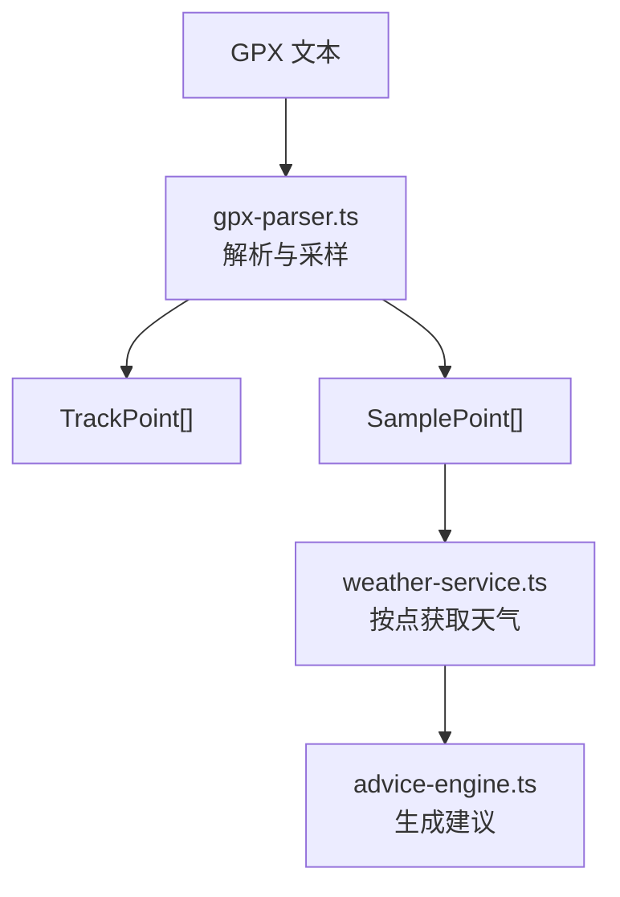
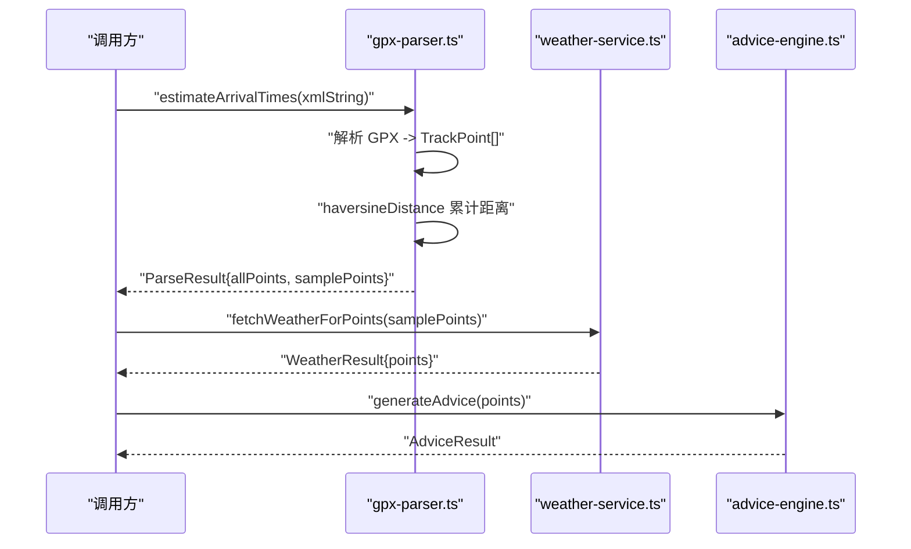
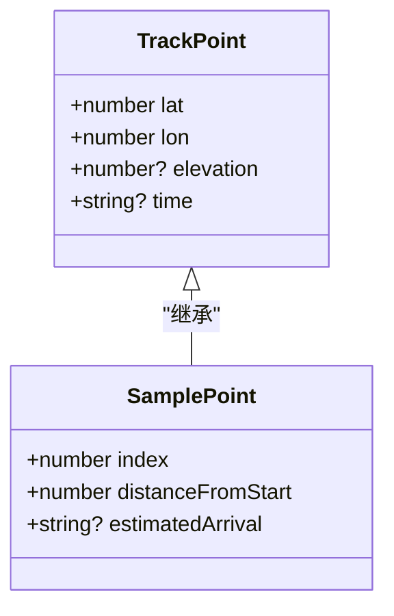
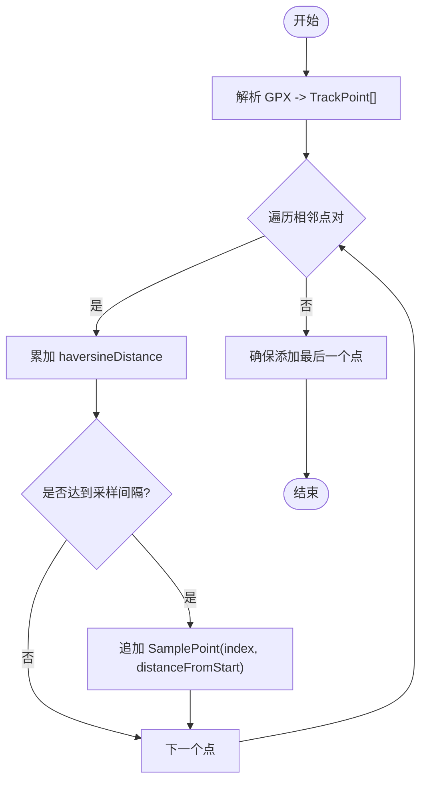
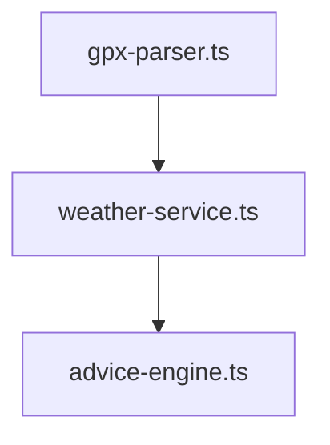

# TrackPoint 轨迹点模型

<cite>
**本文引用的文件**   
- [gpx-parser.ts](file://src/lib/gpx-parser.ts)
- [weather-service.ts](file://src/lib/weather-service.ts)
- [advice-engine.ts](file://src/lib/advice-engine.ts)
</cite>

## 目录
1. [简介](#简介)
2. [项目结构](#项目结构)
3. [核心组件](#核心组件)
4. [架构总览](#架构总览)
5. [详细组件分析](#详细组件分析)
6. [依赖关系分析](#依赖关系分析)
7. [性能考量](#性能考量)
8. [故障排查指南](#故障排查指南)
9. [结论](#结论)
10. [附录](#附录)

## 简介
本文件围绕 TrackPoint 轨迹点模型进行系统化说明，涵盖接口定义、字段语义与约束、在 GPX 解析与距离计算中的使用方式、以及与 SamplePoint 的继承关系。同时给出数据验证与错误处理的最佳实践建议，帮助读者正确理解并安全地使用该模型。

## 项目结构
TrackPoint 及其相关类型位于地理数据处理模块中，主要参与以下流程：
- 从 GPX 文本解析为 TrackPoint 序列
- 基于 TrackPoint 计算总距离与采样生成 SamplePoint
- 将 SamplePoint 用于天气查询与建议生成

图表来源
- [gpx-parser.ts:139-230](file://src/lib/gpx-parser.ts#L139-L230)
- [weather-service.ts:71-176](file://src/lib/weather-service.ts#L71-L176)
- [advice-engine.ts:118-201](file://src/lib/advice-engine.ts#L118-L201)

章节来源
- [gpx-parser.ts:1-231](file://src/lib/gpx-parser.ts#L1-L231)
- [weather-service.ts:1-176](file://src/lib/weather-service.ts#L1-L176)
- [advice-engine.ts:1-201](file://src/lib/advice-engine.ts#L1-L201)

## 核心组件
- TrackPoint：表示一个轨迹点，包含经纬度、可选海拔与时间戳。
- SamplePoint：继承自 TrackPoint，增加索引、距起点距离与可选预计到达时间等派生信息。
- haversineDistance：基于球面大圆距离公式计算两点间距离（千米）。
- estimateArrivalTimes：从 GPX XML 字符串解析出 TrackPoint 序列，计算总距离并按固定间隔采样得到 SamplePoint。

章节来源
- [gpx-parser.ts:4-15](file://src/lib/gpx-parser.ts#L4-L15)
- [gpx-parser.ts:119-137](file://src/lib/gpx-parser.ts#L119-L137)
- [gpx-parser.ts:139-230](file://src/lib/gpx-parser.ts#L139-L230)

## 架构总览
下图展示了 TrackPoint 在系统中的角色与上下游关系：上游负责从 GPX 构建 TrackPoint；中游通过距离函数与采样策略生成 SamplePoint；下游以 SamplePoint 为基础进行天气查询与建议生成。

图表来源
- [gpx-parser.ts:139-230](file://src/lib/gpx-parser.ts#L139-L230)
- [weather-service.ts:71-176](file://src/lib/weather-service.ts#L71-L176)
- [advice-engine.ts:118-201](file://src/lib/advice-engine.ts#L118-L201)

## 详细组件分析

### TrackPoint 接口定义与字段语义
- lat（纬度）
  - 类型：number
  - 含义：点的纬度坐标
  - 取值范围：[-90, 90]
  - 业务约束：必须有效；若超出范围应视为非法输入
- lon（经度）
  - 类型：number
  - 含义：点的经度坐标
  - 取值范围：[-180, 180]
  - 业务约束：必须有效；若超出范围应视为非法输入
- elevation（海拔高度）
  - 类型：number | undefined
  - 含义：海拔高度（单位通常为米），可选
  - 取值范围：无严格限制，常见为负值到数千米
  - 业务约束：可为空；若存在需为非 NaN/Infinity 数值
- time（时间戳）
  - 类型：string | undefined
  - 含义：ISO 格式或兼容的时间字符串，可选
  - 取值范围：符合 ISO 8601 或可被 Date 解析的字符串
  - 业务约束：可为空；若存在需可被解析为合法日期

注意：
- 在 GPX 解析路径中，time 字段未被自动填充，属于“按需补充”的扩展字段。
- 所有数值字段应避免 NaN 与 Infinity，否则会影响距离计算与后续逻辑。

章节来源
- [gpx-parser.ts:4-9](file://src/lib/gpx-parser.ts#L4-L9)
- [gpx-parser.ts:144-155](file://src/lib/gpx-parser.ts#L144-L155)

### SamplePoint 继承关系与派生字段
SamplePoint 继承自 TrackPoint，新增字段如下：
- index：number
  - 含义：点在原始 TrackPoint 数组中的位置
  - 用途：定位与排序
- distanceFromStart：number
  - 含义：从轨迹起点沿轨迹累积的距离（千米）
  - 用途：分段统计、采样、展示进度
- estimatedArrival：string | undefined
  - 含义：预计到达时间（ISO 字符串），可选
  - 用途：结合活动类型与平均速度估算到达时刻

继承关系示意：

图表来源
- [gpx-parser.ts:4-15](file://src/lib/gpx-parser.ts#L4-L15)

章节来源
- [gpx-parser.ts:11-15](file://src/lib/gpx-parser.ts#L11-L15)

### 距离计算与采样流程
- 距离计算
  - 使用 haversineDistance 计算相邻 TrackPoint 间的球面距离（千米），并累加得到 totalDistance。
- 采样策略
  - 以固定间隔（如每 10 km）对轨迹进行采样，确保首尾点始终保留，且样本数量有上下限控制。
  - 每个 SamplePoint 附带 index 与 distanceFromStart，便于后续分析与可视化。

图表来源
- [gpx-parser.ts:119-137](file://src/lib/gpx-parser.ts#L119-L137)
- [gpx-parser.ts:162-218](file://src/lib/gpx-parser.ts#L162-L218)

章节来源
- [gpx-parser.ts:119-137](file://src/lib/gpx-parser.ts#L119-L137)
- [gpx-parser.ts:162-218](file://src/lib/gpx-parser.ts#L162-L218)

### 从 GPX 解析到 TrackPoint 的使用示例
- 输入：GPX XML 字符串
- 处理：
  - 解析为 GeoJSON LineString，提取坐标序列为 TrackPoint[]
  - 计算总距离与采样得到 SamplePoint[]
- 输出：ParseResult，包含 name、totalDistance、allPoints、samplePoints

典型调用路径：
- 调用 estimateArrivalTimes(xmlString)
- 返回 ParseResult 后，可直接使用 allPoints 与 samplePoints 进行地图渲染、统计分析或进一步处理

章节来源
- [gpx-parser.ts:139-230](file://src/lib/gpx-parser.ts#L139-L230)

### 在距离计算中的应用
- 单段距离：haversineDistance(lat1, lon1, lat2, lon2)
- 累计距离：遍历 TrackPoint 序列，逐段累加
- 采样距离：SamplePoint.distanceFromStart 即为对应位置的累计距离

章节来源
- [gpx-parser.ts:119-137](file://src/lib/gpx-parser.ts#L119-L137)
- [gpx-parser.ts:162-170](file://src/lib/gpx-parser.ts#L162-L170)

### 与其他数据结构的关系
- weather-service.ts 以 SamplePoint 为输入，按点请求天气并回写 arrivalDate/arrivalTime 等信息。
- advice-engine.ts 基于 PointWeather（内含 SamplePoint）生成各路段的建议与总体摘要。

图表来源
- [weather-service.ts:71-176](file://src/lib/weather-service.ts#L71-L176)
- [advice-engine.ts:118-201](file://src/lib/advice-engine.ts#L118-L201)

章节来源
- [weather-service.ts:1-176](file://src/lib/weather-service.ts#L1-L176)
- [advice-engine.ts:1-201](file://src/lib/advice-engine.ts#L1-L201)

## 依赖关系分析
- gpx-parser.ts
  - 对外暴露：TrackPoint、SamplePoint、haversineDistance、estimateArrivalTimes
  - 内部依赖：@tmcw/togeojson、@xmldom/xmldom（用于 GPX 解析）
- weather-service.ts
  - 依赖：SamplePoint（来自 gpx-parser.ts）
  - 功能：批量拉取 Open-Meteo 天气，映射到 SamplePoint
- advice-engine.ts
  - 依赖：PointWeather（含 SamplePoint）
  - 功能：根据天气生成建议与汇总

图表来源
- [gpx-parser.ts:1-231](file://src/lib/gpx-parser.ts#L1-L231)
- [weather-service.ts:1-176](file://src/lib/weather-service.ts#L1-L176)
- [advice-engine.ts:1-201](file://src/lib/advice-engine.ts#L1-L201)

章节来源
- [gpx-parser.ts:1-231](file://src/lib/gpx-parser.ts#L1-L231)
- [weather-service.ts:1-176](file://src/lib/weather-service.ts#L1-L176)
- [advice-engine.ts:1-201](file://src/lib/advice-engine.ts#L1-L201)

## 性能考量
- 距离计算复杂度：O(n)，n 为 TrackPoint 数量
- 采样复杂度：O(n)，一次扫描完成采样与累计距离
- 批量天气请求：按批次并发请求，减少串行等待
- 内存占用：TrackPoint 与 SamplePoint 均为轻量对象，适合前端直接操作

[本节为通用指导，不直接分析具体文件]

## 故障排查指南
- 输入校验
  - 检查 lat ∈ [-90, 90]，lon ∈ [-180, 180]
  - 检查 elevation 与 time 是否为非空时具备合理值
  - 避免 NaN/Infinity 进入距离计算
- 解析异常
  - 当 GPX 未包含有效轨迹点时，会抛出错误提示
- 网络异常
  - 天气 API 请求失败时抛出错误，需捕获并降级处理（例如回退到默认天气或提示用户重试）

章节来源
- [gpx-parser.ts:157-159](file://src/lib/gpx-parser.ts#L157-L159)
- [weather-service.ts:141-145](file://src/lib/weather-service.ts#L141-L145)

## 结论
TrackPoint 作为轨迹数据的原子单元，配合 SamplePoint 的派生字段，构成了从 GPX 解析、距离计算、采样到天气与建议生成的完整链路。遵循严格的字段约束与错误处理策略，可显著提升系统的健壮性与用户体验。

## 附录
- 最佳实践清单
  - 在构造 TrackPoint 前进行边界校验
  - 对 elevation/time 做可选性处理，避免空引用
  - 使用 haversineDistance 统一距离口径，避免近似误差
  - 对采样结果进行去重与边界保护（首尾必留、上限控制）
  - 对网络请求进行批量化与超时/重试策略

[本节为通用指导，不直接分析具体文件]