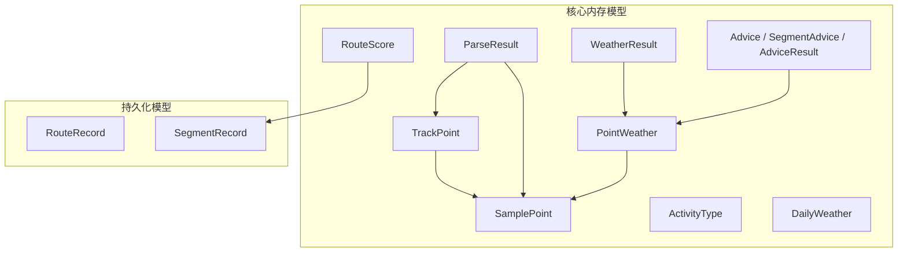
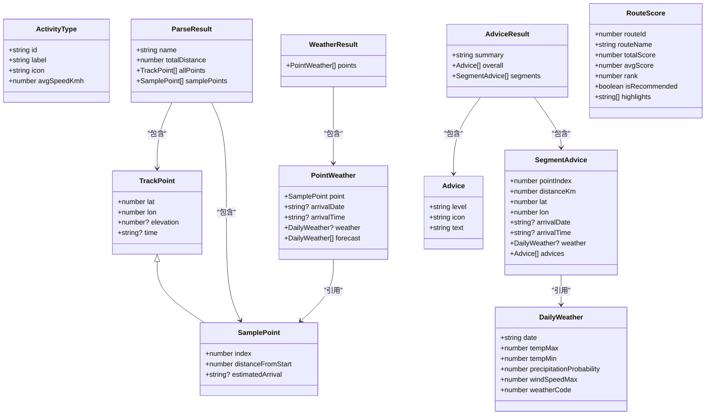
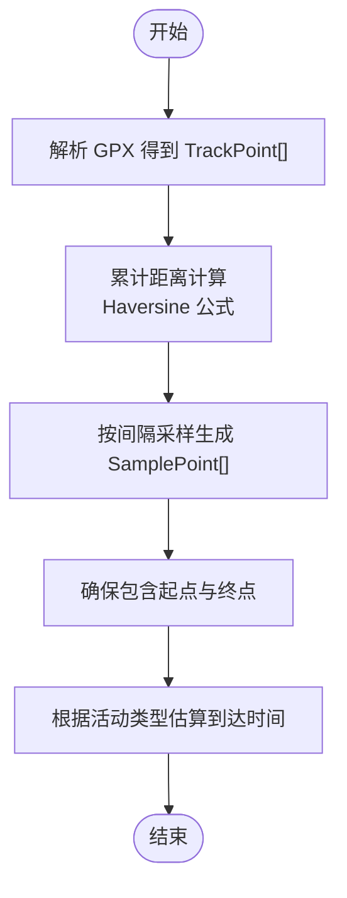
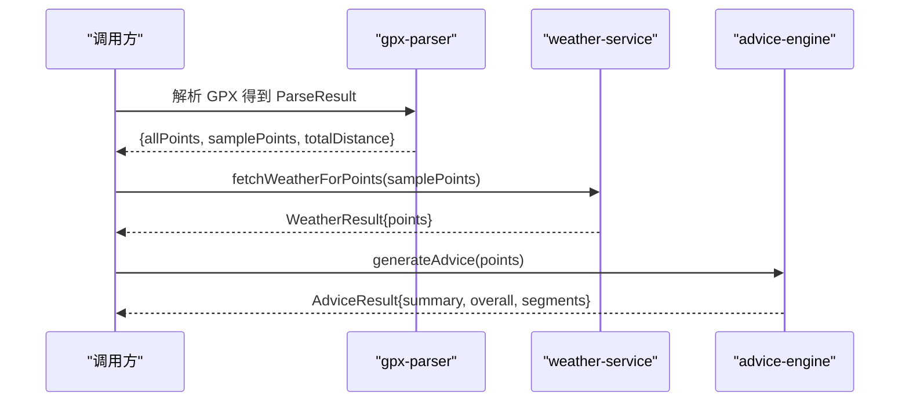
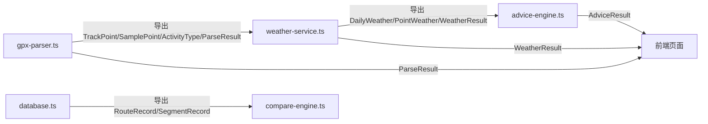

# 核心数据结构

<cite>
**本文引用的文件**
- [gpx-parser.ts](file://lib/gpx-parser.ts)
- [weather-service.ts](file://lib/weather-service.ts)
- [advice-engine.ts](file://lib/advice-engine.ts)
- [compare-engine.ts](file://lib/compare-engine.ts)
- [database.ts](file://lib/database.ts)
</cite>

## 目录
1. [简介](#简介)
2. [项目结构](#项目结构)
3. [核心组件](#核心组件)
4. [架构总览](#架构总览)
5. [详细组件分析](#详细组件分析)
6. [依赖关系分析](#依赖关系分析)
7. [性能考量](#性能考量)
8. [故障排查指南](#故障排查指南)
9. [结论](#结论)
10. [附录](#附录)

## 简介
本文件聚焦 FineG 项目的核心内存数据结构，围绕轨迹点与采样点模型、活动类型枚举以及与之相关的天气与建议结果模型进行系统化说明。重点包括：
- TrackPoint 轨迹点模型的定义、字段含义、数据类型与业务约束
- SamplePoint 采样点模型对 TrackPoint 的扩展方式与新增字段的用途
- ActivityType 活动类型模型的语义与使用场景
- 相关数据结构的组合关系（如 ParseResult、PointWeather、Advice 等）
- 典型处理流程中的数据结构流转与校验策略
- 错误处理与最佳实践建议

## 项目结构
与核心数据结构直接相关的代码主要位于 lib 目录下：
- gpx-parser.ts：定义 TrackPoint、SamplePoint、ActivityType、ParseResult 等核心内存模型，并提供 GPX 解析、重采样、距离计算等工具函数
- weather-service.ts：定义 DailyWeather、PointWeather、WeatherResult 等天气相关模型，并封装天气查询逻辑
- advice-engine.ts：定义 Advice、SegmentAdvice、AdviceResult 等建议模型，提供基于天气的建议生成逻辑
- compare-engine.ts：定义 RouteScore 评分模型，用于路线对比
- database.ts：定义持久化记录模型 RouteRecord、SegmentRecord，映射到 SQLite 表结构

图表来源
- [gpx-parser.ts:4-22](file://lib/gpx-parser.ts#L4-L22)
- [gpx-parser.ts:112-117](file://lib/gpx-parser.ts#L112-L117)
- [weather-service.ts:3-22](file://lib/weather-service.ts#L3-L22)
- [advice-engine.ts:7-28](file://lib/advice-engine.ts#L7-L28)
- [compare-engine.ts:3-11](file://lib/compare-engine.ts#L3-L11)
- [database.ts:59-86](file://lib/database.ts#L59-L86)

章节来源
- [gpx-parser.ts:1-231](file://lib/gpx-parser.ts#L1-L231)
- [weather-service.ts:1-176](file://lib/weather-service.ts#L1-L176)
- [advice-engine.ts:1-201](file://lib/advice-engine.ts#L1-L201)
- [compare-engine.ts:1-116](file://lib/compare-engine.ts#L1-L116)
- [database.ts:1-204](file://lib/database.ts#L1-L204)

## 核心组件
本节深入解释核心内存数据结构的定义、字段含义、数据类型与业务约束，并给出关系图与使用示例路径。

### TrackPoint 轨迹点模型
- 用途：表示原始轨迹中的一个地理点，作为所有轨迹数据的原子单元
- 字段与约束
  - lat: number；纬度，单位度，数值型
  - lon: number；经度，单位度，数值型
  - elevation?: number；可选的海拔高度，单位米，数值型
  - time?: string；可选的时间戳，ISO 字符串或设备时间字符串
- 业务约束
  - lat 应在 [-90, 90] 范围，lon 应在 [-180, 180] 范围（建议在消费端做校验）
  - elevation 若存在应非负（海拔通常为非负）
  - time 若存在应符合 ISO 格式或可被 Date.parse 解析
- 复杂度与性能
  - 单点对象，创建与拷贝开销极低
  - 在大量轨迹点数组中，应避免频繁深拷贝，优先使用浅合并或只更新必要字段

章节来源
- [gpx-parser.ts:4-9](file://lib/gpx-parser.ts#L4-L9)

### SamplePoint 采样点模型
- 用途：对原始轨迹点进行降采样后的代表性点，用于可视化、分析与展示
- 继承关系
  - 继承自 TrackPoint，包含其全部字段
- 新增字段与约束
  - index: number；该点在原始 allPoints 中的索引，用于定位与对齐
  - distanceFromStart: number；从起点到该点的累计距离（km），保留一位小数
  - estimatedArrival?: string；可选的预计到达时间，ISO 字符串
- 业务约束
  - index 应为非负整数且小于 allPoints.length
  - distanceFromStart 单调递增，首点为 0，末点等于 totalDistance
  - estimatedArrival 若存在需为有效 ISO 时间字符串
- 复杂度与性能
  - 采样点数量受 maxSamples 限制，避免渲染与计算压力过大
  - 通过 index 与 distanceFromStart 实现快速定位与插值

章节来源
- [gpx-parser.ts:11-15](file://lib/gpx-parser.ts#L11-L15)
- [gpx-parser.ts:44-94](file://lib/gpx-parser.ts#L44-L94)

### ActivityType 活动类型模型
- 用途：描述不同活动类型的元数据，用于估算到达时间与行程规划
- 字段与约束
  - id: string；唯一标识，如 walking、hiking、cycling、mtb、running、driving
  - label: string；显示标签，中文文案
  - icon: string；图标字符，用于 UI 展示
  - avgSpeedKmh: number；平均速度（km/h），用于估算到达时间
- 业务约束
  - id 必须存在于预置常量集合中
  - avgSpeedKmh 应为正数
- 使用示例路径
  - 预置列表与选择：[gpx-parser.ts:24-31](file://lib/gpx-parser.ts#L24-L31)
  - 根据活动类型估算到达时间：[gpx-parser.ts:95-110](file://lib/gpx-parser.ts#L95-L110)

章节来源
- [gpx-parser.ts:17-31](file://lib/gpx-parser.ts#L17-L31)
- [gpx-parser.ts:95-110](file://lib/gpx-parser.ts#L95-L110)

### ParseResult 解析结果模型
- 用途：GPX 解析后返回的统一结果，包含名称、总距离、全量轨迹点与采样点
- 字段与约束
  - name: string；轨迹名称
  - totalDistance: number；总距离（km），保留一位小数
  - allPoints: TrackPoint[]；完整轨迹点序列
  - samplePoints: SamplePoint[]；降采样后的代表性点序列
- 业务约束
  - allPoints 长度至少为 2（起点与终点）
  - samplePoints 长度在最小 2 与最大 50 之间（由 resamplePoints 控制）
- 使用示例路径
  - 解析入口与构造：[gpx-parser.ts:139-230](file://lib/gpx-parser.ts#L139-L230)
  - 前端存储与传递：[app/page.tsx:88-125](file://app/page.tsx#L88-L125)

章节来源
- [gpx-parser.ts:112-117](file://lib/gpx-parser.ts#L112-L117)
- [gpx-parser.ts:139-230](file://lib/gpx-parser.ts#L139-L230)
- [app/page.tsx:88-125](file://app/page.tsx#L88-L125)

### 天气与建议相关模型
- DailyWeather：单日天气摘要，包含日期、最高/最低温、降水概率、最大风速、WMO 天气码
- PointWeather：将 SamplePoint 与其到达日期对应的天气信息关联，同时携带完整 7 天预报
- WeatherResult：批量天气查询结果，包含多个 PointWeather
- Advice、SegmentAdvice、AdviceResult：按段生成的建议与整体汇总，包含级别、图标、文本与排序

章节来源
- [weather-service.ts:3-22](file://lib/weather-service.ts#L3-L22)
- [advice-engine.ts:7-28](file://lib/advice-engine.ts#L7-L28)

### 对比评分模型
- RouteScore：路线对比评分结果，包含总分、平均分、排名、是否推荐与亮点提示

章节来源
- [compare-engine.ts:3-11](file://lib/compare-engine.ts#L3-L11)

## 架构总览
下图展示了核心数据结构之间的依赖与交互关系，以及它们在解析、采样、天气与建议生成流程中的位置。

图表来源
- [gpx-parser.ts:4-22](file://lib/gpx-parser.ts#L4-L22)
- [gpx-parser.ts:112-117](file://lib/gpx-parser.ts#L112-L117)
- [weather-service.ts:3-22](file://lib/weather-service.ts#L3-L22)
- [advice-engine.ts:7-28](file://lib/advice-engine.ts#L7-L28)
- [compare-engine.ts:3-11](file://lib/compare-engine.ts#L3-L11)

## 详细组件分析

### TrackPoint 与 SamplePoint 的关系与扩展
- 继承关系
  - SamplePoint 继承 TrackPoint，复用经纬度、海拔与时间字段，并增加 index、distanceFromStart、estimatedArrival
- 数据流
  - 解析阶段：GPX 解析得到 TrackPoint[]
  - 采样阶段：resamplePoints 将 TrackPoint[] 转换为 SamplePoint[]，保证首尾点与间隔采样
  - 估算到达时间：根据 ActivityType.avgSpeedKmh 与 SamplePoint.distanceFromStart 计算 estimatedArrival
- 关键算法
  - Haversine 距离计算用于累计距离
  - 采样上限与下限控制，避免过多或过少采样点

图表来源
- [gpx-parser.ts:44-94](file://lib/gpx-parser.ts#L44-L94)
- [gpx-parser.ts:119-137](file://lib/gpx-parser.ts#L119-L137)
- [gpx-parser.ts:95-110](file://lib/gpx-parser.ts#L95-L110)

章节来源
- [gpx-parser.ts:4-15](file://lib/gpx-parser.ts#L4-L15)
- [gpx-parser.ts:44-94](file://lib/gpx-parser.ts#L44-L94)
- [gpx-parser.ts:119-137](file://lib/gpx-parser.ts#L119-L137)
- [gpx-parser.ts:95-110](file://lib/gpx-parser.ts#L95-L110)

### ActivityType 的使用与约束
- 预置活动类型列表包含步行、登山、骑行、山地骑行、跑步、驾车等
- 使用场景
  - 根据用户选择的 activityTypeId 查找对应 ActivityType
  - 用 avgSpeedKmh 与 SamplePoint.distanceFromStart 计算 estimatedArrival
- 约束与校验
  - 若未找到匹配的活动类型，则跳过估算并返回原采样点
  - startTime 必须为有效 ISO 时间，否则跳过估算

章节来源
- [gpx-parser.ts:24-31](file://lib/gpx-parser.ts#L24-L31)
- [gpx-parser.ts:95-110](file://lib/gpx-parser.ts#L95-L110)

### ParseResult 的构建与校验
- 构建过程
  - 解析 GPX 提取 LineString 坐标，构造 TrackPoint[]
  - 计算 totalDistance，生成 samplePoints
  - 提取 name 作为轨迹名称
- 校验与异常
  - 若无有效轨迹点，抛出错误“GPX 文件中未找到有效的轨迹点”
  - 前端捕获错误并回退到设置状态

章节来源
- [gpx-parser.ts:139-230](file://lib/gpx-parser.ts#L139-L230)
- [app/page.tsx:108-115](file://app/page.tsx#L108-L115)

### 天气与建议模型的数据流
- 天气查询
  - 以 SamplePoint 为输入，批量请求 Open-Meteo API，返回 WeatherResult
  - 根据 estimatedArrival 确定查询日期范围，匹配到达日期的 DailyWeather
- 建议生成
  - 基于 DailyWeather 的阈值规则生成 Advice
  - 聚合各段建议，去重并按严重级别排序，生成 AdviceResult

图表来源
- [gpx-parser.ts:139-230](file://lib/gpx-parser.ts#L139-L230)
- [weather-service.ts:71-87](file://lib/weather-service.ts#L71-L87)
- [advice-engine.ts:118-201](file://lib/advice-engine.ts#L118-L201)

章节来源
- [weather-service.ts:71-176](file://lib/weather-service.ts#L71-L176)
- [advice-engine.ts:118-201](file://lib/advice-engine.ts#L118-L201)

### 对比评分模型 RouteScore
- 评分维度
  - 降水概率、最大风速、WMO 天气码、温度区间
- 输出
  - 总分、平均分、排名、是否推荐、亮点提示
- 使用场景
  - 多路线对比时，依据各段 SegmentRecord 的天气与风况生成评分

章节来源
- [compare-engine.ts:3-11](file://lib/compare-engine.ts#L3-L11)
- [compare-engine.ts:83-116](file://lib/compare-engine.ts#L83-L116)

## 依赖关系分析
- 模块内聚与耦合
  - gpx-parser.ts 集中定义核心轨迹与采样模型，低耦合其他模块
  - weather-service.ts 依赖 SamplePoint，输出 WeatherResult
  - advice-engine.ts 依赖 PointWeather 与 DailyWeather，输出 AdviceResult
  - compare-engine.ts 依赖数据库记录 SegmentRecord，输出 RouteScore
- 外部依赖
  - @tmcw/togeojson 与 @xmldom/xmldom 用于 GPX 解析
  - better-sqlite3 用于本地持久化
  - Open-Meteo API 用于天气查询

图表来源
- [gpx-parser.ts:4-22](file://lib/gpx-parser.ts#L4-L22)
- [weather-service.ts:3-22](file://lib/weather-service.ts#L3-L22)
- [advice-engine.ts:7-28](file://lib/advice-engine.ts#L7-L28)
- [compare-engine.ts:3-11](file://lib/compare-engine.ts#L3-L11)
- [database.ts:59-86](file://lib/database.ts#L59-L86)

章节来源
- [gpx-parser.ts:1-231](file://lib/gpx-parser.ts#L1-L231)
- [weather-service.ts:1-176](file://lib/weather-service.ts#L1-L176)
- [advice-engine.ts:1-201](file://lib/advice-engine.ts#L1-L201)
- [compare-engine.ts:1-116](file://lib/compare-engine.ts#L1-L116)
- [database.ts:1-204](file://lib/database.ts#L1-L204)

## 性能考量
- 采样点数量控制
  - 通过 maxSamples 限制采样点数量，避免渲染与计算压力
  - 默认采样间隔与上限在 resamplePoints 中设定
- 批量天气请求
  - 采用批次大小（batchSize=5）并行请求，减少总体延迟
- 距离计算
  - Haversine 公式逐段累加，时间复杂度 O(n)，n 为轨迹点数
- 内存占用
  - TrackPoint 与 SamplePoint 均为轻量对象，注意避免不必要的深拷贝

[本节为通用指导，不直接分析具体文件]

## 故障排查指南
- GPX 解析失败
  - 现象：抛出错误“GPX 文件中未找到有效的轨迹点”
  - 原因：LineString 特征为空或坐标缺失
  - 处理：检查 GPX 文件结构与坐标有效性
- 天气 API 请求失败
  - 现象：抛出错误“天气 API 请求失败: status statusText”
  - 原因：网络错误或 API 限流
  - 处理：重试机制与降级策略（如无网络时使用默认天气）
- 活动类型无效
  - 现象：无法估算到达时间，返回原采样点
  - 原因：activityTypeId 不在预置列表中
  - 处理：校验 activityTypeId 并提示用户选择有效类型
- 时间戳无效
  - 现象：startTime 无法解析为有效日期
  - 原因：时间字符串格式不正确
  - 处理：校验 ISO 格式并在前端提示修正

章节来源
- [gpx-parser.ts:157-159](file://lib/gpx-parser.ts#L157-L159)
- [weather-service.ts:141-145](file://lib/weather-service.ts#L141-L145)
- [gpx-parser.ts:95-110](file://lib/gpx-parser.ts#L95-L110)

## 结论
FineG 的核心数据结构以 TrackPoint 为基础，通过 SamplePoint 扩展出采样与估算能力，配合 ActivityType 完成到达时间估算。ParseResult 统一了 GPX 解析结果，WeatherResult 与 AdviceResult 则将天气与建议整合到轨迹分析中。整体设计清晰、职责分明，便于扩展与维护。建议在生产环境中加强输入校验与错误恢复策略，以提升鲁棒性与用户体验。

[本节为总结性内容，不直接分析具体文件]

## 附录
- 使用示例与最佳实践
  - 轨迹点校验：在解析后对 TrackPoint.lat/lon/elevation/time 进行边界与格式校验
  - 采样点一致性：确保 SamplePoint.index 与 distanceFromStart 单调递增，首尾点正确
  - 活动类型选择：在前端提供下拉选择，限制为 ACTIVITY_TYPES 中的 id
  - 到达时间估算：仅在 startTime 有效且 activityTypeId 匹配时执行
  - 天气建议：对空天气数据提供默认建议，避免 UI 空白
  - 错误处理：统一捕获并提示用户，必要时回退到上一状态

章节来源
- [gpx-parser.ts:44-94](file://lib/gpx-parser.ts#L44-L94)
- [gpx-parser.ts:95-110](file://lib/gpx-parser.ts#L95-L110)
- [weather-service.ts:71-176](file://lib/weather-service.ts#L71-L176)
- [advice-engine.ts:118-201](file://lib/advice-engine.ts#L118-L201)