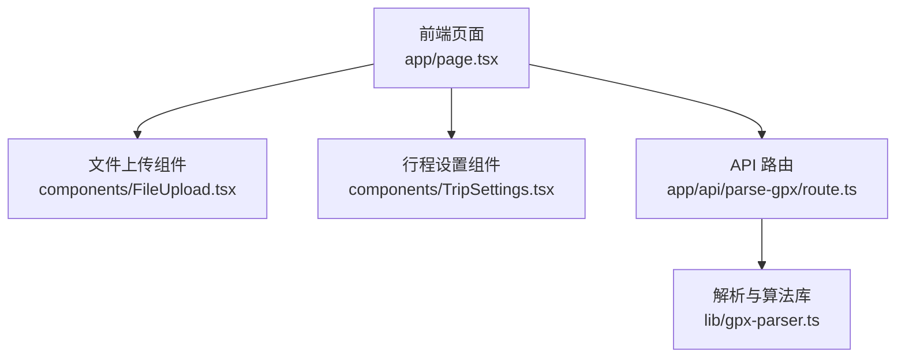
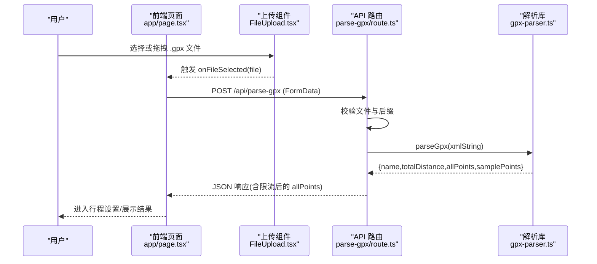
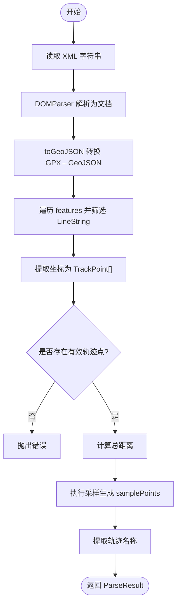
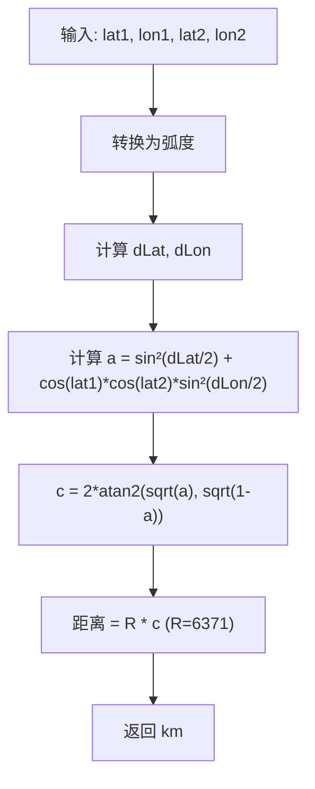
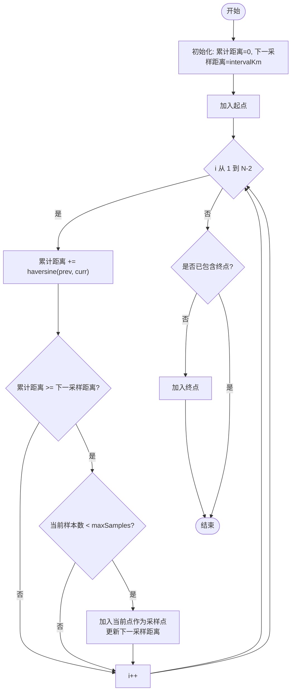
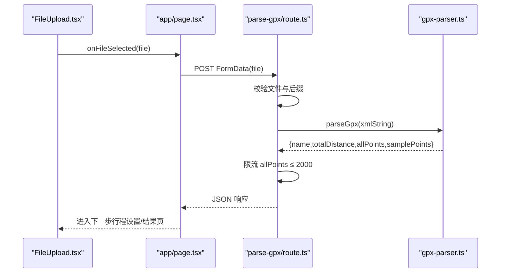
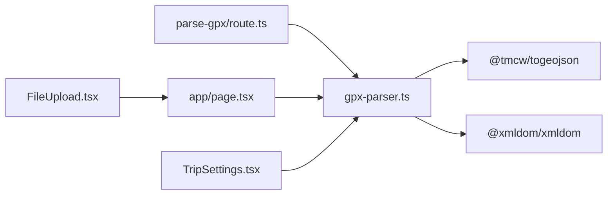

# GPX 轨迹解析引擎

<cite>
**本文引用的文件**   
- [lib/gpx-parser.ts](file://lib/gpx-parser.ts)
- [app/api/parse-gpx/route.ts](file://app/api/parse-gpx/route.ts)
- [components/FileUpload.tsx](file://components/FileUpload.tsx)
- [components/TripSettings.tsx](file://components/TripSettings.tsx)
- [app/page.tsx](file://app/page.tsx)
</cite>

## 目录
1. [简介](#简介)
2. [项目结构](#项目结构)
3. [核心组件](#核心组件)
4. [架构总览](#架构总览)
5. [详细组件分析](#详细组件分析)
6. [依赖关系分析](#依赖关系分析)
7. [性能考量](#性能考量)
8. [故障排查指南](#故障排查指南)
9. [结论](#结论)
10. [附录](#附录)

## 简介
本文件面向“GPX 轨迹解析引擎”，系统性阐述以下方面：
- GPX 文件格式规范与 XML 解析流程
- 坐标数据处理逻辑（经纬度、高程、时间）
- Haversine 距离计算公式的实现原理与精度控制
- 智能采样算法的核心逻辑（采样间隔计算、边界点处理、性能优化）
- 活动类型配置扩展与自定义采样间隔选项
- 从文件上传到采样点生成的完整流程示例
- 错误处理机制与异常情况的解决方案

## 项目结构
围绕 GPX 解析的关键代码分布在以下位置：
- 解析与算法库：lib/gpx-parser.ts
- API 路由入口：app/api/parse-gpx/route.ts
- 前端上传组件：components/FileUpload.tsx
- 行程设置组件：components/TripSettings.tsx
- 主页面流程编排：app/page.tsx

图表来源
- [app/page.tsx:1-214](file://app/page.tsx#L1-L214)
- [components/FileUpload.tsx:1-97](file://components/FileUpload.tsx#L1-L97)
- [components/TripSettings.tsx:1-175](file://components/TripSettings.tsx#L1-L175)
- [app/api/parse-gpx/route.ts:1-48](file://app/api/parse-gpx/route.ts#L1-L48)
- [lib/gpx-parser.ts:1-231](file://lib/gpx-parser.ts#L1-L231)

章节来源
- [app/page.tsx:1-214](file://app/page.tsx#L1-L214)
- [components/FileUpload.tsx:1-97](file://components/FileUpload.tsx#L1-L97)
- [components/TripSettings.tsx:1-175](file://components/TripSettings.tsx#L1-L175)
- [app/api/parse-gpx/route.ts:1-48](file://app/api/parse-gpx/route.ts#L1-L48)
- [lib/gpx-parser.ts:1-231](file://lib/gpx-parser.ts#L1-L231)

## 核心组件
- 数据模型
  - TrackPoint：包含纬度、经度、可选高程与时间
  - SamplePoint：在 TrackPoint 基础上增加索引、累计距离、预计到达时间等字段
  - ActivityType：活动类型配置，含标识、标签、图标、平均速度
  - SampleIntervalOption：采样间隔配置项
- 常量配置
  - ACTIVITY_TYPES：内置活动类型列表
  - SAMPLE_INTERVALS：预设采样间隔选项
- 核心函数
  - haversineDistance：Haversine 球面距离计算
  - resamplePoints：通用重采样函数（按累计距离与最大样本数限制）
  - estimateArrivalTimes：XML 解析、全量点提取、总距离计算、默认采样策略、名称提取
- API 层
  - POST /api/parse-gpx：接收 .gpx 文件，调用解析器，返回结构化结果并对全量点进行渲染级限流

章节来源
- [lib/gpx-parser.ts:4-42](file://lib/gpx-parser.ts#L4-L42)
- [lib/gpx-parser.ts:44-94](file://lib/gpx-parser.ts#L44-L94)
- [lib/gpx-parser.ts:119-137](file://lib/gpx-parser.ts#L119-L137)
- [lib/gpx-parser.ts:139-230](file://lib/gpx-parser.ts#L139-L230)
- [app/api/parse-gpx/route.ts:1-48](file://app/api/parse-gpx/route.ts#L1-L48)

## 架构总览
整体流程：前端上传 GPX → Next.js API 路由校验并读取文本 → 调用解析库进行 XML 解析与采样 → 返回结构化结果。

图表来源
- [app/page.tsx:30-60](file://app/page.tsx#L30-L60)
- [components/FileUpload.tsx:28-48](file://components/FileUpload.tsx#L28-L48)
- [app/api/parse-gpx/route.ts:4-46](file://app/api/parse-gpx/route.ts#L4-L46)
- [lib/gpx-parser.ts:139-230](file://lib/gpx-parser.ts#L139-L230)

## 详细组件分析

### GPX 文件格式与 XML 解析流程
- 输入：浏览器端以 FormData 上传的 .gpx 文件
- 解析步骤
  - 使用 DOMParser 将 XML 字符串解析为文档对象
  - 通过 toGeoJSON 将 GPX 转换为 GeoJSON
  - 遍历 features，筛选 LineString 几何，提取坐标序列为 TrackPoint[]
  - 若未找到有效轨迹点，抛出错误
- 输出：ParseResult（包含 name、totalDistance、allPoints、samplePoints）

图表来源
- [lib/gpx-parser.ts:139-159](file://lib/gpx-parser.ts#L139-L159)
- [lib/gpx-parser.ts:161-170](file://lib/gpx-parser.ts#L161-L170)
- [lib/gpx-parser.ts:220-229](file://lib/gpx-parser.ts#L220-L229)

章节来源
- [lib/gpx-parser.ts:139-159](file://lib/gpx-parser.ts#L139-L159)
- [lib/gpx-parser.ts:161-170](file://lib/gpx-parser.ts#L161-L170)
- [lib/gpx-parser.ts:220-229](file://lib/gpx-parser.ts#L220-L229)

### 坐标数据处理与 Haversine 距离
- 坐标来源：GeoJSON coordinates 数组，顺序为 [经度, 纬度, 可选高程]
- 距离计算：Haversine 公式，地球半径取 6371 km，角度单位统一为弧度
- 精度控制：累计距离与最终距离保留一位小数（乘以 10 后四舍五入再除以 10），避免浮点误差累积影响显示

图表来源
- [lib/gpx-parser.ts:119-137](file://lib/gpx-parser.ts#L119-L137)

章节来源
- [lib/gpx-parser.ts:119-137](file://lib/gpx-parser.ts#L119-L137)

### 智能采样算法
- 目标：在保持轨迹代表性的前提下减少点数，便于后续天气查询与可视化
- 关键参数
  - intervalKm：采样间隔（km）
  - maxSamples：最大样本数上限
- 算法要点
  - 始终包含起点
  - 沿轨迹累加相邻点间 Haversine 距离，当累计距离达到下一个采样阈值时插入一个采样点
  - 始终包含终点（若尚未被采样且未达到上限）
  - 对 distanceFromStart 做一位小数舍入
- 复杂度
  - 时间 O(N)，空间 O(M)（M 为采样点数）

图表来源
- [lib/gpx-parser.ts:44-94](file://lib/gpx-parser.ts#L44-L94)
- [lib/gpx-parser.ts:172-218](file://lib/gpx-parser.ts#L172-L218)

章节来源
- [lib/gpx-parser.ts:44-94](file://lib/gpx-parser.ts#L44-L94)
- [lib/gpx-parser.ts:172-218](file://lib/gpx-parser.ts#L172-L218)

### 活动类型配置与自定义采样间隔
- 活动类型
  - 通过 ACTIVITY_TYPES 配置不同活动的平均速度（km/h），用于估算到达时间与行程时长
  - 可在该数组中新增条目以扩展新的活动类型
- 采样间隔
  - SAMPLE_INTERVALS 提供常用间隔选项；可据此在前端下拉菜单中动态生成
  - 也可根据业务需求调整默认采样策略（例如在 estimateArrivalTimes 中修改 sampleIntervalKm 与 maxSamples）

章节来源
- [lib/gpx-parser.ts:24-42](file://lib/gpx-parser.ts#L24-L42)
- [components/TripSettings.tsx:42-53](file://components/TripSettings.tsx#L42-L53)

### 从文件上传到采样点生成的完整流程
- 前端交互
  - FileUpload 支持拖拽与点击选择，仅接受 .gpx 后缀
  - app/page.tsx 负责状态管理与请求编排
- API 路由
  - 校验文件存在性与后缀
  - 读取文件文本并调用解析器
  - 对 allPoints 进行渲染级限流（最多约 2000 点）
- 解析库
  - 解析 XML、提取轨迹点、计算总距离、执行采样、提取名称

图表来源
- [components/FileUpload.tsx:28-48](file://components/FileUpload.tsx#L28-L48)
- [app/page.tsx:30-60](file://app/page.tsx#L30-L60)
- [app/api/parse-gpx/route.ts:4-46](file://app/api/parse-gpx/route.ts#L4-L46)
- [lib/gpx-parser.ts:139-230](file://lib/gpx-parser.ts#L139-L230)

章节来源
- [components/FileUpload.tsx:1-97](file://components/FileUpload.tsx#L1-L97)
- [app/page.tsx:1-214](file://app/page.tsx#L1-L214)
- [app/api/parse-gpx/route.ts:1-48](file://app/api/parse-gpx/route.ts#L1-L48)
- [lib/gpx-parser.ts:139-230](file://lib/gpx-parser.ts#L139-L230)

## 依赖关系分析
- 外部依赖
  - @tmcw/togeojson：GPX→GeoJSON 转换
  - @xmldom/xmldom：XML 解析
- 内部依赖
  - API 路由依赖解析库
  - 前端组件依赖解析库导出的类型与常量

图表来源
- [app/api/parse-gpx/route.ts:1-48](file://app/api/parse-gpx/route.ts#L1-L48)
- [lib/gpx-parser.ts:1-2](file://lib/gpx-parser.ts#L1-L2)
- [app/page.tsx:1-214](file://app/page.tsx#L1-L214)
- [components/FileUpload.tsx:1-97](file://components/FileUpload.tsx#L1-L97)
- [components/TripSettings.tsx:1-175](file://components/TripSettings.tsx#L1-L175)

章节来源
- [lib/gpx-parser.ts:1-2](file://lib/gpx-parser.ts#L1-L2)
- [app/api/parse-gpx/route.ts:1-48](file://app/api/parse-gpx/route.ts#L1-L48)
- [app/page.tsx:1-214](file://app/page.tsx#L1-L214)
- [components/FileUpload.tsx:1-97](file://components/FileUpload.tsx#L1-L97)
- [components/TripSettings.tsx:1-175](file://components/TripSettings.tsx#L1-L175)

## 性能考量
- 采样降维
  - 通过 resamplePoints 与默认采样策略控制样本数量，降低后续天气查询与渲染压力
- 渲染限流
  - API 层对 allPoints 进行抽样，确保不超过约 2000 点，提升前端地图渲染性能
- 数值精度
  - 距离计算采用一位小数舍入，平衡精度与稳定性
- 建议
  - 对于超长轨迹，可适当增大 intervalKm 或提高 maxSamples 上限
  - 前端可根据设备能力进一步限制 allPoints 的显示数量

章节来源
- [lib/gpx-parser.ts:44-94](file://lib/gpx-parser.ts#L44-L94)
- [app/api/parse-gpx/route.ts:26-33](file://app/api/parse-gpx/route.ts#L26-L33)

## 故障排查指南
- 常见错误
  - 未上传文件或后缀非 .gpx：API 返回 400 错误
  - GPX 文件中无有效轨迹点：解析库抛出错误
  - 网络或服务异常：上层捕获并返回 500 错误
- 定位方法
  - 检查浏览器控制台与 Network 面板的请求/响应
  - 确认 GPX 文件包含有效的 track/line 数据
- 恢复策略
  - 前端在错误状态下提供“重新开始”按钮，重置状态
  - 建议在 API 层记录错误日志以便追踪

章节来源
- [app/api/parse-gpx/route.ts:9-21](file://app/api/parse-gpx/route.ts#L9-L21)
- [lib/gpx-parser.ts:157-159](file://lib/gpx-parser.ts#L157-L159)
- [app/api/parse-gpx/route.ts:42-46](file://app/api/parse-gpx/route.ts#L42-L46)
- [app/page.tsx:56-59](file://app/page.tsx#L56-L59)

## 结论
本解析引擎以轻量、可扩展的方式完成 GPX 文件的解析、距离计算与智能采样，并通过 API 层限流保障前端渲染性能。通过活动类型与采样间隔的可配置化，系统能够灵活适配不同出行场景与数据规模。

## 附录
- 扩展活动类型
  - 在 ACTIVITY_TYPES 中添加新条目，包含 id、label、icon、avgSpeedKmh
- 自定义采样间隔
  - 在 SAMPLE_INTERVALS 中新增选项，并在前端表单中渲染
  - 如需改变默认策略，可在 estimateArrivalTimes 中调整 sampleIntervalKm 与 maxSamples
- 参考实现路径
  - 活动类型定义与使用：[lib/gpx-parser.ts:24-42](file://lib/gpx-parser.ts#L24-L42)、[components/TripSettings.tsx:42-53](file://components/TripSettings.tsx#L42-L53)
  - 采样函数与默认策略：[lib/gpx-parser.ts:44-94](file://lib/gpx-parser.ts#L44-L94)、[lib/gpx-parser.ts:172-218](file://lib/gpx-parser.ts#L172-L218)
  - API 限流策略：[app/api/parse-gpx/route.ts:26-33](file://app/api/parse-gpx/route.ts#L26-L33)