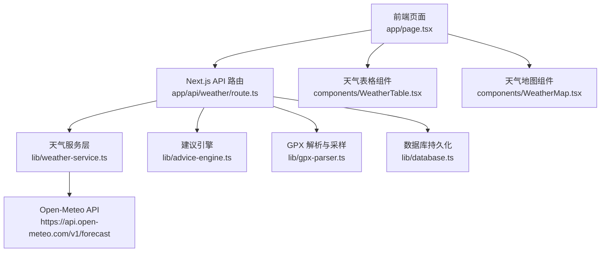
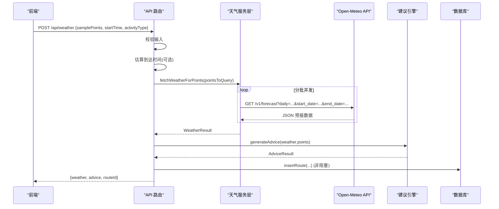
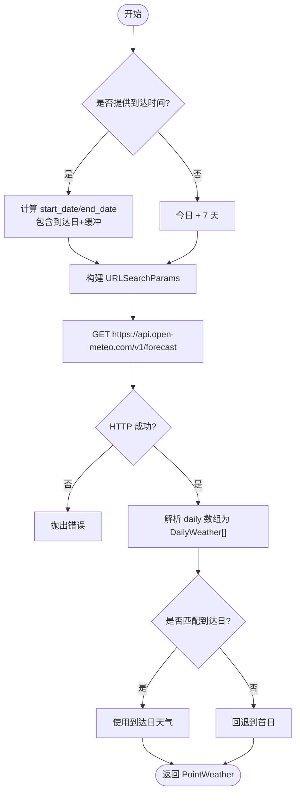
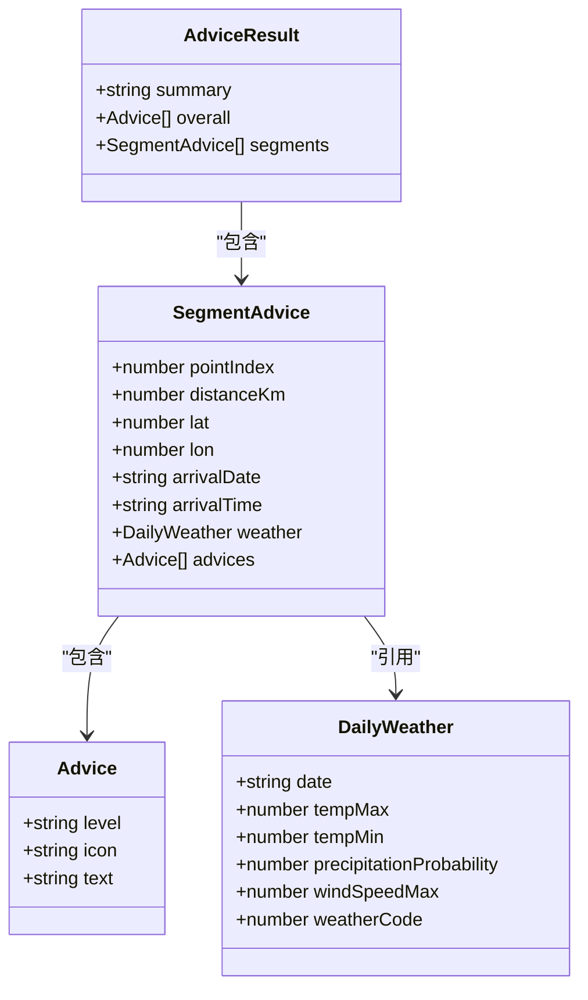
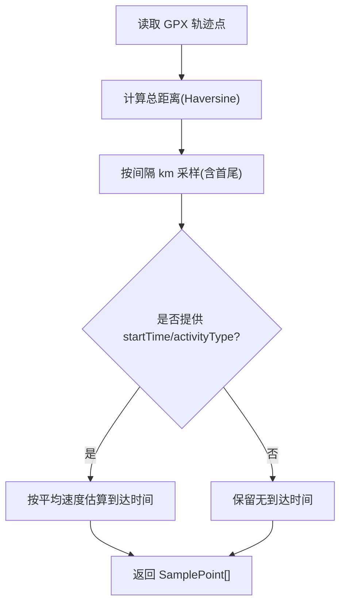
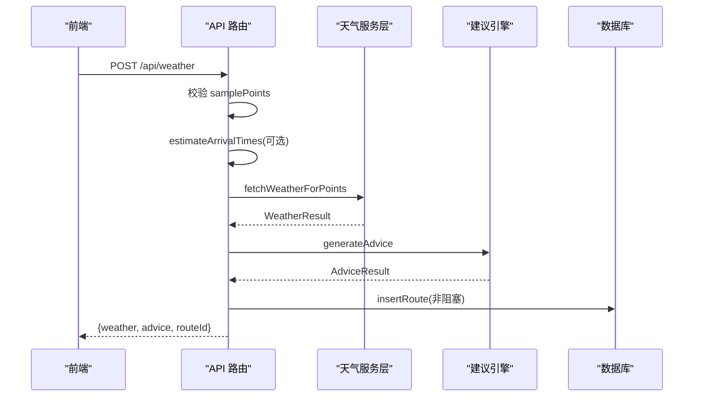
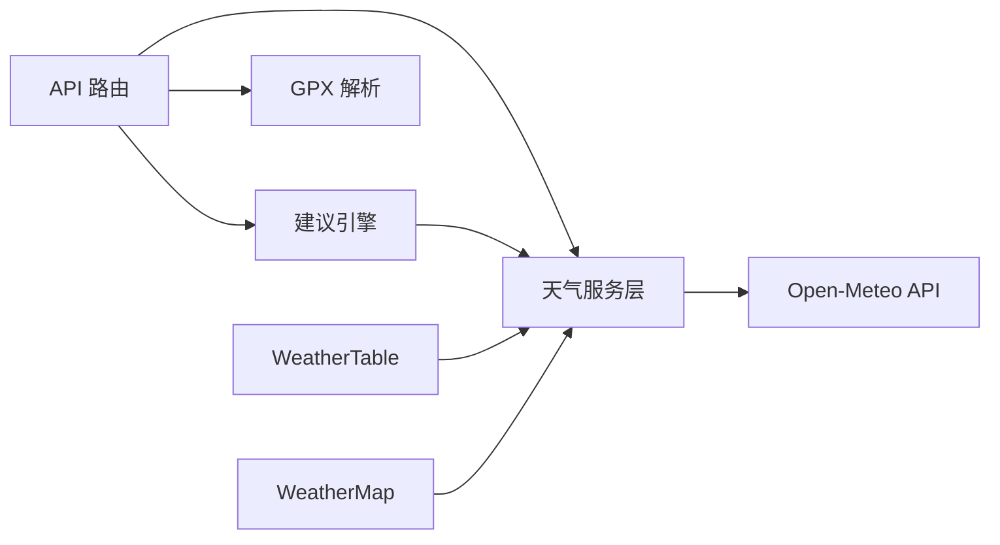

# 天气服务集成

<cite>
**本文引用的文件**
- [lib/weather-service.ts](file://lib/weather-service.ts)
- [app/api/weather/route.ts](file://app/api/weather/route.ts)
- [components/WeatherTable.tsx](file://components/WeatherTable.tsx)
- [components/WeatherMap.tsx](file://components/WeatherMap.tsx)
- [lib/gpx-parser.ts](file://lib/gpx-parser.ts)
- [lib/advice-engine.ts](file://lib/advice-engine.ts)
- [package.json](file://package.json)
</cite>

## 目录
1. [简介](#简介)
2. [项目结构](#项目结构)
3. [核心组件](#核心组件)
4. [架构总览](#架构总览)
5. [详细组件分析](#详细组件分析)
6. [依赖关系分析](#依赖关系分析)
7. [性能与并发优化](#性能与并发优化)
8. [故障排查指南](#故障排查指南)
9. [结论](#结论)
10. [附录：API 调用示例与数据结构](#附录api-调用示例与数据结构)

## 简介
本模块面向户外轨迹场景，提供基于 Open-Meteo API 的天气服务集成能力。其目标包括：
- 按采样点批量获取实时与未来7天预报数据
- 将 WMO 天气代码映射为中文描述与图标
- 根据活动类型与起始时间估算到达时间，并据此智能计算查询日期范围
- 生成可执行的出行建议（降水、温度、风、雷暴、降雪等）
- 在 Next.js 服务端路由中聚合天气与建议，并持久化到数据库

## 项目结构
围绕天气服务的核心文件分布如下：
- 服务端 API 路由：接收前端请求，调度天气与建议引擎，落库
- 天气服务层：封装 Open-Meteo 请求参数构建、批量并发控制、响应解析与 WMO 映射
- 建议引擎：基于天气指标生成分级建议与总体摘要
- GPX 解析器：从轨迹中提取采样点、估算到达时间
- 前端展示：表格与地图可视化天气与建议

图表来源
- [app/api/weather/route.ts:1-93](file://app/api/weather/route.ts#L1-L93)
- [lib/weather-service.ts:71-176](file://lib/weather-service.ts#L71-L176)
- [lib/advice-engine.ts:118-201](file://lib/advice-engine.ts#L118-L201)
- [lib/gpx-parser.ts:44-110](file://lib/gpx-parser.ts#L44-L110)

章节来源
- [app/api/weather/route.ts:1-93](file://app/api/weather/route.ts#L1-L93)
- [lib/weather-service.ts:1-176](file://lib/weather-service.ts#L1-L176)
- [lib/advice-engine.ts:1-201](file://lib/advice-engine.ts#L1-L201)
- [lib/gpx-parser.ts:1-231](file://lib/gpx-parser.ts#L1-L231)
- [components/WeatherTable.tsx:1-102](file://components/WeatherTable.tsx#L1-L102)
- [components/WeatherMap.tsx:1-182](file://components/WeatherMap.tsx#L1-L182)

## 核心组件
- 天气服务层
  - 负责构造 Open-Meteo 请求参数、批量并发拉取、响应解析、WMO 代码映射与中文描述转换
- 建议引擎
  - 基于每日天气指标生成分级建议（info/warning/danger），并汇总整体摘要
- GPX 解析与采样
  - 从 GPX 提取轨迹点，按距离间隔采样，支持根据活动类型估算到达时间
- API 路由
  - 校验输入、估算到达时间、调用天气服务、生成建议、落库并返回结果
- 前端展示
  - 表格与地图组件使用 WMO 映射函数渲染天气图标与中文描述

章节来源
- [lib/weather-service.ts:1-176](file://lib/weather-service.ts#L1-L176)
- [lib/advice-engine.ts:1-201](file://lib/advice-engine.ts#L1-L201)
- [lib/gpx-parser.ts:1-231](file://lib/gpx-parser.ts#L1-L231)
- [app/api/weather/route.ts:1-93](file://app/api/weather/route.ts#L1-L93)
- [components/WeatherTable.tsx:1-102](file://components/WeatherTable.tsx#L1-L102)
- [components/WeatherMap.tsx:1-182](file://components/WeatherMap.tsx#L1-L182)

## 架构总览
系统采用前后端分离的 BFF 模式：前端发起请求至 Next.js API 路由，路由组合天气服务与建议引擎，必要时进行数据库写入，最终返回结构化结果供前端渲染。

图表来源
- [app/api/weather/route.ts:7-92](file://app/api/weather/route.ts#L7-L92)
- [lib/weather-service.ts:71-176](file://lib/weather-service.ts#L71-L176)
- [lib/advice-engine.ts:118-201](file://lib/advice-engine.ts#L118-L201)

## 详细组件分析

### 天气服务层（Open-Meteo 集成）
- 请求参数构建
  - 维度：纬度、经度
  - 字段：最高温、最低温、最大降水概率、天气代码、最大风速
  - 时区：自动
  - 日期范围：根据是否提供到达时间动态计算
- 批量并发策略
  - 以固定批次大小并行请求，避免一次性并发过高导致限流或资源耗尽
- 响应解析
  - 将 Open-Meteo 的 daily 数组映射为内部 DailyWeather 列表
  - 匹配到达日期的天气；若无则回退到首日
- WMO 映射与中文描述
  - 提供天气代码到中文描述与图标的映射函数

图表来源
- [lib/weather-service.ts:89-176](file://lib/weather-service.ts#L89-L176)

章节来源
- [lib/weather-service.ts:24-69](file://lib/weather-service.ts#L24-L69)
- [lib/weather-service.ts:71-176](file://lib/weather-service.ts#L71-L176)

### 建议引擎（分级建议与摘要）
- 规则维度
  - 降水概率：>70% 警告，>50% 提示
  - 雷暴：天气代码>=95 危险
  - 高温：最高温≥35℃ 警告，≥30℃ 提示
  - 低温：最低温≤0℃ 警告，≤5℃ 提示
  - 大风：最大风速>50km/h 危险，>30km/h 警告
  - 降雪：代码区间内提示路面湿滑
- 汇总逻辑
  - 去重并按严重级别排序
  - 生成整体摘要（平均温度、天气状况集合、最高降水概率）

图表来源
- [lib/advice-engine.ts:7-28](file://lib/advice-engine.ts#L7-L28)
- [lib/weather-service.ts:3-10](file://lib/weather-service.ts#L3-L10)

章节来源
- [lib/advice-engine.ts:30-116](file://lib/advice-engine.ts#L30-L116)
- [lib/advice-engine.ts:118-201](file://lib/advice-engine.ts#L118-L201)

### GPX 解析与采样、到达时间估算
- 采样算法
  - 按累计距离间隔采样，限制最小/最大样本数，确保首尾点存在
- 到达时间估算
  - 根据活动类型的平均速度，将距离转换为耗时，叠加起始时间得到 ISO 到达时间
- 输出
  - TrackPoint 原始点集
  - SamplePoint 采样点集（含索引、累计距离、可选到达时间）

图表来源
- [lib/gpx-parser.ts:44-110](file://lib/gpx-parser.ts#L44-L110)
- [lib/gpx-parser.ts:119-137](file://lib/gpx-parser.ts#L119-L137)

章节来源
- [lib/gpx-parser.ts:44-110](file://lib/gpx-parser.ts#L44-L110)
- [lib/gpx-parser.ts:119-137](file://lib/gpx-parser.ts#L119-L137)

### API 路由（入口与编排）
- 输入校验：必须提供采样点
- 到达时间估算：当提供起始时间与活动类型时启用
- 天气与建议：顺序调用天气服务与建议引擎
- 落库：异步保存路线与建议，失败不阻断主流程
- 错误处理：统一捕获并返回 500 错误信息

图表来源
- [app/api/weather/route.ts:7-92](file://app/api/weather/route.ts#L7-L92)

章节来源
- [app/api/weather/route.ts:1-93](file://app/api/weather/route.ts#L1-L93)

### 前端展示（表格与地图）
- 表格组件
  - 显示序号、距离、到达时间、天气图标与中文描述、温度区间、降水概率、风速
  - 对高降水与高风速进行视觉强调
- 地图组件
  - 绘制轨迹线、采样点标记（颜色区分风险等级）
  - Tooltip/Popup 展示到达时间、天气详情与建议

章节来源
- [components/WeatherTable.tsx:1-102](file://components/WeatherTable.tsx#L1-L102)
- [components/WeatherMap.tsx:1-182](file://components/WeatherMap.tsx#L1-L182)

## 依赖关系分析
- 外部依赖
  - Open-Meteo 天气预报 API（HTTP 接口）
  - Leaflet 地图渲染
  - GPX 解析库（@tmcw/togeojson、@xmldom/xmldom）
- 内部依赖
  - API 路由依赖天气服务与建议引擎
  - 天气服务依赖 GPX 采样点模型
  - 建议引擎依赖天气服务的数据结构与映射函数

图表来源
- [app/api/weather/route.ts:1-93](file://app/api/weather/route.ts#L1-L93)
- [lib/weather-service.ts:1-176](file://lib/weather-service.ts#L1-L176)
- [lib/advice-engine.ts:1-201](file://lib/advice-engine.ts#L1-L201)
- [lib/gpx-parser.ts:1-231](file://lib/gpx-parser.ts#L1-L231)
- [components/WeatherTable.tsx:1-102](file://components/WeatherTable.tsx#L1-L102)
- [components/WeatherMap.tsx:1-182](file://components/WeatherMap.tsx#L1-L182)

章节来源
- [package.json:11-21](file://package.json#L11-L21)

## 性能与并发优化
- 批量并发控制
  - 通过固定批次大小并行请求，降低瞬时并发压力，提高吞吐稳定性
- 重试机制
  - 当前实现未内置重试逻辑。建议在天气服务层引入指数退避重试，针对网络抖动与临时性错误（如 429/5xx）进行有限次重试
- 超时控制
  - 当前未显式设置超时。建议为每个 Open-Meteo 请求配置合理超时（例如 5-10 秒），并在路由层增加整体超时保护
- 降级策略
  - 若 Open-Meteo 不可用，可回退到缓存的历史天气数据或仅返回基础建议（忽略天气细节）
- 缓存
  - 对相同经纬度与日期范围的请求进行短期缓存，减少重复请求
- 采样点数量控制
  - 采样点上限已做约束，避免单次请求过多导致后端压力过大

[本节为通用性能建议，无需特定文件来源]

## 故障排查指南
- 常见错误
  - 未提供采样点：路由层会返回 400 错误
  - 天气 API 请求失败：天气服务层抛出错误，路由层捕获后返回 500
  - 数据库写入失败：记录日志但不影响主流程返回
- 定位步骤
  - 检查前端请求体是否包含 samplePoints
  - 查看天气服务层抛出的错误消息（包含 HTTP 状态码与文本）
  - 确认 Open-Meteo 域名可达性与网络环境
  - 检查到达时间估算是否正确（startTime/activityType 是否有效）
- 日志与监控
  - 在路由层与天气服务层增加结构化日志（请求参数、耗时、错误堆栈）
  - 统计失败率与延迟分布，识别限流或异常峰值

章节来源
- [app/api/weather/route.ts:24-29](file://app/api/weather/route.ts#L24-L29)
- [app/api/weather/route.ts:77-80](file://app/api/weather/route.ts#L77-L80)
- [app/api/weather/route.ts:87-91](file://app/api/weather/route.ts#L87-L91)
- [lib/weather-service.ts:141-145](file://lib/weather-service.ts#L141-L145)

## 结论
该天气服务集成模块以清晰的职责划分实现了从轨迹采样、到达时间估算、Open-Meteo 批量请求、WMO 映射到建议生成的完整链路。当前实现具备稳定的并发控制与基本的错误处理，后续可在重试、超时、缓存与降级方面进一步增强鲁棒性与可用性。

[本节为总结性内容，无需特定文件来源]

## 附录：API 调用示例与数据结构

### 请求示例（前端 -> API 路由）
- 方法：POST
- 路径：/api/weather
- 请求体字段
  - name: 轨迹名称（可选）
  - samplePoints: 采样点数组（必填）
  - allPoints: 原始轨迹点（可选）
  - startTime: 起始时间 ISO 字符串（可选）
  - activityType: 活动类型 ID（可选）
- 响应体字段
  - weather: 天气结果对象
  - advice: 建议结果对象
  - routeId: 数据库写入后的标识（可能为空）

章节来源
- [app/api/weather/route.ts:7-22](file://app/api/weather/route.ts#L7-L22)
- [app/api/weather/route.ts:82-86](file://app/api/weather/route.ts#L82-L86)

### Open-Meteo 请求参数说明
- 必选
  - latitude: 纬度
  - longitude: 经度
  - daily: 所需字段列表（温度、降水概率、天气代码、风速）
  - timezone: auto
  - start_date/end_date: 日期范围（由到达时间或默认 7 天决定）
- 示例参数键名
  - latitude, longitude, daily, timezone, start_date, end_date

章节来源
- [lib/weather-service.ts:128-136](file://lib/weather-service.ts#L128-L136)

### 关键数据结构定义
- DailyWeather
  - 字段：date、tempMax、tempMin、precipitationProbability、windSpeedMax、weatherCode
- PointWeather
  - 字段：point、arrivalDate、arrivalTime、weather、forecast
- WeatherResult
  - 字段：points（PointWeather 数组）
- Advice
  - 字段：level、icon、text
- SegmentAdvice
  - 字段：pointIndex、distanceKm、lat、lon、arrivalDate、arrivalTime、weather、advices
- AdviceResult
  - 字段：summary、overall、segments

章节来源
- [lib/weather-service.ts:3-22](file://lib/weather-service.ts#L3-L22)
- [lib/advice-engine.ts:7-28](file://lib/advice-engine.ts#L7-L28)

### WMO 天气代码映射与中文描述
- 映射函数
  - getWeatherDescription(code): 返回中文描述
  - getWeatherIcon(code): 返回对应图标
- 覆盖范围
  - 晴朗、多云、雾、毛毛雨、雨、冻雨、雪、阵雪、雷暴、冰雹等

章节来源
- [lib/weather-service.ts:24-69](file://lib/weather-service.ts#L24-L69)

### 日期范围智能计算算法
- 有到达时间
  - start_date = max(今天, 到达日期)
  - end_date = min(到达日期+1天, 今天+16天)
- 无到达时间
  - start_date = 今天
  - end_date = 今天+7天

章节来源
- [lib/weather-service.ts:102-126](file://lib/weather-service.ts#L102-L126)

### 批量请求优化策略
- 并发控制
  - 固定批次大小并行请求，逐批推进
- 重试机制
  - 当前未实现，建议添加指数退避与最大重试次数
- 错误处理
  - 非 2xx 响应抛出错误，路由层统一捕获并返回 500

章节来源
- [lib/weather-service.ts:76-87](file://lib/weather-service.ts#L76-L87)
- [lib/weather-service.ts:141-145](file://lib/weather-service.ts#L141-L145)
- [app/api/weather/route.ts:87-91](file://app/api/weather/route.ts#L87-L91)