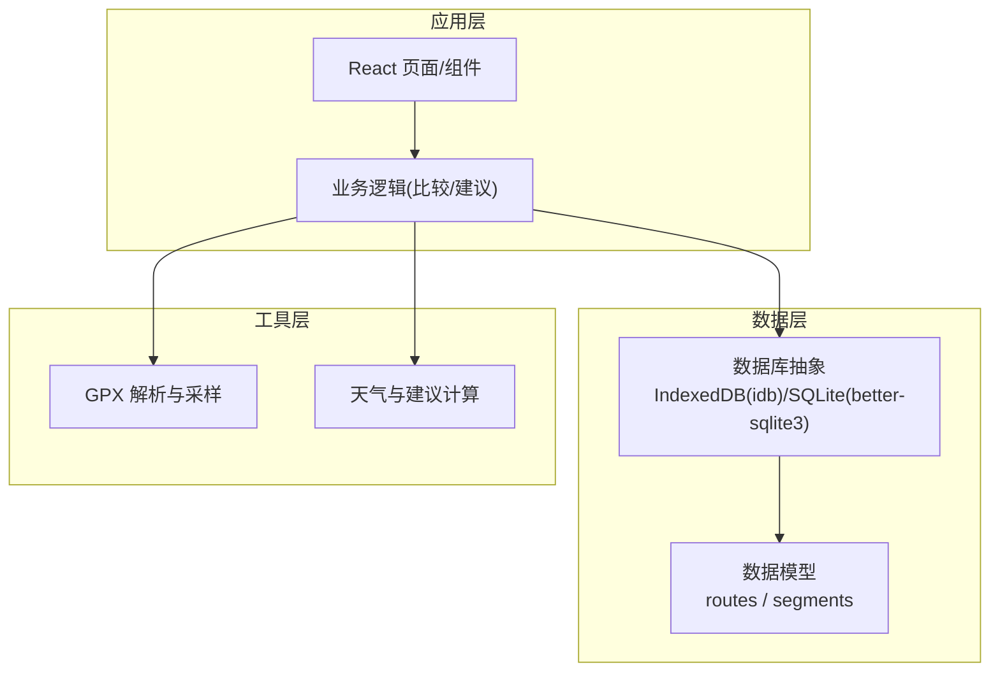
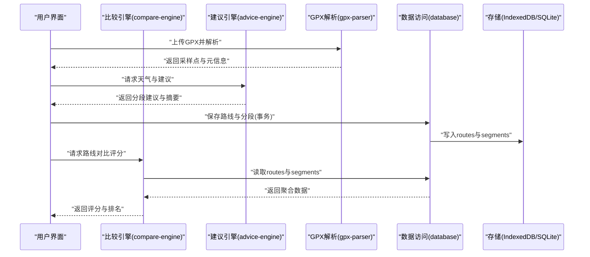
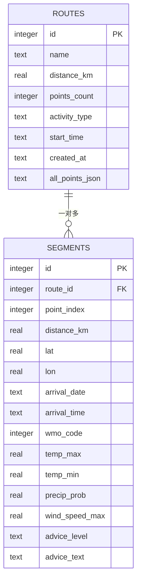
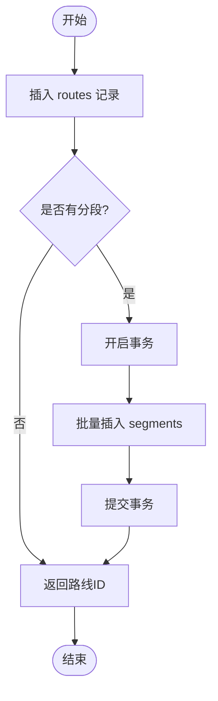
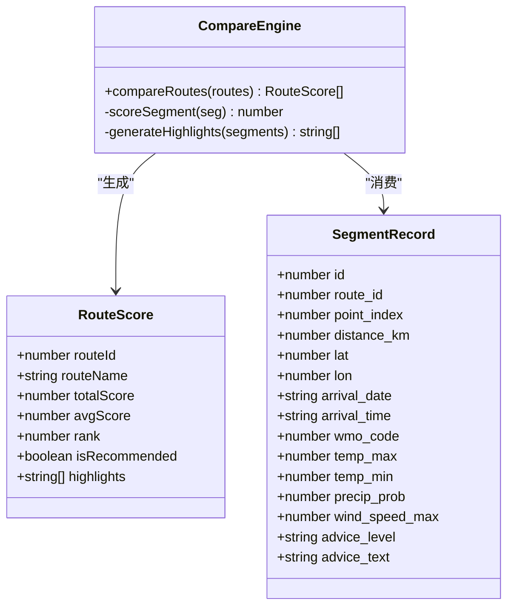
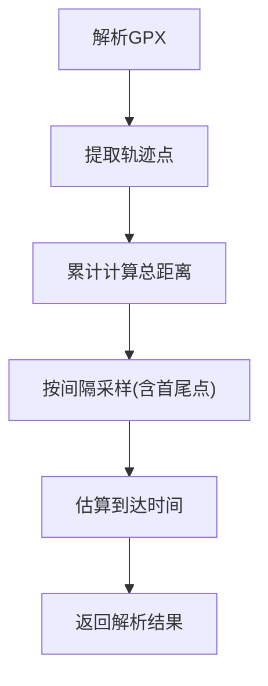
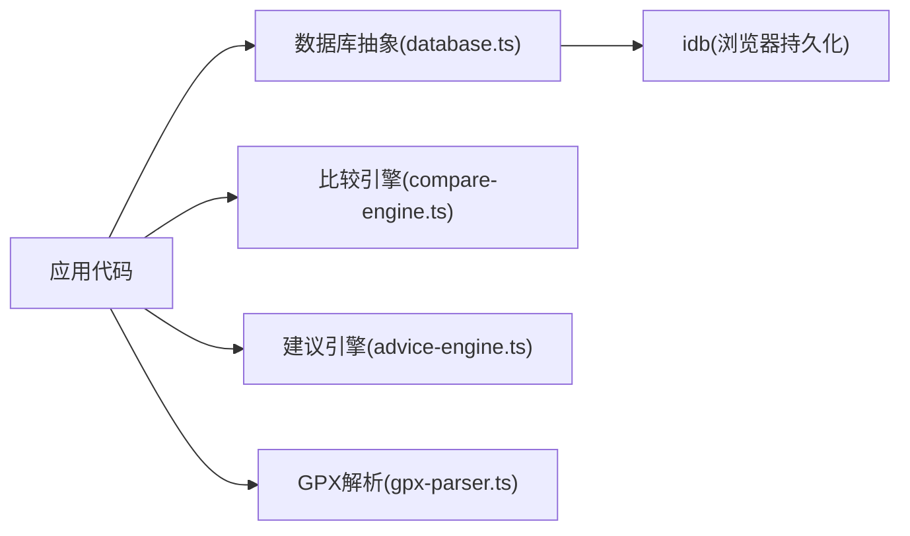

# 数据库管理系统

<cite>
**本文引用的文件**   
- [database.ts](file://src/lib/database.ts)
- [compare-engine.ts](file://src/lib/compare-engine.ts)
- [advice-engine.ts](file://src/lib/advice-engine.ts)
- [gpx-parser.ts](file://src/lib/gpx-parser.ts)
- [package.json](file://package.json)
</cite>

## 目录
1. [简介](#简介)
2. [项目结构](#项目结构)
3. [核心组件](#核心组件)
4. [架构总览](#架构总览)
5. [详细组件分析](#详细组件分析)
6. [依赖关系分析](#依赖关系分析)
7. [性能与优化](#性能与优化)
8. [故障排查指南](#故障排查指南)
9. [结论](#结论)
10. [附录](#附录)

## 简介
本文件系统性地梳理并文档化基于 SQLite 的本地数据层设计与实现，重点覆盖以下方面：
- 设计理念与架构选择：在浏览器环境中使用 IndexedDB（通过 idb）作为持久化存储，替代传统服务端 SQLite；同时保留对“双表模型”（routes + segments）的数据建模思路。
- 数据模型：详细说明 routes 与 segments 两张表的关系、字段定义及约束。
- CRUD 封装与事务：提供统一的增删改查接口，强调事务一致性。
- 索引与查询优化：给出针对常见查询路径的索引策略与调优建议。
- 典型操作示例：历史记录存储、批量写入、按条件查询与删除等。
- 迁移与版本管理：面向前端 IndexedDB 的迁移方案与版本控制策略。
- 连接池与资源释放：在浏览器环境下的最佳实践与注意事项。

说明：仓库中提供的 src/lib/database.ts 展示了基于 better-sqlite3 的服务端 SQLite 实现（WAL 模式、事务、外键级联删除等），可作为理解“双表模型”和事务处理的参考；但当前项目的运行时依赖为浏览器端（Vite + React），实际持久化应使用 IndexedDB（idb）。下文将分别阐述两种环境的差异与适配建议。

## 项目结构
本项目采用模块化组织方式，数据库相关逻辑集中在 lib 目录下：
- database.ts：数据访问层（SQLite 示例实现，便于理解模型与事务）
- gpx-parser.ts：GPX 解析与采样点生成
- advice-engine.ts：天气与建议引擎
- compare-engine.ts：路线评分与对比
- package.json：项目依赖声明（包含 idb）

图表来源
- [database.ts:1-204](file://src/lib/database.ts#L1-L204)
- [compare-engine.ts:1-116](file://src/lib/compare-engine.ts#L1-L116)
- [advice-engine.ts:1-201](file://src/lib/advice-engine.ts#L1-L201)
- [gpx-parser.ts:1-231](file://src/lib/gpx-parser.ts#L1-L231)
- [package.json:1-31](file://package.json#L1-L31)

章节来源
- [package.json:1-31](file://package.json#L1-L31)

## 核心组件
- 数据访问层（database.ts）
  - 提供 getDb、initTables、insertRoute、getAllRoutes、getRouteById、deleteRoute 等函数
  - 使用 WAL 日志模式提升并发读性能
  - 使用事务确保多语句操作的原子性
  - 使用外键 ON DELETE CASCADE 保证子记录一致性
- 业务逻辑层
  - compare-engine.ts：基于 segments 的天气指标进行评分与排序
  - advice-engine.ts：根据天气数据生成分段建议与总体摘要
- 数据处理层
  - gpx-parser.ts：解析 GPX、计算距离、采样点生成与到达时间估算

章节来源
- [database.ts:1-204](file://src/lib/database.ts#L1-L204)
- [compare-engine.ts:1-116](file://src/lib/compare-engine.ts#L1-L116)
- [advice-engine.ts:1-201](file://src/lib/advice-engine.ts#L1-L201)
- [gpx-parser.ts:1-231](file://src/lib/gpx-parser.ts#L1-L231)

## 架构总览
下图展示从用户交互到数据落盘的端到端流程，以及关键模块间的调用关系。

图表来源
- [database.ts:1-204](file://src/lib/database.ts#L1-L204)
- [compare-engine.ts:1-116](file://src/lib/compare-engine.ts#L1-L116)
- [advice-engine.ts:1-201](file://src/lib/advice-engine.ts#L1-L201)
- [gpx-parser.ts:1-231](file://src/lib/gpx-parser.ts#L1-L231)

## 详细组件分析

### 数据模型与关系（routes + segments）
- routes 表
  - 主键：自增整数
  - 名称、距离、点数、活动类型、开始时间、创建时间、全部点位 JSON
- segments 表
  - 主键：自增整数
  - 外键：route_id 引用 routes.id，ON DELETE CASCADE
  - 字段包括：point_index、distance_km、经纬度、到达日期/时间、WMO 代码、温度极值、降水概率、最大风速、建议等级与文本

图表来源
- [database.ts:23-55](file://src/lib/database.ts#L23-L55)

章节来源
- [database.ts:23-86](file://src/lib/database.ts#L23-L86)

### 数据访问层（CRUD 与事务）
- 插入路线与分段（事务）
  - 先插入 routes，再在事务中批量插入 segments，确保原子性与一致性
- 查询
  - 获取所有路线（排除大字段 all_points_json）
  - 按 ID 获取路线及其分段（按 point_index 升序）
- 删除
  - 使用事务顺序删除 segments 与 routes，或依赖外键级联删除

图表来源
- [database.ts:90-162](file://src/lib/database.ts#L90-L162)

章节来源
- [database.ts:90-203](file://src/lib/database.ts#L90-L203)

### 业务逻辑层（比较与评分）
- 评分维度
  - 降水概率、最大风速、WMO 天气代码、温度极值
- 输出
  - 总分、平均分、排名、是否推荐、亮点提示

图表来源
- [compare-engine.ts:1-116](file://src/lib/compare-engine.ts#L1-L116)
- [database.ts:70-86](file://src/lib/database.ts#L70-L86)

章节来源
- [compare-engine.ts:1-116](file://src/lib/compare-engine.ts#L1-L116)

### 数据处理层（GPX 解析与采样）
- 功能
  - 解析 GPX 轨迹点
  - 计算总距离
  - 按固定间隔采样（限制最小/最大样本数）
  - 估算到达时间（基于活动类型平均速度）

图表来源
- [gpx-parser.ts:139-231](file://src/lib/gpx-parser.ts#L139-L231)

章节来源
- [gpx-parser.ts:1-231](file://src/lib/gpx-parser.ts#L1-L231)

### 建议引擎（天气与建议）
- 依据 WMO 代码、降水概率、温度、风速等生成分级建议
- 汇总各段建议并按严重级别排序，形成总体摘要

章节来源
- [advice-engine.ts:1-201](file://src/lib/advice-engine.ts#L1-L201)

## 依赖关系分析
- 运行时依赖
  - idb：浏览器端 IndexedDB 封装，用于本地持久化
- 开发依赖
  - Vite、TypeScript、Tailwind 等构建与样式工具

图表来源
- [package.json:1-31](file://package.json#L1-L31)
- [database.ts:1-204](file://src/lib/database.ts#L1-L204)

章节来源
- [package.json:1-31](file://package.json#L1-L31)

## 性能与优化

### 索引策略（建议）
- routes
  - created_at：用于列表倒序排序
  - activity_type：用于按活动类型筛选
- segments
  - route_id：用于 JOIN 与按路线聚合
  - point_index：用于顺序读取
  - (arrival_date, arrival_time)：用于按时间段范围查询
  - (wmo_code)、(precip_prob)、(wind_speed_max)、(temp_max)、(temp_min)：用于评分与过滤

说明：上述索引为通用优化建议，具体需在目标数据库（IndexedDB 或 SQLite）中创建对应索引。

### 查询优化技巧
- 避免 SELECT *：仅选择必要字段，减少网络与序列化开销
- 分页与游标：大数据量时使用 LIMIT/OFFSET 或游标分页
- 预聚合：对常用统计（如平均评分）考虑物化视图或缓存
- 批量写入：使用事务包裹多条 INSERT，降低 I/O 次数

### 事务与一致性
- 使用事务确保多表写入的原子性
- 利用外键级联删除简化清理逻辑
- 长事务需谨慎，避免阻塞其他读写

章节来源
- [database.ts:17-55](file://src/lib/database.ts#L17-L55)
- [database.ts:137-159](file://src/lib/database.ts#L137-L159)
- [database.ts:190-203](file://src/lib/database.ts#L190-L203)

## 故障排查指南
- 常见问题
  - 未初始化数据目录或数据库文件权限问题（服务端 SQLite）
  - IndexedDB 配额不足导致写入失败（浏览器）
  - 事务回滚：检查外键约束与数据类型匹配
- 定位方法
  - 打印 SQL 执行计划（EXPLAIN QUERY PLAN）验证索引命中
  - 监控 WAL 文件大小与增长趋势（SQLite）
  - 在浏览器 DevTools 中查看 IndexedDB 状态与大小

章节来源
- [database.ts:10-21](file://src/lib/database.ts#L10-L21)
- [database.ts:190-203](file://src/lib/database.ts#L190-L203)

## 结论
本项目以“双表模型”为核心，围绕 routes 与 segments 构建了清晰的数据分层与业务处理链路。尽管仓库提供了 SQLite 的实现示例，但在浏览器环境下应优先采用 IndexedDB（idb）进行本地持久化。通过合理的事务设计、索引策略与查询优化，可在保证一致性的前提下获得良好的性能表现。

## 附录

### 典型操作示例（概念性步骤）
- 历史记录存储
  - 解析 GPX 得到采样点与元信息
  - 在事务中插入 routes 与 segments
- 批量查询
  - 按活动类型与时间范围筛选 routes
  - 关联 segments 进行评分与排序
- 数据删除
  - 按 route_id 删除 segments，再删除 routes（或使用外键级联）

### 数据迁移与版本管理（IndexedDB）
- 版本号管理
  - 使用 db.version 标识 schema 版本
- 升级策略
  - 在 onupgradeneeded 中检测版本并执行增量迁移
  - 新增对象存储或索引时，保持向后兼容
- 回滚与降级
  - 迁移前备份关键数据
  - 失败时回滚至上一版本

### 连接池与资源释放（浏览器环境）
- IndexedDB 无显式连接池概念
- 每次打开数据库后尽快关闭连接，避免长时间持有
- 避免在主线程执行耗时事务，必要时使用后台线程（Web Worker）