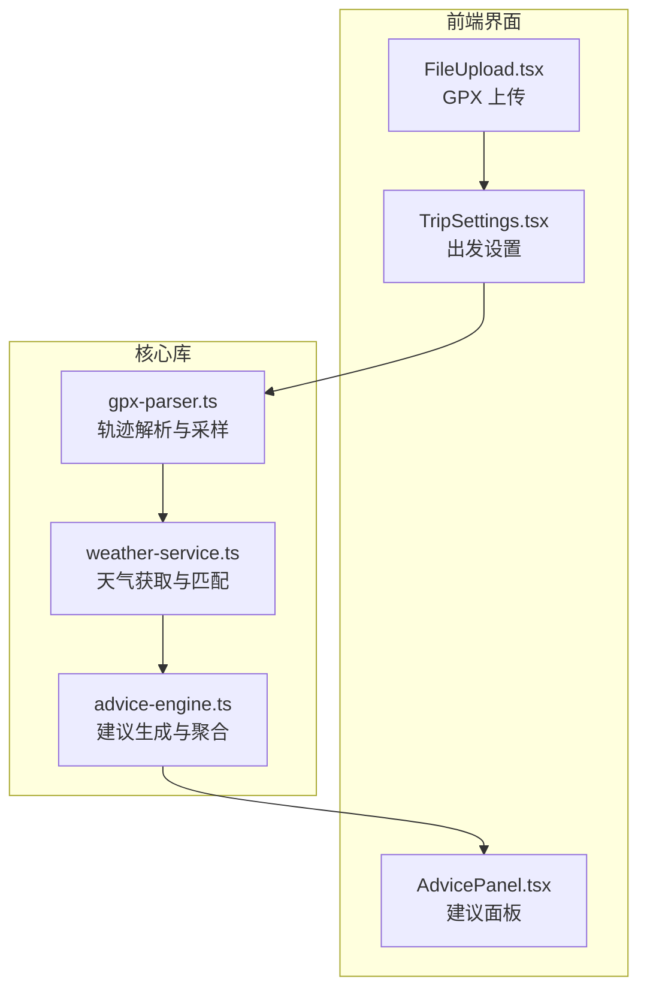
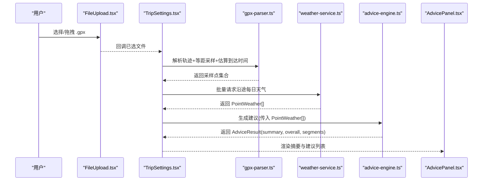
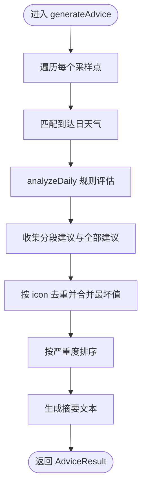
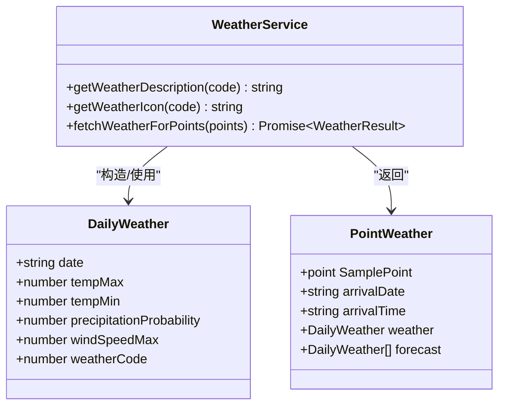
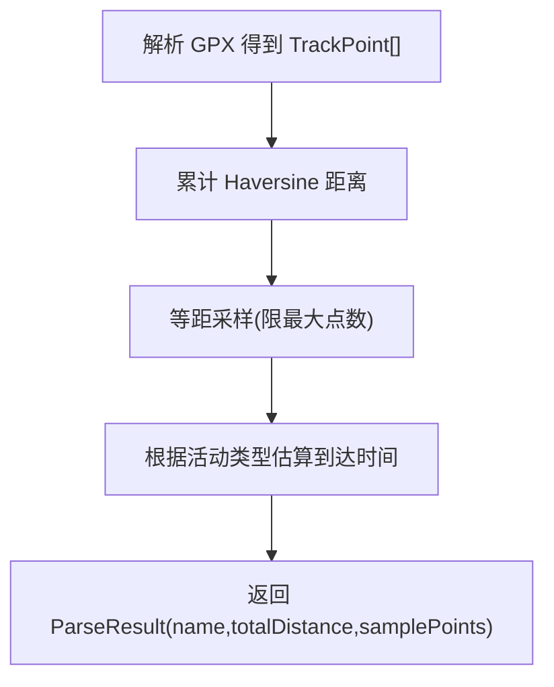
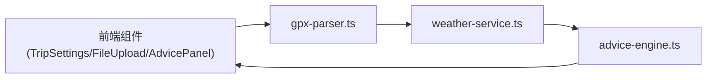

# 智能建议引擎

<cite>
**本文引用的文件**   
- [lib/advice-engine.ts](file://lib/advice-engine.ts)
- [lib/weather-service.ts](file://lib/weather-service.ts)
- [components/AdvicePanel.tsx](file://components/AdvicePanel.tsx)
- [lib/gpx-parser.ts](file://lib/gpx-parser.ts)
- [components/TripSettings.tsx](file://components/TripSettings.tsx)
- [components/FileUpload.tsx](file://components/FileUpload.tsx)
</cite>

## 目录
1. [简介](#简介)
2. [项目结构](#项目结构)
3. [核心组件](#核心组件)
4. [架构总览](#架构总览)
5. [详细组件分析](#详细组件分析)
6. [依赖关系分析](#依赖关系分析)
7. [性能与可扩展性](#性能与可扩展性)
8. [故障排查指南](#故障排查指南)
9. [结论](#结论)
10. [附录：规则扩展与模板定制](#附录：规则扩展与模板定制)

## 简介
本文件面向“智能建议引擎”的完整技术文档，聚焦多维度天气分析规则体系、分级预警系统、建议生成算法与去重合并机制，并提供扩展新规则与自定义建议模板的方法。同时给出典型业务场景示例（如雨天出行警告、高温防暑提示）以及规则配置优化与性能调优建议。

## 项目结构
本项目采用前后端同仓的 Next.js 应用，建议引擎的核心逻辑位于 lib 层，UI 展示位于 components 层，数据解析与采样在 gpx-parser 中完成。

图表来源
- [components/FileUpload.tsx:1-97](file://components/FileUpload.tsx#L1-L97)
- [components/TripSettings.tsx:1-175](file://components/TripSettings.tsx#L1-L175)
- [lib/gpx-parser.ts:1-231](file://lib/gpx-parser.ts#L1-L231)
- [lib/weather-service.ts:1-176](file://lib/weather-service.ts#L1-L176)
- [lib/advice-engine.ts:1-201](file://lib/advice-engine.ts#L1-L201)
- [components/AdvicePanel.tsx:1-65](file://components/AdvicePanel.tsx#L1-L65)

章节来源
- [components/FileUpload.tsx:1-97](file://components/FileUpload.tsx#L1-L97)
- [components/TripSettings.tsx:1-175](file://components/TripSettings.tsx#L1-L175)
- [lib/gpx-parser.ts:1-231](file://lib/gpx-parser.ts#L1-L231)
- [lib/weather-service.ts:1-176](file://lib/weather-service.ts#L1-L176)
- [lib/advice-engine.ts:1-201](file://lib/advice-engine.ts#L1-L201)
- [components/AdvicePanel.tsx:1-65](file://components/AdvicePanel.tsx#L1-L65)

## 核心组件
- 建议引擎（advice-engine.ts）
  - 负责将逐点天气数据转换为分段建议与整体建议，执行风险等级划分、阈值判断、按类别去重与最坏值合并、严重度排序与摘要生成。
- 天气服务（weather-service.ts）
  - 负责批量拉取 Open-Meteo 每日预报，映射 WMO 天气代码为中文描述与图标，并将到达日期与时间匹配到具体日级预报。
- GPX 解析器（gpx-parser.ts）
  - 负责解析 GPX 轨迹、计算总距离、等距采样、估算到达时间，并定义活动类型与默认速度。
- 建议面板（AdvicePanel.tsx）
  - 负责渲染总体摘要与分类后的建议列表，按危险级别进行视觉区分。
- 行程设置（TripSettings.tsx）
  - 提供出发时间与出行方式选择，驱动后续采样与天气查询流程。
- 文件上传（FileUpload.tsx）
  - 支持拖拽或选择 .gpx 文件，触发解析流程。

章节来源
- [lib/advice-engine.ts:1-201](file://lib/advice-engine.ts#L1-L201)
- [lib/weather-service.ts:1-176](file://lib/weather-service.ts#L1-L176)
- [lib/gpx-parser.ts:1-231](file://lib/gpx-parser.ts#L1-L231)
- [components/AdvicePanel.tsx:1-65](file://components/AdvicePanel.tsx#L1-L65)
- [components/TripSettings.tsx:1-175](file://components/TripSettings.tsx#L1-L175)
- [components/FileUpload.tsx:1-97](file://components/FileUpload.tsx#L1-L97)

## 架构总览
建议引擎的数据流从 GPX 解析开始，经采样与到达时间估算，再调用天气服务获取每日预报，最后由建议引擎生成多维度的出行建议并进行汇总与去重。

图表来源
- [components/FileUpload.tsx:1-97](file://components/FileUpload.tsx#L1-L97)
- [components/TripSettings.tsx:1-175](file://components/TripSettings.tsx#L1-L175)
- [lib/gpx-parser.ts:1-231](file://lib/gpx-parser.ts#L1-L231)
- [lib/weather-service.ts:1-176](file://lib/weather-service.ts#L1-L176)
- [lib/advice-engine.ts:1-201](file://lib/advice-engine.ts#L1-L201)
- [components/AdvicePanel.tsx:1-65](file://components/AdvicePanel.tsx#L1-L65)

## 详细组件分析

### 建议引擎（advice-engine.ts）
- 输入输出
  - 输入：PointWeather[]（每个采样点的地理信息、到达日期/时间、当日天气与完整 7 天预报）。
  - 输出：AdviceResult，包含 summary（文本摘要）、overall（去重后的整体建议）、segments（分段建议明细）。
- 多维度规则体系
  - 降水概率：>70% 标记 warning；>50% 标记 info。
  - 雷暴：weatherCode≥95 标记 danger。
  - 高温：最高温≥35°C 标记 warning；≥30°C 标记 info。
  - 低温：最低温≤0°C 标记 warning；≤5°C 标记 info。
  - 大风：最大风速>50km/h 标记 danger；>30km/h 标记 warning。
  - 降雪/阵雪：特定 weatherCode 区间（排除雪粒）标记 info，提示路面湿滑。
- 分级预警系统
  - 风险等级：danger > warning > info。
  - 严重度排序：overall 按等级降序排列，优先展示高风险项。
- 建议去重与合并策略
  - 以 icon 作为类别键进行去重。
  - 数值型指标通过正则提取首组数字进行比较，结合“越低越差”（如低温）与“越高越差”（如高温、大风、降水）的策略保留最坏值。
- 摘要生成
  - 统计平均最高/最低温度、最高降水概率、天气状况去重列表，拼接成自然语言摘要；若无任何告警则附加“适合出行”的友好提示。

图表来源
- [lib/advice-engine.ts:118-201](file://lib/advice-engine.ts#L118-L201)
- [lib/advice-engine.ts:30-116](file://lib/advice-engine.ts#L30-L116)

章节来源
- [lib/advice-engine.ts:1-201](file://lib/advice-engine.ts#L1-L201)

### 天气服务（weather-service.ts）
- 数据结构
  - DailyWeather：日期、最高/最低温、降水概率、最大风速、WMO 天气代码。
  - PointWeather：采样点、到达日期/时间、匹配到的当日天气、完整 7 天预报。
- 天气描述与图标
  - getWeatherDescription：WMO 代码到中文描述的映射。
  - getWeatherIcon：WMO 代码到 emoji 图标的映射。
- 批量获取与日期范围
  - fetchWeatherForPoints：按批次并发请求，提升吞吐。
  - fetchSinglePointWeather：根据到达日期动态确定 start_date/end_date，避免请求历史数据；若无法匹配到达日，回退到首日。
- 错误处理
  - 对非成功响应抛出明确错误信息，便于上层捕获与降级。

图表来源
- [lib/weather-service.ts:1-176](file://lib/weather-service.ts#L1-L176)

章节来源
- [lib/weather-service.ts:1-176](file://lib/weather-service.ts#L1-L176)

### GPX 解析与采样（gpx-parser.ts）
- 轨迹解析
  - 解析 GPX XML，提取 LineString 坐标序列，计算总距离（Haversine 公式）。
- 等距采样
  - 基于固定间隔（默认约 10km）进行采样，限制最小/最大采样点数，保证首尾点必含。
- 到达时间估算
  - 依据活动类型平均速度（步行、骑行、跑步、驾车等）推算各采样点预计到达时间，供天气服务按到达日匹配。
- 活动类型与采样间隔
  - ACTIVITY_TYPES：内置多种出行方式及默认速度。
  - SAMPLE_INTERVALS：可选采样间隔配置。

图表来源
- [lib/gpx-parser.ts:1-231](file://lib/gpx-parser.ts#L1-L231)

章节来源
- [lib/gpx-parser.ts:1-231](file://lib/gpx-parser.ts#L1-L231)

### 建议面板（AdvicePanel.tsx）
- 渲染摘要与建议列表
  - 根据 level 字段进行颜色与样式区分（danger/warning/info）。
  - 无建议时显示“整体天气良好，适合出行”。

章节来源
- [components/AdvicePanel.tsx:1-65](file://components/AdvicePanel.tsx#L1-L65)

### 行程设置（TripSettings.tsx）
- 提供出发时间与出行方式选择，计算预估时长，驱动后续天气查询与生成建议。

章节来源
- [components/TripSettings.tsx:1-175](file://components/TripSettings.tsx#L1-L175)

### 文件上传（FileUpload.tsx）
- 支持拖拽与点击选择 .gpx 文件，校验后缀后回调上层处理。

章节来源
- [components/FileUpload.tsx:1-97](file://components/FileUpload.tsx#L1-L97)

## 依赖关系分析
- 模块耦合
  - advice-engine.ts 依赖 weather-service.ts 的类型与工具函数。
  - TripSettings.tsx 依赖 gpx-parser.ts 的活动类型与采样能力。
  - AdvicePanel.tsx 仅消费 advice-engine.ts 的输出结构。
- 外部依赖
  - Open-Meteo 天气 API（HTTP 请求）。
  - @tmcw/togeojson 与 @xmldom/xmldom 用于 GPX 解析。

图表来源
- [components/TripSettings.tsx:1-175](file://components/TripSettings.tsx#L1-L175)
- [components/FileUpload.tsx:1-97](file://components/FileUpload.tsx#L1-L97)
- [components/AdvicePanel.tsx:1-65](file://components/AdvicePanel.tsx#L1-L65)
- [lib/gpx-parser.ts:1-231](file://lib/gpx-parser.ts#L1-L231)
- [lib/weather-service.ts:1-176](file://lib/weather-service.ts#L1-L176)
- [lib/advice-engine.ts:1-201](file://lib/advice-engine.ts#L1-L201)

章节来源
- [lib/advice-engine.ts:1-201](file://lib/advice-engine.ts#L1-L201)
- [lib/weather-service.ts:1-176](file://lib/weather-service.ts#L1-L176)
- [lib/gpx-parser.ts:1-231](file://lib/gpx-parser.ts#L1-L231)
- [components/AdvicePanel.tsx:1-65](file://components/AdvicePanel.tsx#L1-L65)
- [components/TripSettings.tsx:1-175](file://components/TripSettings.tsx#L1-L175)
- [components/FileUpload.tsx:1-97](file://components/FileUpload.tsx#L1-L97)

## 性能与可扩展性
- 并发与批处理
  - 天气请求按批次并发（每批 5 个），显著降低端到端延迟。
- 采样控制
  - 采样点数量上限与下限受控，避免过多天气请求与渲染压力。
- 去重与排序
  - 去重基于 icon 类别，减少冗余；排序按严重度，确保关键信息前置。
- 可扩展点
  - 新增规则：在 analyzeDaily 中追加条件分支，遵循现有 level/icon/text 规范。
  - 调整阈值：修改温度、风、降水等阈值常量，实现更细粒度控制。
  - 自定义模板：扩展 text 模板，结合 getWeatherDescription 与数值插值，保持可读性与一致性。
  - 权重与评分：可在去重阶段引入加权评分，替代简单的“最坏值”策略，以支持多指标融合。

[本节为通用指导，不直接分析具体文件]

## 故障排查指南
- 天气 API 失败
  - 现象：请求返回非 2xx 状态码。
  - 处理：上层应捕获异常并提示重试或降级（例如使用最近可用预报或默认建议）。
- 未匹配到达日天气
  - 现象：arrivalDate 存在但 forecast 中无对应日期。
  - 处理：自动回退到首日预报；检查日期范围计算与本地时区设置。
- 空轨迹或无效 GPX
  - 现象：解析后无有效轨迹点。
  - 处理：提示用户上传正确格式的 GPX 文件。
- 建议为空
  - 现象：overall 为空数组。
  - 处理：确认阈值是否过于严格；可放宽阈值或增加更多维度规则。

章节来源
- [lib/weather-service.ts:139-176](file://lib/weather-service.ts#L139-L176)
- [lib/gpx-parser.ts:157-159](file://lib/gpx-parser.ts#L157-L159)
- [lib/advice-engine.ts:171-197](file://lib/advice-engine.ts#L171-L197)

## 结论
智能建议引擎通过“解析—采样—天气—规则—聚合”的流水线，实现了多维度天气分析与分级预警，并以直观的建议面板呈现给用户。其模块化设计便于扩展新规则与自定义模板，配合批处理与采样控制具备良好的性能表现。

[本节为总结性内容，不直接分析具体文件]

## 附录：规则扩展与模板定制

### 新增规则步骤
- 在 analyzeDaily 中添加新的条件分支，遵循以下约定：
  - level：info | warning | danger
  - icon：与语义一致的 emoji，用于去重与视觉区分
  - text：包含关键数值与行动建议的自然语言
- 若需影响去重策略，考虑在去重阶段加入新的 lowerIsWorse 或 higherIsWorse 判定。

章节来源
- [lib/advice-engine.ts:30-116](file://lib/advice-engine.ts#L30-L116)
- [lib/advice-engine.ts:143-165](file://lib/advice-engine.ts#L143-L165)

### 阈值配置建议
- 温度：高温≥35°C（warning）、≥30°C（info）；低温≤0°C（warning）、≤5°C（info）。
- 降水：>70%（warning）、>50%（info）。
- 风：>50km/h（danger）、>30km/h（warning）。
- 天气代码：雷暴≥95（danger）；降雪/阵雪区间（info）。

章节来源
- [lib/advice-engine.ts:34-113](file://lib/advice-engine.ts#L34-L113)

### 自定义建议模板
- 使用 getWeatherDescription 统一天气描述，保持文案风格一致。
- 在 text 中嵌入关键数值（如温度、风速、降水概率），便于用户快速决策。

章节来源
- [lib/weather-service.ts:25-57](file://lib/weather-service.ts#L25-L57)
- [lib/advice-engine.ts:48-55](file://lib/advice-engine.ts#L48-L55)

### 业务场景示例
- 雨天出行警告
  - 触发条件：降水概率>70%。
  - 建议：携带雨具，注意路面湿滑。
- 高温防暑提示
  - 触发条件：最高温≥35°C。
  - 建议：注意防暑降温、多补充水分。
- 强风风险提示
  - 触发条件：最大风速>50km/h。
  - 建议：强烈建议避免户外，必要时改期。
- 低温结冰提醒
  - 触发条件：最低温≤0°C。
  - 建议：路面可能结冰，注意防滑保暖。

章节来源
- [lib/advice-engine.ts:34-113](file://lib/advice-engine.ts#L34-L113)

### 规则配置优化与性能调优
- 规则层面
  - 合并相似规则，减少重复 icon 导致的冗余。
  - 引入权重评分，综合多指标生成更稳健的整体建议。
- 性能层面
  - 增大批大小（谨慎评估并发限制）以降低 RTT。
  - 缓存常用天气描述与图标映射，减少重复计算。
  - 对长轨迹进一步降低采样密度，平衡精度与性能。

[本节为通用指导，不直接分析具体文件]