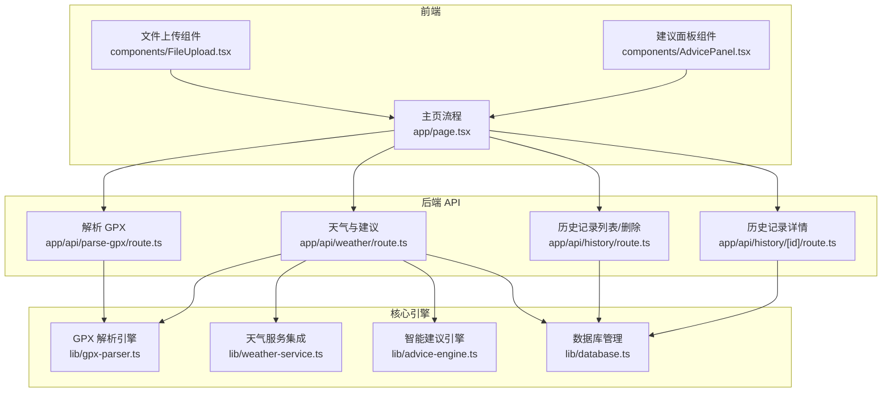
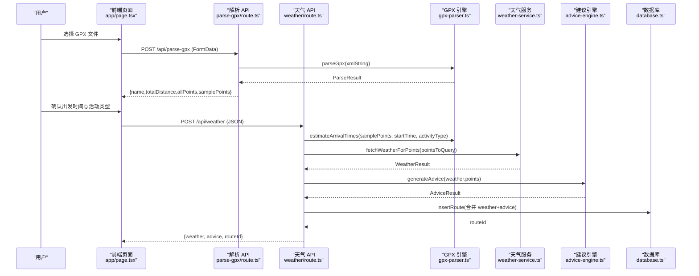
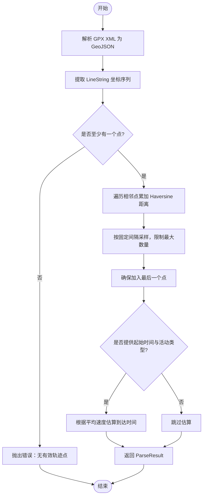
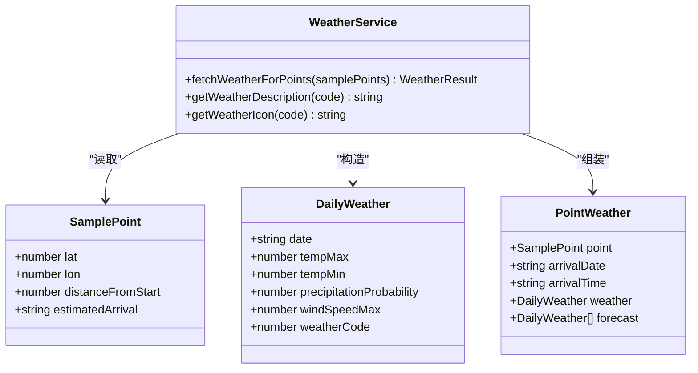
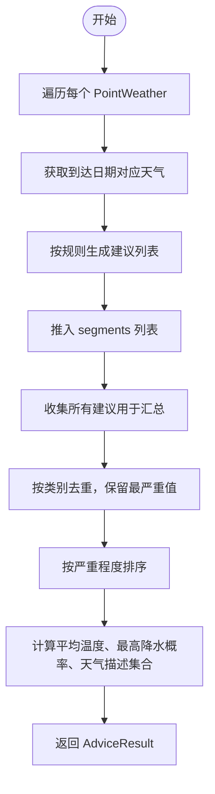
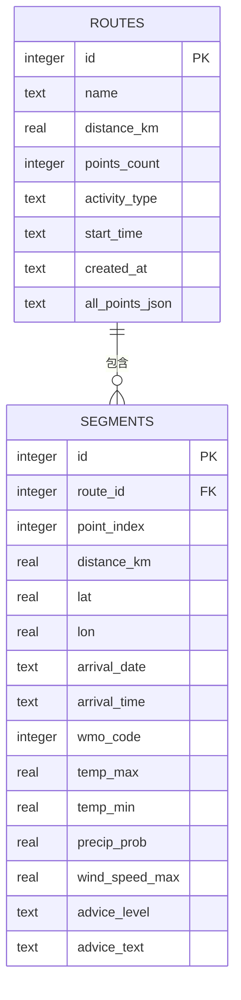
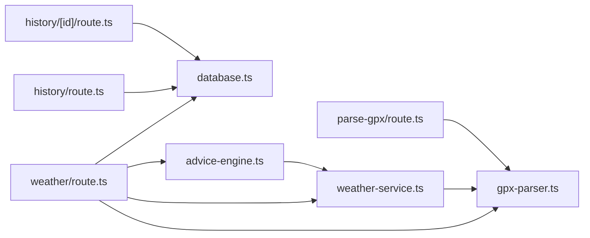

# 核心功能模块

<cite>
**本文引用的文件**   
- [lib/gpx-parser.ts](file://lib/gpx-parser.ts)
- [lib/weather-service.ts](file://lib/weather-service.ts)
- [lib/advice-engine.ts](file://lib/advice-engine.ts)
- [lib/database.ts](file://lib/database.ts)
- [app/api/parse-gpx/route.ts](file://app/api/parse-gpx/route.ts)
- [app/api/weather/route.ts](file://app/api/weather/route.ts)
- [app/api/history/route.ts](file://app/api/history/route.ts)
- [app/api/history/[id]/route.ts](file://app/api/history/[id]/route.ts)
- [components/FileUpload.tsx](file://components/FileUpload.tsx)
- [components/AdvicePanel.tsx](file://components/AdvicePanel.tsx)
- [app/page.tsx](file://app/page.tsx)
</cite>

## 目录
1. [简介](#简介)
2. [项目结构](#项目结构)
3. [核心组件](#核心组件)
4. [架构总览](#架构总览)
5. [详细组件分析](#详细组件分析)
6. [依赖关系分析](#依赖关系分析)
7. [性能考量](#性能考量)
8. [故障排查指南](#故障排查指南)
9. [结论](#结论)
10. [附录：扩展与定制指南](#附录扩展与定制指南)

## 简介
本文件为 FineG 的核心功能模块文档，聚焦四大核心引擎：
- GPX 轨迹解析引擎：负责解析 GPX 轨迹、计算距离、采样点生成与到达时间估算。
- 天气服务集成：基于 Open-Meteo 获取沿途采样点的逐日天气预报，并映射到到达日期。
- 智能建议引擎：根据天气数据生成按路段的出行建议与整体摘要。
- 数据库管理系统：使用 SQLite 持久化路线与分段信息，提供增删查接口。

文档将说明各模块的职责边界、输入输出接口、内部实现逻辑、模块间依赖与数据流转，并提供实际调用模式与扩展建议。

## 项目结构
FineG 采用 Next.js App Router 组织前后端代码：
- lib 目录包含四大核心引擎的实现。
- app/api 暴露 REST 接口，串联前端与核心引擎。
- components 提供 UI 交互与展示。
- app/page.tsx 作为主流程入口，协调上传、设置、请求天气与建议。

图表来源
- [app/page.tsx:1-214](file://app/page.tsx#L1-L214)
- [app/api/parse-gpx/route.ts:1-48](file://app/api/parse-gpx/route.ts#L1-L48)
- [app/api/weather/route.ts:1-93](file://app/api/weather/route.ts#L1-L93)
- [app/api/history/route.ts:1-33](file://app/api/history/route.ts#L1-L33)
- [app/api/history/[id]/route.ts:1-25](file://app/api/history/[id]/route.ts#L1-L25)
- [lib/gpx-parser.ts:1-231](file://lib/gpx-parser.ts#L1-L231)
- [lib/weather-service.ts:1-176](file://lib/weather-service.ts#L1-L176)
- [lib/advice-engine.ts:1-201](file://lib/advice-engine.ts#L1-L201)
- [lib/database.ts:1-204](file://lib/database.ts#L1-L204)

章节来源
- [app/page.tsx:1-214](file://app/page.tsx#L1-L214)
- [app/api/parse-gpx/route.ts:1-48](file://app/api/parse-gpx/route.ts#L1-L48)
- [app/api/weather/route.ts:1-93](file://app/api/weather/route.ts#L1-L93)
- [app/api/history/route.ts:1-33](file://app/api/history/route.ts#L1-L33)
- [app/api/history/[id]/route.ts:1-25](file://app/api/history/[id]/route.ts#L1-L25)
- [lib/gpx-parser.ts:1-231](file://lib/gpx-parser.ts#L1-L231)
- [lib/weather-service.ts:1-176](file://lib/weather-service.ts#L1-L176)
- [lib/advice-engine.ts:1-201](file://lib/advice-engine.ts#L1-L201)
- [lib/database.ts:1-204](file://lib/database.ts#L1-L204)

## 核心组件
本节概述四大核心引擎的职责、输入输出与关键方法。

- GPX 轨迹解析引擎
  - 职责：解析 GPX XML，提取轨迹点，计算总距离，生成均匀采样的样本点，估算到达时间。
  - 输入：GPX XML 字符串；可选起始时间与活动类型。
  - 输出：ParseResult（名称、总距离、全部点、采样点）；SamplePoint[]（含索引、累计距离、预估到达时间）。
  - 关键函数：estimateArrivalTimes、resamplePoints、haversineDistance。

- 天气服务集成
  - 职责：对每个采样点批量请求 Open-Meteo 每日预报，匹配到达日期天气，返回完整 7 天预报。
  - 输入：SamplePoint[]（可含 estimatedArrival）。
  - 输出：WeatherResult（points: PointWeather[]），其中包含到达日期/时间、当日天气与 7 天预报。
  - 辅助：getWeatherDescription、getWeatherIcon。

- 智能建议引擎
  - 职责：基于每日天气生成按路段的建议，汇总去重后给出整体建议与摘要。
  - 输入：PointWeather[]。
  - 输出：AdviceResult（summary、overall、segments）。

- 数据库管理系统
  - 职责：SQLite 初始化、建表、事务写入、查询与删除。
  - 输入：RouteRecord/SegmentRecord 相关对象。
  - 输出：插入 ID、记录列表、单条记录（含 segments）、删除结果。
  - 关键函数：insertRoute、getAllRoutes、getRouteById、deleteRoute。

章节来源
- [lib/gpx-parser.ts:1-231](file://lib/gpx-parser.ts#L1-L231)
- [lib/weather-service.ts:1-176](file://lib/weather-service.ts#L1-L176)
- [lib/advice-engine.ts:1-201](file://lib/advice-engine.ts#L1-L201)
- [lib/database.ts:1-204](file://lib/database.ts#L1-L204)

## 架构总览
系统通过前端页面发起请求，API 路由编排核心引擎完成解析、天气获取、建议生成与持久化。

图表来源
- [app/page.tsx:1-214](file://app/page.tsx#L1-L214)
- [app/api/parse-gpx/route.ts:1-48](file://app/api/parse-gpx/route.ts#L1-L48)
- [app/api/weather/route.ts:1-93](file://app/api/weather/route.ts#L1-L93)
- [lib/gpx-parser.ts:1-231](file://lib/gpx-parser.ts#L1-L231)
- [lib/weather-service.ts:1-176](file://lib/weather-service.ts#L1-L176)
- [lib/advice-engine.ts:1-201](file://lib/advice-engine.ts#L1-L201)
- [lib/database.ts:1-204](file://lib/database.ts#L1-L204)

## 详细组件分析

### GPX 轨迹解析引擎
- 职责边界
  - 解析 GPX XML 为结构化轨迹点。
  - 计算两点间球面距离（Haversine）。
  - 按固定间隔采样生成 SamplePoint，限制最大采样数。
  - 根据活动类型平均速度估算到达时间。
- 关键数据结构
  - TrackPoint：经纬度、海拔、时间。
  - SamplePoint：TrackPoint 扩展，含 index、distanceFromStart、estimatedArrival。
  - ActivityType：活动类型定义（步行、骑行、跑步等）及平均速度。
  - ParseResult：解析结果聚合。
- 算法要点
  - Haversine 距离计算用于累积距离。
  - resamplePoints 控制采样密度与上限，保证首尾点存在。
  - estimateArrivalTimes 基于活动类型平均速度推算到达时间。
- 错误处理
  - 未找到有效轨迹点时抛出错误。
- 复杂度
  - 距离计算 O(n)，采样 O(n)，估算到达时间 O(m)。

图表来源
- [lib/gpx-parser.ts:1-231](file://lib/gpx-parser.ts#L1-L231)

章节来源
- [lib/gpx-parser.ts:1-231](file://lib/gpx-parser.ts#L1-L231)

### 天气服务集成
- 职责边界
  - 对采样点进行批量化请求 Open-Meteo 每日预报。
  - 根据到达日期匹配当日天气，缺失则回退到第一天。
  - 提供天气描述与图标映射。
- 输入输出
  - 输入：SamplePoint[]（可含 estimatedArrival）。
  - 输出：WeatherResult（points: PointWeather[]），每点包含到达日期/时间、当日天气与 7 天预报。
- 并发策略
  - 分批并行请求，避免过多并发导致外部 API 限流。
- 错误处理
  - HTTP 非成功状态抛出错误，携带状态码与原因。
- 外部依赖
  - Open-Meteo Forecast API（无需密钥）。

图表来源
- [lib/weather-service.ts:1-176](file://lib/weather-service.ts#L1-L176)
- [lib/gpx-parser.ts:1-231](file://lib/gpx-parser.ts#L1-L231)

章节来源
- [lib/weather-service.ts:1-176](file://lib/weather-service.ts#L1-L176)

### 智能建议引擎
- 职责边界
  - 针对每日天气指标生成分级建议（info/warning/danger）。
  - 按路段聚合建议，并按类别去重取最严重值。
  - 生成整体摘要（温度区间、天气状况、最高降水概率）。
- 规则示例
  - 降水概率阈值触发带伞或雨具提示。
  - 雷暴等级直接建议避开户外。
  - 高温/低温分别给出防晒或保暖提示。
  - 大风等级给出风险提示。
  - 降雪/冻雨提示路面湿滑。
- 输入输出
  - 输入：PointWeather[]。
  - 输出：AdviceResult（summary、overall、segments）。

图表来源
- [lib/advice-engine.ts:1-201](file://lib/advice-engine.ts#L1-L201)
- [lib/weather-service.ts:1-176](file://lib/weather-service.ts#L1-L176)

章节来源
- [lib/advice-engine.ts:1-201](file://lib/advice-engine.ts#L1-L201)

### 数据库管理系统
- 职责边界
  - 初始化 SQLite 数据库与表结构（routes、segments）。
  - 提供事务性写入、查询与删除操作。
  - 将天气与建议结果持久化为分段记录。
- 表结构
  - routes：路线基本信息与全部点 JSON。
  - segments：分段维度存储位置、到达时间、天气与建议。
- 关键函数
  - insertRoute：插入路线与分段（事务）。
  - getAllRoutes：列出历史路线（不含 all_points_json）。
  - getRouteById：获取路线及其分段。
  - deleteRoute：级联删除分段与路线。
- 错误处理
  - 异常向上抛出，由 API 层捕获并返回统一错误格式。

图表来源
- [lib/database.ts:1-204](file://lib/database.ts#L1-L204)

章节来源
- [lib/database.ts:1-204](file://lib/database.ts#L1-L204)

## 依赖关系分析
- 耦合关系
  - API 层依赖核心引擎，形成单向依赖。
  - 天气服务依赖 GPX 引擎的数据结构（SamplePoint）。
  - 建议引擎依赖天气服务的数据结构与工具函数。
  - 数据库独立于业务引擎，仅被 API 层调用。
- 外部依赖
  - Open-Meteo 天气 API。
  - better-sqlite3 本地数据库。
  - @tmcw/togeojson 与 @xmldom/xmldom 解析 GPX。

图表来源
- [app/api/parse-gpx/route.ts:1-48](file://app/api/parse-gpx/route.ts#L1-L48)
- [app/api/weather/route.ts:1-93](file://app/api/weather/route.ts#L1-L93)
- [app/api/history/route.ts:1-33](file://app/api/history/route.ts#L1-L33)
- [app/api/history/[id]/route.ts:1-25](file://app/api/history/[id]/route.ts#L1-L25)
- [lib/gpx-parser.ts:1-231](file://lib/gpx-parser.ts#L1-L231)
- [lib/weather-service.ts:1-176](file://lib/weather-service.ts#L1-L176)
- [lib/advice-engine.ts:1-201](file://lib/advice-engine.ts#L1-L201)
- [lib/database.ts:1-204](file://lib/database.ts#L1-L204)

章节来源
- [app/api/parse-gpx/route.ts:1-48](file://app/api/parse-gpx/route.ts#L1-L48)
- [app/api/weather/route.ts:1-93](file://app/api/weather/route.ts#L1-L93)
- [app/api/history/route.ts:1-33](file://app/api/history/route.ts#L1-L33)
- [app/api/history/[id]/route.ts:1-25](file://app/api/history/[id]/route.ts#L1-L25)
- [lib/gpx-parser.ts:1-231](file://lib/gpx-parser.ts#L1-L231)
- [lib/weather-service.ts:1-176](file://lib/weather-service.ts#L1-L176)
- [lib/advice-engine.ts:1-201](file://lib/advice-engine.ts#L1-L201)
- [lib/database.ts:1-204](file://lib/database.ts#L1-L204)

## 性能考量
- GPX 解析
  - 全量点渲染可能过大，API 层对 allPoints 进行抽样限制以提升前端渲染性能。
- 天气请求
  - 批量并行请求，批次大小适中以避免外部 API 限流。
- 数据库
  - 使用 WAL 模式提升并发读写性能。
  - 分段写入使用事务减少 I/O 次数。
- 内存占用
  - 采样点数量受上限约束，避免内存峰值过高。

[本节为通用指导，不直接分析具体文件]

## 故障排查指南
- GPX 解析失败
  - 现象：返回“未上传文件”、“请上传 .gpx 格式的文件”或“GPX 文件中未找到有效的轨迹点”。
  - 排查：检查文件格式与内容；确认 XML 中包含 LineString 轨迹。
  - 参考路径：[app/api/parse-gpx/route.ts:1-48](file://app/api/parse-gpx/route.ts#L1-L48)、[lib/gpx-parser.ts:1-231](file://lib/gpx-parser.ts#L1-L231)
- 天气请求失败
  - 现象：返回“天气 API 请求失败: 状态码 原因”。
  - 排查：网络连通性、Open-Meteo 可用性、坐标有效性。
  - 参考路径：[lib/weather-service.ts:1-176](file://lib/weather-service.ts#L1-L176)
- 建议生成异常
  - 现象：建议为空或摘要不完整。
  - 排查：确认传入的 PointWeather 中 weather 字段是否为空；检查天气数据质量。
  - 参考路径：[lib/advice-engine.ts:1-201](file://lib/advice-engine.ts#L1-L201)
- 数据库写入失败
  - 现象：日志打印“Failed to save route to database”，但请求仍成功。
  - 排查：data 目录权限、SQLite 文件损坏、磁盘空间不足。
  - 参考路径：[app/api/weather/route.ts:1-93](file://app/api/weather/route.ts#L1-L93)、[lib/database.ts:1-204](file://lib/database.ts#L1-L204)
- 历史记录查询失败
  - 现象：返回“记录不存在”或“无效的 ID”。
  - 排查：确认 ID 合法性与记录是否存在。
  - 参考路径：[app/api/history/route.ts:1-33](file://app/api/history/route.ts#L1-L33)、[app/api/history/[id]/route.ts:1-25](file://app/api/history/[id]/route.ts#L1-L25)

章节来源
- [app/api/parse-gpx/route.ts:1-48](file://app/api/parse-gpx/route.ts#L1-L48)
- [lib/gpx-parser.ts:1-231](file://lib/gpx-parser.ts#L1-L231)
- [lib/weather-service.ts:1-176](file://lib/weather-service.ts#L1-L176)
- [lib/advice-engine.ts:1-201](file://lib/advice-engine.ts#L1-L201)
- [app/api/weather/route.ts:1-93](file://app/api/weather/route.ts#L1-L93)
- [lib/database.ts:1-204](file://lib/database.ts#L1-L204)
- [app/api/history/route.ts:1-33](file://app/api/history/route.ts#L1-L33)
- [app/api/history/[id]/route.ts:1-25](file://app/api/history/[id]/route.ts#L1-L25)

## 结论
FineG 以清晰的模块化设计将 GPX 解析、天气集成、智能建议与数据库管理解耦，并通过 API 层组合成完整的业务流程。该架构便于扩展新的天气源、建议规则与存储后端，同时具备良好的性能与容错能力。

[本节为总结，不直接分析具体文件]

## 附录：扩展与定制指南
- 新增活动类型与速度模型
  - 在 GPX 引擎中添加 ActivityType 条目，调整平均速度以影响到达时间估算。
  - 参考路径：[lib/gpx-parser.ts:1-231](file://lib/gpx-parser.ts#L1-L231)
- 自定义采样策略
  - 修改 resamplePoints 的采样间隔与最大采样数，平衡精度与性能。
  - 参考路径：[lib/gpx-parser.ts:1-231](file://lib/gpx-parser.ts#L1-L231)
- 接入新天气源
  - 替换 fetchSinglePointWeather 中的请求逻辑，适配新 API 响应结构。
  - 保持 PointWeather/DailyWeather 接口稳定，以便建议引擎兼容。
  - 参考路径：[lib/weather-service.ts:1-176](file://lib/weather-service.ts#L1-L176)
- 扩展建议规则
  - 在 analyzeDaily 中增加新的气象条件判断与提示文案。
  - 参考路径：[lib/advice-engine.ts:1-201](file://lib/advice-engine.ts#L1-L201)
- 持久化扩展
  - 在数据库表中新增字段并在 insertRoute/getRouteById 中维护。
  - 注意事务一致性与迁移策略。
  - 参考路径：[lib/database.ts:1-204](file://lib/database.ts#L1-L204)
- 前端集成示例
  - 上传 GPX 文件并显示解析结果：
    - 参考路径：[components/FileUpload.tsx:1-97](file://components/FileUpload.tsx#L1-L97)、[app/page.tsx:1-214](file://app/page.tsx#L1-L214)
  - 展示建议面板：
    - 参考路径：[components/AdvicePanel.tsx:1-65](file://components/AdvicePanel.tsx#L1-L65)
  - 调用天气与建议 API：
    - 参考路径：[app/page.tsx:1-214](file://app/page.tsx#L1-L214)、[app/api/weather/route.ts:1-93](file://app/api/weather/route.ts#L1-L93)

章节来源
- [lib/gpx-parser.ts:1-231](file://lib/gpx-parser.ts#L1-L231)
- [lib/weather-service.ts:1-176](file://lib/weather-service.ts#L1-L176)
- [lib/advice-engine.ts:1-201](file://lib/advice-engine.ts#L1-L201)
- [lib/database.ts:1-204](file://lib/database.ts#L1-L204)
- [components/FileUpload.tsx:1-97](file://components/FileUpload.tsx#L1-L97)
- [components/AdvicePanel.tsx:1-65](file://components/AdvicePanel.tsx#L1-L65)
- [app/page.tsx:1-214](file://app/page.tsx#L1-L214)
- [app/api/weather/route.ts:1-93](file://app/api/weather/route.ts#L1-L93)