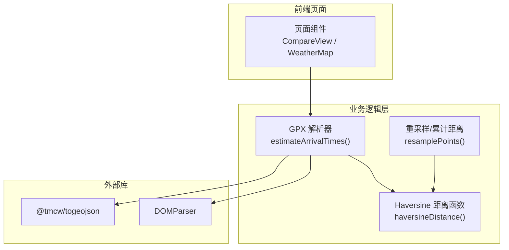
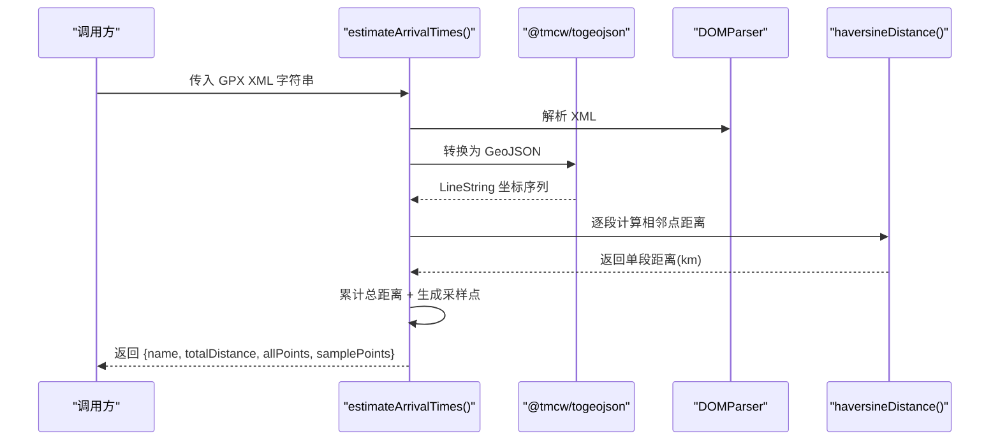
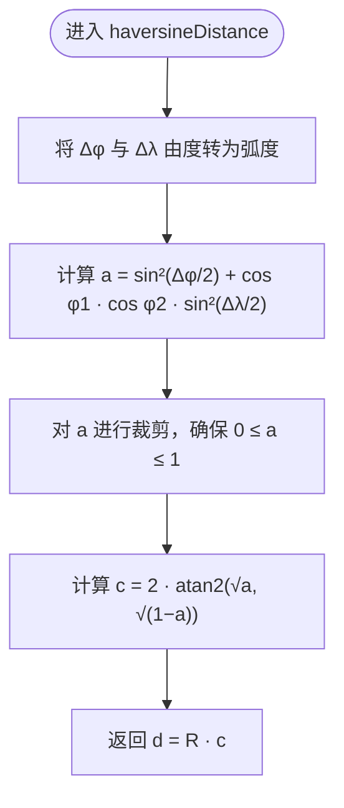
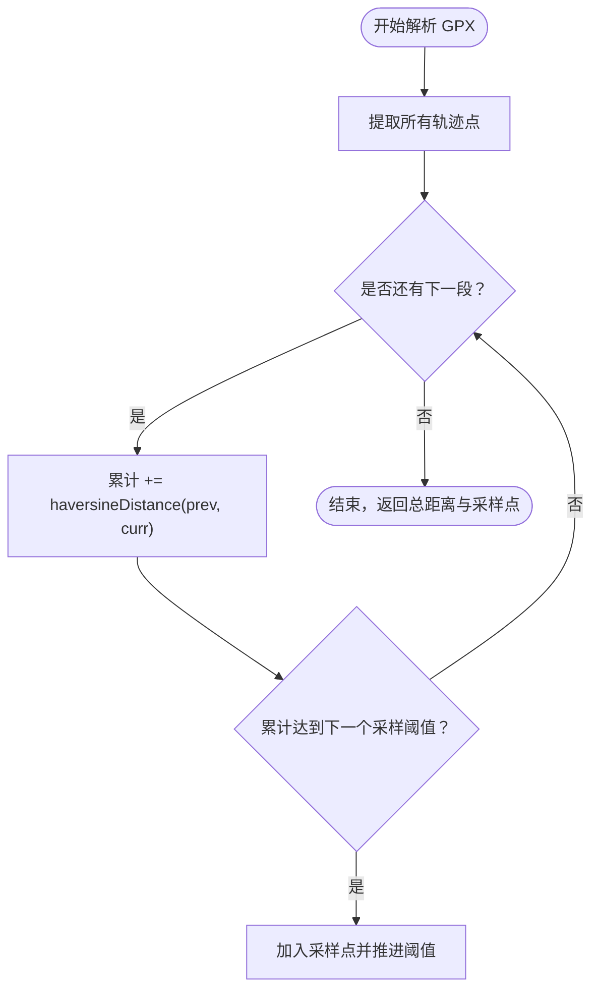
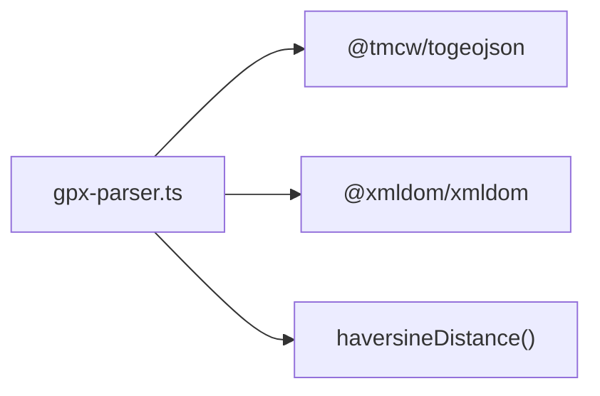

# Haversine 距离计算

<cite>
**本文引用的文件**   
- [gpx-parser.ts](file://lib/gpx-parser.ts)
</cite>

## 目录
1. [简介](#简介)
2. [项目结构](#项目结构)
3. [核心组件](#核心组件)
4. [架构总览](#架构总览)
5. [详细组件分析](#详细组件分析)
6. [依赖关系分析](#依赖关系分析)
7. [性能与精度考量](#性能与精度考量)
8. [故障排查指南](#故障排查指南)
9. [结论](#结论)
10. [附录：公式推导与对比](#附录公式推导与对比)

## 简介
本技术文档聚焦于 FineG 项目中用于球面距离计算的 Haversine 算法实现，系统阐述其数学原理、地球半径常量 R=6371km 的选择依据、经纬度到弧度的转换过程、三角函数应用、数值稳定性与精度控制策略，并给出与其他常用球面距离公式的对比。同时结合仓库中的实际代码位置，提供调用路径与优化建议，帮助读者在理解理论的同时掌握工程落地要点。

## 项目结构
FineG 是一个基于 Next.js 的应用，Haversine 距离计算的核心逻辑位于地理数据处理模块中，负责从 GPX 轨迹点序列中累计计算总距离并进行采样。该模块被上层功能（如地图展示、天气叠加、比较视图等）间接使用。

图表来源
- [gpx-parser.ts:119-137](file://lib/gpx-parser.ts#L119-L137)
- [gpx-parser.ts:139-230](file://lib/gpx-parser.ts#L139-L230)

章节来源
- [gpx-parser.ts:1-231](file://lib/gpx-parser.ts#L1-L231)

## 核心组件
- Haversine 距离函数：计算两点间球面最短距离（单位 km）。
- 轨迹解析与累计距离：遍历轨迹点序列，累加相邻点的 Haversine 距离得到总距离。
- 采样点生成：按固定间隔（例如每 10 km）抽取样本点，便于后续天气查询与可视化。

章节来源
- [gpx-parser.ts:119-137](file://lib/gpx-parser.ts#L119-L137)
- [gpx-parser.ts:139-230](file://lib/gpx-parser.ts#L139-L230)

## 架构总览
下图展示了从 GPX 文本到最终结果的数据流，以及 Haversine 在其中的关键作用。

图表来源
- [gpx-parser.ts:139-230](file://lib/gpx-parser.ts#L139-L230)
- [gpx-parser.ts:119-137](file://lib/gpx-parser.ts#L119-L137)

## 详细组件分析

### Haversine 距离函数
- 输入：两个点的纬度与经度（度数），lat1/lon1 与 lat2/lon2。
- 输出：两点间的球面距离（千米）。
- 关键点：
  - 地球半径常量 R = 6371（千米）。
  - 角度转弧度：乘以 π/180。
  - 中间变量 a 与 c 的计算，最后 d = R·c。

图表来源
- [gpx-parser.ts:119-137](file://lib/gpx-parser.ts#L119-L137)

章节来源
- [gpx-parser.ts:119-137](file://lib/gpx-parser.ts#L119-L137)

### 轨迹解析与累计距离
- 解析 GPX 为 GeoJSON，提取 LineString 坐标序列。
- 遍历相邻点对，累加 Haversine 距离得到总距离。
- 按固定间隔（默认约 10 km）生成采样点，限制最大采样数量，保证可视化与查询效率。

图表来源
- [gpx-parser.ts:139-230](file://lib/gpx-parser.ts#L139-L230)

章节来源
- [gpx-parser.ts:139-230](file://lib/gpx-parser.ts#L139-L230)

## 依赖关系分析
- 内部依赖：
  - 轨迹解析与采样逻辑依赖 Haversine 距离函数。
- 外部依赖：
  - @tmcw/togeojson：将 GPX XML 转换为 GeoJSON。
  - @xmldom/xmldom：浏览器/Node 环境下解析 XML。

图表来源
- [gpx-parser.ts:1-10](file://lib/gpx-parser.ts#L1-L10)
- [gpx-parser.ts:119-137](file://lib/gpx-parser.ts#L119-L137)

章节来源
- [gpx-parser.ts:1-10](file://lib/gpx-parser.ts#L1-L10)
- [gpx-parser.ts:119-137](file://lib/gpx-parser.ts#L119-L137)

## 性能与精度考量
- 时间复杂度：
  - 轨迹总距离计算为 O(n)，n 为轨迹点数；采样过程亦为线性扫描。
- 空间复杂度：
  - 存储 allPoints 与 samplePoints，额外空间 O(n)。
- 数值稳定性与精度控制：
  - 当两点非常接近时，a 可能因浮点误差略大于 1，导致 sqrt(1−a) 出现 NaN。建议在计算 c 前对 a 做裁剪，确保 a ∈ [0, 1]。
  - 使用 Math.atan2 替代 Math.acos 可提升小角度的数值稳定性。
- 常数选择：
  - R=6371 km 是常用的平均地球半径近似值，适用于大多数场景。若需更高精度，可采用 WGS84 椭球模型或更精确的平均半径（如 6371.0088 km）。
- 其他优化建议：
  - 批量预计算 cos/sin 值以减少重复计算。
  - 对极短距离（如 < 1 m）可直接返回 0 或使用平面近似（Equirectangular）以节省开销。
  - 避免在高频循环中进行不必要的对象创建与类型转换。

章节来源
- [gpx-parser.ts:119-137](file://lib/gpx-parser.ts#L119-L137)
- [gpx-parser.ts:139-230](file://lib/gpx-parser.ts#L139-L230)

## 故障排查指南
- 常见错误：
  - 输入经纬度超出范围：应校验 lat ∈ [-90, 90]，lon ∈ [-180, 180]。
  - 相同点或极近点导致 a > 1：需要对 a 进行裁剪至 [0, 1]。
  - 空轨迹或无效 GPX：解析阶段抛出异常，需检查输入格式与内容。
- 定位方法：
  - 打印中间变量 a、c 的值，确认是否在合理区间。
  - 分段测试：先对少量点验证距离是否符合预期。
  - 边界用例：同一点、极点附近、跨 180° 经线。

章节来源
- [gpx-parser.ts:119-137](file://lib/gpx-parser.ts#L119-L137)
- [gpx-parser.ts:139-230](file://lib/gpx-parser.ts#L139-L230)

## 结论
FineG 的 Haversine 实现简洁且实用，满足轨迹距离估算与采样需求。通过引入 a 的裁剪与稳定的 atan2 计算，可进一步提升数值鲁棒性。对于高精度场景，可考虑采用椭球模型或更精确的地球半径常量。整体而言，当前实现已在性能与准确性之间取得良好平衡。

## 附录：公式推导与对比

### 数学原理与公式
- 基本符号：
  - φ1, φ2：两点纬度（弧度）
  - λ1, λ2：两点经度（弧度）
  - Δφ = φ2 − φ1，Δλ = λ2 − λ1
- Haversine 公式：
  - a = sin²(Δφ/2) + cos φ1 · cos φ2 · sin²(Δλ/2)
  - c = 2 · atan2(√a, √(1−a))
  - d = R · c
- 地球半径 R：
  - 取 R = 6371 km，为常用平均值，适合一般用途。
  - 若需要更高精度，可使用 WGS84 椭球参数或更精确的平均半径（例如 6371.0088 km）。

### 经纬度转换与弧度计算
- 度数转弧度：rad = deg × π / 180
- 在实现中，分别对 Δφ、Δλ 以及 φ1、φ2 执行此转换。

### 数值稳定性与精度控制
- 防止 a > 1：对 a 进行裁剪，确保 a ∈ [0, 1]，避免 sqrt(1−a) 产生 NaN。
- 使用 atan2 提高小角度稳定性，避免 acos 在接近 1 时的数值问题。
- 对极短距离可返回 0 或采用平面近似，减少浮点误差影响。

### 与其他公式的比较
- Spherical Law of Cosines：
  - 优点：形式简单
  - 缺点：在小距离下数值不稳定，易受舍入误差影响
- Vincenty 公式（椭球模型）：
  - 优点：精度高，考虑地球扁率
  - 缺点：实现复杂，收敛性与边界条件需谨慎处理
- Equirectangular 近似：
  - 优点：计算量小，适合短距离
  - 缺点：随距离增大误差显著

### 代码级参考路径
- Haversine 实现与调用位置：
  - [gpx-parser.ts:119-137](file://lib/gpx-parser.ts#L119-L137)
  - [gpx-parser.ts:161-170](file://lib/gpx-parser.ts#L161-L170)
  - [gpx-parser.ts:185-191](file://lib/gpx-parser.ts#L185-L191)