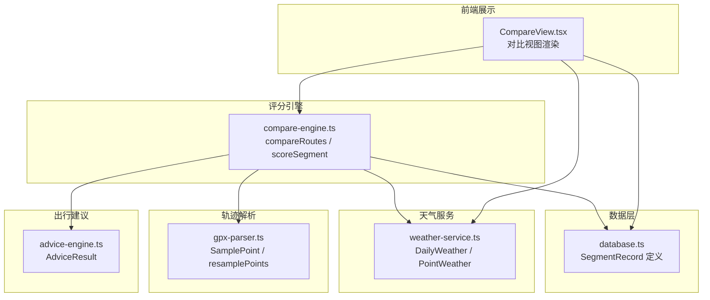
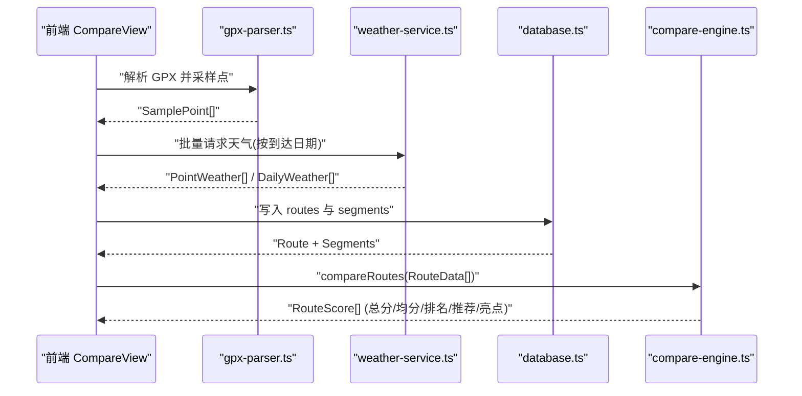
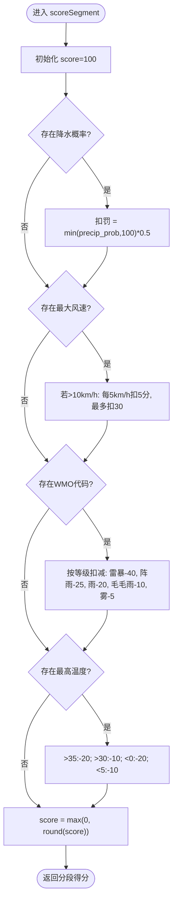
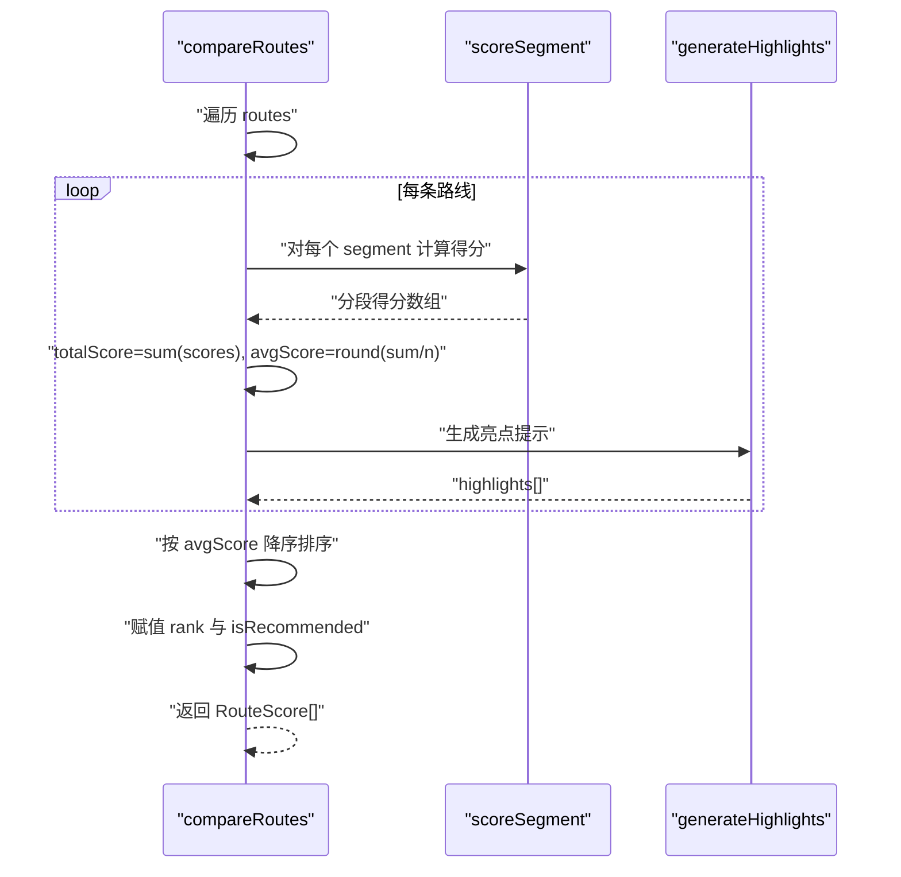
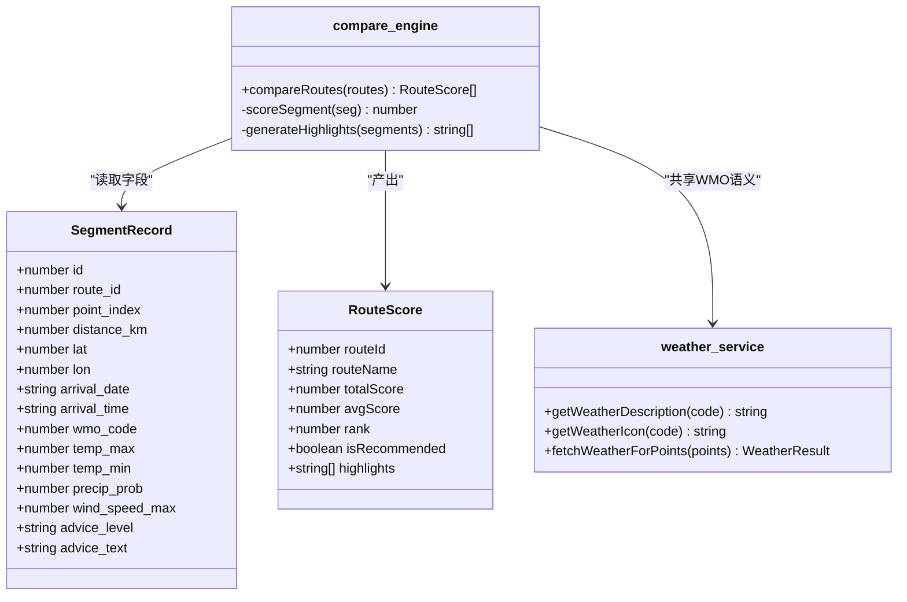

# 多维度评分算法

<cite>
**本文引用的文件**   
- [compare-engine.ts](file://src/lib/compare-engine.ts)
- [weather-service.ts](file://src/lib/weather-service.ts)
- [database.ts](file://src/lib/database.ts)
- [gpx-parser.ts](file://src/lib/gpx-parser.ts)
- [advice-engine.ts](file://src/lib/advice-engine.ts)
- [CompareView.tsx](file://src/components/CompareView.tsx)
</cite>

## 目录
1. [简介](#简介)
2. [项目结构](#项目结构)
3. [核心组件](#核心组件)
4. [架构总览](#架构总览)
5. [详细组件分析](#详细组件分析)
6. [依赖关系分析](#依赖关系分析)
7. [性能考量](#性能考量)
8. [故障排查指南](#故障排查指南)
9. [结论](#结论)
10. [附录](#附录)

## 简介
本技术文档聚焦 FineG 的多维度评分算法，重点解析 compareRoutes 函数及其子模块的评分体系设计。内容涵盖天气条件权重分配、安全因素考量与舒适度评估；详细说明温度适宜度、风速影响、降水概率等维度的量化方法与权重设置；给出评分计算公式、排名算法实现细节（含分数归一化与多路线对比逻辑）；并解释异常值处理、边界条件处理与评分一致性保证机制。文末提供评分矩阵示例与算法调优建议，帮助读者理解与扩展该评分系统。

## 项目结构
FineG 采用前后端分离的 Next.js 工程组织方式，评分相关核心逻辑位于 src/lib 下的 compare-engine.ts，数据模型与持久化在 database.ts，天气服务在 weather-service.ts，GPX 解析与采样在 gpx-parser.ts，出行建议在 advice-engine.ts，前端展示在 CompareView.tsx。

图表来源
- [compare-engine.ts:1-116](file://src/lib/compare-engine.ts#L1-L116)
- [database.ts:70-86](file://src/lib/database.ts#L70-L86)
- [weather-service.ts:3-18](file://src/lib/weather-service.ts#L3-L18)
- [gpx-parser.ts:11-15](file://src/lib/gpx-parser.ts#L11-L15)
- [advice-engine.ts:7-28](file://src/lib/advice-engine.ts#L7-L28)
- [CompareView.tsx:1-273](file://src/components/CompareView.tsx#L1-L273)

章节来源
- [compare-engine.ts:1-116](file://src/lib/compare-engine.ts#L1-L116)
- [database.ts:1-204](file://src/lib/database.ts#L1-L204)
- [weather-service.ts:1-176](file://src/lib/weather-service.ts#L1-L176)
- [gpx-parser.ts:1-231](file://src/lib/gpx-parser.ts#L1-L231)
- [advice-engine.ts:1-201](file://src/lib/advice-engine.ts#L1-L201)
- [CompareView.tsx:1-273](file://src/components/CompareView.tsx#L1-L273)

## 核心组件
- 评分入口：compareRoutes(routes) 接收多条路线数据，逐段计算得分，汇总为总分与平均分，排序后赋予排名与推荐标记，并生成亮点提示。
- 分段评分：scoreSegment(seg) 基于降水概率、最大风速、WMO 天气代码、最高温度四个维度进行扣分式打分，初始满分 100，最终截断到 [0,100] 并取整。
- 亮点生成：generateHighlights(segments) 根据整条路线的气温区间、降水概率上限、风速上限生成可读性强的提示语。
- 数据模型：SegmentRecord 包含到达时间、WMO 代码、温度上下限、降水概率、最大风速等字段，是评分的核心输入。
- 天气服务：提供 WMO 描述与图标映射，以及按点批量拉取天气预报的能力，供上游流程使用。
- 前端展示：CompareView 将评分结果与分段天气信息以卡片和表格形式呈现，突出推荐路线与关键指标。

章节来源
- [compare-engine.ts:19-54](file://src/lib/compare-engine.ts#L19-L54)
- [compare-engine.ts:56-81](file://src/lib/compare-engine.ts#L56-L81)
- [compare-engine.ts:83-115](file://src/lib/compare-engine.ts#L83-L115)
- [database.ts:70-86](file://src/lib/database.ts#L70-L86)
- [weather-service.ts:25-69](file://src/lib/weather-service.ts#L25-L69)
- [CompareView.tsx:22-157](file://src/components/CompareView.tsx#L22-L157)

## 架构总览
评分系统的数据流从 GPX 解析与采样开始，结合活动类型估算到达时间，随后调用天气服务获取每日预报，落库形成 SegmentRecord，再由 compare-engine 对每条路线的各段进行评分与汇总，最后由前端渲染对比视图。

图表来源
- [gpx-parser.ts:44-94](file://src/lib/gpx-parser.ts#L44-L94)
- [weather-service.ts:71-87](file://src/lib/weather-service.ts#L71-L87)
- [database.ts:90-162](file://src/lib/database.ts#L90-L162)
- [compare-engine.ts:83-115](file://src/lib/compare-engine.ts#L83-L115)
- [CompareView.tsx:22-157](file://src/components/CompareView.tsx#L22-L157)

## 详细组件分析

### 评分体系设计与权重分配
- 基础分值：每段起始 100 分，通过各维度惩罚项扣减，最终下限为 0，上限为 100，且取整。
- 降水概率：线性惩罚，每 1% 扣 0.5 分，封顶扣至 0。体现“越可能下雨，体验越差”的直观关系。
- 最大风速：超过 10 km/h 起罚，每增加 5 km/h 扣 5 分，最多扣 30 分。体现风阻与安全边际。
- WMO 天气代码：依据严重程度分级扣减，雷暴最重，阵雨次之，毛毛雨/雾较轻，晴或多云不扣分。
- 最高温度：极端高温或低温分别扣 10~20 分，体现人体舒适度与安全（中暑/失温风险）。

上述规则共同构成“舒适度优先、兼顾安全”的评分理念：降水与强对流天气显著降低分数；风与极端温度作为辅助惩罚；WMO 编码用于快速识别恶劣天气类别。

章节来源
- [compare-engine.ts:19-54](file://src/lib/compare-engine.ts#L19-L54)

#### 评分计算流程图

图表来源
- [compare-engine.ts:19-54](file://src/lib/compare-engine.ts#L19-L54)

### 排名与对比逻辑
- 总分与均分：对一条路线的所有分段得分求和得到总分，再除以段数得到均分（四舍五入）。
- 排序与排名：按均分降序排列，依次赋予 rank=1,2,...，并将排名第一的路线标记为推荐。
- 亮点提示：基于整条路线的温度区间、降水概率上限、风速上限生成若干可读性提示，便于用户快速把握优劣。

图表来源
- [compare-engine.ts:83-115](file://src/lib/compare-engine.ts#L83-L115)
- [compare-engine.ts:56-81](file://src/lib/compare-engine.ts#L56-L81)

章节来源
- [compare-engine.ts:83-115](file://src/lib/compare-engine.ts#L83-L115)
- [compare-engine.ts:56-81](file://src/lib/compare-engine.ts#L56-L81)

### 数据模型与字段说明
- SegmentRecord 关键字段：
  - arrival_date / arrival_time：到达日期与时间，用于匹配对应日期的天气预报。
  - wmo_code：WMO 天气代码，用于分类判断恶劣天气。
  - temp_max / temp_min：最高/最低温度，用于舒适度与安全评估。
  - precip_prob：降水概率（百分比），用于降水惩罚。
  - wind_speed_max：最大风速（km/h），用于风力惩罚。
- RouteScore 输出字段：
  - routeId / routeName：路线标识与名称。
  - totalScore / avgScore：总分与均分。
  - rank / isRecommended：排名与是否推荐。
  - highlights：亮点提示数组。

章节来源
- [database.ts:70-86](file://src/lib/database.ts#L70-L86)
- [compare-engine.ts:3-11](file://src/lib/compare-engine.ts#L3-L11)

### 天气服务与 WMO 映射
- getWeatherDescription(code)：将 WMO 代码映射为中文天气描述，便于展示与诊断。
- getWeatherIcon(code)：将 WMO 代码映射为表情图标，提升可视化效果。
- fetchWeatherForPoints(points)：按批次并发请求 Open-Meteo API，返回每日预报与到达日匹配的天气。

章节来源
- [weather-service.ts:25-69](file://src/lib/weather-service.ts#L25-L69)
- [weather-service.ts:71-87](file://src/lib/weather-service.ts#L71-L87)

### 前端对比视图
- 卡片区：显示路线名称、距离、活动类型、气温范围、降水概率、风速、排名与推荐标签。
- 对比表：按 0%/25%/50%/75%/100% 五个位置对齐展示各路线的分段天气与危险等级高亮。
- 颜色与状态：根据平均分数段着色，推荐路线加粗边框与徽章。

章节来源
- [CompareView.tsx:22-157](file://src/components/CompareView.tsx#L22-L157)
- [CompareView.tsx:196-262](file://src/components/CompareView.tsx#L196-L262)

## 依赖关系分析
- compare-engine.ts 依赖 database.ts 的 SegmentRecord 数据结构，确保评分输入字段一致。
- compare-engine.ts 与 weather-service.ts 解耦，但共享 WMO 语义（评分使用代码阈值，展示使用描述/图标）。
- gpx-parser.ts 提供 SamplePoint 与采样策略，间接决定评分粒度（段数越多，评分越细）。
- advice-engine.ts 与 compare-engine.ts 并行工作：前者生成出行建议，后者生成评分与排名，二者可联合展示。

图表来源
- [database.ts:70-86](file://src/lib/database.ts#L70-L86)
- [compare-engine.ts:3-11](file://src/lib/compare-engine.ts#L3-L11)
- [compare-engine.ts:19-115](file://src/lib/compare-engine.ts#L19-L115)
- [weather-service.ts:25-87](file://src/lib/weather-service.ts#L25-L87)

章节来源
- [compare-engine.ts:1-116](file://src/lib/compare-engine.ts#L1-L116)
- [database.ts:70-86](file://src/lib/database.ts#L70-L86)
- [weather-service.ts:25-87](file://src/lib/weather-service.ts#L25-L87)

## 性能考量
- 评分复杂度：compareRoutes 的时间复杂度为 O(N*M)，N 为路线数量，M 为每条路线的分段数量。由于 M 通常较小（采样间隔控制），整体开销低。
- 内存占用：仅维护分段得分数组与结果对象，空间复杂度 O(M)。
- I/O 与网络：天气请求在 weather-service 中分批并发，避免阻塞主线程；评分阶段无外部 I/O。
- 数值稳定性：所有中间惩罚项均有上限限制，最终截断到 [0,100]，避免溢出与负分。

[本节为通用性能讨论，无需具体文件引用]

## 故障排查指南
- 空输入保护：当 routes 为空时直接返回空数组，避免后续排序与索引错误。
- 缺失字段处理：降水、风速、WMO、温度均为可选字段，缺失时跳过相应惩罚，保证鲁棒性。
- 边界条件：
  - 降水概率上限 100%，防止超界导致过度扣罚。
  - 风速惩罚上限 30 分，避免单一维度主导总分。
  - 最终分数截断到 0，避免负分。
- 一致性保证：
  - 均分计算使用整数除法后再四舍五入，保证跨平台一致性。
  - 排序稳定（按均分严格降序），排名连续且唯一。
  - 推荐标记仅赋给第一名，避免歧义。
- 常见错误定位：
  - 若出现“暂无数据”，检查 GPX 采样与到达时间估算是否正确。
  - 若天气 API 失败，查看 weather-service 的错误抛出与上层捕获。
  - 若亮点提示不符合预期，核对 generateHighlights 的阈值设定。

章节来源
- [compare-engine.ts:83-115](file://src/lib/compare-engine.ts#L83-L115)
- [compare-engine.ts:19-54](file://src/lib/compare-engine.ts#L19-L54)
- [weather-service.ts:141-145](file://src/lib/weather-service.ts#L141-L145)
- [CompareView.tsx:232-255](file://src/components/CompareView.tsx#L232-L255)

## 结论
FineG 的多维度评分算法以“舒适度优先、兼顾安全”为核心原则，通过降水概率、风速、WMO 天气代码与温度四个维度构建扣分式评分模型。compareRoutes 负责汇总与排名，generateHighlights 提供可读性总结，配合前端对比视图形成完整的决策支持闭环。该方案结构简单、可扩展性强，适合进一步引入活动类型差异化权重、动态阈值与机器学习校准。

[本节为总结性内容，无需具体文件引用]

## 附录

### 评分矩阵示例（示意）
以下为不同天气条件下的典型分段得分参考（基于当前规则）：
- 晴朗、微风、温度 20°C、降水 0%：约 100 分
- 多云、微风、温度 28°C、降水 10%：约 95 分
- 小雨、微风、温度 22°C、降水 40%：约 80 分
- 阵雨、中等风、温度 32°C、降水 70%：约 55 分
- 雷暴、大风、温度 36°C、降水 90%：约 0 分

注：以上为经验性示例，实际得分取决于各维度组合与惩罚叠加。

### 算法调优建议
- 活动类型差异化：为步行、骑行、登山等不同活动调整温度与风速阈值，增强场景适配性。
- 动态权重：根据季节或地区历史数据学习降水与风的相对重要性，动态调整惩罚系数。
- 非线性惩罚：对极端天气（如雷暴、冰雹）采用更陡峭的惩罚曲线，强化安全约束。
- 舒适度模型：引入体感温度（考虑湿度与风速）替代单纯温度，提升主观体验拟合度。
- 多目标优化：在总分之外输出分项得分，支持用户自定义偏好（如更看重降水或更看重温度）。
- 稳健性增强：对缺失字段进行插补或置信度标注，避免单点缺失导致误判。

[本节为概念性建议，无需具体文件引用]