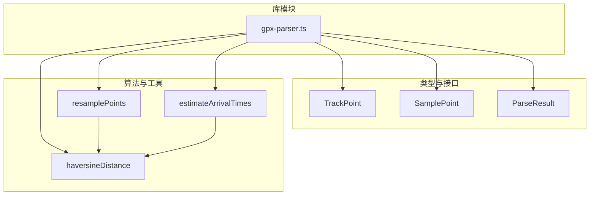
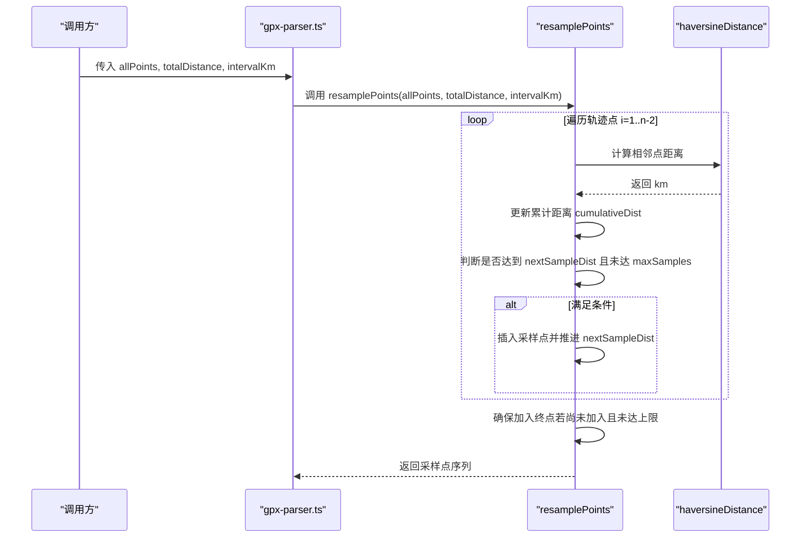
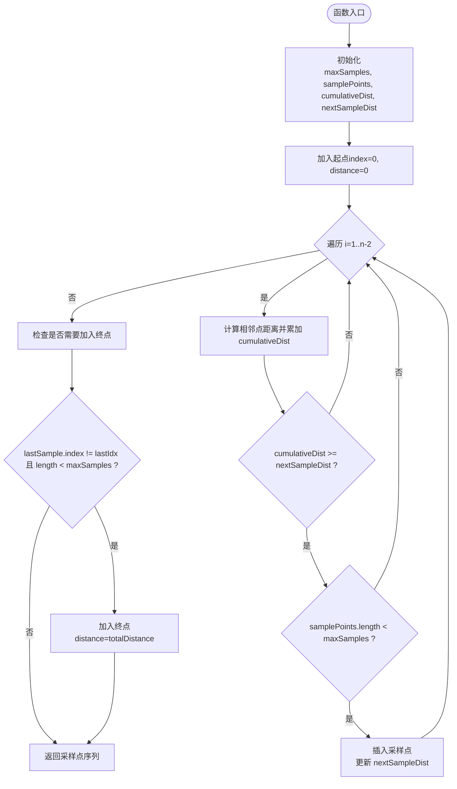
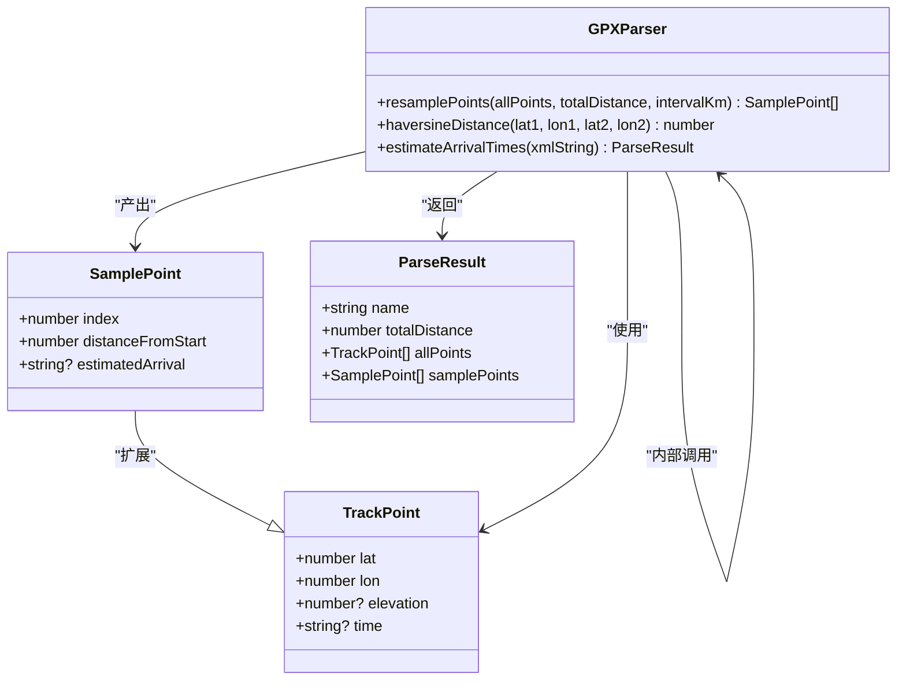

# 智能采样算法

<cite>
**本文引用的文件**   
- [gpx-parser.ts](file://lib/gpx-parser.ts)
</cite>

## 目录
1. [简介](#简介)
2. [项目结构](#项目结构)
3. [核心组件](#核心组件)
4. [架构总览](#架构总览)
5. [详细组件分析](#详细组件分析)
6. [依赖关系分析](#依赖关系分析)
7. [性能考量](#性能考量)
8. [故障排查指南](#故障排查指南)
9. [结论](#结论)
10. [附录](#附录)

## 简介
本技术文档聚焦于 FineG 中的“智能采样算法”，重点解析 resamplePoints 函数的工作原理与实现细节。内容涵盖：
- 采样间隔计算逻辑
- 边界点处理策略（起点、终点）
- 最大采样点数量限制（2-50个）的实现机制
- 累计距离计算方法与阈值判断的精确性控制
- 采样点插入时机控制
- 时间复杂度 O(n) 与空间复杂度分析
- 轨迹起点和终点的特殊逻辑说明

该算法用于在长轨迹中按固定距离间隔抽取代表性采样点，以平衡可视化/分析精度与性能开销。

## 项目结构
与采样算法直接相关的代码位于库模块 gpx-parser.ts 中，包含：
- 数据结构定义：TrackPoint、SamplePoint、ParseResult 等
- 核心算法：resamplePoints
- 辅助函数：haversineDistance（球面两点间距离）
- 相关流程：estimateArrivalTimes（GPX 解析、总距离计算、旧版采样逻辑）

图表来源
- [gpx-parser.ts:4-15](file://lib/gpx-parser.ts#L4-L15)
- [gpx-parser.ts:44-94](file://lib/gpx-parser.ts#L44-L94)
- [gpx-parser.ts:119-137](file://lib/gpx-parser.ts#L119-L137)
- [gpx-parser.ts:139-230](file://lib/gpx-parser.ts#L139-L230)

章节来源
- [gpx-parser.ts:4-15](file://lib/gpx-parser.ts#L4-L15)
- [gpx-parser.ts:44-94](file://lib/gpx-parser.ts#L44-L94)
- [gpx-parser.ts:119-137](file://lib/gpx-parser.ts#L119-L137)
- [gpx-parser.ts:139-230](file://lib/gpx-parser.ts#L139-L230)

## 核心组件
- TrackPoint：表示原始轨迹点（经纬度、可选海拔和时间）。
- SamplePoint：扩展自 TrackPoint，增加 index、distanceFromStart、estimatedArrival 字段，用于采样结果展示与分析。
- ParseResult：封装解析结果，包括名称、总距离、全部点集与采样点集。
- haversineDistance：基于球面三角公式计算两点间的公里数。
- resamplePoints：核心采样函数，按距离间隔从全量轨迹点中抽取采样点。
- estimateArrivalTimes：GPX 解析入口，负责提取轨迹点、计算总距离并生成采样点（内部包含一段历史采样逻辑）。

章节来源
- [gpx-parser.ts:4-15](file://lib/gpx-parser.ts#L4-L15)
- [gpx-parser.ts:112-117](file://lib/gpx-parser.ts#L112-L117)
- [gpx-parser.ts:119-137](file://lib/gpx-parser.ts#L119-L137)
- [gpx-parser.ts:44-94](file://lib/gpx-parser.ts#L44-L94)
- [gpx-parser.ts:139-230](file://lib/gpx-parser.ts#L139-L230)

## 架构总览
下图展示了 resamplePoints 与 haversineDistance 的关系，以及 estimateArrivalTimes 对两者的调用路径。

图表来源
- [gpx-parser.ts:44-94](file://lib/gpx-parser.ts#L44-L94)
- [gpx-parser.ts:119-137](file://lib/gpx-parser.ts#L119-L137)

## 详细组件分析

### resamplePoints 工作原理
- 输入参数
  - allPoints：完整轨迹点数组
  - totalDistance：轨迹总距离（km），用于计算最大采样点数
  - intervalKm：期望的采样间隔（km）
- 输出
  - SamplePoint[]：包含 index、distanceFromStart 等信息的采样点序列

#### 采样间隔与最大采样点数量限制（2-50个）
- 最大采样点数量计算公式：
  - maxSamples = clamp(ceil(totalDistance / intervalKm) + 2, min=2, max=50)
  - 含义：根据总距离与间隔估算理论采样点数量，再加回起点与终点；同时通过上下界钳制保证最小为 2、最大为 50。
- 作用：避免短轨迹产生过多采样点，也防止超长轨迹导致采样点爆炸影响渲染或分析性能。

章节来源
- [gpx-parser.ts:44-52](file://lib/gpx-parser.ts#L44-L52)

#### 累计距离计算方法
- 使用 haversineDistance 计算相邻点之间的球面距离（单位：km），并在循环中累加得到 cumulativeDist。
- 当 cumulativeDist 达到或超过下一个目标采样距离 nextSampleDist 时，触发一次采样插入。
- 每次插入后，将 nextSampleDist 推进一个间隔（即 nextSampleDist = cumulativeDist + intervalKm），从而形成等距采样窗口。

章节来源
- [gpx-parser.ts:61-79](file://lib/gpx-parser.ts#L61-L79)
- [gpx-parser.ts:119-137](file://lib/gpx-parser.ts#L119-L137)

#### 边界点处理策略（起点与终点）
- 起点：始终作为第一个采样点加入，distanceFromStart 设为 0。
- 终点：在循环结束后检查最后一个采样点是否为轨迹终点；若不是且未达到 maxSamples，则追加终点，distanceFromStart 取 totalDistance。
- 目的：保证采样序列覆盖整条轨迹的首尾，便于后续分析与展示。

章节来源
- [gpx-parser.ts:54-59](file://lib/gpx-parser.ts#L54-L59)
- [gpx-parser.ts:81-91](file://lib/gpx-parser.ts#L81-L91)

#### 采样点插入时机控制
- 插入条件：cumulativeDist >= nextSampleDist 且 samplePoints.length < maxSamples。
- 插入动作：将当前点加入采样序列，记录其 index 与 distanceFromStart（四舍五入到小数点后一位），然后推进 nextSampleDist。
- 终止条件：遍历至倒数第二个点（i < allPoints.length - 1），最后统一处理终点。

章节来源
- [gpx-parser.ts:61-79](file://lib/gpx-parser.ts#L61-L79)
- [gpx-parser.ts:81-91](file://lib/gpx-parser.ts#L81-L91)

#### 数学公式与推导
- Haversine 距离（km）：
  - R ≈ 6371 km
  - dLat = (lat2 - lat1) * π / 180
  - dLon = (lon2 - lon1) * π / 180
  - a = sin²(dLat/2) + cos(lat1*π/180) * cos(lat2*π/180) * sin²(dLon/2)
  - c = 2 * atan2(sqrt(a), sqrt(1-a))
  - dist = R * c
- 累计距离：
  - cumulativeDist_i = Σ_{k=1}^{i} dist(point_{k-1}, point_k)
- 采样阈值推进：
  - nextSampleDist_0 = intervalKm
  - nextSampleDist_{j+1} = cumulativeDist_j + intervalKm（在第 j 次采样后）
- 最大采样点数量：
  - maxSamples = clamp(ceil(totalDistance / intervalKm) + 2, 2, 50)

章节来源
- [gpx-parser.ts:119-137](file://lib/gpx-parser.ts#L119-L137)
- [gpx-parser.ts:44-52](file://lib/gpx-parser.ts#L44-L52)
- [gpx-parser.ts:61-79](file://lib/gpx-parser.ts#L61-L79)

#### 时间复杂度与空间复杂度
- 时间复杂度：O(n)，其中 n 为 allPoints 长度。单次线性扫描，每步常数时间操作（距离计算、比较、插入）。
- 空间复杂度：O(k)，其中 k 为采样点数量（k ≤ 50）。除输入外仅维护少量标量变量与结果数组。

章节来源
- [gpx-parser.ts:61-79](file://lib/gpx-parser.ts#L61-L79)
- [gpx-parser.ts:44-52](file://lib/gpx-parser.ts#L44-L52)

#### 累积距离阈值判断的精确性控制
- 使用“>=”进行阈值判断，确保一旦累计距离跨过目标间隔即触发采样。
- distanceFromStart 采用四舍五入到小数点后一位，减少浮点误差对显示的影响，同时保持足够的精度用于排序与对比。
- 注意：由于是离散点步进，实际采样位置可能略早或略晚于理想等距点，属于可接受的近似策略。

章节来源
- [gpx-parser.ts:69-76](file://lib/gpx-parser.ts#L69-L76)
- [gpx-parser.ts:74](file://lib/gpx-parser.ts#L74)
- [gpx-parser.ts:89](file://lib/gpx-parser.ts#L89)

#### 流程图（算法步骤）

图表来源
- [gpx-parser.ts:44-94](file://lib/gpx-parser.ts#L44-L94)

### 与 estimateArrivalTimes 的关系
- estimateArrivalTimes 负责解析 GPX、提取轨迹点、计算总距离，并执行一段历史采样逻辑（固定间隔与上限）。
- 新版 resamplePoints 提供了更灵活的动态 maxSamples 计算方式，建议优先使用 resamplePoints 以获得更好的自适应能力。

章节来源
- [gpx-parser.ts:139-230](file://lib/gpx-parser.ts#L139-L230)
- [gpx-parser.ts:44-94](file://lib/gpx-parser.ts#L44-L94)

## 依赖关系分析
- resamplePoints 依赖 haversineDistance 进行距离计算。
- estimateArrivalTimes 同样依赖 haversineDistance，并在内部实现了独立的采样流程（固定间隔与上限）。
- 类型定义（TrackPoint、SamplePoint、ParseResult）贯穿整个模块，确保数据一致性。

图表来源
- [gpx-parser.ts:4-15](file://lib/gpx-parser.ts#L4-L15)
- [gpx-parser.ts:112-117](file://lib/gpx-parser.ts#L112-L117)
- [gpx-parser.ts:44-94](file://lib/gpx-parser.ts#L44-L94)
- [gpx-parser.ts:119-137](file://lib/gpx-parser.ts#L119-L137)
- [gpx-parser.ts:139-230](file://lib/gpx-parser.ts#L139-L230)

## 性能考量
- 时间复杂度 O(n)：适合处理大规模轨迹点，单遍扫描即可完成采样。
- 空间复杂度 O(k)：k ≤ 50，内存占用稳定可控。
- 数值稳定性：使用 Math.round(x*10)/10 保留一位小数，降低浮点误差对展示与排序的影响。
- 可扩展优化方向：
  - 预分配 samplePoints 容量（如预估 maxSamples）以减少数组扩容开销。
  - 批量计算距离时利用 SIMD 或 WebAssembly（在浏览器环境）提升性能。
  - 对于极长轨迹，可采用分块处理或流式读取以降低峰值内存。

[本节为通用性能讨论，不直接分析具体文件]

## 故障排查指南
- 问题：采样点数量异常（少于 2 或超过 50）
  - 检查 totalDistance 与 intervalKm 的取值是否正确。
  - 确认 maxSamples 的 clamp 逻辑生效（最小 2、最大 50）。
- 问题：缺少终点或起点
  - 确认起点总是被加入，终点仅在未重复且未达上限时追加。
- 问题：采样点分布不均匀
  - 由于离散点步进，实际采样位置可能略偏离理想等距点，属预期行为。
  - 可通过调整 intervalKm 或增大 maxSamples 上限来改善密度。
- 问题：距离计算偏差较大
  - 检查 haversineDistance 的参数顺序与单位（km）。
  - 确认输入坐标为 WGS84 经纬度。

章节来源
- [gpx-parser.ts:44-52](file://lib/gpx-parser.ts#L44-L52)
- [gpx-parser.ts:54-59](file://lib/gpx-parser.ts#L54-L59)
- [gpx-parser.ts:81-91](file://lib/gpx-parser.ts#L81-L91)
- [gpx-parser.ts:119-137](file://lib/gpx-parser.ts#L119-L137)

## 结论
resamplePoints 以 O(n) 的时间复杂度与 O(k) 的空间复杂度，实现了基于距离阈值的智能采样。通过动态计算 maxSamples（2-50）、严格的边界点处理与稳定的数值精度控制，能够在不同长度的轨迹上提供一致且高效的采样效果。结合 haversineDistance 的球面距离计算，该算法适用于地理轨迹的可视化与分析场景。

[本节为总结性内容，不直接分析具体文件]

## 附录
- 关键实现片段路径（不含代码内容）：
  - 最大采样点数量计算：[gpx-parser.ts:44-52](file://lib/gpx-parser.ts#L44-L52)
  - 累计距离与阈值判断：[gpx-parser.ts:61-79](file://lib/gpx-parser.ts#L61-L79)
  - 起点与终点处理：[gpx-parser.ts:54-59](file://lib/gpx-parser.ts#L54-L59)、[gpx-parser.ts:81-91](file://lib/gpx-parser.ts#L81-L91)
  - Haversine 距离公式：[gpx-parser.ts:119-137](file://lib/gpx-parser.ts#L119-L137)
  - 历史采样流程（estimateArrivalTimes）：[gpx-parser.ts:139-230](file://lib/gpx-parser.ts#L139-L230)