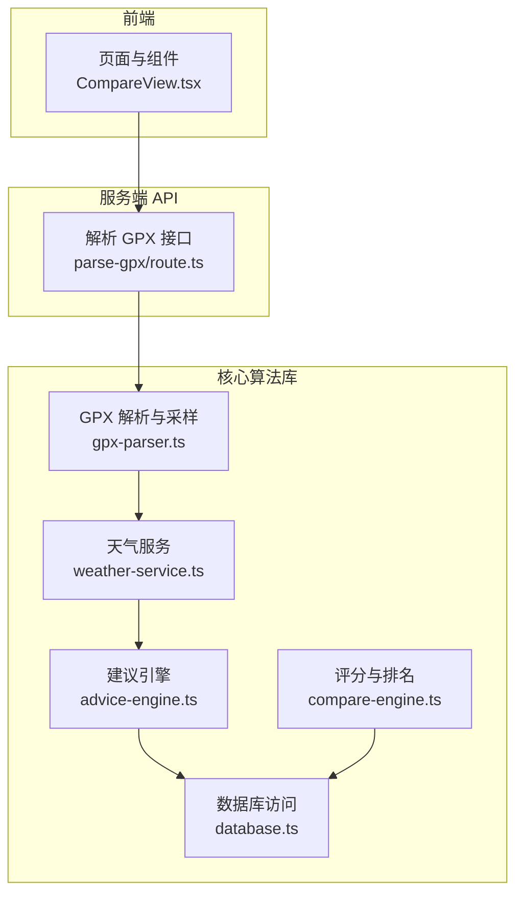
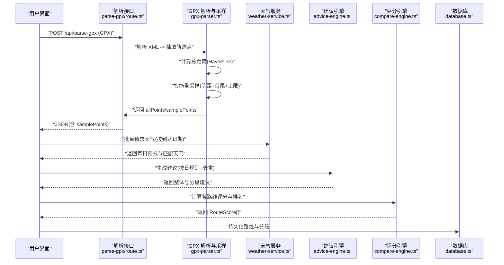
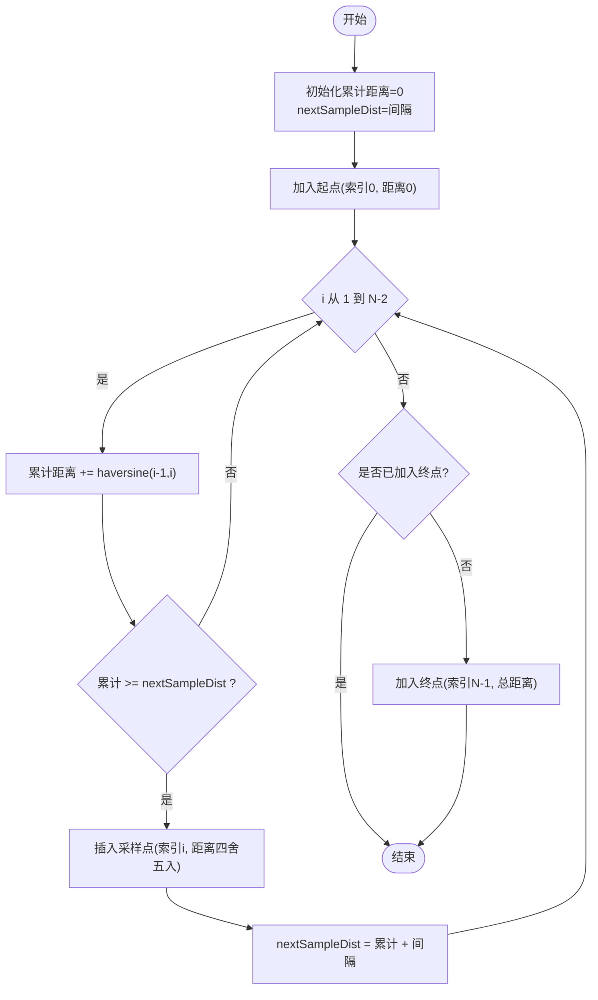
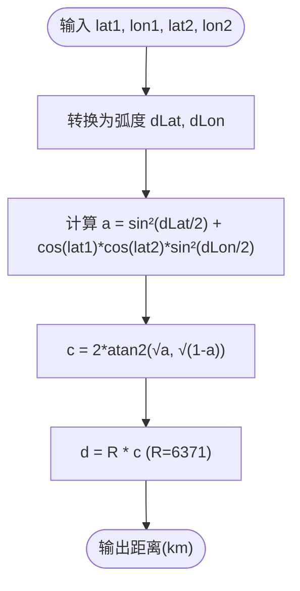
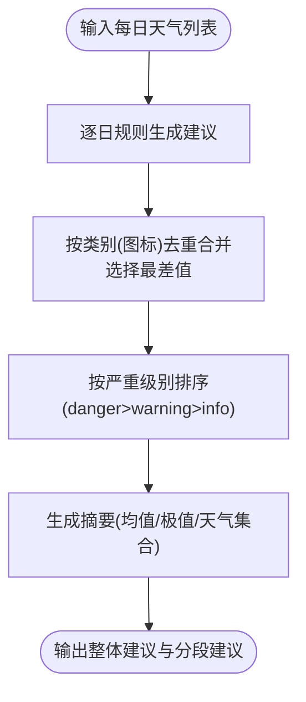
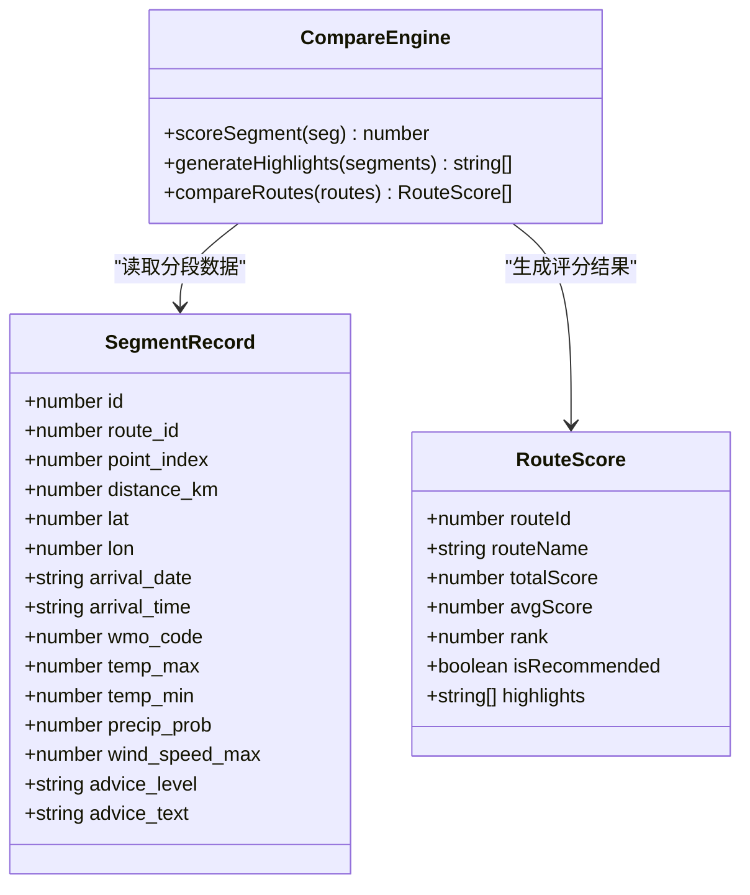
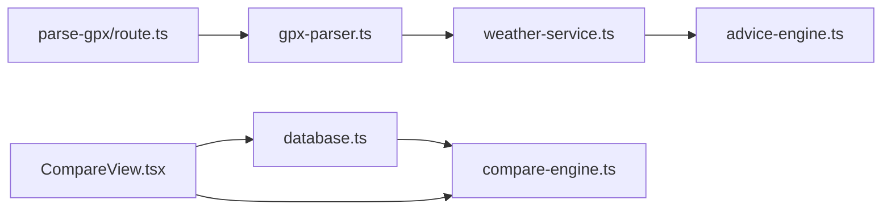

# 核心算法实现

<cite>
**本文引用的文件**
- [gpx-parser.ts](file://lib/gpx-parser.ts)
- [weather-service.ts](file://lib/weather-service.ts)
- [advice-engine.ts](file://lib/advice-engine.ts)
- [compare-engine.ts](file://lib/compare-engine.ts)
- [database.ts](file://lib/database.ts)
- [parse-gpx/route.ts](file://app/api/parse-gpx/route.ts)
- [CompareView.tsx](file://components/CompareView.tsx)
</cite>

## 目录
1. [简介](#简介)
2. [项目结构](#项目结构)
3. [核心组件](#核心组件)
4. [架构总览](#架构总览)
5. [详细组件分析](#详细组件分析)
6. [依赖关系分析](#依赖关系分析)
7. [性能与复杂度](#性能与复杂度)
8. [故障排查指南](#故障排查指南)
9. [结论](#结论)
10. [附录：数学公式与实现要点](#附录数学公式与实现要点)

## 简介
本技术文档聚焦 FineG 的核心算法实现，围绕以下目标展开：
- 智能采样算法：采样间隔计算、边界点处理策略与性能优化技巧
- Haversine 距离计算公式的实现与精度控制方法
- 评分算法的多维度评价体系、权重分配策略与排名计算逻辑
- 时间/空间复杂度分析与调优建议
- 提供关键流程的图示与代码片段路径，便于定位实现细节

## 项目结构
FineG 采用 Next.js 应用结构，核心算法集中在 lib 目录下的若干模块中：
- gpx-parser.ts：GPX 解析、轨迹点抽取、Haversine 距离计算、智能重采样与到达时间估算
- weather-service.ts：按采样点批量拉取天气数据，WMO 天气码解释与图标映射
- advice-engine.ts：基于每日天气生成分段建议与整体摘要
- compare-engine.ts：多路线多维度评分、亮点提取与排名
- database.ts：SQLite 持久化（路由与分段记录）
- app/api/parse-gpx/route.ts：API 入口，限制全量点数量以提升渲染性能
- components/CompareView.tsx：对比视图展示，按百分比对齐分段进行可视化

图表来源
- [parse-gpx/route.ts:1-48](file://app/api/parse-gpx/route.ts#L1-L48)
- [gpx-parser.ts:1-231](file://lib/gpx-parser.ts#L1-L231)
- [weather-service.ts:1-176](file://lib/weather-service.ts#L1-L176)
- [advice-engine.ts:1-201](file://lib/advice-engine.ts#L1-L201)
- [compare-engine.ts:1-116](file://lib/compare-engine.ts#L1-L116)
- [database.ts:1-204](file://lib/database.ts#L1-L204)
- [CompareView.tsx:1-273](file://components/CompareView.tsx#L1-L273)

章节来源
- [parse-gpx/route.ts:1-48](file://app/api/parse-gpx/route.ts#L1-L48)
- [gpx-parser.ts:1-231](file://lib/gpx-parser.ts#L1-L231)
- [weather-service.ts:1-176](file://lib/weather-service.ts#L1-L176)
- [advice-engine.ts:1-201](file://lib/advice-engine.ts#L1-L201)
- [compare-engine.ts:1-116](file://lib/compare-engine.ts#L1-L116)
- [database.ts:1-204](file://lib/database.ts#L1-L204)
- [CompareView.tsx:1-273](file://components/CompareView.tsx#L1-L273)

## 核心组件
- 智能采样器：在原始轨迹上以固定累计距离为阈值进行等距采样，保证首尾点必选，并限制最大样本数以避免过度采样。
- Haversine 距离：使用球面大圆距离公式计算经纬度两点间距离，半径取地球平均半径，结果单位为千米。
- 天气聚合与建议：按采样点的预计到达日期匹配天气预报，逐日规则生成建议，并按严重级别去重合并。
- 多维评分：从降水概率、风速、WMO 天气码、温度四个维度对分段打分，汇总得到路线总分与平均分，排序后赋予名次与推荐标记。
- 数据持久化：将路线与分段信息写入 SQLite，支持后续查询与对比展示。

章节来源
- [gpx-parser.ts:44-94](file://lib/gpx-parser.ts#L44-L94)
- [gpx-parser.ts:119-137](file://lib/gpx-parser.ts#L119-L137)
- [weather-service.ts:71-176](file://lib/weather-service.ts#L71-L176)
- [advice-engine.ts:30-201](file://lib/advice-engine.ts#L30-L201)
- [compare-engine.ts:19-116](file://lib/compare-engine.ts#L19-L116)
- [database.ts:23-55](file://lib/database.ts#L23-L55)

## 架构总览
下图展示了从上传 GPX 到生成建议与评分的整体调用链与数据流。

图表来源
- [parse-gpx/route.ts:1-48](file://app/api/parse-gpx/route.ts#L1-L48)
- [gpx-parser.ts:139-230](file://lib/gpx-parser.ts#L139-L230)
- [weather-service.ts:71-176](file://lib/weather-service.ts#L71-L176)
- [advice-engine.ts:118-201](file://lib/advice-engine.ts#L118-L201)
- [compare-engine.ts:83-116](file://lib/compare-engine.ts#L83-L116)
- [database.ts:90-162](file://lib/database.ts#L90-L162)

## 详细组件分析

### 智能采样算法
- 输入：全部轨迹点、总距离、采样间隔（km）
- 输出：等距采样的 SamplePoint[]，包含 index、distanceFromStart、estimatedArrival 等
- 关键策略：
  - 累计距离驱动：遍历相邻点对，累加 Haversine 距离，当累计达到下一个采样阈值时插入采样点
  - 边界点保护：始终加入起点与终点，避免丢失端点信息
  - 样本上限：根据总距离与间隔动态计算最大样本数，防止过多采样影响性能
  - 距离精度：保留一位小数，减少浮点误差累积对显示的影响

图表来源
- [gpx-parser.ts:44-94](file://lib/gpx-parser.ts#L44-L94)
- [gpx-parser.ts:172-218](file://lib/gpx-parser.ts#L172-L218)

章节来源
- [gpx-parser.ts:44-94](file://lib/gpx-parser.ts#L44-L94)
- [gpx-parser.ts:172-218](file://lib/gpx-parser.ts#L172-L218)

#### 到达时间估算
- 依据活动类型平均速度（km/h），将 distanceFromStart 换算为小时偏移，叠加起始时间得到 estimatedArrival
- 用于后续按到达日期匹配天气预报

章节来源
- [gpx-parser.ts:95-110](file://lib/gpx-parser.ts#L95-L110)

### Haversine 距离计算与精度控制
- 公式：球面大圆距离，R=6371 km，角度转弧度，a=sin²(dLat/2)+cos(lat1)*cos(lat2)*sin²(dLon/2)，c=2*atan2(√a, √(1-a))，d=R*c
- 精度控制：
  - 中间变量 a 使用 Math.sin/cos 计算，注意角度转弧度
  - 最终距离保留一位小数，避免显示抖动
  - 累计距离用于采样阈值判断，保持单调递增

图表来源
- [gpx-parser.ts:119-137](file://lib/gpx-parser.ts#L119-L137)

章节来源
- [gpx-parser.ts:119-137](file://lib/gpx-parser.ts#L119-L137)

### 天气服务与 WMO 解释
- 批量请求：按批次并发获取多个采样点的 7 天预报，降低网络往返次数
- 日期范围：优先使用到达日期，若不可用则回退到“今天起 7 天”
- 字段映射：将 Open-Meteo 响应映射为 DailyWeather，包括最高/最低温、降水概率、最大风速、WMO 天气码
- 描述与图标：提供 getWeatherDescription/getWeatherIcon 辅助函数，便于前端展示

章节来源
- [weather-service.ts:24-69](file://lib/weather-service.ts#L24-L69)
- [weather-service.ts:71-176](file://lib/weather-service.ts#L71-L176)

### 建议引擎（多维度规则）
- 规则维度：
  - 降水概率：>70% 警告，>50% 提示
  - 雷暴：WMO>=95 危险
  - 高温：>35°C 警告，>30°C 提示
  - 低温：<=0°C 警告，<=5°C 提示
  - 大风：>50km/h 危险，>30km/h 警告
  - 雪况：特定 WMO 区间提示路面湿滑
- 去重合并：按图标分类，选择最严重数值（考虑“越低越差”的场景如低温）
- 总体摘要：统计平均最高/最低温、最高降水概率、天气状况集合，给出整体出行建议

图表来源
- [advice-engine.ts:30-116](file://lib/advice-engine.ts#L30-L116)
- [advice-engine.ts:143-197](file://lib/advice-engine.ts#L143-L197)

章节来源
- [advice-engine.ts:30-116](file://lib/advice-engine.ts#L30-L116)
- [advice-engine.ts:118-201](file://lib/advice-engine.ts#L118-L201)

### 评分算法（多维度评价与排名）
- 分段评分 scoreSegment：
  - 初始分 100
  - 降水概率：每 1% 扣 0.5 分，封顶扣至 0
  - 风速：超过 10km/h 部分，每 5km/h 扣 5 分，最多扣 30
  - WMO 天气码：按等级扣分（雷暴、阵雨、雨、毛毛雨、雾）
  - 温度：极端高温或低温扣分
  - 最终分数截断到 [0,100] 并取整
- 亮点提取：基于分段统计生成亮点标签（如“全程降水概率低”、“气温适宜”等）
- 排名计算：
  - 计算每条路线所有分段得分总和与平均分
  - 按平均分降序排序，依次赋予 rank 与 isRecommended（第一名推荐）

图表来源
- [compare-engine.ts:19-116](file://lib/compare-engine.ts#L19-L116)
- [database.ts:70-86](file://lib/database.ts#L70-L86)

章节来源
- [compare-engine.ts:19-116](file://lib/compare-engine.ts#L19-L116)
- [database.ts:70-86](file://lib/database.ts#L70-L86)

### 数据持久化与对比展示
- 持久化：
  - routes 表：保存路线基本信息与全量点 JSON
  - segments 表：保存采样分段及对应天气与建议
  - 事务批量插入提升写入性能
- 对比展示：
  - CompareView 按百分比位置（0%, 25%, 50%, 75%, 100%）对齐不同路线的分段，直观比较天气与风险等级
  - 高亮推荐路线，颜色区分不同路线

章节来源
- [database.ts:23-55](file://lib/database.ts#L23-L55)
- [database.ts:90-162](file://lib/database.ts#L90-L162)
- [CompareView.tsx:22-44](file://components/CompareView.tsx#L22-L44)
- [CompareView.tsx:46-158](file://components/CompareView.tsx#L46-L158)

## 依赖关系分析
- 模块耦合：
  - gpx-parser.ts 被 API 层与前端调用，负责解析与采样
  - weather-service.ts 依赖 gpx-parser.ts 的 SamplePoint
  - advice-engine.ts 依赖 weather-service.ts 的 DailyWeather
  - compare-engine.ts 依赖 database.ts 的 SegmentRecord
  - API 层 parse-gpx/route.ts 组合 gpx-parser.ts 并限制全量点数量
- 外部依赖：
  - Open-Meteo 天气 API（HTTP 请求）
  - better-sqlite3（本地数据库）
  - @tmcw/togeojson 与 @xmldom/xmldom（GPX 解析）

图表来源
- [gpx-parser.ts:1-231](file://lib/gpx-parser.ts#L1-L231)
- [weather-service.ts:1-176](file://lib/weather-service.ts#L1-L176)
- [advice-engine.ts:1-201](file://lib/advice-engine.ts#L1-L201)
- [compare-engine.ts:1-116](file://lib/compare-engine.ts#L1-L116)
- [database.ts:1-204](file://lib/database.ts#L1-L204)
- [parse-gpx/route.ts:1-48](file://app/api/parse-gpx/route.ts#L1-L48)
- [CompareView.tsx:1-273](file://components/CompareView.tsx#L1-L273)

章节来源
- [gpx-parser.ts:1-231](file://lib/gpx-parser.ts#L1-L231)
- [weather-service.ts:1-176](file://lib/weather-service.ts#L1-L176)
- [advice-engine.ts:1-201](file://lib/advice-engine.ts#L1-L201)
- [compare-engine.ts:1-116](file://lib/compare-engine.ts#L1-L116)
- [database.ts:1-204](file://lib/database.ts#L1-L204)
- [parse-gpx/route.ts:1-48](file://app/api/parse-gpx/route.ts#L1-L48)
- [CompareView.tsx:1-273](file://components/CompareView.tsx#L1-L273)

## 性能与复杂度
- 时间复杂度：
  - 总距离计算：O(N)，N 为轨迹点数
  - 智能采样：O(N)，单次线性扫描
  - 天气批量请求：O(M/B)，M 为采样点数，B 为批大小（并发）
  - 建议生成：O(M)，逐点规则与去重合并
  - 评分与排名：O(S log S)，S 为路线数量（排序）
- 空间复杂度：
  - 存储 allPoints 与 samplePoints：O(N) 与 O(M)
  - 天气缓存：O(M*D)，D 为天数（默认 7）
  - 数据库写入：事务内缓冲，峰值取决于单条路线分段数量
- 性能优化建议：
  - 采样上限：通过 maxSamples 限制样本规模，避免大数据集导致内存与渲染压力
  - 批量请求：按批次并发获取天气，减少网络往返
  - 前端限流：API 层对 allPoints 进行抽样限制（例如不超过 2000 点），保障渲染流畅
  - 距离精度：保留一位小数，平衡精度与显示稳定性
  - 数据库 WAL 模式：开启 write-ahead logging 提升并发读写性能

章节来源
- [gpx-parser.ts:44-94](file://lib/gpx-parser.ts#L44-L94)
- [weather-service.ts:71-87](file://lib/weather-service.ts#L71-L87)
- [parse-gpx/route.ts:26-33](file://app/api/parse-gpx/route.ts#L26-L33)
- [database.ts:17-18](file://lib/database.ts#L17-L18)

## 故障排查指南
- GPX 解析失败：
  - 检查文件格式是否为 .gpx
  - 确认文件中存在有效的 LineString 轨迹点
  - 错误消息会返回具体原因（如未找到有效轨迹点）
- 天气 API 请求失败：
  - 检查 HTTP 状态码与响应体
  - 确认坐标与日期范围合法
  - 重试策略：可结合指数退避与降级（使用最近可用数据）
- 评分异常：
  - 检查分段数据完整性（wmo_code、temp_max/min、precip_prob、wind_speed_max）
  - 确认评分函数边界条件（负分截断、封顶扣分）
- 数据库写入问题：
  - 检查 data 目录权限与 WAL 模式配置
  - 确认事务执行顺序（先删除子表再删除主表）

章节来源
- [parse-gpx/route.ts:42-47](file://app/api/parse-gpx/route.ts#L42-L47)
- [weather-service.ts:141-145](file://lib/weather-service.ts#L141-L145)
- [compare-engine.ts:53-54](file://lib/compare-engine.ts#L53-L54)
- [database.ts:190-203](file://lib/database.ts#L190-L203)

## 结论
FineG 的核心算法围绕“等距采样 + Haversine 距离 + 多维度评分”构建，具备清晰的模块化设计与良好的可扩展性。通过合理的边界点保护、样本上限控制与批量请求策略，系统在准确性与性能之间取得平衡。建议在后续迭代中引入更精细的权重调节机制与离线缓存策略，进一步提升用户体验与系统鲁棒性。

## 附录：数学公式与实现要点
- Haversine 公式推导要点：
  - 将经纬度差转换为弧度
  - 计算 a 与 c，利用 atan2 提高数值稳定性
  - 乘以地球平均半径得到千米级距离
- 采样间隔计算：
  - 动态 maxSamples = min(50, ceil(totalDistance/intervalKm)+2)
  - 累计距离触发采样，确保首尾点必选
- 评分权重策略：
  - 降水概率线性惩罚（每 1% 扣 0.5）
  - 风速非线性惩罚（超过阈值后阶梯式扣分）
  - WMO 天气码分级扣分（恶劣天气显著扣分）
  - 温度极端值扣分（高温/低温分别设置阈值）
- 排名计算：
  - 总分与平均分并行计算
  - 按平均分降序排序，赋予名次与推荐标记

章节来源
- [gpx-parser.ts:119-137](file://lib/gpx-parser.ts#L119-L137)
- [gpx-parser.ts:44-94](file://lib/gpx-parser.ts#L44-L94)
- [compare-engine.ts:19-116](file://lib/compare-engine.ts#L19-L116)