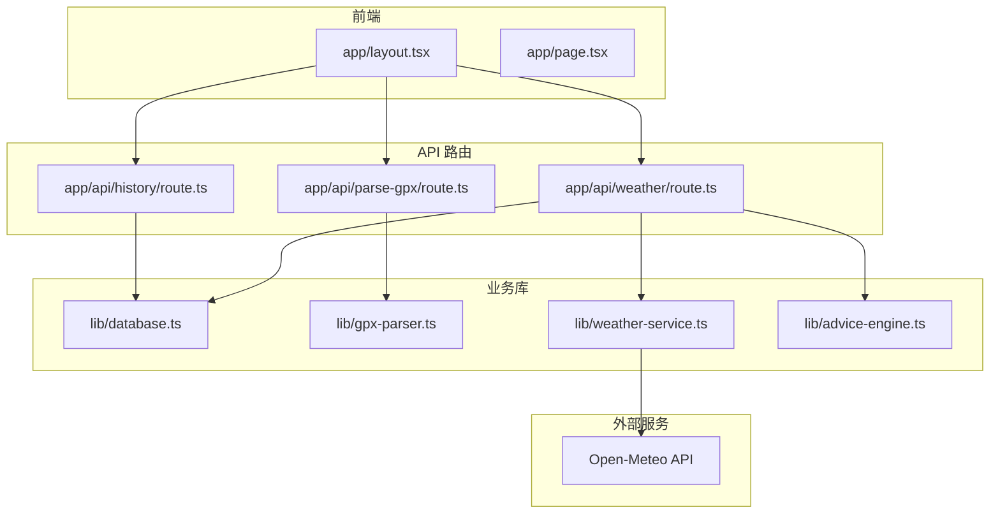
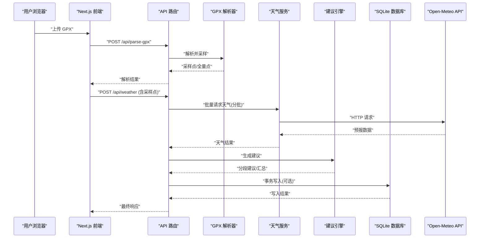
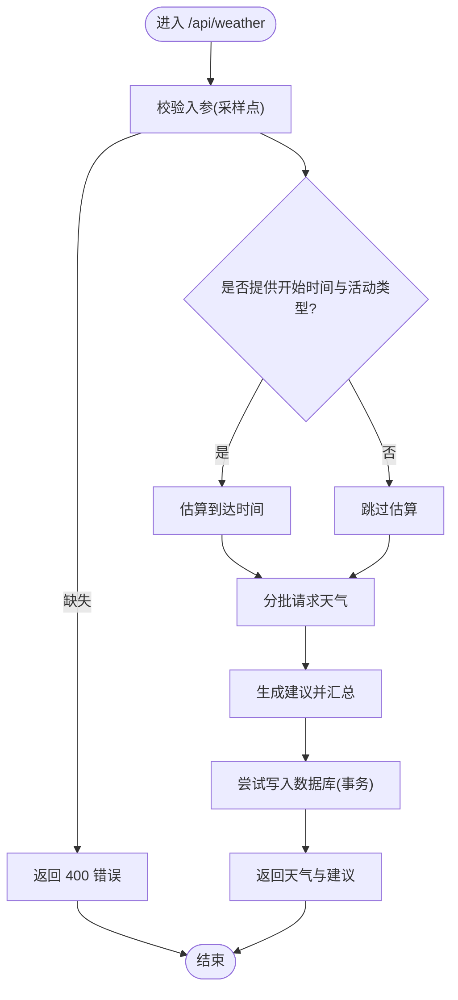
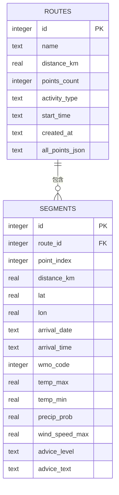
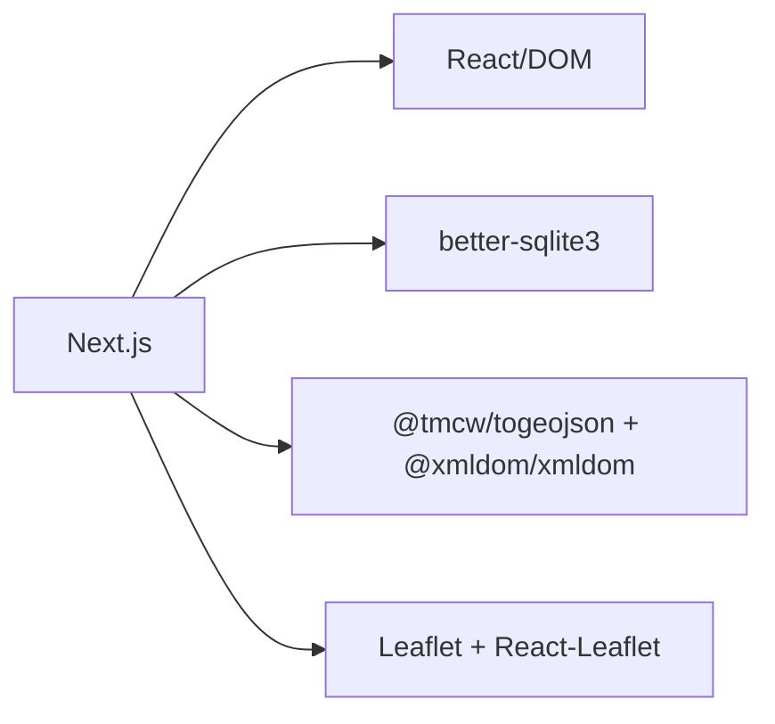

# 部署与运维

<cite>
**本文引用的文件**   
- [package.json](file://package.json)
- [next.config.ts](file://next.config.ts)
- [tsconfig.json](file://tsconfig.json)
- [README.md](file://README.md)
- [app/layout.tsx](file://app/layout.tsx)
- [app/api/history/route.ts](file://app/api/history/route.ts)
- [app/api/parse-gpx/route.ts](file://app/api/parse-gpx/route.ts)
- [app/api/weather/route.ts](file://app/api/weather/route.ts)
- [lib/database.ts](file://lib/database.ts)
- [lib/gpx-parser.ts](file://lib/gpx-parser.ts)
- [lib/weather-service.ts](file://lib/weather-service.ts)
- [lib/advice-engine.ts](file://lib/advice-engine.ts)
</cite>

## 目录
1. [简介](#简介)
2. [项目结构](#项目结构)
3. [核心组件](#核心组件)
4. [架构总览](#架构总览)
5. [详细组件分析](#详细组件分析)
6. [依赖分析](#依赖分析)
7. [性能考虑](#性能考虑)
8. [故障排查指南](#故障排查指南)
9. [结论](#结论)
10. [附录](#附录)

## 简介
本指南面向生产环境的部署与运维，覆盖环境变量配置、构建优化、性能调优、多平台部署（Vercel、Docker）、监控与日志、错误追踪、性能监控、用户行为分析、数据库备份策略、安全加固与故障恢复预案，以及日常运维操作手册和常见问题排查。

## 项目结构
本项目为 Next.js 应用，采用 App Router 组织页面与 API 路由，业务逻辑集中在 lib 目录，数据持久化使用 SQLite（better-sqlite3），外部天气数据通过 Open-Meteo 获取。

图示来源
- [app/layout.tsx:1-47](file://app/layout.tsx#L1-L47)
- [app/api/history/route.ts:1-33](file://app/api/history/route.ts#L1-L33)
- [app/api/parse-gpx/route.ts:1-48](file://app/api/parse-gpx/route.ts#L1-L48)
- [app/api/weather/route.ts:1-93](file://app/api/weather/route.ts#L1-L93)
- [lib/database.ts:1-204](file://lib/database.ts#L1-L204)
- [lib/gpx-parser.ts:1-231](file://lib/gpx-parser.ts#L1-L231)
- [lib/weather-service.ts:1-176](file://lib/weather-service.ts#L1-L176)
- [lib/advice-engine.ts:1-201](file://lib/advice-engine.ts#L1-L201)

章节来源
- [README.md:1-37](file://README.md#L1-L37)
- [package.json:1-34](file://package.json#L1-L34)

## 核心组件
- 应用入口与布局：提供站点元信息、导航与全局样式挂载。
- API 路由：
  - 解析 GPX 轨迹并返回采样点与全量点（用于前端渲染）。
  - 查询历史轨迹列表与删除记录。
  - 根据采样点请求天气、生成建议并落库。
- 数据处理：
  - GPX 解析与重采样、到达时间估算。
  - 天气数据聚合与描述映射。
  - 建议引擎基于天气指标生成分级提示。
- 数据持久化：
  - SQLite 单进程连接、WAL 模式、事务批量写入、表结构初始化。

章节来源
- [app/layout.tsx:1-47](file://app/layout.tsx#L1-L47)
- [app/api/parse-gpx/route.ts:1-48](file://app/api/parse-gpx/route.ts#L1-L48)
- [app/api/history/route.ts:1-33](file://app/api/history/route.ts#L1-L33)
- [app/api/weather/route.ts:1-93](file://app/api/weather/route.ts#L1-L93)
- [lib/gpx-parser.ts:1-231](file://lib/gpx-parser.ts#L1-L231)
- [lib/weather-service.ts:1-176](file://lib/weather-service.ts#L1-L176)
- [lib/advice-engine.ts:1-201](file://lib/advice-engine.ts#L1-L201)
- [lib/database.ts:1-204](file://lib/database.ts#L1-L204)

## 架构总览
整体流程：前端上传 GPX -> 后端解析与采样 -> 调用天气 API -> 生成建议 -> 可选落库 -> 返回结果。

图示来源
- [app/api/parse-gpx/route.ts:1-48](file://app/api/parse-gpx/route.ts#L1-L48)
- [app/api/weather/route.ts:1-93](file://app/api/weather/route.ts#L1-L93)
- [lib/gpx-parser.ts:1-231](file://lib/gpx-parser.ts#L1-L231)
- [lib/weather-service.ts:1-176](file://lib/weather-service.ts#L1-L176)
- [lib/advice-engine.ts:1-201](file://lib/advice-engine.ts#L1-L201)
- [lib/database.ts:1-204](file://lib/database.ts#L1-L204)

## 详细组件分析

### API 路由与处理流
- 解析 GPX
  - 校验文件类型与存在性，读取文本后解析，限制全量点数量以优化渲染。
- 天气与建议
  - 支持按活动类型估算到达时间；分批请求天气；合并建议并去重；自动落库（失败不阻断主流程）。
- 历史记录
  - 列出轨迹摘要（不含全量点）；删除轨迹时级联删除分段。

图示来源
- [app/api/weather/route.ts:1-93](file://app/api/weather/route.ts#L1-L93)
- [lib/gpx-parser.ts:1-231](file://lib/gpx-parser.ts#L1-L231)
- [lib/weather-service.ts:1-176](file://lib/weather-service.ts#L1-L176)
- [lib/advice-engine.ts:1-201](file://lib/advice-engine.ts#L1-L201)
- [lib/database.ts:1-204](file://lib/database.ts#L1-L204)

章节来源
- [app/api/parse-gpx/route.ts:1-48](file://app/api/parse-gpx/route.ts#L1-L48)
- [app/api/weather/route.ts:1-93](file://app/api/weather/route.ts#L1-L93)
- [app/api/history/route.ts:1-33](file://app/api/history/route.ts#L1-L33)

### 数据模型与持久化
- 表结构
  - routes：轨迹基本信息与全量点 JSON。
  - segments：分段维度存储天气与建议字段，外键级联删除。
- 连接与初始化
  - 单例连接、WAL 模式提升并发读性能、按需创建 data 目录与建表。
- 写入策略
  - 使用事务批量插入分段，减少 I/O 次数。

图示来源
- [lib/database.ts:23-55](file://lib/database.ts#L23-L55)

章节来源
- [lib/database.ts:1-204](file://lib/database.ts#L1-L204)

### 天气服务与外部依赖
- 分批请求：每批最多 5 个点，降低瞬时压力。
- 日期范围计算：优先使用到达日期，否则回退到当前日期起 7 天。
- 错误处理：非 2xx 状态码抛出异常，由上层统一捕获。

章节来源
- [lib/weather-service.ts:71-176](file://lib/weather-service.ts#L71-L176)

### 建议引擎
- 规则维度：降水概率、雷暴、高温、低温、大风、降雪等。
- 汇总策略：按图标分类去重，取最严重数值，排序输出。

章节来源
- [lib/advice-engine.ts:30-201](file://lib/advice-engine.ts#L30-L201)

## 依赖分析
- 运行时依赖
  - next、react/react-dom：框架与 UI。
  - better-sqlite3：本地数据库。
  - @tmcw/togeojson、@xmldom/xmldom：GPX 解析。
  - leaflet/react-leaflet：地图展示。
- 开发依赖
  - typescript、eslint、tailwindcss 等。

图示来源
- [package.json:11-21](file://package.json#L11-L21)
- [package.json:22-32](file://package.json#L22-L32)

章节来源
- [package.json:1-34](file://package.json#L1-L34)

## 性能考虑
- 构建与运行
  - 使用 Node LTS 版本，确保与 better-sqlite3 原生模块兼容。
  - 开启增量编译与严格类型检查，避免不必要的运行时开销。
- 网络与 I/O
  - 天气请求已分批，必要时可结合缓存层（如 Redis）对热点坐标的预报进行短期缓存。
  - SQLite 使用 WAL 模式，适合高并发读场景；避免在单个请求中执行长时间阻塞任务。
- 前端渲染
  - 全量点已做上限控制，避免大数组导致渲染卡顿。
- 资源优化
  - 静态资源与字体按需加载，启用浏览器缓存与 CDN。

[本节为通用指导，无需代码引用]

## 故障排查指南
- 常见错误定位
  - 天气 API 失败：检查网络连通性与返回状态码，确认参数（经纬度、日期范围）合法。
  - 数据库写入失败：检查 data 目录权限与磁盘空间；查看 SQLite 日志与 WAL 文件完整性。
  - GPX 解析失败：确认文件格式与内容符合 GPX 规范，轨迹点是否为空。
- 日志与追踪
  - 建议在 API 路由中增加结构化日志（请求 ID、耗时、关键指标），便于问题复现与性能分析。
  - 接入错误追踪服务（如 Sentry）收集未捕获异常与堆栈。
- 健康检查与告警
  - 暴露健康检查端点，监控关键依赖（数据库、外部 API）可用性。
  - 设置阈值告警（错误率、P95/P99 延迟、CPU/内存使用率）。

章节来源
- [app/api/weather/route.ts:77-80](file://app/api/weather/route.ts#L77-L80)
- [lib/weather-service.ts:141-145](file://lib/weather-service.ts#L141-L145)
- [lib/database.ts:11-18](file://lib/database.ts#L11-L18)

## 结论
FineG 采用 Next.js + SQLite 的轻量架构，具备快速迭代与低运维成本的优势。生产环境需重点关注外部依赖稳定性、数据库持久化与备份、日志与监控体系完善，以及安全加固与容量规划。

[本节为总结，无需代码引用]

## 附录

### 环境变量与配置
- 推荐环境变量
  - OPEN_METEO_API_KEY：若后续引入认证或配额管理时使用（当前实现未强制要求）。
  - DATABASE_PATH：自定义 SQLite 数据文件路径（默认位于 data/routes.db）。
  - NODE_ENV：production 时关闭调试输出，开启最小化构建。
  - LOG_LEVEL：控制日志级别（info/warn/error）。
  - CORS_ORIGIN：跨域白名单（如需前后端分离部署）。
- 配置文件
  - next.config.ts：可按需添加压缩、缓存头、CDN 域名等。
  - tsconfig.json：保持严格模式与增量编译，利于构建稳定与速度。

章节来源
- [next.config.ts:1-8](file://next.config.ts#L1-L8)
- [tsconfig.json:1-35](file://tsconfig.json#L1-L35)
- [lib/database.ts:5-18](file://lib/database.ts#L5-L18)

### 构建与启动命令
- 安装依赖：npm install
- 开发：npm run dev
- 构建：npm run build
- 启动：npm run start

章节来源
- [package.json:5-10](file://package.json#L5-L10)
- [README.md:3-15](file://README.md#L3-L15)

### Vercel 部署
- 步骤
  - 将仓库连接到 Vercel，选择 Next.js 预设。
  - 在“环境变量”中配置必要变量（如 DATABASE_PATH、LOG_LEVEL）。
  - 构建与部署完成后，访问预览/生产 URL。
- 注意事项
  - Vercel Serverless 环境无持久文件系统，SQLite 文件会随实例销毁而丢失。生产建议使用外部数据库或对象存储持久化。
  - 若必须使用 SQLite，请改用支持持久卷的托管方案（见 Docker 部署）。

章节来源
- [README.md:32-37](file://README.md#L32-L37)

### Docker 容器化部署
- 基础镜像
  - 使用 node:lts-alpine 作为基础镜像，安装系统依赖（如有原生模块需求）。
- 构建阶段
  - 复制 package.json 与 lock 文件，安装依赖，执行 npm run build。
- 运行阶段
  - 仅复制 .next、node_modules 与源码，暴露 3000 端口。
  - 挂载数据卷至 data 目录，保证 SQLite 持久化。
- 示例 docker-compose（概念性说明）
  - 定义 web 服务与数据卷，设置环境变量，重启策略与健康检查。

[本节为概念性说明，无需代码引用]

### 监控与日志
- 日志
  - 结构化日志（JSON），包含请求 ID、方法、路径、耗时、状态码、错误堆栈。
  - 集中式日志采集（如 ELK/Cloud Logging），设置保留策略与索引。
- 错误追踪
  - 接入错误追踪平台，捕获未处理异常与边界条件。
- 性能监控
  - 采集关键指标：QPS、错误率、P95/P99 延迟、CPU/内存、I/O 等待。
  - 对外部依赖（Open-Meteo）设置超时与重试策略，记录失败原因。
- 用户行为分析
  - 埋点关键事件（上传成功、解析耗时、建议生成耗时、保存成功/失败）。
  - 注意隐私合规，避免记录敏感信息。

[本节为通用指导，无需代码引用]

### 数据库备份策略
- 备份方式
  - 定期拷贝 data/routes.db 与同目录下的 -wal/-shm 文件，确保一致性。
  - 可使用数据库快照工具或文件系统快照。
- 频率与保留
  - 每日全量备份，每小时增量备份（视数据变更频率调整）。
  - 保留周期至少 30 天，异地容灾副本。
- 恢复演练
  - 定期验证备份可用性与恢复流程，记录 RTO/RPO 目标。

章节来源
- [lib/database.ts:5-18](file://lib/database.ts#L5-L18)

### 安全加固措施
- 输入校验
  - 严格校验上传文件类型与大小，拒绝非法格式。
- 速率限制
  - 对 API 接口实施限流，防止滥用与 DDoS。
- 网络安全
  - 启用 HTTPS，配置强加密套件与 HSTS。
  - 最小权限原则：容器与服务仅授予必要权限。
- 依赖安全
  - 定期扫描依赖漏洞，及时升级。

章节来源
- [app/api/parse-gpx/route.ts:9-21](file://app/api/parse-gpx/route.ts#L9-L21)

### 故障恢复预案
- 降级策略
  - 天气 API 不可用时返回缓存数据或友好提示，保障用户体验。
  - 数据库写入失败不影响主流程，记录错误并告警。
- 熔断与重试
  - 对外部 API 设置熔断与指数退避重试，避免雪崩。
- 回滚机制
  - 发布前灰度验证，出现问题快速回滚到上一稳定版本。

章节来源
- [app/api/weather/route.ts:77-80](file://app/api/weather/route.ts#L77-L80)

### 日常运维操作手册
- 上线流程
  - 预发环境验证 -> 灰度发布 -> 全量发布 -> 观察指标与日志。
- 巡检清单
  - 检查磁盘空间、数据库文件大小与增长趋势、外部 API 成功率与延迟。
- 扩容与弹性
  - 根据 QPS 与 CPU/内存使用率水平扩展实例数，配合负载均衡。
- 变更管理
  - 所有变更走评审与自动化测试，变更记录与影响评估。

[本节为通用指导，无需代码引用]