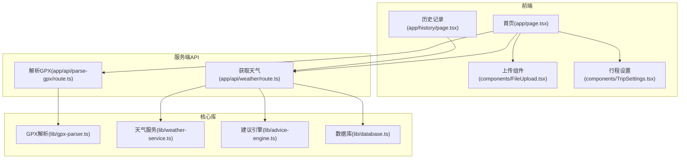
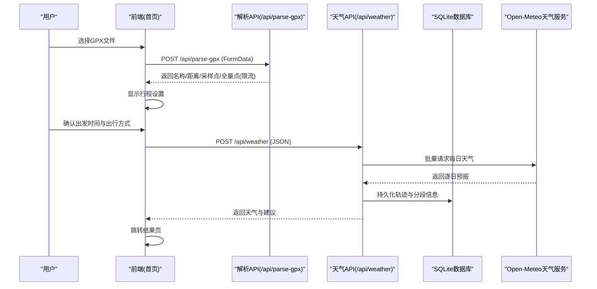
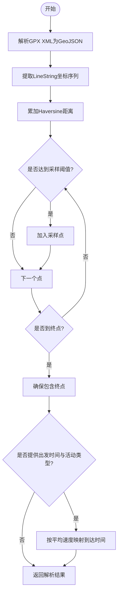
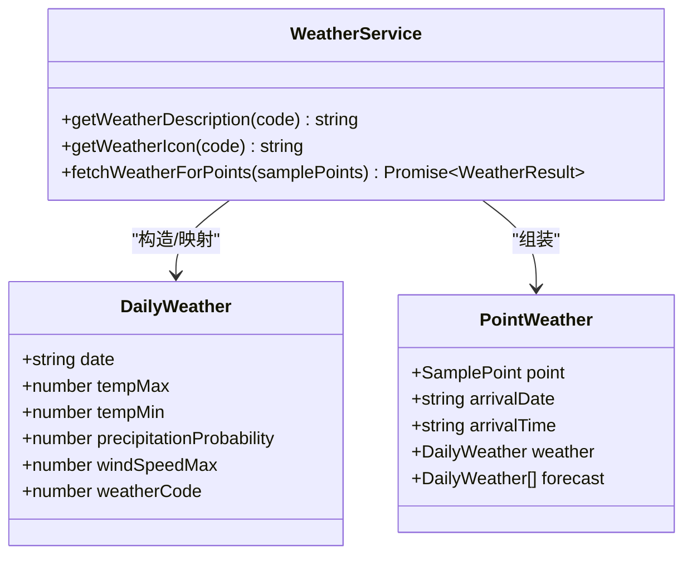
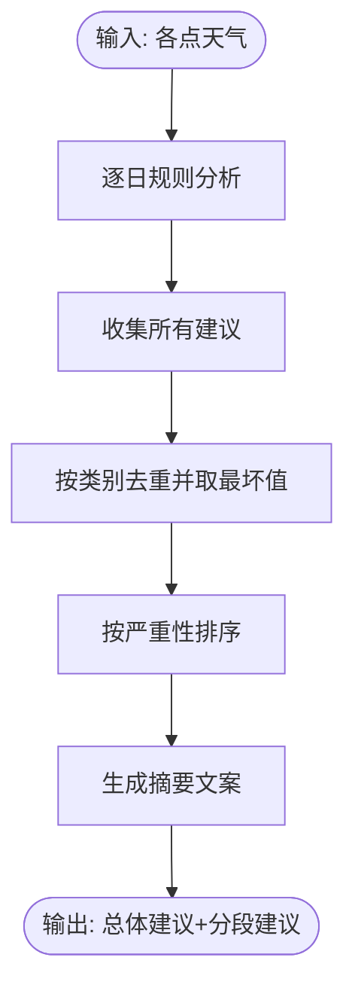
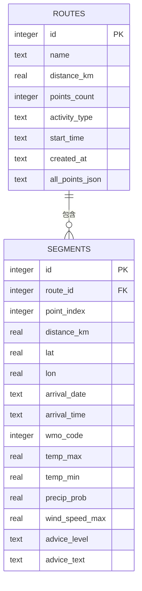
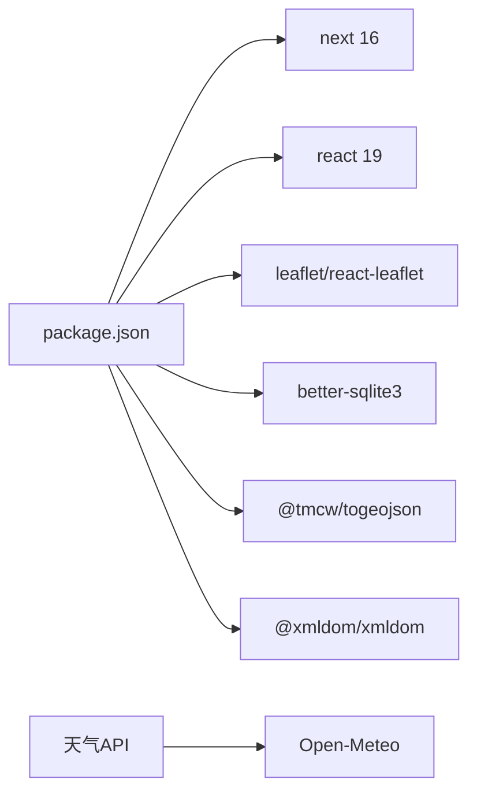

# 项目概述

<cite>
**本文引用的文件**   
- [README.md](file://README.md)
- [package.json](file://package.json)
- [next.config.ts](file://next.config.ts)
- [app/layout.tsx](file://app/layout.tsx)
- [app/page.tsx](file://app/page.tsx)
- [app/history/page.tsx](file://app/history/page.tsx)
- [app/api/parse-gpx/route.ts](file://app/api/parse-gpx/route.ts)
- [app/api/weather/route.ts](file://app/api/weather/route.ts)
- [lib/gpx-parser.ts](file://lib/gpx-parser.ts)
- [lib/weather-service.ts](file://lib/weather-service.ts)
- [lib/advice-engine.ts](file://lib/advice-engine.ts)
- [lib/database.ts](file://lib/database.ts)
- [components/FileUpload.tsx](file://components/FileUpload.tsx)
- [components/TripSettings.tsx](file://components/TripSettings.tsx)
</cite>

## 目录
1. [简介](#简介)
2. [项目结构](#项目结构)
3. [核心组件](#核心组件)
4. [架构总览](#架构总览)
5. [详细组件分析](#详细组件分析)
6. [依赖关系分析](#依赖关系分析)
7. [性能考量](#性能考量)
8. [故障排查指南](#故障排查指南)
9. [结论](#结论)
10. [附录](#附录)

## 简介
FineG 是一个基于 Next.js 的全栈 Web 应用，专注于对 GPX 轨迹文件进行天气分析与智能出行建议生成。其核心价值在于：
- 支持从 Strava、佳明、两步路等运动平台导出的 GPX 文件
- 提供沿途实时天气预报与个性化出行建议
- 本地持久化历史记录，支持多路线对比与推荐

技术栈包括 React 19、TypeScript、SQLite（better-sqlite3）、Leaflet 地图可视化等，采用 Next.js App Router 组织路由与服务端 API。

## 项目结构
项目采用按功能域划分的目录组织方式：
- app：页面与 API 路由（Next.js App Router）
- components：可复用的前端 UI 组件
- lib：核心业务逻辑（GPX 解析、天气服务、建议引擎、数据库访问）
- public：静态资源
- data：运行时数据（SQLite 数据库文件所在目录）

图表来源
- [app/page.tsx:1-214](file://app/page.tsx#L1-L214)
- [app/history/page.tsx:1-96](file://app/history/page.tsx#L1-L96)
- [app/api/parse-gpx/route.ts:1-48](file://app/api/parse-gpx/route.ts#L1-L48)
- [app/api/weather/route.ts:1-93](file://app/api/weather/route.ts#L1-L93)
- [lib/gpx-parser.ts:1-231](file://lib/gpx-parser.ts#L1-L231)
- [lib/weather-service.ts:1-176](file://lib/weather-service.ts#L1-L176)
- [lib/advice-engine.ts:1-201](file://lib/advice-engine.ts#L1-L201)
- [lib/database.ts:1-204](file://lib/database.ts#L1-L204)

章节来源
- [README.md:1-37](file://README.md#L1-L37)
- [package.json:1-34](file://package.json#L1-L34)
- [next.config.ts:1-8](file://next.config.ts#L1-L8)
- [app/layout.tsx:1-47](file://app/layout.tsx#L1-L47)

## 核心组件
- 首页流程控制（app/page.tsx）
  - 负责上传 GPX、调用解析接口、进入行程设置、发起天气查询并跳转结果页
  - 管理“空闲/解析中/设置/天气加载中/错误”等状态
- 上传组件（components/FileUpload.tsx）
  - 支持拖拽与点击选择 .gpx 文件，禁用态与加载反馈
- 行程设置（components/TripSettings.tsx）
  - 展示轨迹摘要、出发时间、出行方式（步行/骑行/跑步/驾车等），估算用时
- 解析接口（app/api/parse-gpx/route.ts）
  - 校验文件类型、读取文本、调用解析器、限制全量点数量以提升渲染性能
- 天气接口（app/api/weather/route.ts）
  - 根据采样点与活动类型估算到达时间，批量拉取 Open-Meteo 天气，生成建议，写入 SQLite
- 历史列表（app/history/page.tsx）
  - 加载历史、删除记录、跳转到对比或详情

章节来源
- [app/page.tsx:1-214](file://app/page.tsx#L1-L214)
- [components/FileUpload.tsx:1-97](file://components/FileUpload.tsx#L1-L97)
- [components/TripSettings.tsx:1-175](file://components/TripSettings.tsx#L1-L175)
- [app/api/parse-gpx/route.ts:1-48](file://app/api/parse-gpx/route.ts#L1-L48)
- [app/api/weather/route.ts:1-93](file://app/api/weather/route.ts#L1-L93)
- [app/history/page.tsx:1-96](file://app/history/page.tsx#L1-L96)

## 架构总览
系统采用前后端一体化架构：
- 前端通过 Next.js 客户端组件驱动交互
- 服务端 API 处理 GPX 解析、天气聚合与建议生成
- 使用 better-sqlite3 在服务器端本地存储轨迹与分析结果
- 外部依赖 Open-Meteo 免费天气 API 获取逐日预报

图表来源
- [app/page.tsx:1-214](file://app/page.tsx#L1-L214)
- [app/api/parse-gpx/route.ts:1-48](file://app/api/parse-gpx/route.ts#L1-L48)
- [app/api/weather/route.ts:1-93](file://app/api/weather/route.ts#L1-L93)
- [lib/gpx-parser.ts:1-231](file://lib/gpx-parser.ts#L1-L231)
- [lib/weather-service.ts:1-176](file://lib/weather-service.ts#L1-L176)
- [lib/advice-engine.ts:1-201](file://lib/advice-engine.ts#L1-L201)
- [lib/database.ts:1-204](file://lib/database.ts#L1-L204)

## 详细组件分析

### GPX 解析与采样（lib/gpx-parser.ts）
- 职责
  - 将 GPX XML 转换为 GeoJSON，提取 LineString 坐标序列为 TrackPoint
  - 计算总距离（Haversine 公式）
  - 按固定间隔采样生成 SamplePoint，限制最大采样数
  - 根据出发时间与活动类型估算到达时间
- 关键数据结构
  - TrackPoint：经纬度、海拔、时间
  - SamplePoint：TrackPoint + index/distanceFromStart/estimatedArrival
  - ActivityType：出行方式与平均速度
- 复杂度
  - 距离计算 O(n)，采样 O(n)，估算到达 O(m)（m 为采样点数）
- 优化点
  - 采样上限避免过多请求；可根据轨迹长度动态调整采样间隔

图表来源
- [lib/gpx-parser.ts:1-231](file://lib/gpx-parser.ts#L1-L231)

章节来源
- [lib/gpx-parser.ts:1-231](file://lib/gpx-parser.ts#L1-L231)

### 天气服务（lib/weather-service.ts）
- 职责
  - 根据采样点与到达日期范围，批量请求 Open-Meteo 每日预报
  - 将 WMO 天气代码映射为中文描述与图标
  - 匹配到达日期的天气，回退到首日
- 批处理策略
  - 每批次最多 5 个点并行请求，平衡并发与稳定性
- 错误处理
  - 非 2xx 响应抛出错误，便于上层统一捕获

图表来源
- [lib/weather-service.ts:1-176](file://lib/weather-service.ts#L1-L176)

章节来源
- [lib/weather-service.ts:1-176](file://lib/weather-service.ts#L1-L176)

### 建议引擎（lib/advice-engine.ts）
- 职责
  - 基于每日天气指标（降水概率、温度、风、雪/雷暴等）生成分级建议
  - 汇总整体建议并按严重性排序，生成摘要文案
- 规则要点
  - 高降水概率提示携带雨具
  - 雷暴等级直接建议避开户外
  - 高温/低温分别给出防暑/保暖提示
  - 大风与降雪提示路面影响
- 输出
  - 分段建议（segments）与总体建议（overall），以及一段总结文案

图表来源
- [lib/advice-engine.ts:1-201](file://lib/advice-engine.ts#L1-L201)

章节来源
- [lib/advice-engine.ts:1-201](file://lib/advice-engine.ts#L1-L201)

### 数据库层（lib/database.ts）
- 职责
  - 初始化 SQLite 数据库与表结构（routes、segments）
  - 提供插入、查询、删除等 CRUD 操作
  - 使用事务批量写入分段数据，提升写入性能
- 表设计
  - routes：轨迹基本信息与全量点 JSON
  - segments：分段天气与建议字段，外键关联 routes
- 运行期路径
  - 数据库文件位于 data/routes.db，首次访问自动创建目录与表

图表来源
- [lib/database.ts:1-204](file://lib/database.ts#L1-L204)

章节来源
- [lib/database.ts:1-204](file://lib/database.ts#L1-L204)

### 前端页面与导航（app/layout.tsx, app/page.tsx, app/history/page.tsx）
- 根布局（layout.tsx）
  - 定义站点元信息与顶部导航（首页/历史记录）
- 首页（page.tsx）
  - 三阶段流程：上传 -> 设置 -> 天气查询与结果跳转
  - 错误态与加载态清晰分离
- 历史记录（history/page.tsx）
  - 加载历史列表、删除、跳转对比与详情

章节来源
- [app/layout.tsx:1-47](file://app/layout.tsx#L1-L47)
- [app/page.tsx:1-214](file://app/page.tsx#L1-L214)
- [app/history/page.tsx:1-96](file://app/history/page.tsx#L1-L96)

## 依赖关系分析
- 运行时依赖
  - next 16、react/react-dom 19、leaflet/react-leaflet（地图可视化）
  - better-sqlite3（本地数据库）、@tmcw/togeojson（GPX→GeoJSON）、@xmldom/xmldom（XML 解析）
- 开发依赖
  - TypeScript、Tailwind CSS、ESLint 等
- 外部服务
  - Open-Meteo 免费天气 API（无需密钥）

图表来源
- [package.json:1-34](file://package.json#L1-L34)

章节来源
- [package.json:1-34](file://package.json#L1-L34)

## 性能考量
- GPX 全量点渲染限流
  - 解析接口对全量点进行抽样，限制至约 2000 点，降低前端渲染压力
- 天气请求批处理
  - 每批最多 5 个采样点并行请求，减少串行等待
- 数据库写入事务
  - 分段数据批量写入，减少磁盘 IO 次数
- 采样点数量控制
  - 采样上限与最小值保障，避免极端长轨迹导致大量外部请求

[本节为通用指导，不直接分析具体文件]

## 故障排查指南
- 常见错误与定位
  - 未上传文件或格式不正确：检查上传组件与接口校验逻辑
  - 天气 API 失败：查看网络状态与 Open-Meteo 可用性
  - 数据库写入失败：检查 data 目录权限与 SQLite 文件是否被占用
- 日志与调试
  - 接口层统一捕获异常并返回错误消息
  - 数据库写入失败不影响主流程，但会打印错误日志以便排查

章节来源
- [app/api/parse-gpx/route.ts:1-48](file://app/api/parse-gpx/route.ts#L1-L48)
- [app/api/weather/route.ts:1-93](file://app/api/weather/route.ts#L1-L93)
- [lib/database.ts:1-204](file://lib/database.ts#L1-L204)

## 结论
FineG 以 Next.js 为核心，结合 GPX 解析、天气聚合与智能建议，形成了一条完整的“轨迹→天气→建议”闭环。通过本地 SQLite 持久化与历史对比能力，既满足个人出行规划需求，也为后续扩展（如更多出行场景、更丰富的建议规则）提供了良好基础。

[本节为总结性内容，不直接分析具体文件]

## 附录
- 快速开始
  - 安装依赖后运行开发服务器，浏览器访问本地端口即可体验
- 部署建议
  - 使用 Vercel 等平台一键部署，注意服务器端文件系统读写权限（SQLite 文件）

章节来源
- [README.md:1-37](file://README.md#L1-L37)